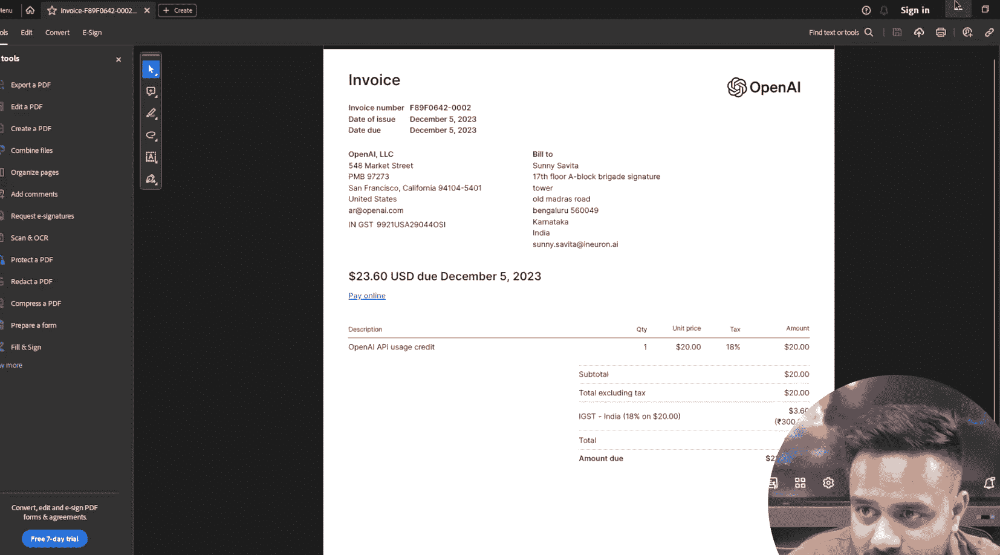
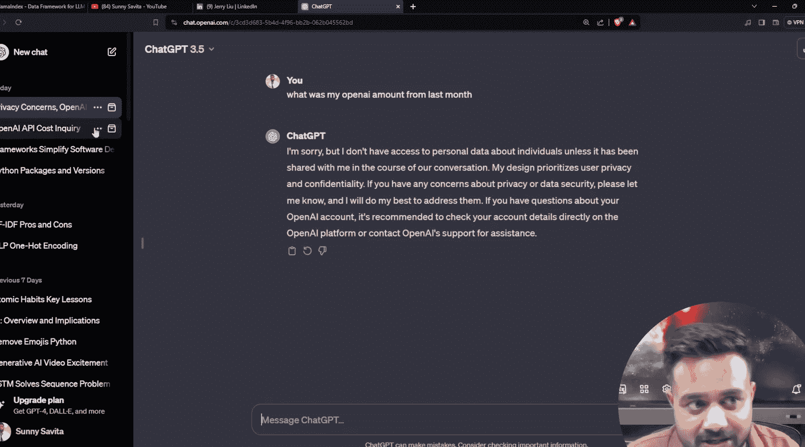
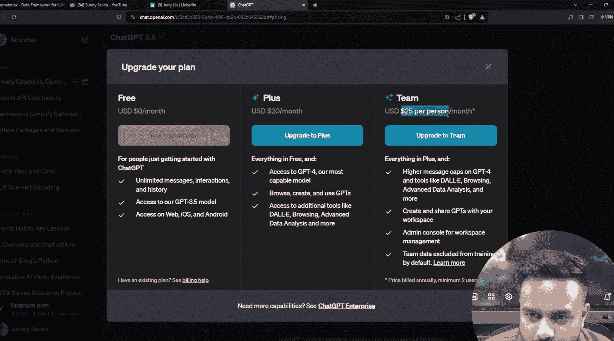
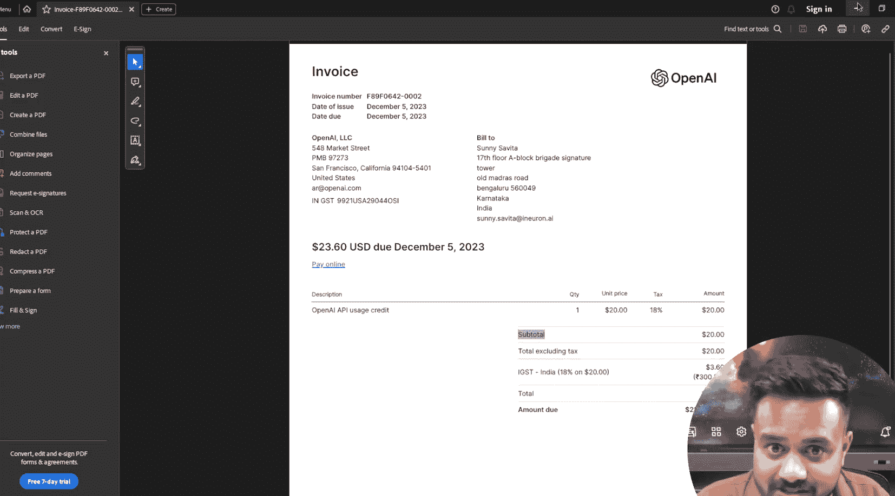

# 生成式AI：P5：LlamaIndex 入门与RAG系统简介 🦙

在本节课中，我们将要学习一个用于构建大语言模型应用的重要框架——LlamaIndex。我们将了解它的核心概念、为何需要它，以及它如何通过连接自定义数据与大语言模型来创建强大的应用。

## 什么是LlamaIndex？🤔

上一节我们回顾了大语言模型的历史，本节中我们来看看一个具体的应用构建工具。

LlamaIndex是一个**开源项目**，也是一个**框架**。它的主要用途是帮助开发者创建基于大语言模型的应用程序。

一个最著名的例子就是ChatGPT本身。ChatGPT是一个构建在GPT模型之上的应用程序。而使用LlamaIndex，我们也能构建类似功能的系统。

## LlamaIndex的核心目的 🔗

那么，LlamaIndex具体解决了什么问题呢？它的核心目的是：**将自定义数据资源与大语言模型连接起来**。

为了理解这一点，让我们看一个例子。假设我有一份上个月的OpenAI API使用账单（一个PDF文件）。如果我将这个文件直接上传给ChatGPT（例如GPT-3.5），并询问“我上个月的账单总额是多少？”，模型会回答它无法访问我的个人数据。

但是，如果我们使用LlamaIndex构建一个应用，流程就会不同：
1.  应用会使用LlamaIndex的工具**加载并读取**PDF文档中的信息。
2.  将这些信息**处理**成模型可以理解的格式。
3.  将处理后的信息与用户的**问题**一同提交给大语言模型。
4.  模型基于提供的**自定义数据**生成准确的答案。

通过这种方式，LlamaIndex充当了外部数据与大语言模型之间的桥梁，使得模型能够基于它原本“不知道”的信息进行回答。

## 理解“框架”的概念 🛠️

在深入之前，我们需要理解什么是“框架”。这有助于我们明白LlamaIndex扮演的角色。

框架是一套用于开发应用程序的**工具、规范和约定**的集合。

一个简单的类比是Python编程语言。Python本身是语言，而**Flask**和**Django**则是用于快速构建Web应用的框架。它们提供了一套规则和现成的工具（如路由处理、数据库连接），让开发者不必从零开始。

类似地，LlamaIndex也是一个框架。它提供了一套专门的工具和规范，但其目的不是构建网站，而是为了更高效地构建能够处理和理解私有或特定领域数据的LLM应用。

## 总结 📚

本节课中我们一起学习了LlamaIndex的基础知识。我们了解到LlamaIndex是一个用于构建大语言模型应用的开源框架，其核心功能是充当**自定义数据**与**大语言模型**之间的连接器。通过它，我们可以让模型基于我们提供的特定数据（如文档、数据库）进行回答，从而创建出更智能、更个性化的应用。这为解决大语言模型“知识截止”和无法访问私有数据的问题提供了方案。在接下来的课程中，我们将开始动手进行项目设置和开发。