# 生成式AI：从初学者到专家｜P6：LlamaIndex项目搭建与基础问答系统实现 🚀

在本节课中，我们将学习如何搭建LlamaIndex的开发环境，并使用OpenAI API和LlamaIndex创建一个基础的问答系统。我们将从零开始，逐步完成项目初始化、环境配置、依赖安装和核心代码编写。

---

## 项目环境搭建 💻

上一节我们介绍了LlamaIndex的基本概念，本节中我们来看看如何搭建一个可运行的项目环境。

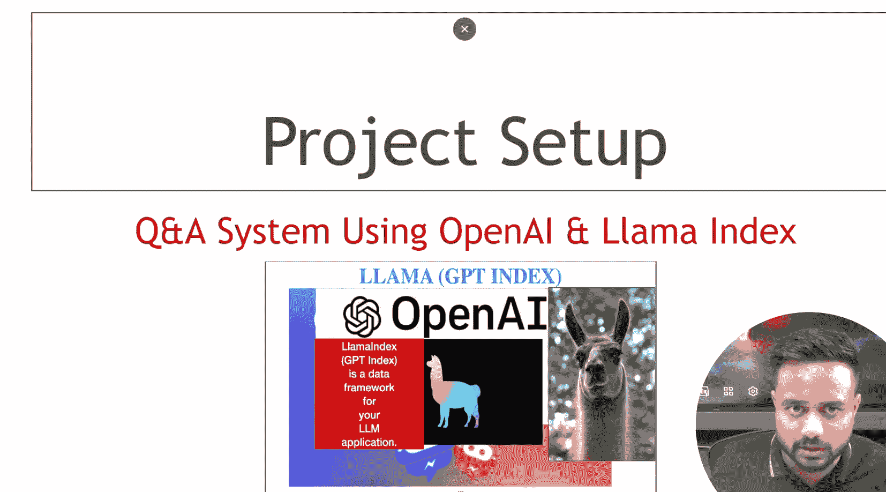

首先，我们需要在命令行中创建一个项目目录并进入该目录。

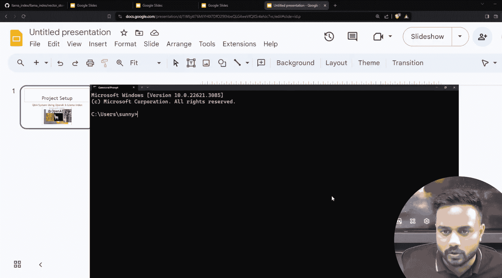

```bash
MD LlamaIndexProject
CD LlamaIndexProject
```

接着，在当前目录下启动Visual Studio Code编辑器。

```bash
code .
```

现在，我们已经在VS Code中打开了空的工作区。接下来，我们需要创建一个Python虚拟环境来隔离项目依赖。

在VS Code中打开终端，使用以下命令创建并激活一个名为`venv`的虚拟环境。

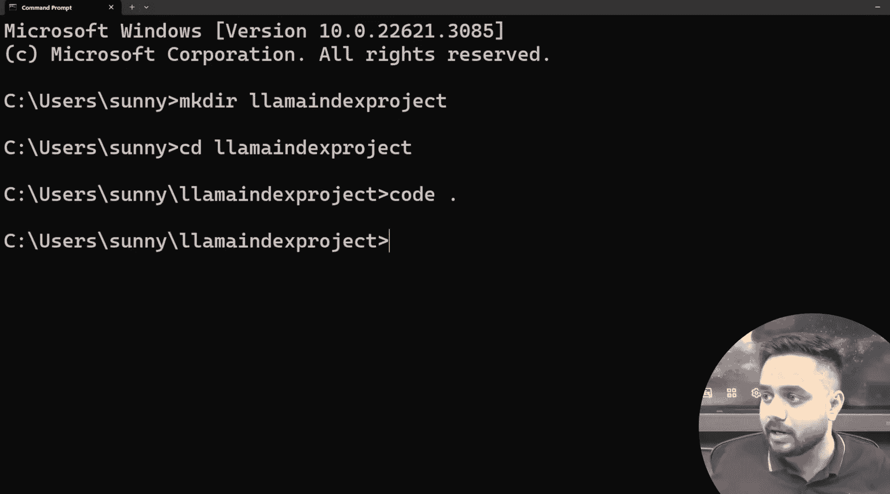

```bash
conda create -p ./venv python=3.8 -y
conda activate ./venv
```

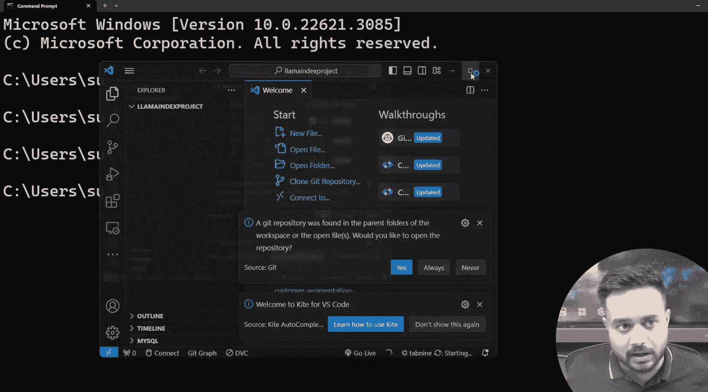

创建虚拟环境后，我们需要安装项目所需的Python包。以下是本项目的核心依赖列表。

创建一个名为`requirements.txt`的文件，并写入以下内容：

```
llama-index
python-dotenv
html2text
```

使用pip包管理器安装这些依赖。

```bash
pip install -r requirements.txt
```

---

## 配置环境变量 🔐

上一节我们完成了依赖安装，本节中我们来配置项目的安全密钥。

为了保护敏感信息（如API密钥），我们使用环境变量进行管理。在项目根目录下创建一个名为`.env`的文件。

在`.env`文件中，添加你的OpenAI API密钥。格式如下：

```
OPENAI_API_KEY=你的API密钥
```

**注意**：请勿将真实的API密钥分享或提交到公开的代码仓库，以免产生不必要的费用。

为了在Python代码中安全地读取这个密钥，我们将使用`python-dotenv`库和`os`模块。

---

## 构建基础问答系统 🤖

上一节我们配置了环境变量，本节中我们开始编写问答系统的核心代码。

首先，创建一个新的Python文件，例如`basic_qa.py`。然后，按照以下步骤编写代码。

### 1. 导入必要的库

我们需要导入LlamaIndex的核心组件、环境变量管理库以及用于加载文档的读取器。

```python
from llama_index import VectorStoreIndex, SimpleDirectoryReader
from dotenv import load_dotenv
import os
```

### 2. 加载环境变量

使用`load_dotenv()`函数从`.env`文件中加载环境变量，然后通过`os.environ`获取API密钥。

```python
load_dotenv()
openai_api_key = os.environ.get("OPENAI_API_KEY")
```

### 3. 加载文档数据

LlamaIndex可以从本地目录读取文档。确保你的项目目录下有一个`data`文件夹，并将文本文件（如`.txt`， `.pdf`）放入其中。

```python
documents = SimpleDirectoryReader('data').load_data()
```

### 4. 创建索引并构建查询引擎

使用加载的文档创建向量索引，然后将其转换为一个可以回答问题的查询引擎。

```python
index = VectorStoreIndex.from_documents(documents)
query_engine = index.as_query_engine()
```

### 5. 执行查询

现在，你可以向查询引擎提出问题，并获取基于文档内容的答案。

```python
response = query_engine.query("你的问题是什么？")
print(response)
```


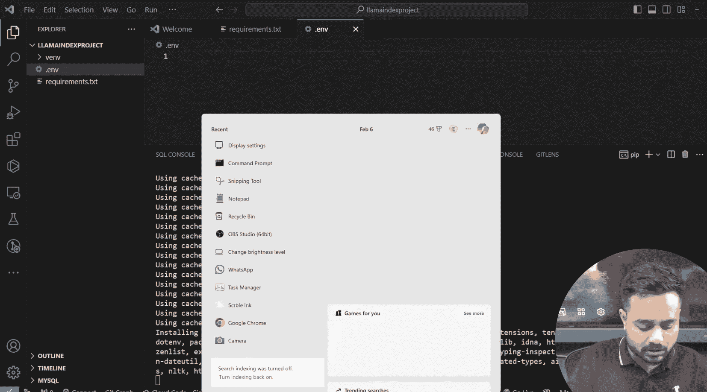

以下是完整的代码示例，整合了以上所有步骤：

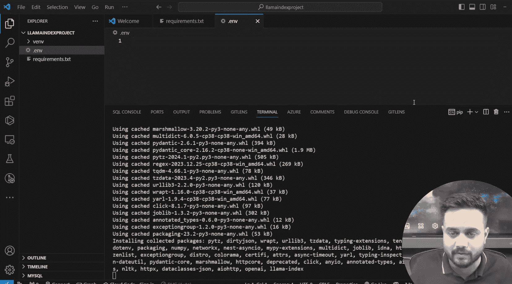

```python
# basic_qa.py
from llama_index import VectorStoreIndex, SimpleDirectoryReader
from dotenv import load_dotenv
import os

# 加载环境变量
load_dotenv()
openai_api_key = os.environ.get("OPENAI_API_KEY")

# 加载文档
documents = SimpleDirectoryReader('data').load_data()

# 创建索引和查询引擎
index = VectorStoreIndex.from_documents(documents)
query_engine = index.as_query_engine()

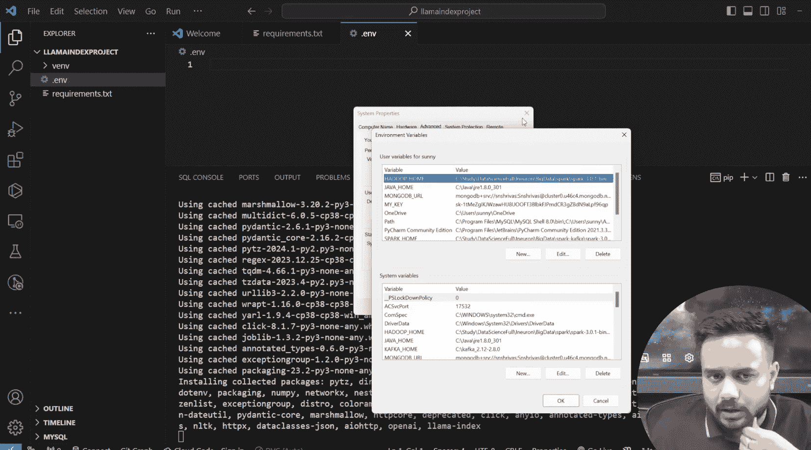

# 进行查询
response = query_engine.query("LlamaIndex是什么？")
print(response)
```

运行此脚本前，请确保`data`文件夹中存在文档，并且`.env`文件中的API密钥有效。

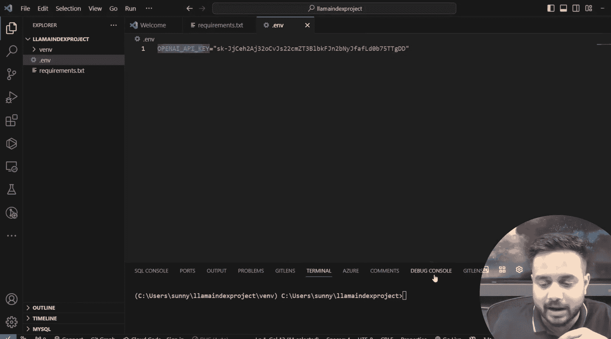

---

## 总结 📝

本节课中我们一起学习了如何从零开始搭建一个基于LlamaIndex和OpenAI API的问答系统。我们完成了以下关键步骤：

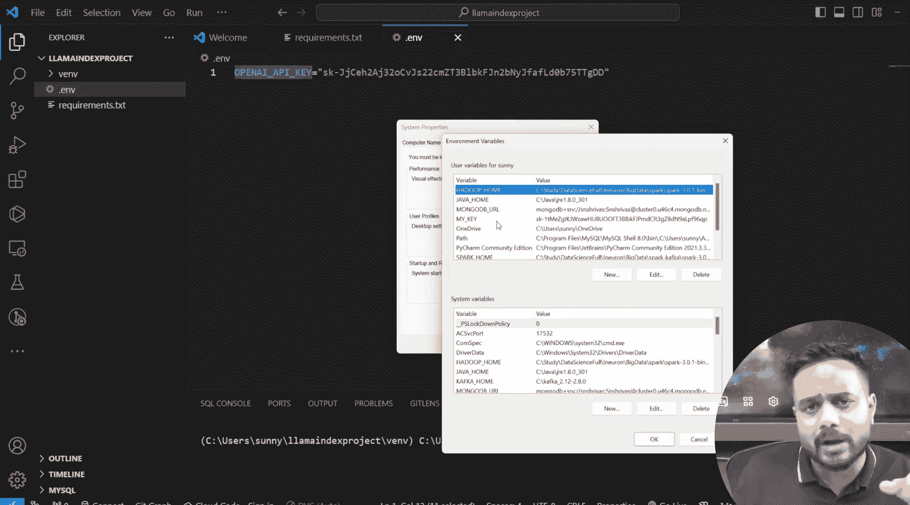

1.  **环境搭建**：创建项目目录、虚拟环境并安装必要依赖。
2.  **安全配置**：使用`.env`文件管理敏感的API密钥。
3.  **系统实现**：编写代码加载文档、创建向量索引并构建一个能够回答问题的查询引擎。

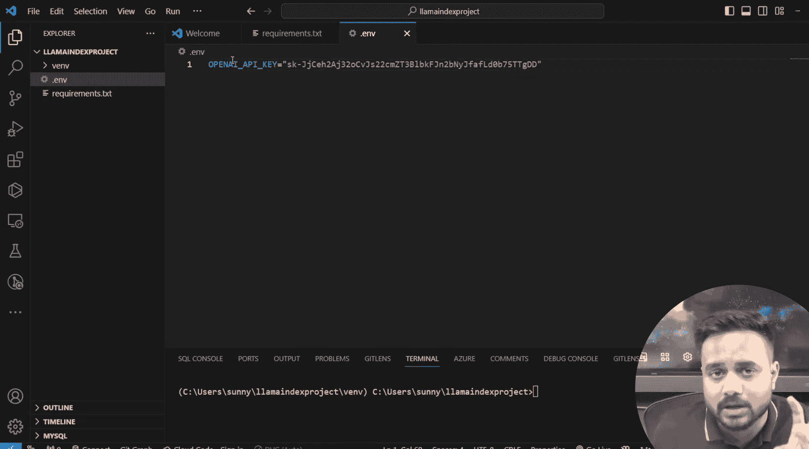

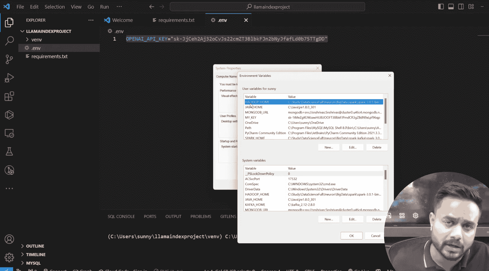

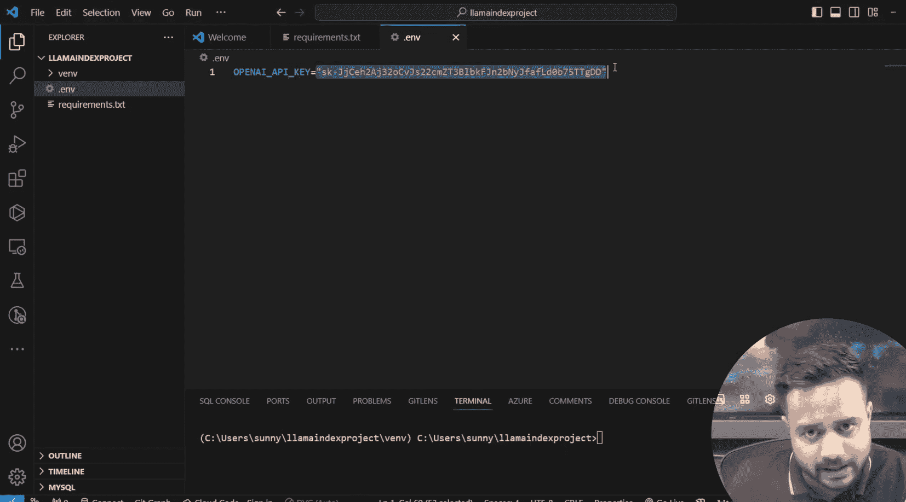

这个基础系统为你进一步探索LlamaIndex的更多高级功能（如连接不同数据源、使用多种LLM模型、构建复杂代理等）打下了坚实的基础。在接下来的课程中，我们将在此基础上进行扩展。