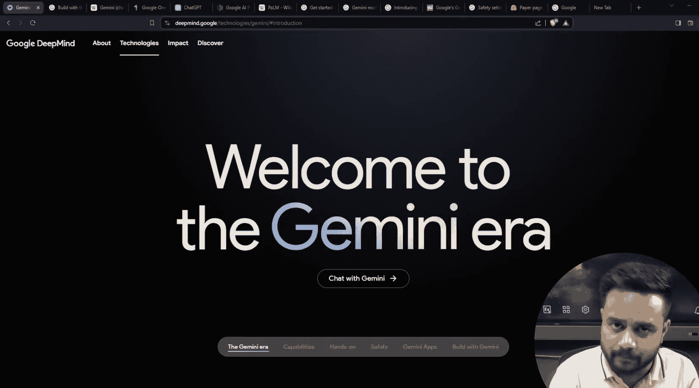
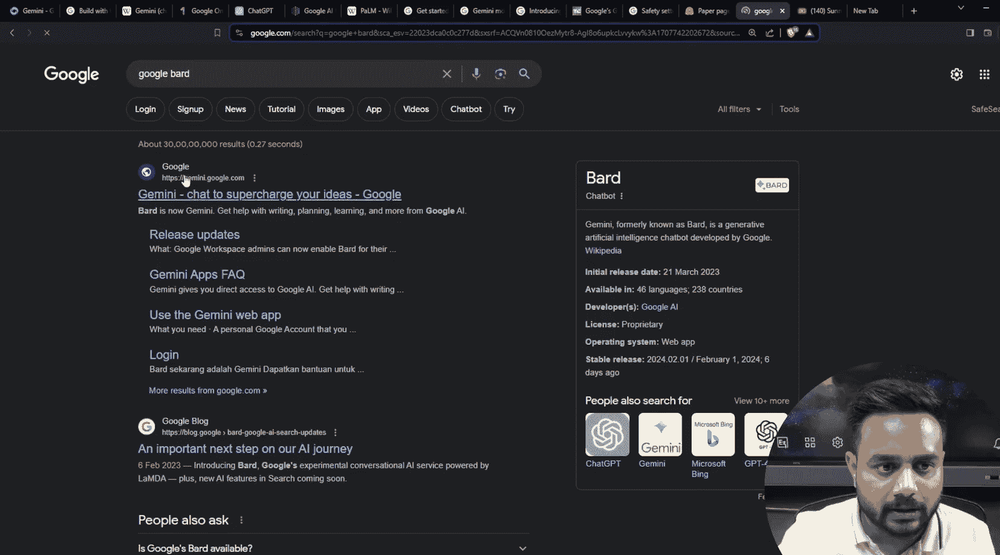
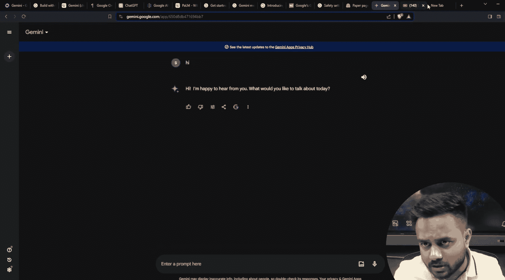
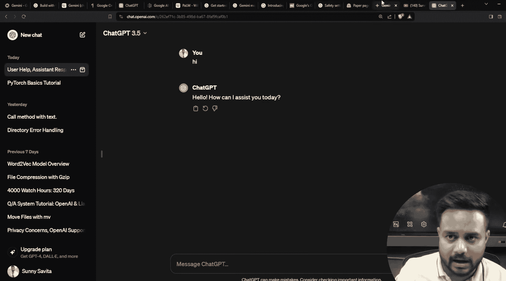
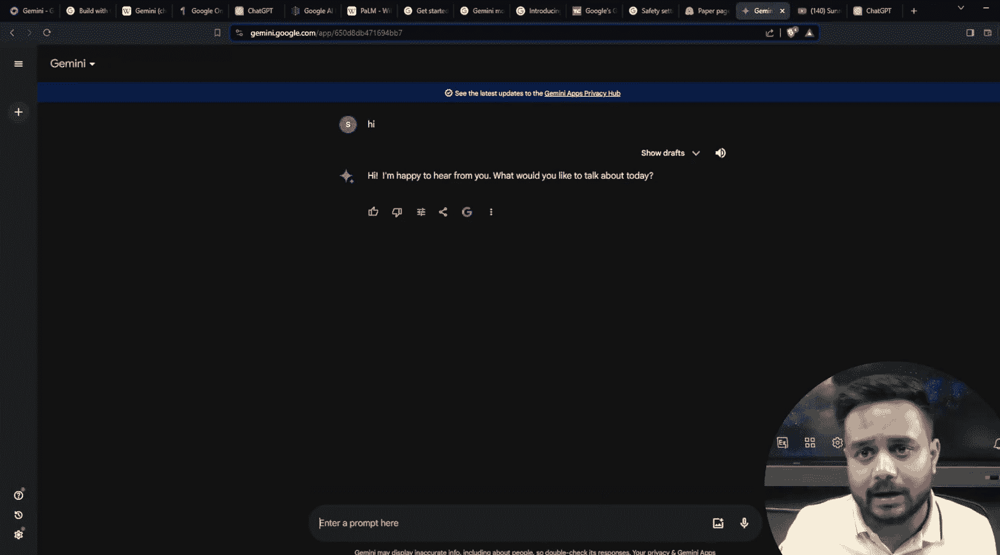
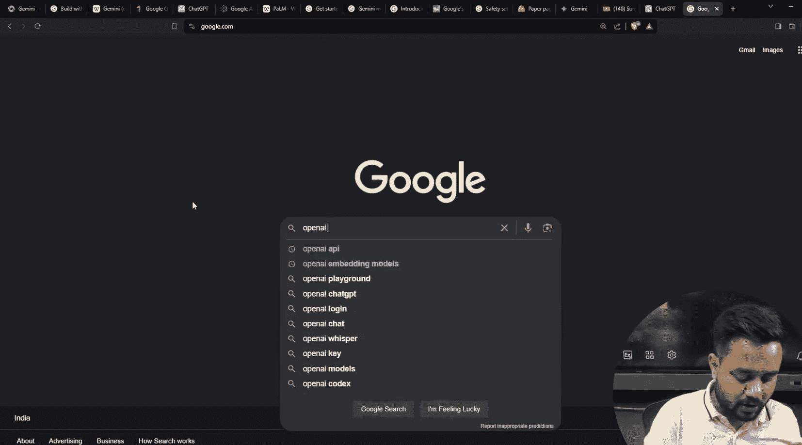
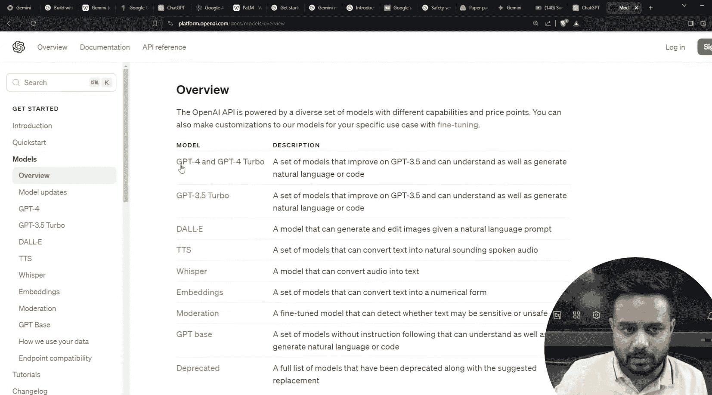
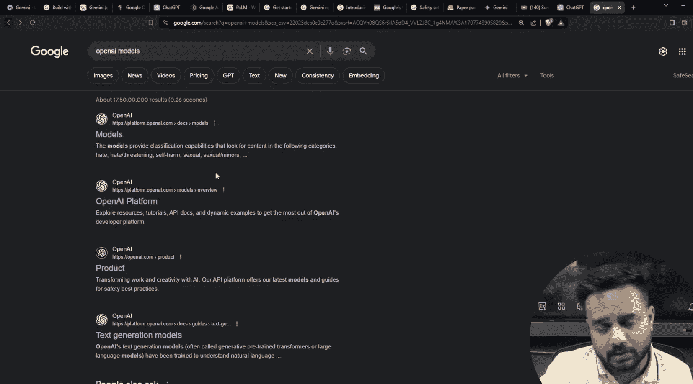
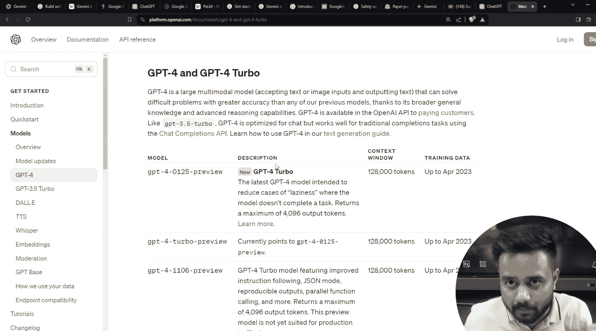

# 生成式AI：07：Google Gemini 介绍 (第一部分)

在本节课中，我们将学习Google Gemini的基础知识。我们将了解什么是Gemini，回顾其发展历史，并初步探索其不同的模型变体。最后，我们会介绍如何开始使用Python API来访问Gemini。

---

## 什么是Google Gemini？🤖

Google Gemini是一个聊天机器人，其前身是Bard。它本质上是一个基于对话的应用程序。

Gemini主要基于两个核心模型构建：**Gemini Pro** 和 **Gemini Pro Vision**。这意味着它能够处理和理解多种类型的信息输入。

为了更直观地理解，我们可以将其与大家熟悉的ChatGPT进行类比。ChatGPT是一个基于GPT-3.5及其变体模型的应用程序。类似地，Gemini（前身为Bard）则是基于Gemini Pro和Gemini Pro Vision模型的应用程序。

## Gemini的核心特性：多模态

Gemini是由Google DeepMind开发的多模态大语言模型。

那么，什么是“多模态”？多模态模型是指能够处理和理解多种类型数据（模态）的模型。对于Gemini而言，它主要具备以下能力：
*   **文本到文本**：例如，文本生成、翻译、总结。
*   **图像到文本**：例如，描述图片内容、回答关于图片的问题。

需要注意的是，目前的Gemini模型**不支持**文本生成图像或图像生成图像。它的输出形式目前仅限于文本。因此，它是一个能够接受多种输入（文本、图像），但主要生成文本输出的多模态模型。

## Gemini的发展历程 📜

上一节我们介绍了Gemini是什么，本节中我们来看看它的由来。Gemini模型是早期模型LaMDA和PaLM的继承者。

为了更好地理解Gemini的演进，我们可以通过以下几个维度来对比这三个模型：

以下是LaMDA、PaLM和Gemini的对比要点：
1.  **推出时间**：模型首次发布或引入的时间点。
2.  **模型规模**：模型参数的大小，通常与能力相关。
3.  **模型变体**：基于核心模型衍生出的不同版本。
4.  **创建目的**：开发该模型的主要目标和应用方向。

### 1. LaMDA
LaMDA的全称是“Language Model for Dialogue Applications”（对话应用语言模型）。顾名思义，它是Google专门为对话场景开发的模型。
*   **推出时间**：于2020年提出，第一代版本于2021年发布，第二代版本于2022年6月发布。
*   **主要目的**：专注于实现更自然、连贯的多轮对话。

### 2. PaLM
PaLM的全称是“Pathways Language Model”（通路语言模型）。
*   **特点**：它是一个开源模型，开发者可以获取其预训练版本，并针对特定任务进行微调。其最新版本是PaLM 2。
*   **现状**：随着Gemini的发布，PaLM现已逐渐成为“遗产”模型，较少被直接使用。

### 3. Gemini
Gemini是最新的模型，可以看作是PaLM的升级版。目前，Gemini Pro是主要使用的先进版本。

---

本节课中我们一起学习了Google Gemini的基本定义、其多模态的特性以及从LaMDA、PaLM到Gemini的发展脉络。我们了解到Gemini是一个能够处理文本和图像输入并生成文本输出的强大聊天机器人模型。在接下来的课程中，我们将深入探讨Gemini的不同变体，并开始动手实践，学习如何使用Python API来调用它。