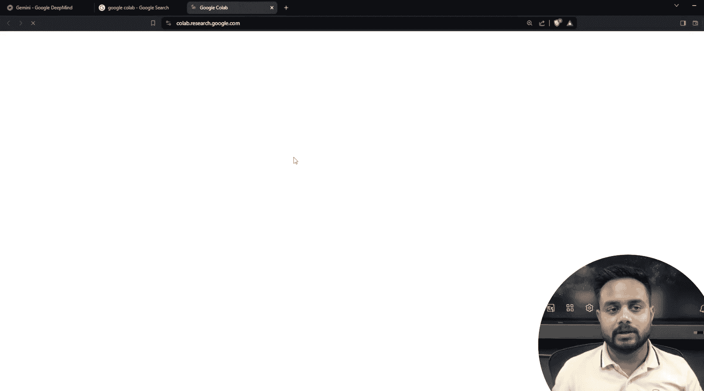
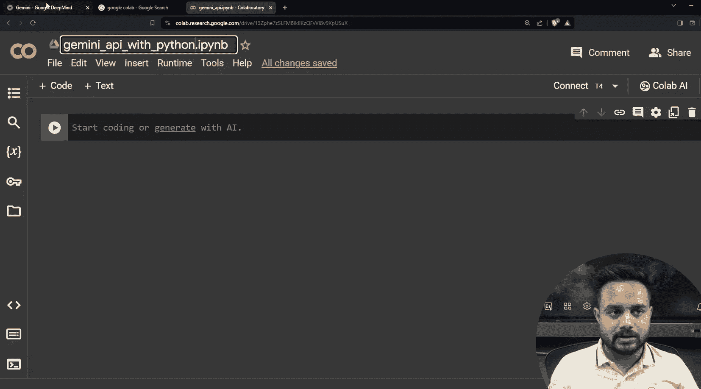
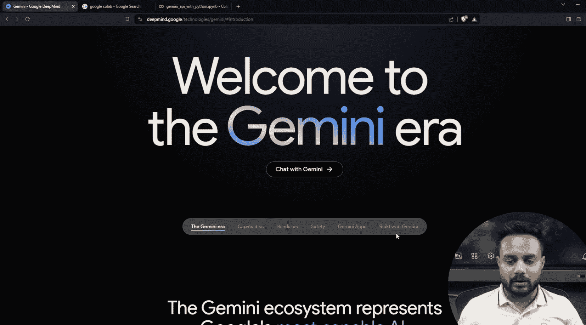
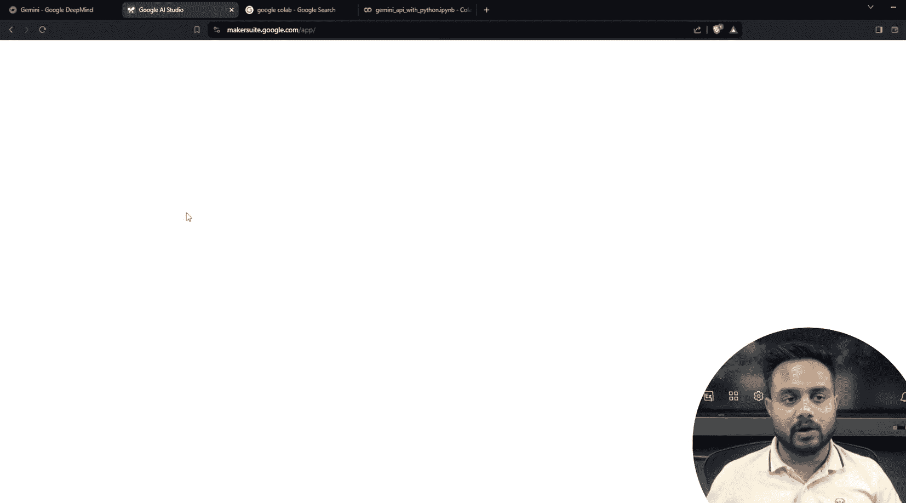
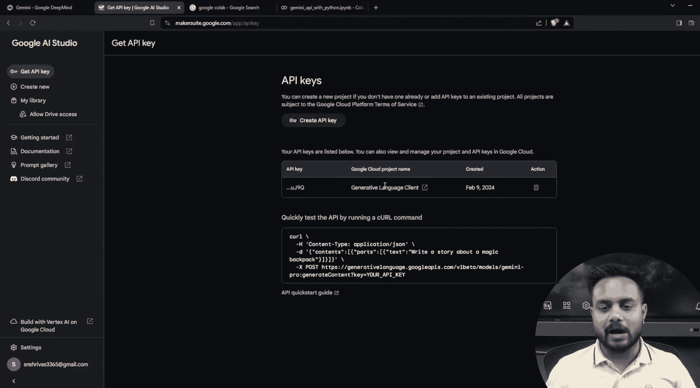
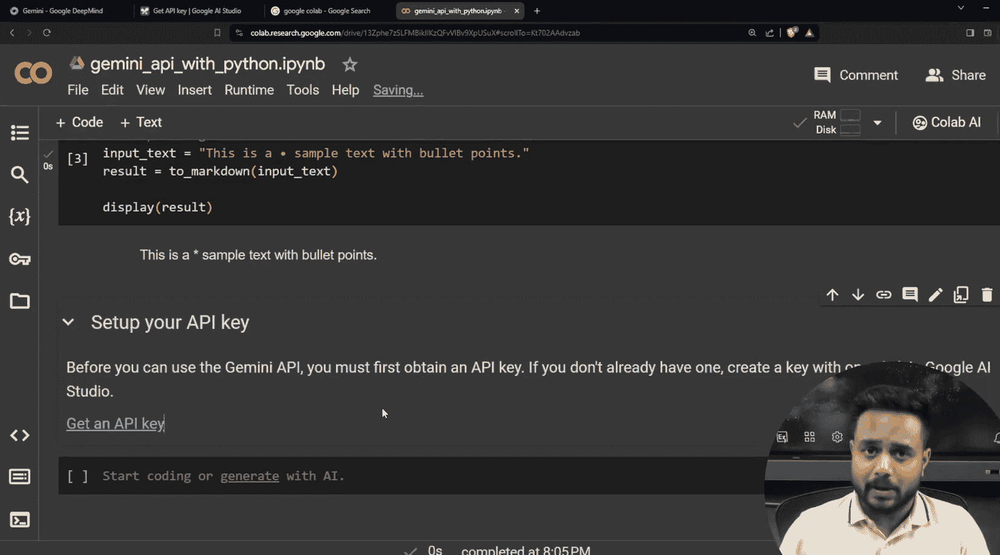

生成式AI：从初学者到专家｜P8：使用Python调用Google Gemini API（第二部分）

在本节课中，我们将学习如何使用Python调用Google Gemini API，重点实现文本生成和图像理解功能。我们将全程在Google Colab环境中操作，并探索其集成的便捷功能。

---

### 概述

上一节我们介绍了Google Gemini家族模型的基本情况。本节中，我们将动手实践，学习如何在Google Colab中配置API密钥，安装必要的Python包，并调用Gemini模型进行文本生成和图像理解。


---

### 环境设置与API密钥配置

首先，我们需要在Google Colab中设置环境并配置API密钥。Google Colab提供了直接保存密钥的“Secrets”功能，这比在本地配置环境变量更为便捷。

以下是配置步骤：

1.  访问Google AI Studio（`aistudio.google.com`）并生成API密钥。
2.  在Colab笔记本侧边栏找到“钥匙”图标（Secrets）。
3.  点击“添加新的密钥”，将变量名设置为`GOOGLE_API_KEY`，并粘贴刚才复制的API密钥值。
4.  确保勾选“允许笔记本访问”选项。




完成上述步骤后，API密钥便安全地保存在了当前Colab环境中。

---

### 安装必要依赖包

要使用Gemini API的Python SDK，我们需要安装`google-generativeai`包。

在Colab单元格中运行以下安装命令：

```python
!pip install -q google-generativeai
```

安装完成后，导入后续编码所需的库。

```python
import google.generativeai as genai
import textwrap
from IPython.display import display, Markdown
```

为了将模型返回的文本（可能包含Markdown符号如`*`）美观地显示出来，我们定义一个辅助函数：

```python
def to_markdown(text):
    # 使用textwrap将长文本按固定宽度折叠，并用Markdown格式渲染
    text = text.replace('•', '  *')
    return Markdown(textwrap.indent(text, '> ', predicate=lambda _: True))
```

---






### 初始化与配置模型





在开始调用API之前，需要先使用保存的密钥配置生成式AI库，并初始化指定的模型。

以下是初始化步骤：

1.  从Colab Secrets中获取之前保存的API密钥。
2.  使用该密钥配置`genai`模块。
3.  选择一个模型进行初始化，例如`gemini-1.5-flash`。

```python
# 从Secrets中获取API密钥
from google.colab import userdata
api_key = userdata.get('GOOGLE_API_KEY')


# 配置genai库
genai.configure(api_key=api_key)

# 初始化一个模型实例，例如使用gemini-1.5-flash模型
model = genai.GenerativeModel('gemini-1.5-flash')
```

---

### 文本生成实践

模型初始化完成后，我们就可以开始进行文本生成。这是通过向模型的`generate_content`方法传入提示词（Prompt）来实现的。

以下是一个简单的文本生成示例：

```python
# 定义一个提示词
prompt = "用简单的语言解释一下人工智能是什么。"

# 调用模型生成内容
response = model.generate_content(prompt)

# 使用之前定义的函数美化并显示结果
display(to_markdown(response.text))
```

执行上述代码，模型将根据提示词生成一段关于人工智能的解释文本。

---

### 图像理解实践

Gemini模型不仅支持文本生成，还具备强大的多模态理解能力，可以分析图像内容。

以下是实现图像理解的步骤：

1.  准备一张图片。可以从本地上传，也可以使用网络图片的URL。
2.  将图片加载或下载到Colab环境中。
3.  将图片和文本提示词一起传递给模型。

假设我们有一张名为`example_image.jpg`的图片，我们想让模型描述它：

```python
import PIL.Image

# 从本地上传图片
img = PIL.Image.open('example_image.jpg')

# 构建一个结合图像和文本的提示词
prompt_with_image = ["描述这张图片的内容。", img]

# 调用模型生成内容
response = model.generate_content(prompt_with_image)

# 显示结果
display(to_markdown(response.text))
```

模型将分析提供的图像，并生成一段描述其内容的文本。

---

### 总结



本节课中我们一起学习了Google Gemini API的核心调用方法。我们首先在Google Colab中完成了环境设置与API密钥的安全配置，然后安装了必要的Python SDK。接着，我们初始化了Gemini模型，并分别实践了纯文本生成和结合图像的多模态理解任务。通过`generate_content`方法，我们可以灵活地让模型处理各种文本和图像输入，生成所需的输出。