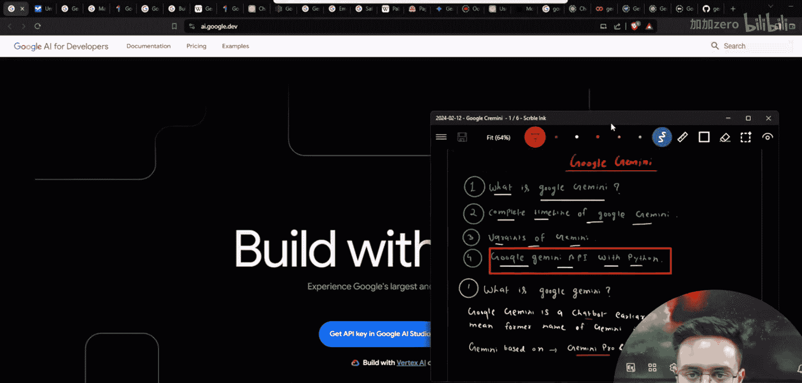
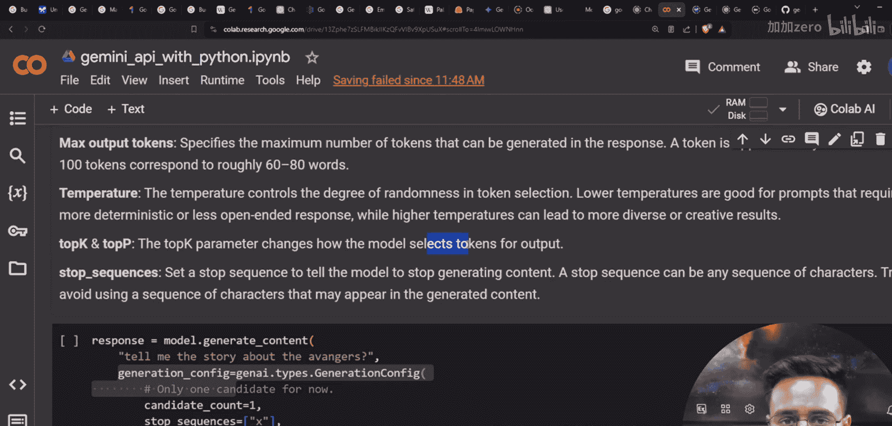

# 生成式AI：P9：Google Gemini API 与 Python 第3部分｜嵌入与安全设置 🧠

在本节课中，我们将探索 Google Gemini API 的一些高级功能。我们将学习如何配置文本生成、管理对话历史、计算令牌数量、生成文本嵌入向量，以及配置模型的安全设置。这些知识对于构建端到端的AI应用至关重要。

上一节我们介绍了Gemini API的基础功能，如读取API密钥和生成文本。本节中我们来看看更高级的配置选项。

## 生成配置 ⚙️

首先，我们来了解什么是生成配置。Gemini 是一个生成模型，我们输入文本，它输出文本。我们可以通过配置参数来调整输出文本的特性。

以下是生成配置中可用的关键参数：

*   **`max_output_tokens`**：指定希望模型生成的最大令牌数。一个令牌大约对应4个字符，即一个单词。
*   **`temperature`**：控制输出的随机性和创造性。取值范围是 `0` 到 `2`。值越接近 `0`，输出越确定和直接；值越接近 `2`，输出越随机和富有创造性。
*   **`top_k`** 与 **`top_p`**：这两个参数影响模型如何从词汇表中选择下一个令牌。`top_p` 是一个介于 `0` 到 `1` 之间的概率值，用于控制候选词的概率累积范围。

```python
import google.generativeai as genai



# 配置API密钥
genai.configure(api_key="YOUR_API_KEY")

# 选择模型
model = genai.GenerativeModel('gemini-pro')

# 使用生成配置
response = model.generate_content(
    "请解释人工智能。",
    generation_config=genai.types.GenerationConfig(
        max_output_tokens=100,  # 限制输出长度
        temperature=0.7,        # 适度的创造性
        top_p=0.8
    )
)

print(response.text)
```

## 管理对话历史 💬

在构建聊天应用时，保持对话的上下文连贯性非常重要。Gemini API 内置了管理对话历史的功能。

以下是管理对话历史的基本步骤：

1.  初始化模型。
2.  使用 `start_chat()` 方法开启一个聊天会话，并可以传入初始历史记录。
3.  通过 `send_message()` 方法发送新消息，模型会自动参考之前的对话历史来生成回复。

```python
import google.generativeai as genai

genai.configure(api_key="YOUR_API_KEY")
model = genai.GenerativeModel('gemini-pro')

# 开启一个聊天会话
chat = model.start_chat(history=[])

# 发送第一条消息
response = chat.send_message("你好，我是小明。")
print(response.text)

# 发送第二条消息，模型会记住上下文
response = chat.send_message("我刚才说我叫什么名字？")
print(response.text)  # 模型应能回答“小明”
```

## 计算令牌数量 🔢

了解输入提示使用了多少令牌有助于管理API调用成本和控制输入长度。Gemini API 提供了计算令牌数量的工具。

以下是计算令牌数量的方法：

*   使用 `genai.count_tokens()` 函数，并传入模型名称和内容，即可返回令牌计数信息。

```python
import google.generativeai as genai

genai.configure(api_key="YOUR_API_KEY")

# 计算一段文本的令牌数
response = genai.count_tokens(model='models/gemini-pro', contents="这是一段需要计算令牌数量的示例文本。")
print(f"令牌总数: {response.total_tokens}")
```

## 生成文本嵌入向量 📊

文本嵌入（Embedding）是将文本转换为数值向量的过程，这些向量能够捕捉文本的语义信息，常用于搜索、聚类和比较文本相似度等任务。

以下是生成文本嵌入向量的步骤：

1.  使用 `genai.embed_content` 方法。
2.  指定模型（如 `embedding-001`）和需要转换的文本。
3.  方法将返回一个代表文本语义的数值向量。

```python
import google.generativeai as genai

genai.configure(api_key="YOUR_API_KEY")

# 生成单个文本的嵌入向量
text = "机器学习是人工智能的一个分支。"
result = genai.embed_content(model="models/embedding-001", content=text)
embedding_vector = result['embedding']
print(f"嵌入向量维度: {len(embedding_vector)}")
print(f"前5个值: {embedding_vector[:5]}")
```

## 配置安全设置 🛡️

为了确保AI应用生成的内容安全、无害，Gemini API 允许开发者对生成内容的安全性进行细粒度控制。

安全设置主要针对以下几个维度进行限制，每个维度都可以设置为 `BLOCK_NONE`、`BLOCK_ONLY_HIGH`、`BLOCK_MEDIUM_AND_ABOVE` 或 `BLOCK_LOW_AND_ABOVE` 等不同级别：

*   **`HARM_CATEGORY_HARASSMENT`**：骚扰内容
*   **`HARM_CATEGORY_HATE_SPEECH`**：仇恨言论
*   **`HARM_CATEGORY_SEXUALLY_EXPLICIT`**：色情内容
*   **`HARM_CATEGORY_DANGEROUS_CONTENT`**：危险内容

```python
import google.generativeai as genai

genai.configure(api_key="YOUR_API_KEY")

# 定义安全设置
safety_settings = [
    {
        "category": "HARM_CATEGORY_HARASSMENT",
        "threshold": "BLOCK_MEDIUM_AND_ABOVE"  # 阻止中等及以上骚扰内容
    },
    {
        "category": "HARM_CATEGORY_HATE_SPEECH",
        "threshold": "BLOCK_ONLY_HIGH"  # 仅阻止高度仇恨言论
    },
    # ... 可以配置更多类别
]

model = genai.GenerativeModel('gemini-pro')
response = model.generate_content(
    "请写一个关于科技的故事。",
    safety_settings=safety_settings  # 应用安全设置
)
print(response.text)
```



本节课中我们一起学习了 Google Gemini API 的五个高级功能：通过生成配置参数控制文本输出特性、管理多轮对话的历史记录、计算输入提示的令牌消耗、将文本转换为有意义的嵌入向量，以及配置内容安全策略以防止生成有害信息。掌握这些功能，你将能够更灵活、更安全地利用 Gemini 模型构建复杂的AI应用程序。