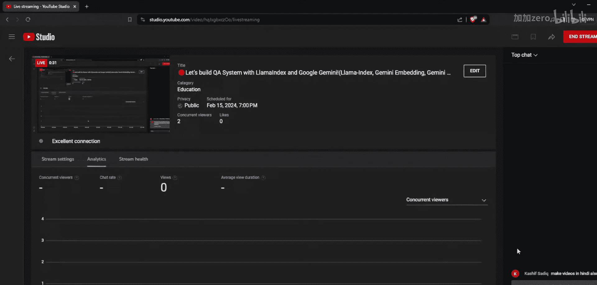
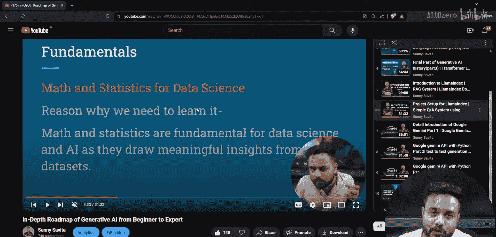
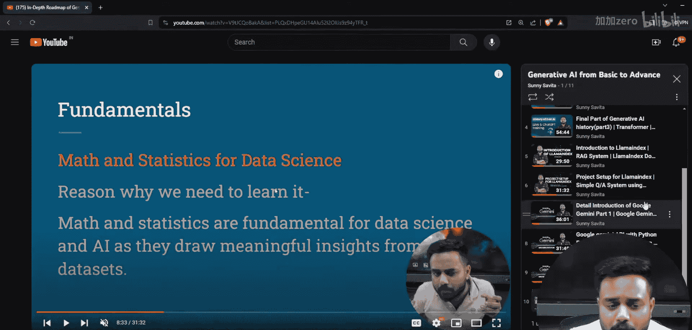
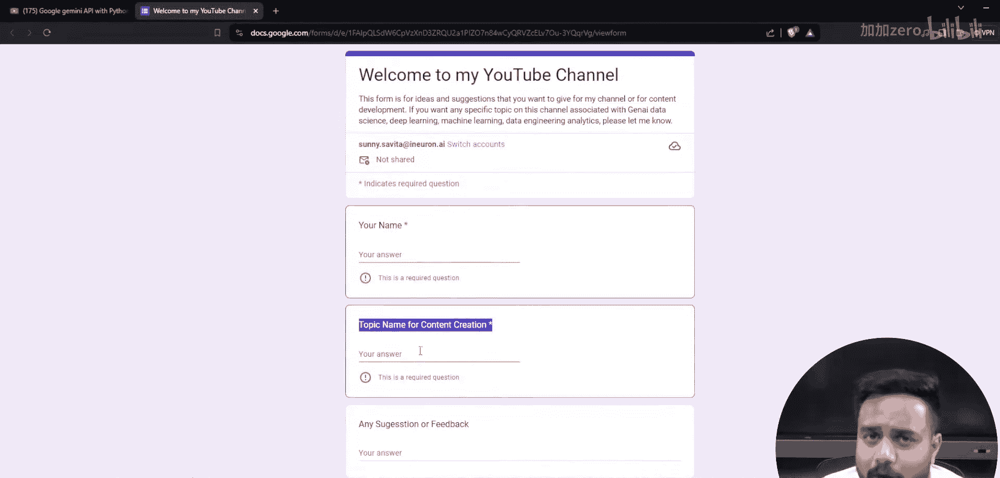

# 生成式AI：P10：使用LlamaIndex与Google Gemini构建问答系统 🚀



## 概述

在本节课中，我们将学习如何使用LlamaIndex框架和Google Gemini模型，从头开始构建一个完整的问答系统。我们将从环境配置开始，逐步讲解数据加载、索引构建、查询处理等核心步骤，最终实现一个能够回答用户问题的智能系统。

---

## 1. 环境与工具准备

上一节我们介绍了课程的整体目标，本节中我们来看看构建问答系统所需的环境和工具。

以下是构建问答系统前需要准备的核心组件：

*   **Python环境**：确保已安装Python 3.8或更高版本。
*   **LlamaIndex库**：用于数据索引和检索增强生成的核心框架。
    ```bash
    pip install llama-index
    ```
*   **Google Gemini API**：我们将使用Gemini模型作为生成答案的大语言模型。你需要一个Google AI Studio账户并获取API密钥。
*   **文本数据**：用于构建知识库的文档或文本文件。

---

## 2. 核心概念：LlamaIndex与RAG

在开始编码之前，理解背后的核心概念至关重要。LlamaIndex是一个用于构建**检索增强生成**应用程序的框架。


**检索增强生成**的核心思想是：当用户提出问题时，系统首先从外部知识库中检索最相关的文档片段，然后将这些片段与问题一起提供给大语言模型，从而生成更准确、更具上下文的答案。


其工作流程可以概括为以下公式：
`最终答案 = LLM(用户问题 + 检索到的相关文档)`

---

## 3. 构建问答系统的步骤

理解了RAG原理后，本节我们将分步实现问答系统。

以下是构建问答系统的具体步骤：


1.  **初始化LLM**：配置Google Gemini作为我们的大语言模型。
2.  **加载文档**：将你的知识文档加载到LlamaIndex中。
3.  **创建索引**：对文档进行分割、嵌入并构建可快速检索的索引。
4.  **创建查询引擎**：基于索引构建一个能够理解问题并检索相关上下文的引擎。
5.  **进行查询**：向引擎提出问题并获取答案。


---

## 4. 代码实现详解

现在，让我们将上述步骤转化为具体的代码。

首先，导入必要的库并设置API密钥。

```python
import os
from llama_index.core import VectorStoreIndex, SimpleDirectoryReader
from llama_index.llms.gemini import Gemini

# 设置你的Google Gemini API密钥
os.environ[“GOOGLE_API_KEY”] = “你的_API_密钥_在这里”

# 初始化Gemini模型
llm = Gemini(model=“models/gemini-pro”)
```

接下来，加载你的文档数据。假设你的文档存放在名为“data”的文件夹中。

```python
# 从指定目录加载文档
documents = SimpleDirectoryReader(“./data”).load_data()
```

然后，使用加载的文档和LLM创建向量索引。索引过程会自动处理文本分块和嵌入。

```python
# 创建向量存储索引
index = VectorStoreIndex.from_documents(documents, llm=llm)
```





索引创建完成后，可以基于它实例化一个查询引擎。

```python
# 创建查询引擎
query_engine = index.as_query_engine(llm=llm)
```

最后，使用查询引擎来提出问题并获取答案。

```python
# 提出一个问题
response = query_engine.query(“什么是生成式人工智能？”)
# 打印答案
print(response)
```

---

## 5. 系统优化与扩展

基础系统搭建完成后，我们可以探索一些优化和扩展方向，以提升其性能和实用性。



以下是几个可以考虑的优化点：

*   **调整分块策略**：修改文本分割的大小和重叠度，以优化检索质量。
*   **使用不同的嵌入模型**：尝试不同的嵌入模型来生成文档向量，可能影响检索的相关性。
*   **添加上下文窗口**：在查询时传入更多历史对话或上下文，使回答更连贯。
*   **构建用户界面**：使用Gradio或Streamlit为你的问答系统创建一个简单的Web界面。

---

## 总结

本节课中我们一起学习了如何使用LlamaIndex和Google Gemini构建一个问答系统。我们从RAG的核心概念讲起，逐步完成了环境配置、文档加载、索引创建和查询响应的全过程。你构建的这个系统能够利用外部知识库，为用户的问题提供基于事实的准确答案。你可以以此为基础，加入更多数据源或优化策略，打造更强大的智能问答应用。