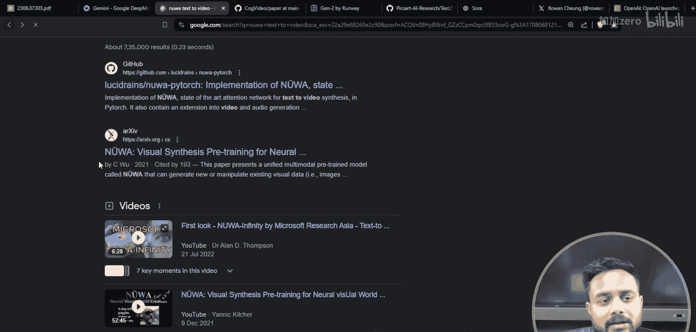

# 生成式AI：P11：文本到视频生成与Sora模型详解 🎬

在本节课中，我们将学习生成式AI中一个激动人心的新领域：文本到视频生成。我们将从基础概念开始，逐步理解不同类型的生成模型，并重点探讨OpenAI最新发布的Sora模型及其工作原理。

## 生成模型的类型 📊

上一节我们介绍了生成式AI的广阔领域，本节中我们来看看生成模型的具体分类。生成模型可以根据输入和输出数据的类型进行划分。

以下是生成模型的四种主要类型：

1.  **同质模型**：输入和输出为同类型数据。
    *   **文本到文本生成**：例如GPT-3、GPT-3.5、GPT-4等大型语言模型。
    *   **图像到图像生成**：例如Stable Diffusion等扩散模型。

2.  **异质模型**：输入和输出为不同类型数据。
    *   **文本到图像生成**：例如Midjourney、DALL-E等模型。
    *   **图像到文本生成**：例如GPT-4V、Gemini Pro等视觉语言模型。

## 文本到视频生成 🎥

理解了生成模型的基本分类后，我们现在聚焦于文本到视频生成这一特定任务。在这种模型中，**输入是文本提示（Prompt）**，而**输出是一段视频**。

我们需要理解视频的本质。**文本**本质上是一系列**令牌（Token）**的集合。而**视频**本质上是一系列**图像（或帧）**的序列。视频的质量通常用**帧率（FPS，Frames Per Second）**来衡量，它表示每秒处理的图像数量。

因此，文本到视频生成模型的核心任务是：接收文本令牌序列作为输入，生成一个连贯的图像帧序列作为输出。

## Sora模型及其竞品 🤖

在Sora发布之前，业界已经存在一些文本到视频生成模型。了解它们有助于我们认识Sora所处的技术背景。

以下是几个知名的文本到视频生成模型：

1.  **Sora**：由OpenAI发布的最新模型。
2.  **NÜWA**：由微软发布的模型。
3.  **CogVideo**：一个开源的文本到视频生成模型。
4.  **Runway Gen-2**：由Runway公司开发的生成模型。
5.  **Text2Video-Zero**：另一个文本到视频生成的研究模型。

其中，Sora是OpenAI于近期发布的最新模型，代表了当前该领域的前沿水平。

## 核心技术：注意力机制与Transformer 📄

这些先进的生成模型，包括Sora，其背后大多依赖于Transformer架构及其核心组件——**注意力机制（Attention Mechanism）**。

注意力机制允许模型在处理序列数据（如文本令牌或视频帧）时，动态地关注输入中不同部分的重要性。其核心公式可以简化为：

**Attention(Q, K, V) = softmax(QK^T / √d_k) V**

其中：
*   **Q (Query)**：代表当前需要计算输出的位置。
*   **K (Key)**：代表输入序列中所有位置的信息。
*   **V (Value)**：代表输入序列中所有位置的实际值。
*   **d_k**：是Key向量的维度，用于缩放。

通过这种机制，模型能够理解长距离的依赖关系，这对于生成时间上连贯、内容上符合文本描述的视频至关重要。Sora等模型正是基于此类架构，将文本提示的语义信息，通过复杂的变换和生成过程，映射到动态的视频帧序列上。

## 总结 📝

本节课中我们一起学习了生成式AI中文本到视频生成的相关知识。我们首先回顾了生成模型的四种基本类型。然后，我们深入探讨了文本到视频任务的定义，理解了视频作为图像序列的本质。接着，我们列举了Sora及其主要竞品模型。最后，我们揭示了支撑这些模型的核心技术——Transformer架构中的注意力机制。Sora的发布标志着AI在理解和生成动态视觉内容方面迈出了重要一步，为未来更广泛的多模态AI应用奠定了基础。