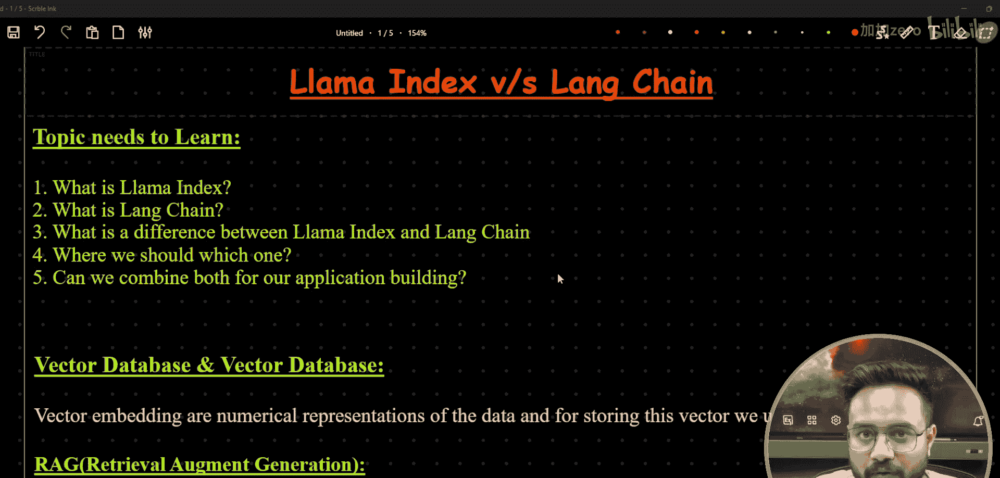
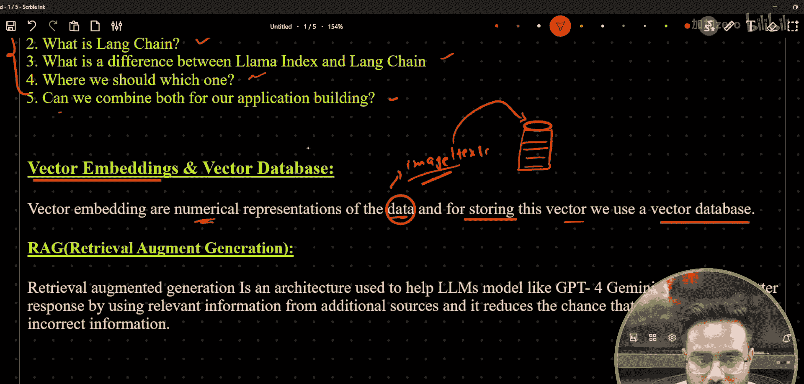
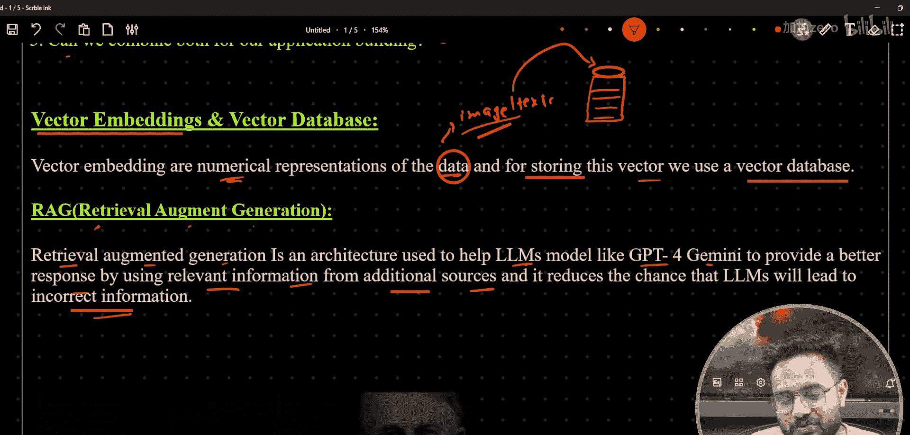
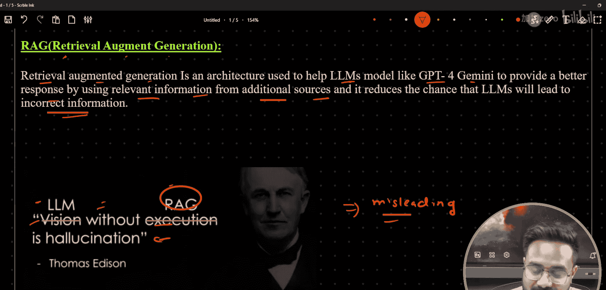
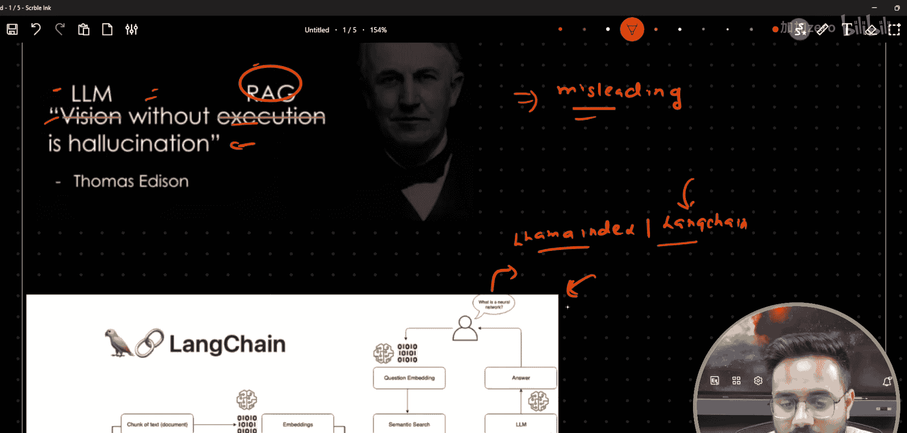
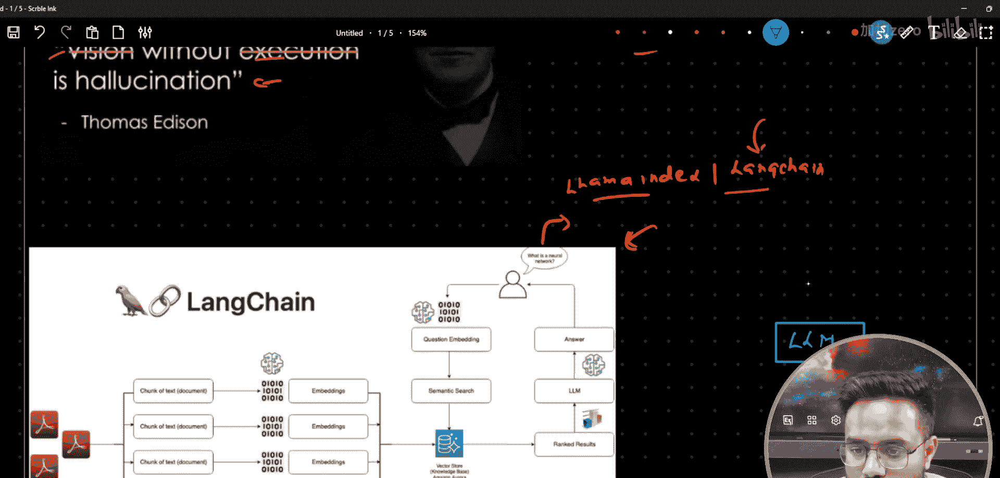
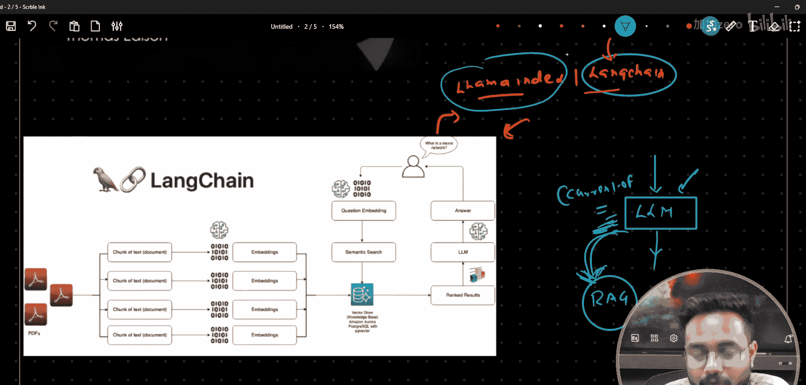
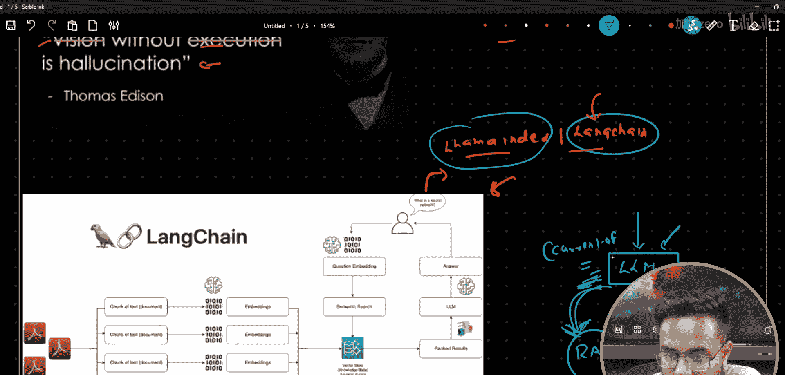

# 生成式AI：P12：LangChain与Llama-Index详细对比 🆚

在本节课中，我们将详细探讨LangChain和Llama-Index这两个用于构建大语言模型应用的主流框架之间的核心区别。我们将从基本概念入手，逐步分析它们的设计哲学、功能差异以及各自的适用场景，帮助你做出明智的技术选型。

## 概述

在开始对比之前，我们需要理解一个核心架构：检索增强生成。这是理解这两个框架作用的基础。

### 向量数据库与嵌入

向量嵌入是数据的数值化表示。例如，一段文本或一张图片可以被转化为一组高维度的数字（向量）。为了高效存储和查询这些向量，我们使用向量数据库。

### 检索增强生成

检索增强生成是一种架构，旨在通过从外部数据源检索相关信息来辅助大语言模型，从而生成更准确、更可靠的回答。它降低了模型产生“幻觉”（即编造不准确信息）的风险。

**核心公式**：
`最终回答 = LLM(用户问题 + 从外部数据检索到的相关上下文)`

上一节我们介绍了RAG的基本概念，本节中我们来看看LangChain和Llama-Index如何在这个架构中发挥作用。

## 什么是Llama-Index？ 📚

Llama-Index是一个专注于数据摄取和检索的框架。它的核心目标是充当你的私有数据和大型语言模型之间的智能桥梁。

其主要功能是：
*   **数据连接**：从各种来源（如PDF、数据库、API）加载数据。
*   **索引构建**：将加载的数据结构化成易于检索的格式（例如，创建向量索引）。
*   **高效检索**：根据用户查询，从索引中快速找到最相关的信息片段。

**简单来说**：Llama-Index擅长“准备数据”和“查找数据”，然后将找到的上下文交给LLM去生成最终答案。

## 什么是LangChain？ ⛓️

LangChain是一个用于开发由语言模型驱动的应用程序的**全面框架**。它不仅仅关注检索，还提供了一个用于链接多个组件和步骤的标准化接口。

其设计围绕“链”的概念，允许你将以下模块像链条一样连接起来：
*   **模型**：与各种LLM和聊天模型交互。
*   **提示**：管理、优化和模板化提示词。
*   **记忆**：为对话或链式调用维护状态（记忆）。
*   **索引**：数据检索（这部分与Llama-Index功能重叠，LangChain也内置了检索能力）。
*   **代理**：让LLM决定调用哪些工具（如计算器、搜索引擎、API）来完成任务。

**简单来说**：LangChain是一个“应用程序构建工具箱”，它协调LLM、工具、数据和逻辑，以创建复杂的多步骤应用。

## 核心差异对比

理解了各自的基本定义后，以下是它们之间的详细区别：

### 1. 设计哲学与范围
*   **Llama-Index**：专注于“检索”。它力求在数据索引和检索方面做到极致、高效和简单。
*   **LangChain**：专注于“编排”。它旨在为构建端到端的LLM应用提供一个通用、可扩展的框架，检索只是其众多功能之一。

### 2. 核心功能
*   **Llama-Index**：
    *   高级数据连接器。
    *   强大的索引结构（如向量索引、树状索引、关键词索引等）。
    *   复杂的检索策略（自动合并检索结果、重排序等）。
*   **LangChain**：
    *   模块化组件（模型、提示、记忆、索引、代理）。
    *   链式调用，将组件组合成工作流。
    *   代理系统，实现LLM驱动的决策和工具使用。
    *   内置的检索功能（相对基础）。

### 3. 学习曲线与易用性
*   **Llama-Index**：对于以检索为中心的任务（如构建Q&A系统），API通常更简洁、更专用，上手更快。
*   **LangChain**：由于功能庞大，概念更多（链、代理、记忆），初始学习曲线更陡峭。但它为复杂应用提供了更大的灵活性。

### 4. 灵活性
*   **Llama-Index**：在数据检索流程中非常灵活，但在构建涉及复杂逻辑、多步骤或工具调用的应用时，需要与其他库配合。
*   **LangChain**：在编排复杂工作流方面极具灵活性。你可以轻松地组合不同的LLM、提示、工具和检索器来创建定制化流程。

### 5. 社区与集成
*   **Llama-Index**：拥有强大的数据源集成生态。
*   **LangChain**：拥有极其广泛的生态系统，集成了海量的LLM、工具、数据库和平台，是当前最流行的LLM应用框架。

## 如何选择？ ✅

根据以上对比，你可以遵循以下原则进行选择：

以下是选择建议：
*   **选择 Llama-Index，如果**：你的应用核心是**从私有数据集中进行高效、精准的检索**，然后进行问答或总结。你想要一个轻量级、专注的解决方案来完成“检索增强生成”中的“检索”部分。
*   **选择 LangChain，如果**：你需要构建**功能复杂的端到端应用程序**。例如，应用需要多步骤推理、调用外部工具API、管理对话历史，或者你预见未来需求会增长，需要框架级的灵活性。
*   **结合使用两者**：这是一种常见且强大的模式。你可以使用 **Llama-Index 来构建高效、专业的检索系统**，然后将它作为一个**检索器组件集成到 LangChain 的链或代理中**。这样既能利用Llama-Index强大的检索能力，又能享受LangChain在整体工作流编排上的便利。

## 总结

本节课中我们一起学习了LangChain和Llama-Index的详细差异。

*   **Llama-Index** 是**检索专家**，擅长为你的数据建立索引并快速找到答案所需的信息。
*   **LangChain** 是**应用架构师**，提供了一个完整的工具箱来设计和组装复杂的、由LLM驱动的应用程序。

理解它们的区别有助于你根据项目需求选择正确的工具。对于简单的文档问答，Llama-Index可能更直接；对于需要决策、工具使用和多步骤交互的智能助手，LangChain是更合适的基础。在许多实际生产场景中，强强联合——用Llama-Index处理检索，用LangChain处理编排——往往能产生最佳效果。