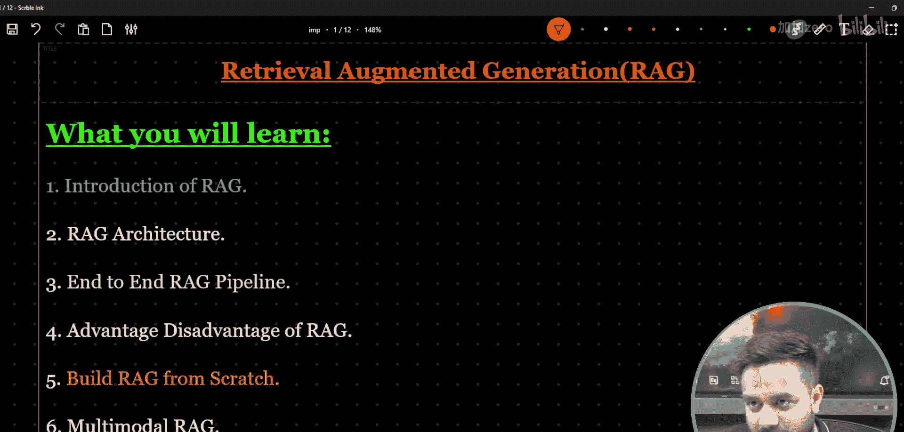
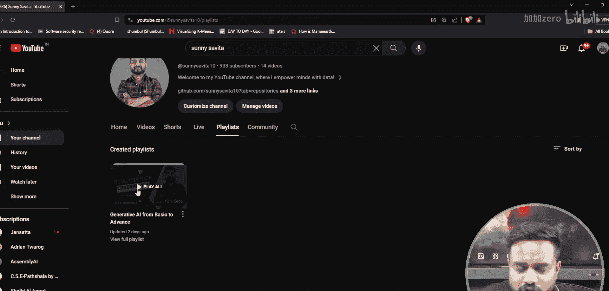
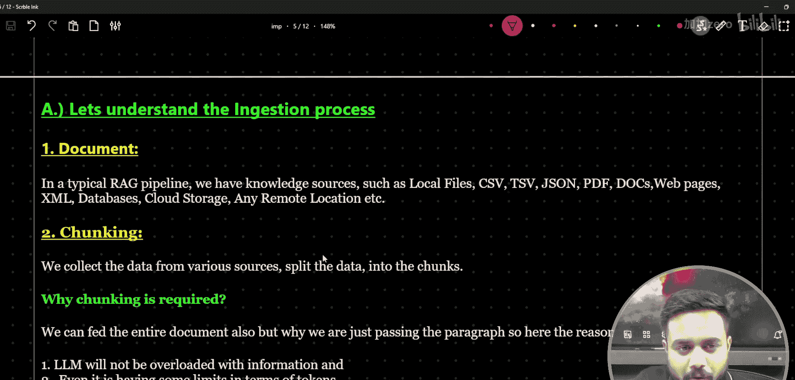
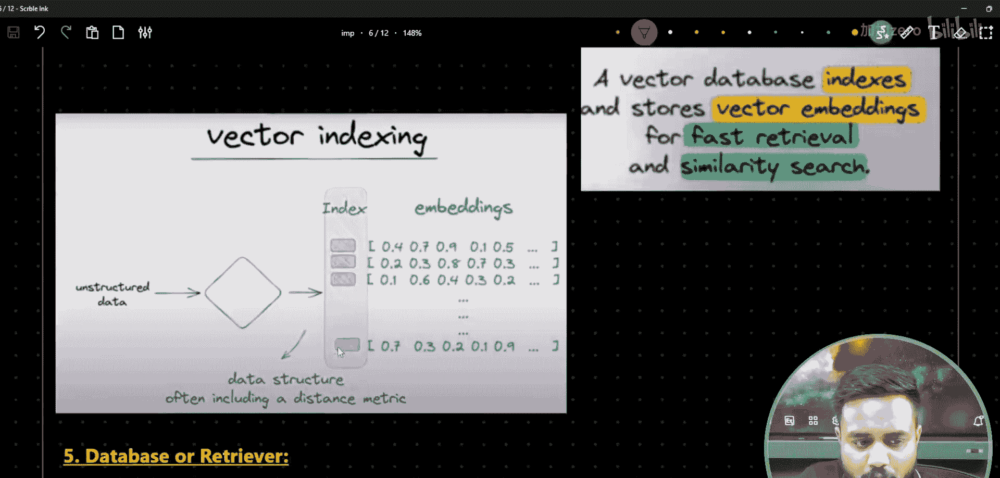
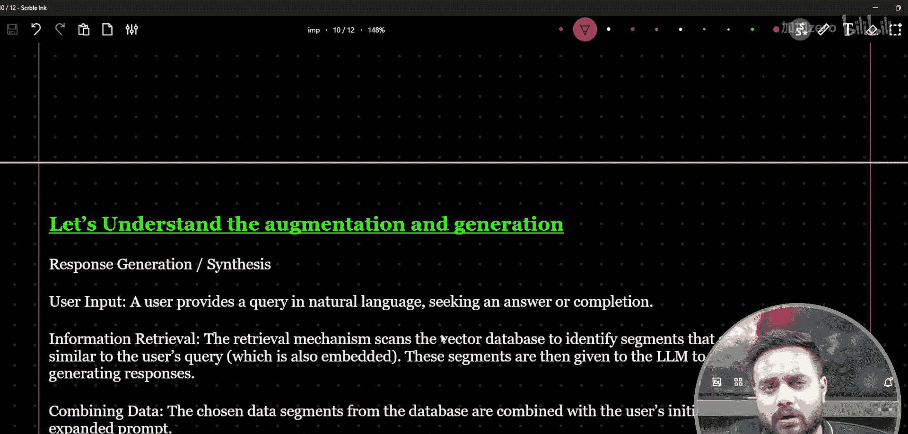
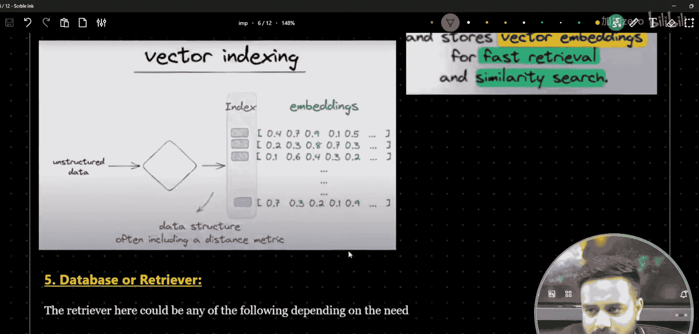
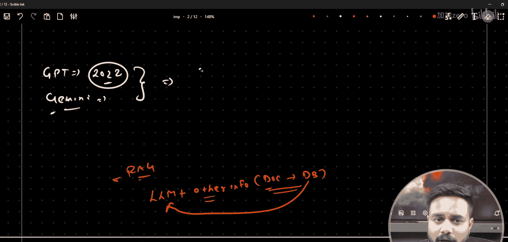

# 生成式AI：13：端到端RAG流水线第一部分｜RAG架构｜数据摄取｜生成





## 概述

在本节课中，我们将学习检索增强生成（RAG）系统。我们将从RAG的基本定义开始，理解其核心架构，并详细探讨其流水线中的关键组成部分：数据摄取和生成过程。本课程旨在为初学者提供一个清晰、全面的RAG入门指南。


## 什么是RAG？

检索增强生成（RAG）是一种用于增强大型语言模型（LLM）性能的架构。它通过从外部知识源检索相关信息，并将这些信息提供给LLM，来帮助模型生成更准确、更相关的回答。这种方法可以减少LLM产生错误或过时信息的可能性。

**核心公式**：`最终回答 = LLM(用户查询 + 检索到的相关文档)`

上一节我们介绍了RAG的基本概念，本节中我们来看看为什么需要使用RAG。

## 为何使用RAG？

使用RAG主要基于以下几个原因：







1.  **知识局限性**：LLM（如GPT系列）的训练数据存在截止日期，无法获取训练时未包含的最新或特定领域信息。
2.  **提高准确性**：通过提供相关的外部文档作为上下文，可以引导LLM生成基于事实的答案，减少“幻觉”（即编造信息）。
3.  **任务特定性**：使通用的LLM能够适应特定的业务领域或任务，而无需进行耗时的微调。

## RAG系统架构总览



一个完整的RAG系统通常分为两个主要阶段：**数据摄取（索引）** 和 **查询与生成**。下面，我们将深入探讨数据摄取阶段。

以下是数据摄取阶段的关键步骤：

1.  **文档加载**：从各种来源（如PDF、网页、数据库）收集原始文档。
2.  **文档分割**：将长文档切分成更小的、语义连贯的文本块（Chunks）。这是为了便于后续的检索和匹配。
3.  **向量化**：使用嵌入模型（Embedding Model）将每个文本块转换为一个高维向量（即嵌入向量）。这个向量代表了文本的语义信息。
    *   **代码示例（概念）**：
        ```python
        # 伪代码，展示向量化过程
        text_chunk = “这是一个示例句子。”
        embedding_vector = embedding_model.encode(text_chunk) # 输出一个数值向量，例如 [0.1, -0.5, 0.8, ...]
        ```
4.  **向量存储**：将所有文本块的嵌入向量以及对应的原始文本（元数据）存储到专门的向量数据库（如ChromaDB, Pinecone, Weaviate）中，以便进行高效的相似性搜索。

## 总结

本节课中我们一起学习了RAG系统的基础知识。我们了解到RAG通过结合外部知识来增强LLM的能力，并初步探讨了其架构的第一部分——数据摄取流水线。这个阶段的核心目标是将原始文档处理并存储为便于检索的格式，为后续的查询和答案生成打下基础。



在下一部分，我们将继续学习RAG架构的第二阶段：查询与生成，看看当用户提出问题时，系统如何检索相关信息并生成最终答案。