# 生成式AI：14：端到端RAG流程第二部分 | 高级检索过程 | RAG架构

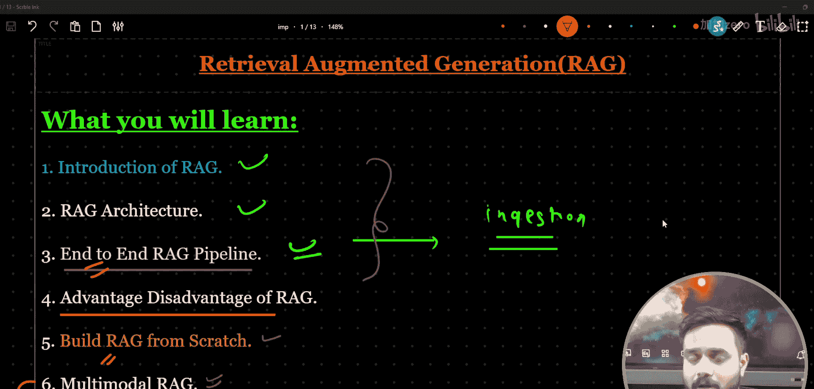

## 概述

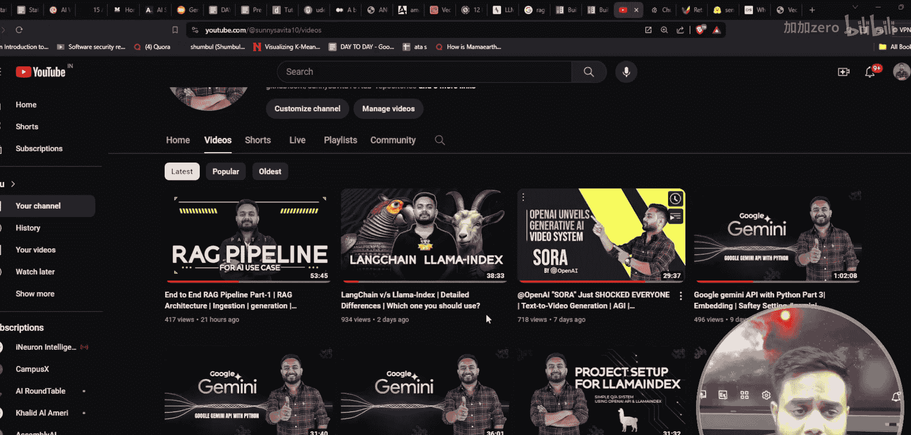

在本节课中，我们将继续学习端到端检索增强生成流程。上一节我们介绍了RAG的架构、嵌入和相似性搜索等基础概念。本节中，我们将深入探讨RAG流程中的**检索**部分，分析其优势与局限，并介绍更高级的检索技术。

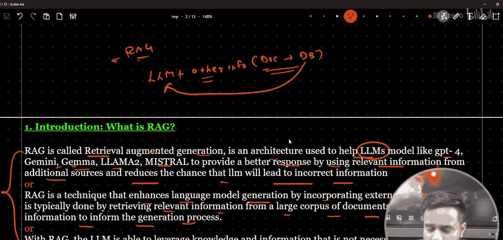

## 回顾：RAG架构与流程

RAG代表检索增强生成。它是一种帮助大型语言模型提供更佳响应的系统架构。该架构主要分为三个部分：**数据摄取**、**检索**和**生成**。

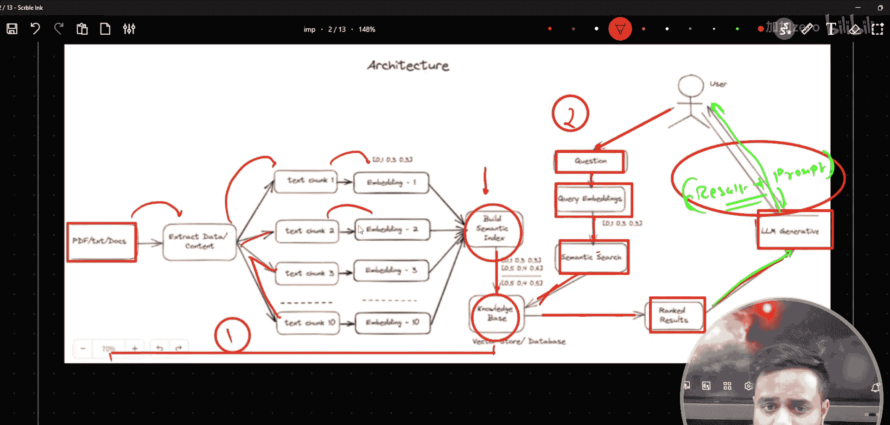

在上一节中，我们详细讨论了数据摄取过程，它包含五个主要步骤：
1.  文档收集
2.  文本分块
3.  生成嵌入
4.  建立索引
5.  存储到检索器/数据库

## 核心：检索过程详解

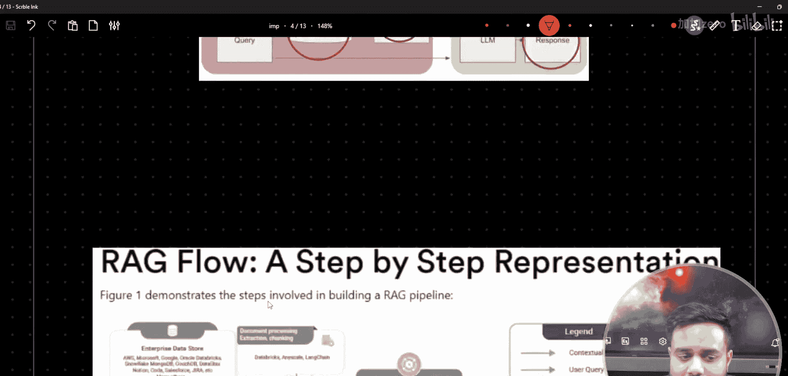

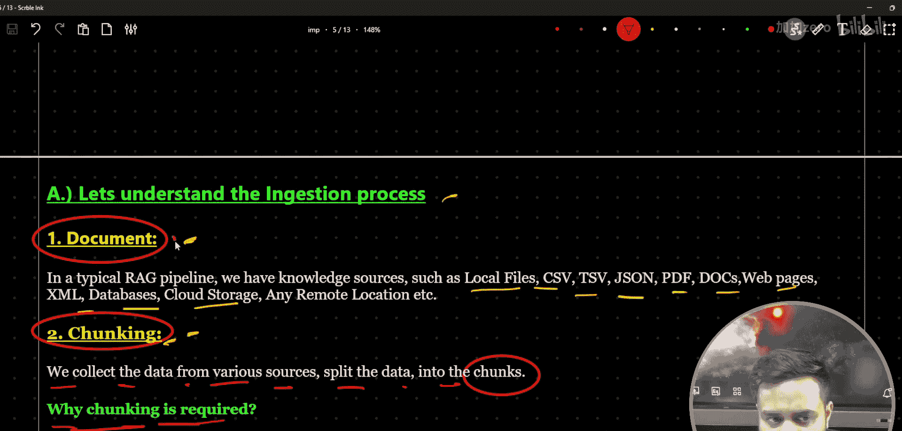

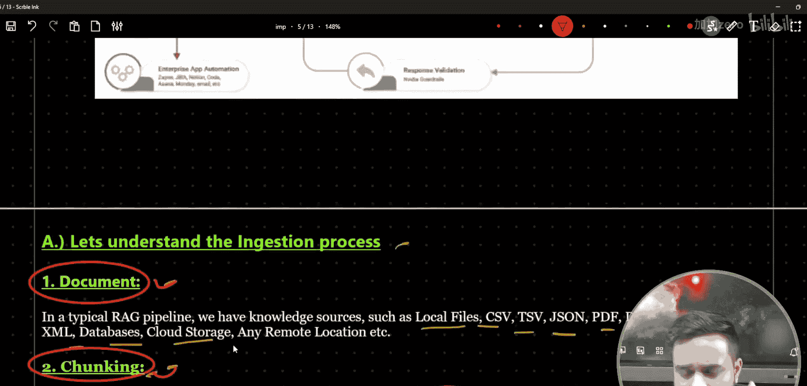

现在，我们来看看检索过程。检索的含义很简单：当用户提出查询时，系统需要从数据库中找出最相关的信息。

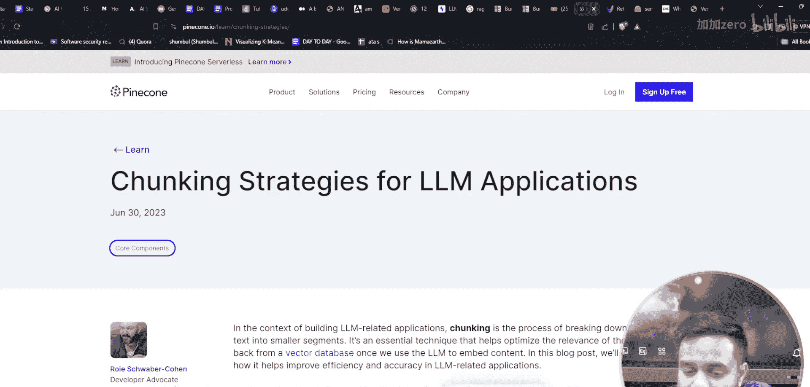

以下是检索过程的基本步骤：
1.  用户提出一个查询。
2.  系统将该查询转换为向量嵌入。
3.  在向量数据库中进行**相似性搜索**（如点积或余弦相似度）。
4.  根据相似度得分，找出前K个最相关的文本块（例如，Top 3 或 Top 5）。
5.  将这些检索到的文本块与原始查询一起传递给大型语言模型。
6.  语言模型综合这些信息，生成最终的回答。

这个过程可以概括为：**用户查询 -> 相似性搜索 -> 检索Top K结果 -> 传递给LLM生成答案**。

## 基础RAG流程的优缺点

上述描述的是一个基础的RAG流程。它适用于数据量较小、场景简单的应用。以下是其主要的优点和缺点：

**优点：**
*   **简单高效**：流程直接，易于理解和实现。
*   **处理统一**：用于创建嵌入和传递给LLM进行生成的文本块是相同的，保持了数据的一致性。

**缺点：**
*   **上下文理解有限**：对于较长的文档或复杂查询，简单的分块可能丢失重要的上下文信息。
*   **不适合大数据**：当处理大量或复杂的文档时，基础方法的检索精度可能不足。

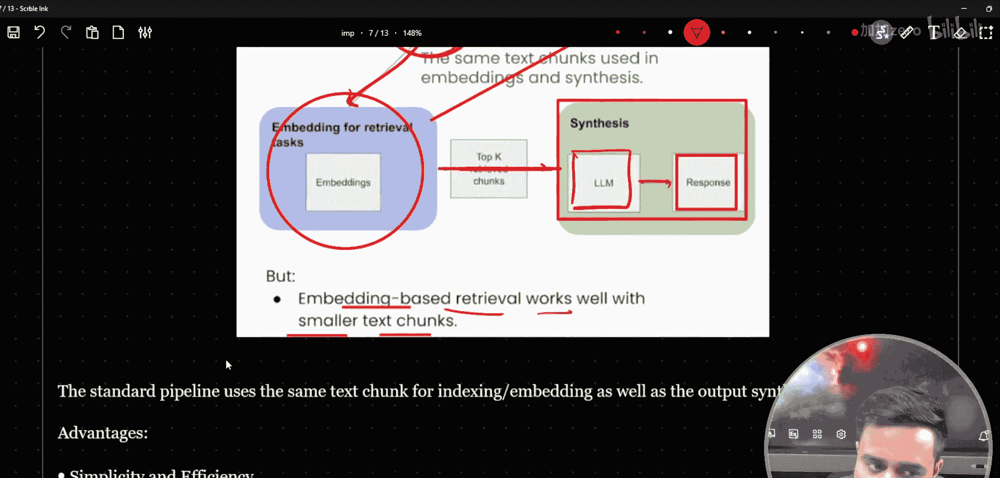

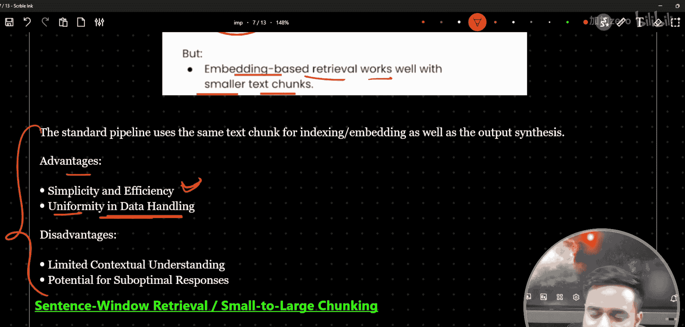

## 总结

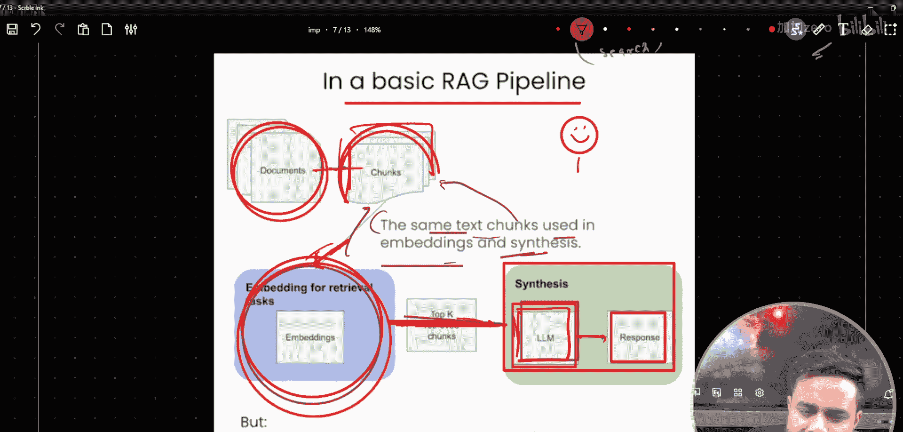

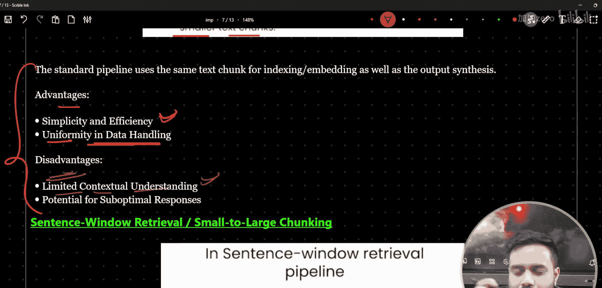

本节课我们一起学习了RAG流程中的核心环节——检索。我们明确了检索就是从数据库中根据用户查询找到最相关信息的过程，并分析了基础检索方法的优缺点。正因为基础方法存在局限，我们才需要更高级的检索技术。在接下来的课程中，我们将探讨这些高级技术，例如重新排序、查询扩展等，以构建更强大、更精准的RAG系统。