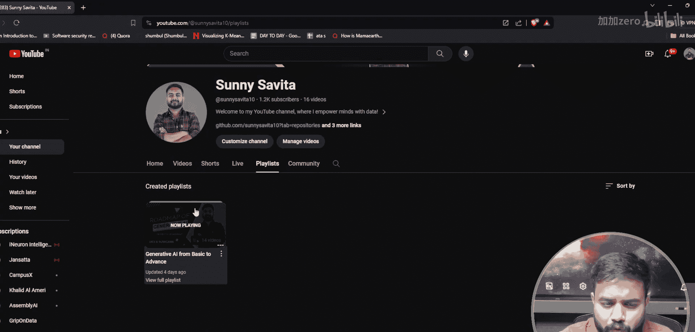
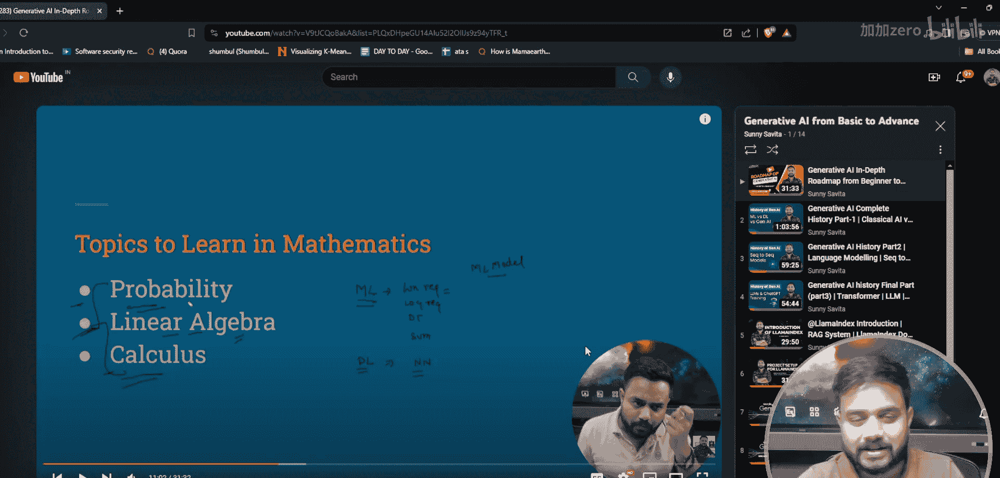
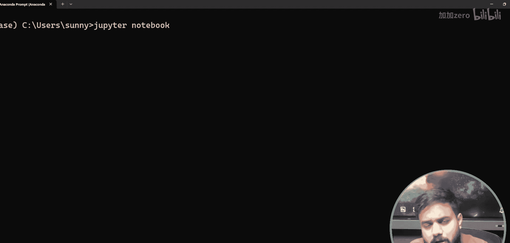
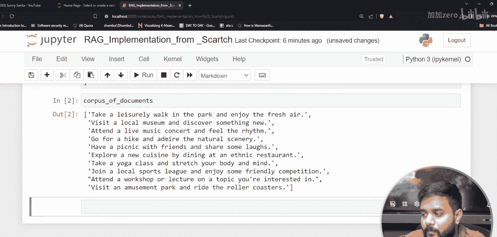
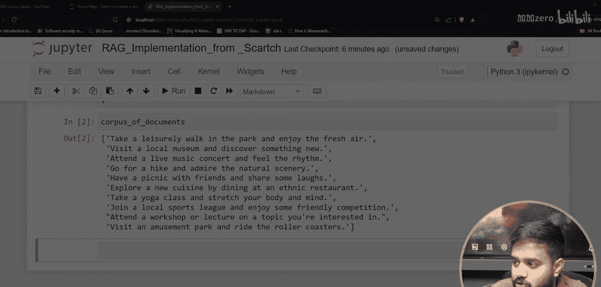
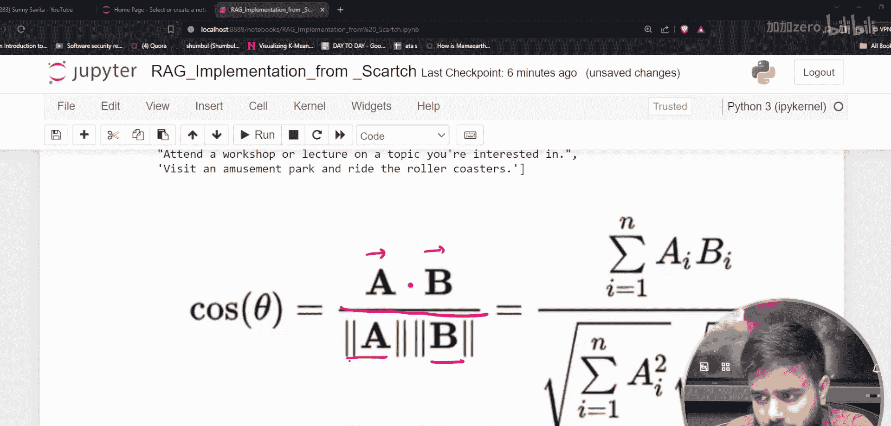

# 生成式AI：P15：从零构建RAG流程（使用Ollama、Python和Llama2）

在本节课中，我们将学习如何不使用任何现成框架（如LlamaIndex），仅使用Python、Ollama和Llama2模型，从零开始实现一个完整的检索增强生成（RAG）架构。我们将把流程分解为数据摄取、检索和生成三个核心部分，并逐步实现。

## 概述



RAG架构通过结合外部知识库来增强大型语言模型的生成能力。本节课，我们将手动实现其核心组件，包括文档处理、向量嵌入、相似性检索以及最终的答案生成。通过这个实践，你将深入理解RAG系统背后的工作原理。

## 环境与工具准备



上一节我们介绍了课程目标，本节中我们来看看实现所需的环境和工具。

我们将使用Jupyter Notebook进行开发，并通过Anaconda管理环境。以下是设置步骤：

*   安装Anaconda。
*   从Anaconda Prompt启动Jupyter Notebook。
*   在Jupyter中创建一个新的Python3笔记本文件。

## RAG架构总览

在开始编码之前，让我们先理解将要构建的RAG系统架构。整个流程可以分为三个主要阶段：



1.  **数据摄取**：准备原始文档并将其转化为机器可理解的格式。
2.  **检索**：将用户查询与知识库中的文档进行匹配，找出最相关的内容。
3.  **生成**：结合检索到的相关文档和原始查询，让语言模型生成最终答案。

接下来，我们将按照这三个阶段依次实现。

## 第一阶段：数据准备与嵌入

首先，我们需要准备一些文档数据作为我们的知识库。为了简化，我们将直接在代码中创建一个文档列表。

```python
# 创建一个简单的文档语料库
corpus_of_documents = [
    "生成式人工智能是人工智能的一个分支，专注于创建新的内容。",
    "检索增强生成（RAG）结合了信息检索和文本生成技术。",
    "向量嵌入是将文本转换为数值表示的过程。",
    "余弦相似度是衡量两个向量方向相似程度的指标。"
]
```

现在，我们需要将这些文本转换为**向量嵌入**。嵌入是文本的一种数值化表示，它捕获了文本的语义信息，使得计算机可以计算文本之间的相似度。

我们将使用一个嵌入模型来完成这个转换。嵌入结果将存储在我们的“向量数据库”中。在本例中，为了清晰展示原理，我们暂时用Python变量来模拟这个存储。

## 第二阶段：检索与相似度计算

当用户提出一个查询时，我们需要从知识库中找出与之最相关的文档。这需要两个步骤：

1.  将用户查询也转换为向量嵌入。
2.  计算查询向量与每个文档向量的相似度。

我们将使用**余弦相似度**作为相似度度量标准。它的公式如下：

**公式**：`similarity = (A · B) / (||A|| * ||B||)`

其中，`A · B` 代表向量A和B的点积，`||A||` 和 `||B||` 分别代表向量A和B的模长（即大小）。这个公式计算的是两个向量在方向上的接近程度，值越接近1，表示越相似。

以下是计算余弦相似度的示例代码逻辑：

```python
import numpy as np

def cosine_similarity(vec_a, vec_b):
    """计算两个向量的余弦相似度"""
    dot_product = np.dot(vec_a, vec_b)
    norm_a = np.linalg.norm(vec_a)
    norm_b = np.linalg.norm(vec_b)
    return dot_product / (norm_a * norm_b)
```

我们将对查询向量和知识库中的所有文档向量执行此计算，并选出相似度最高的文档作为检索结果。

## 第三阶段：答案生成

检索阶段为我们找到了与用户查询最相关的背景文档。现在，我们需要将原始查询和这些相关文档一起提交给大型语言模型（Llama2），让它生成一个准确、信息丰富的答案。





这个步骤的核心是构建一个合适的提示词（Prompt），将查询和上下文信息有效地组合起来，引导模型生成最佳答案。

## 总结



本节课中，我们一起学习了RAG系统的核心架构，并将其分为数据、检索和生成三个模块进行实现。我们了解了如何将文本转换为向量嵌入，如何使用余弦相似度进行语义检索，以及如何将检索到的上下文与查询结合以生成最终答案。通过这个从零开始的手动实现过程，你应该对RAG技术的内在机制有了更扎实的理解。在接下来的课程中，我们将学习如何使用LlamaIndex等框架来更高效地实现这些功能。