生成式AI：P16：使用LangChain、OpenAI和FAISS构建RAG应用 🚀

## 概述

在本节课中，我们将学习如何使用LangChain框架、OpenAI的API以及FAISS向量数据库，构建一个检索增强生成（RAG）应用。我们将从零开始，一步步实现一个能够根据外部知识库生成更准确答案的系统。

## 欢迎回来与课程更新

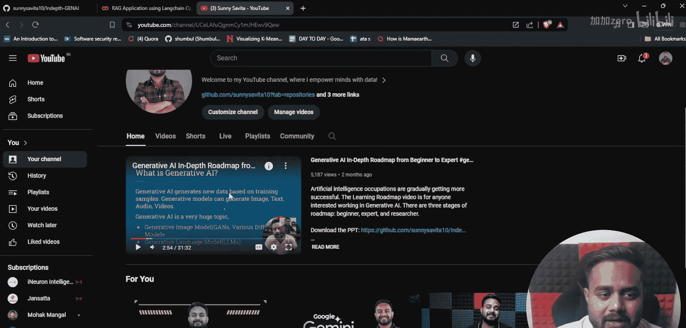

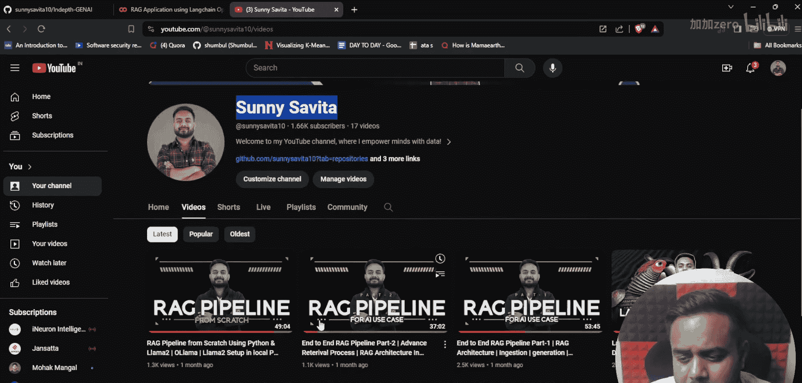

大家好，欢迎回到我的YouTube频道。我是Sunny Savita。

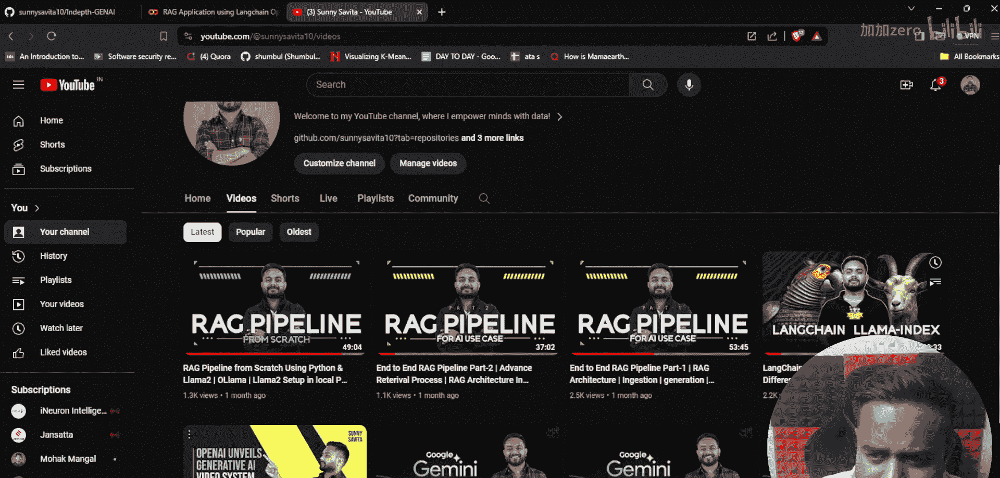

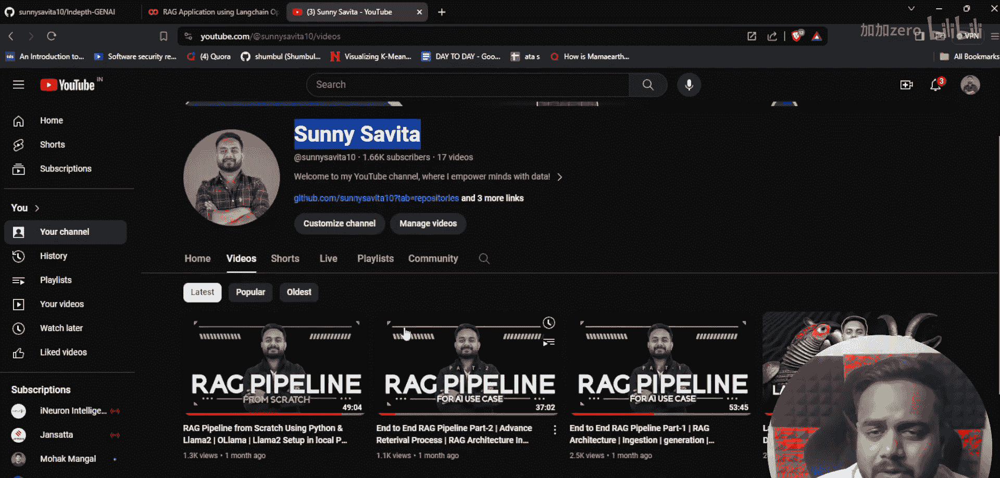

在这期视频中，我们将学习如何使用LangChain创建一个RAG系统。

我休息了一段时间，所以很久没有在YouTube频道上传视频了。

首先，让我展示一下我的YouTube频道，然后我会提供进一步的更新。

你只需要搜索“Sunny Savita”，就能找到我的频道。在那里，你会发现许多关于生成式AI的不同视频，包括LangChain等内容。

我从生成式AI的历史开始讲起，然后涉及了Llama、LangChain、LlamaIndex等主题。还有很多其他视频。如果你还没有订阅或查看，请去看看吧。

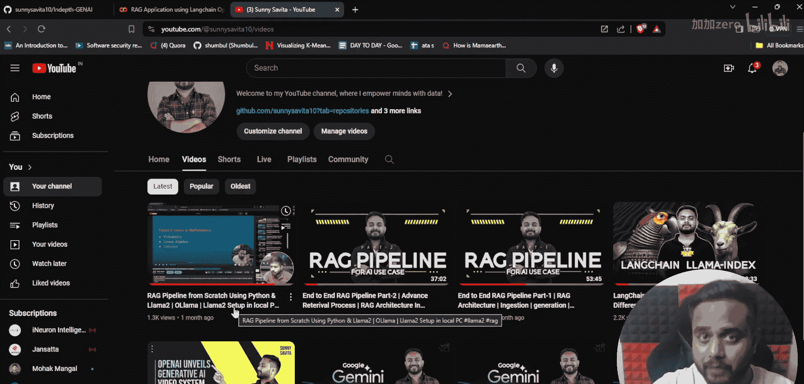

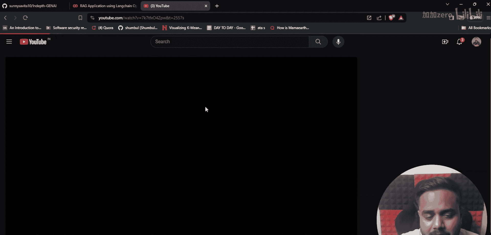

我上传的最后一个视频是关于RAG的。

我休息了很长时间，大约一个月没有上传任何视频，因为我忙于个人事务和工作。现在我回来了，并将重新开始学习之旅。

我会继续发布视频。我将从我一个月前离开的那个主题开始讲起。

如果你查看我的视频，你会发现在上一个视频中，我正在从零开始创建RAG管道。我展示了关于RAG架构的完整代码，以及如何从零开始创建RAG管道，并对RAG进行了完整详细的介绍。如果你想知道更多关于生成式AI和LLM的内容，请务必查看这个视频。即使在直播课程中，我也涵盖了一个项目。那是一个直播会议。

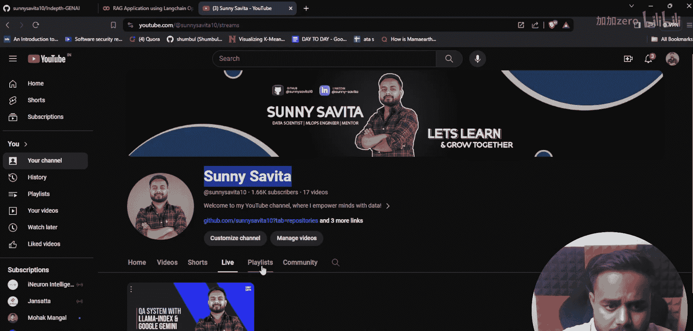

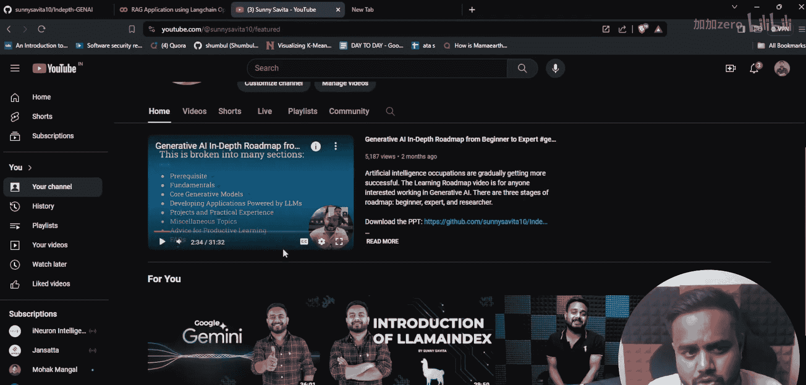

现在，首先，如果你还没有订阅，请去订阅。如果你喜欢这个内容，请也点击“喜欢”按钮。

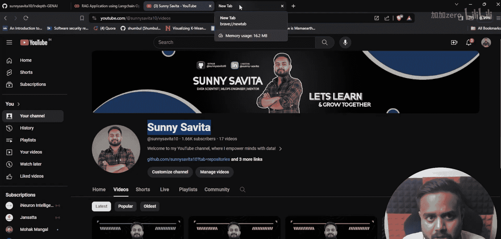

## 本课内容与资源

现在让我们开始这个视频。在这期视频中，我们将要做什么？我们将使用LangChain、OpenAI和一个名为FAISS的向量数据库来创建一个RAG应用。

首先，让我展示完整详细的笔记。我在YouTube视频中讨论的所有笔记，你都可以在我的Github仓库中找到。

让我展示我的Github仓库，以及你可以在哪个仓库找到笔记。

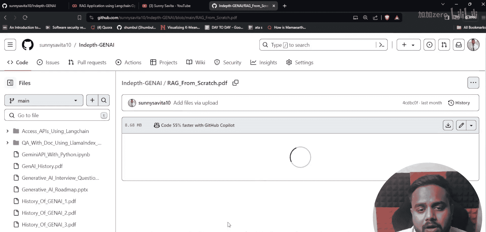

你只需要查看这个名为“in-depth-generative-ai”的仓库，点击打开它。在这里，你会找到所有的笔记、所有的项目以及一切内容。

让我展示这个“RAG from scratch”的PDF。在这个PDF中，你可以找到关于RAG的完整详细理论，这些我在视频中也讨论过。

你可以看到这是主题名称，你将在这个RAG架构和RAG管道中学到什么。我提到了每个主题：RAG的介绍、RAG架构、RAG管道、优势等一切。甚至“从零开始构建RAG”这五点，我也在会议中讨论过了。

现在，基本上，我将向你展示如何从零开始创建RAG，你甚至也会找到代码。这是代码。现在我将展示如何使用不同的框架来创建RAG。这样你会得到不同的体验。如果你想从零开始创建RAG，你可以这样做。如果你想使用任何框架来创建RAG，你当然也可以这样做。

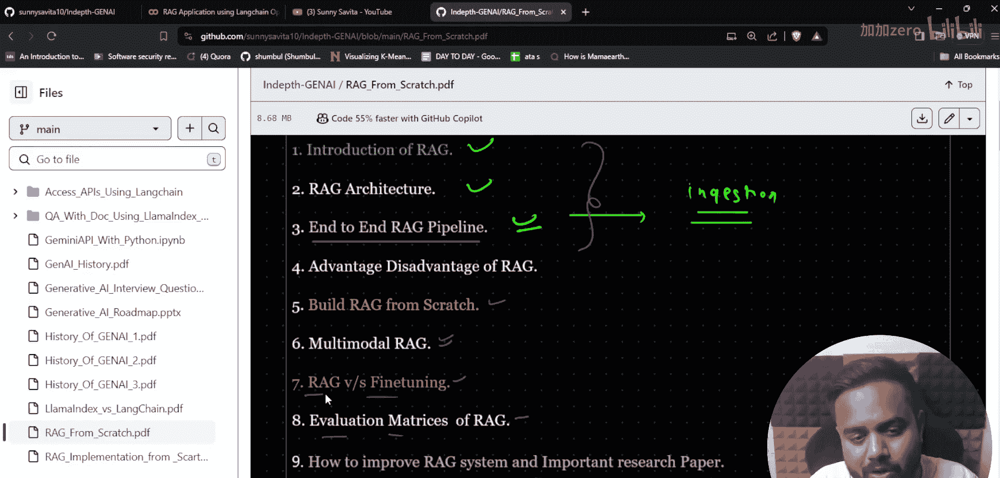

在这里，我将涵盖不同的框架，比如LangChain、LlamaIndex或其他框架。在接下来的4到5个视频中，我基本上将涵盖所有这些内容，包括多模态RAG和RAG的评估。然后我也会展示一些研究论文，因为我告诉过你，我将从我离开教程的那个点开始，这样你可以保持学习的连续性。

之后，我考虑开始一个关于微调的系列，在那里我将讨论所有的微调技术，然后我将向你展示RAG与微调的区别。

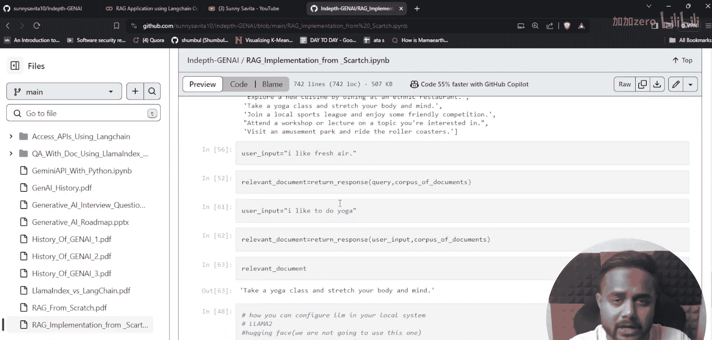

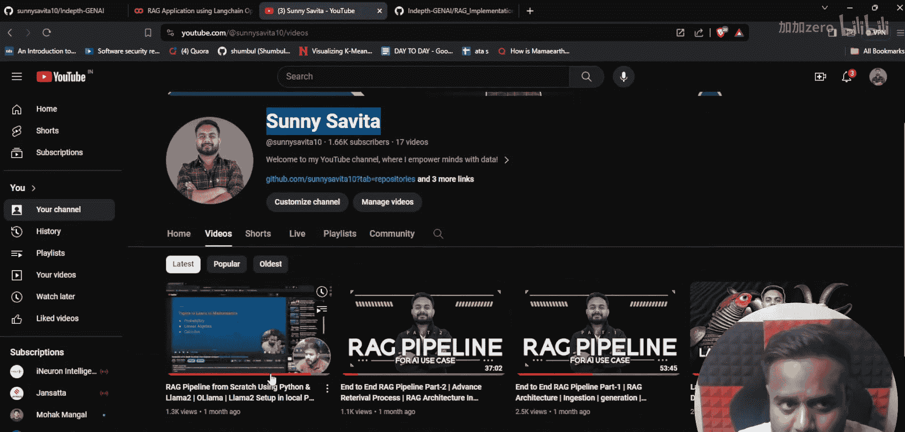

## 开始实践：RAG应用构建

让我们开始吧。首先，你可以去查看代码，即“从零开始的RAG架构或RAG实现”。如果你还没有看过这个，请去查看，请尝试下载并运行它。然后你会获得足够多的想法，而且视频也是可用的。

现在你可以看到，在这个特定的视频中，我们将使用LangChain、OpenAI API和FAISS创建RAG应用。在下一个视频中，我将展示使用LangChain、Mistral和这个向量数据库的RAG架构或RAG应用。

因为我在这里使用的是OpenAI API服务，这是付费的。在下一个视频中，基本上我将展示使用开源模型。我可以使用任何类型的模型，但我选择了Mistral。我会让你知道为什么，我甚至可以用其他API来展示，这我会在下一个视频中告诉你，你很快就会看到。

FAISS，我想你知道，它是一个Facebook的数据库，是一个内存中的向量数据库、向量存储。我们肯定会在我们的项目中使用它。

现在让我们开始吧。我将编写代码，有些部分我会复制粘贴，只是为了节省时间，没有其他原因。

## RAG核心概念回顾

那么，什么是RAG？我在这里清楚地提到了RAG的定义。如果你不知道，你也可以查看我之前的视频。

RAG的定义是：检索增强生成。你会检索相关数据，并将其用于生成。我们将从LLM生成，我们将增强来自LLM的响应。

我们不单纯依赖从训练数据中获得的知识，这意味着我们不直接通过LLM获取响应。我们试图维护一个知识库，并从该知识库中获取信息，而不是直接通过LLM，这样我们就能获得期望的输出。

我向你展示的所有材料都是经过充分研究的。如果你遵循我的材料和笔记，你不需要去其他地方，因为我在为你做这些工作。如果你渴望学习生成式AI，你绝对应该遵循我的材料，因为在这里我将向你展示成为生成式AI工程师或使用生成式AI或LLM开发所需的一切。

## RAG架构详解

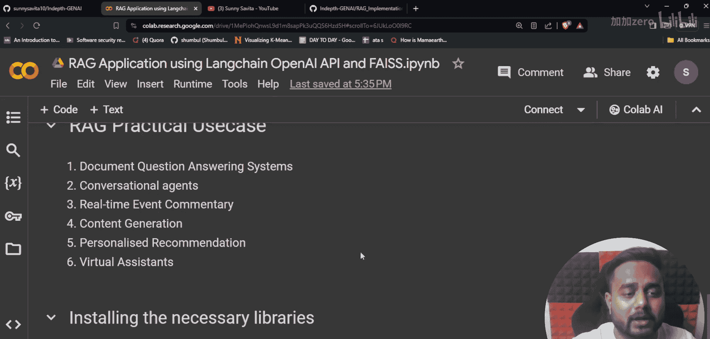

现在定义清楚了，让我们试着理解架构。在这个架构中，你可以看到我们有多个阶段。我在之前的视频中已经解释过了，如果你想详细了解，可以查看那个视频。

在这个架构中，你可以看到我们在做什么。首先，让我打开我的画笔，这样我就可以在这里高亮显示一些内容。我想这对你们所有人都是可见的，但别担心，我会给你这张图片，这样你就可以去查看了。

现在，你会发现我们有PDF、文本文档等，我们从那里提取数据，然后从该数据创建块，接着创建嵌入，并将其保存在知识库中的某个地方。在我们的案例中，我们将使用FAISS这个向量数据库。

之后，你可以看到用户正在提问。如果你看用户部分，这是我的用户。如果用户提出问题，我们不会直接从LLM生成响应。不，我们不这样做。

这是我的LLM，我们不这样做。相反，我们在做什么？我们正在增强响应。为什么？因为我们想要更好的答案，这就是为什么我们在这里增强响应。

你可以看到这是我的用户，用户正在提问。我们正在从那个特定问题创建嵌入。如果你不了解嵌入、向量数据库等，别担心，我会为你们所有人创建一个专门的视频、专门的系列、专门的教程，这样你就能理解这个向量数据库以及我们可以在生成式AI应用中使用的不同类型的数据库。

现在我们正在创建这个特定查询的嵌入，然后我们执行语义搜索。这是我的排名靠前的答案。这个排名答案可以是一个，也可以是多个。这取决于我们。

现在，我们将这个排名答案传递给这个LLM。通过这个LLM，我们从知识库中获得的最佳答案，我们将其传递给这个LLM，同时我们也向这个LLM传递提示，然后我们生成输出。我们不直接生成它，因为我的LLM可能会误导我。这就是为什么我的LLM不能给出所有类型的答案，所有实时答案。因此，我们使用这种特定的技术。明白我的意思了吗？我想是的。

## 总结

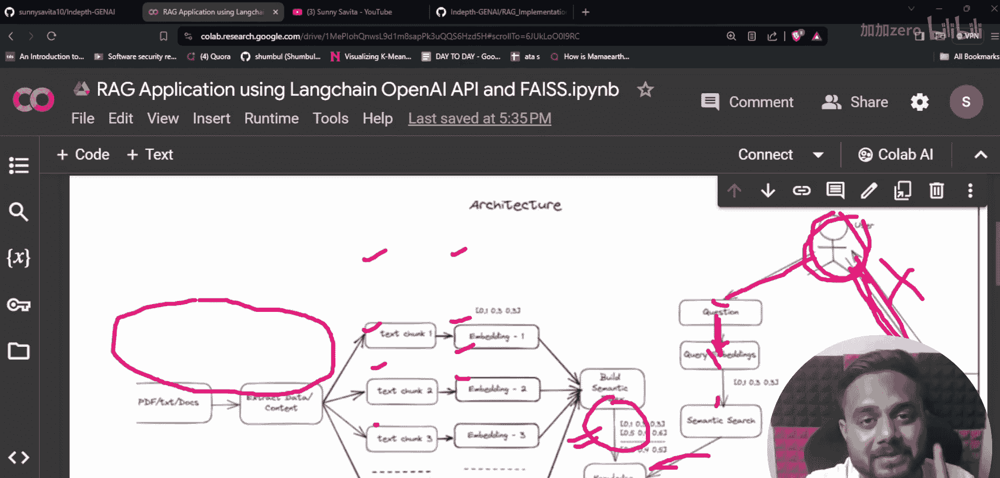

本节课中，我们一起学习了RAG（检索增强生成）的基本概念、核心架构以及如何利用LangChain、OpenAI API和FAISS向量数据库来构建一个基础的RAG应用。我们回顾了从外部文档提取知识、创建嵌入、进行语义检索，并最终利用大语言模型生成增强答案的完整流程。理解这个流程是构建更复杂AI应用的基础。在接下来的课程中，我们将深入更多框架和高级主题。