# 生成式AI：P17：使用Langchain、Mistral AI和Weaviate数据库构建RAG应用 🚀

## 概述
在本节课中，我们将学习如何使用Langchain框架、开源的Mistral AI模型以及Weaviate向量数据库，构建一个检索增强生成（RAG）应用。我们将从环境配置开始，逐步实现数据加载、向量化存储、检索和生成回答的完整流程。

---

## 环境配置与库安装

上一节我们介绍了本课程的目标，本节中我们来看看如何配置开发环境。

首先，我们需要安装项目所需的Python库。以下是需要安装的核心库列表：

```python
!pip install weaviate-client langchain tiktoken pypdf rapidfuzz
```

*   `weaviate-client`: 用于连接和操作Weaviate向量数据库。
*   `langchain`: 用于构建LLM应用链式流程的框架。
*   `tiktoken`: OpenAI开发的用于文本分词的工具。
*   `pypdf`: 用于读取PDF文档。
*   `rapidfuzz`: 一个后端依赖包，在某些运行时环境中需要。

安装过程需要一些时间。在等待的同时，我们可以开始配置Weaviate数据库。

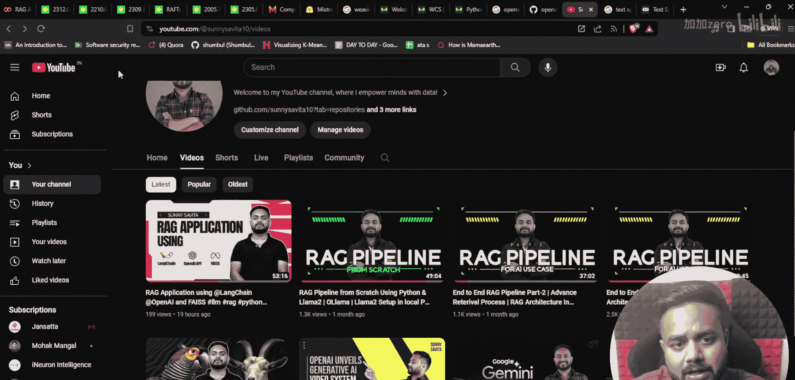

---

## 配置Weaviate向量数据库

我们已经安装了必要的库，接下来需要设置向量数据库。Weaviate是一个用于存储和检索向量嵌入的数据库。它有两种使用方式：作为内存数据库或作为云服务。本教程将使用其云服务版本。

要使用Weaviate云服务，你需要获取两个关键信息：**API密钥**和**集群URL**。

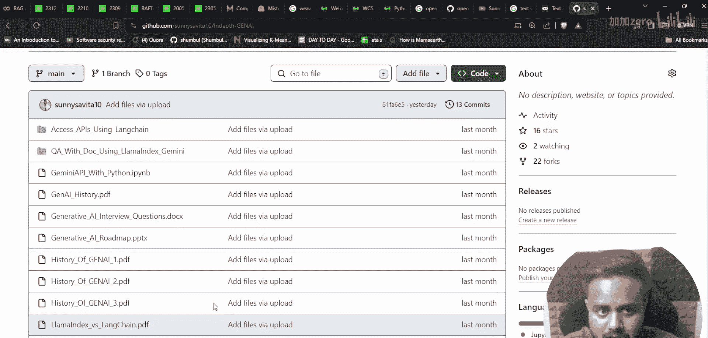

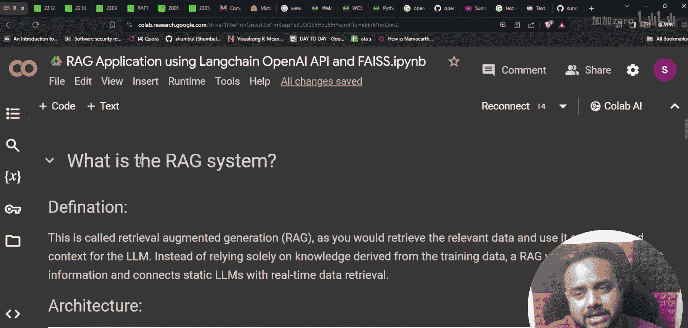

以下是获取这些信息的步骤：
1.  访问Weaviate官方网站并注册一个账户。
2.  登录后，点击“Create Cluster”（创建集群）。
3.  选择“Sandbox”（沙盒）免费套餐，而不是付费的“Managed Cluster”。
4.  为你的集群命名（例如“my_project”），然后点击创建。
5.  创建完成后，你可以在集群详情页找到你的**集群URL**和用于生成**API密钥**的选项。

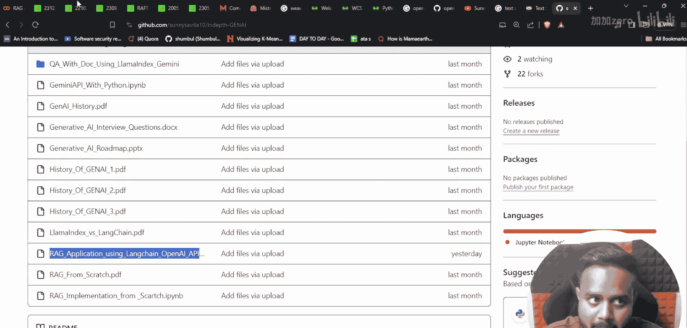

获取到`WEAVIATE_API_KEY`和`WEAVIATE_CLUSTER_URL`后，你就可以在代码中配置客户端了。

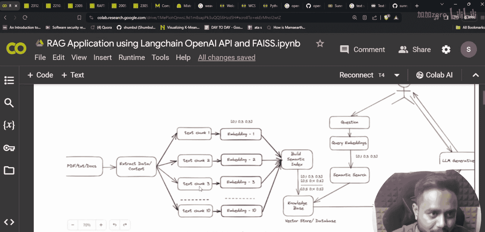

---

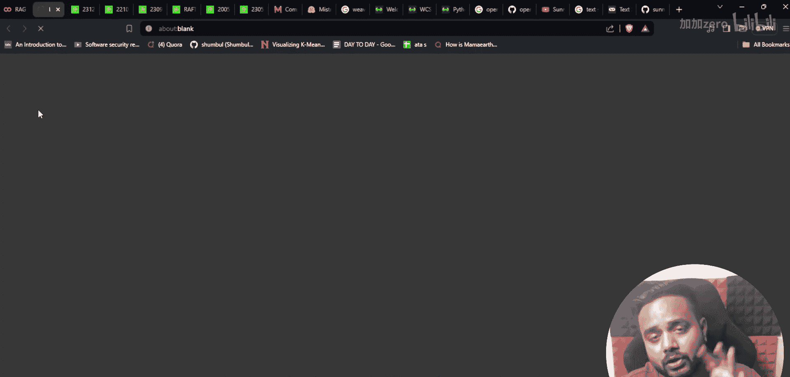

## 项目架构与数据准备

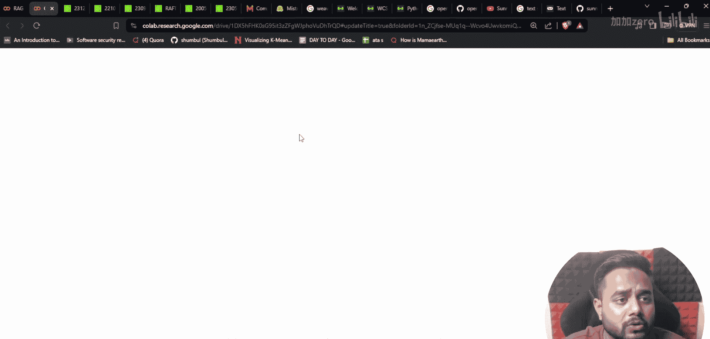

配置好数据库后，我们来了解一下本项目的架构。我们将实现一个标准的RAG流程。

以下是实现RAG应用的核心步骤：
1.  **数据加载**：从PDF文件中读取原始文本数据。
2.  **文本分块**：将长文本分割成适合模型处理的小片段。
3.  **向量化与存储**：使用嵌入模型将文本块转换为向量，并存入Weaviate数据库，构建知识库。
4.  **检索**：当用户提问时，将问题转换为向量，并在知识库中检索最相关的文本块。
5.  **生成**：将检索到的相关上下文与用户问题一起提交给大语言模型（Mistral AI），生成最终答案。

我们将按照这个流程，在接下来的章节中逐一实现。

---

## 代码实现：连接数据库与加载模型

现在，我们开始编写核心代码。首先，导入必要的模块并设置Weaviate客户端。

```python
import os
from langchain.vectorstores import Weaviate
from langchain.embeddings import HuggingFaceEmbeddings
from langchain.llms import HuggingFacePipeline
from langchain.chains import RetrievalQA
import weaviate

# 1. 配置Weaviate客户端（请替换为你的实际信息）
client = weaviate.Client(
    url="YOUR_WEAVIATE_CLUSTER_URL",
    auth_client_secret=weaviate.AuthApiKey(api_key="YOUR_WEAVIATE_API_KEY")
)

# 2. 加载嵌入模型（用于将文本转换为向量）
embedding_model = HuggingFaceEmbeddings(model_name="sentence-transformers/all-MiniLM-L6-v2")

# 3. 加载Mistral AI生成模型（这里以本地或HuggingFace模型为例）
# 注意：实际部署可能需要根据模型大小和硬件调整加载方式
llm = HuggingFacePipeline.from_model_id(
    model_id="mistralai/Mistral-7B-Instruct-v0.1",
    task="text-generation",
    model_kwargs={"temperature": 0.1, "max_length": 512}
)
```

这段代码建立了与Weaviate云服务的连接，并初始化了用于创建向量（嵌入模型）和生成文本（LLM）的组件。

---

## 代码实现：构建知识库与问答链

连接和模型准备就绪后，下一步是构建知识库并创建问答链。

假设我们有一个名为`document.pdf`的PDF文件。

```python
# 1. 加载并处理PDF文档
from langchain.document_loaders import PyPDFLoader
from langchain.text_splitter import RecursiveCharacterTextSplitter

loader = PyPDFLoader("document.pdf")
documents = loader.load()

# 2. 将文档分割成块
text_splitter = RecursiveCharacterTextSplitter(chunk_size=500, chunk_overlap=50)
texts = text_splitter.split_documents(documents)

# 3. 将文本块向量化并存储到Weaviate，创建向量存储（知识库）
vectorstore = Weaviate.from_documents(
    client=client,
    documents=texts,
    embedding=embedding_model,
    index_name="MyDocumentIndex" # 指定Weaviate中的索引名
)

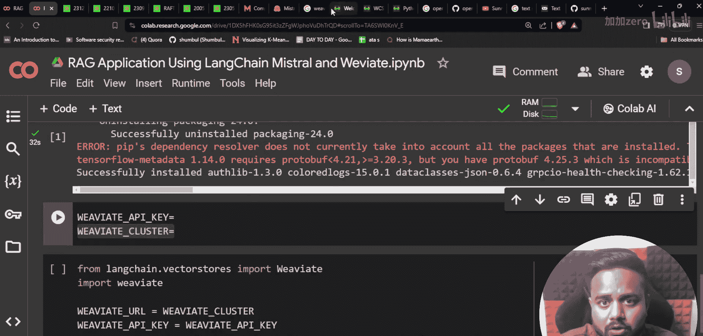

# 4. 基于向量存储创建检索器
retriever = vectorstore.as_retriever(search_kwargs={"k": 3}) # 检索最相关的3个块

# 5. 创建检索增强生成（RAG）链
qa_chain = RetrievalQA.from_chain_type(
    llm=llm,
    chain_type="stuff",
    retriever=retriever,
    return_source_documents=True
)
```

现在，一个完整的RAG应用链就构建好了。`qa_chain`可以接收用户问题，自动从我们上传的PDF知识库中检索信息，并调用Mistral AI模型生成答案。

---

## 代码实现：进行问答测试

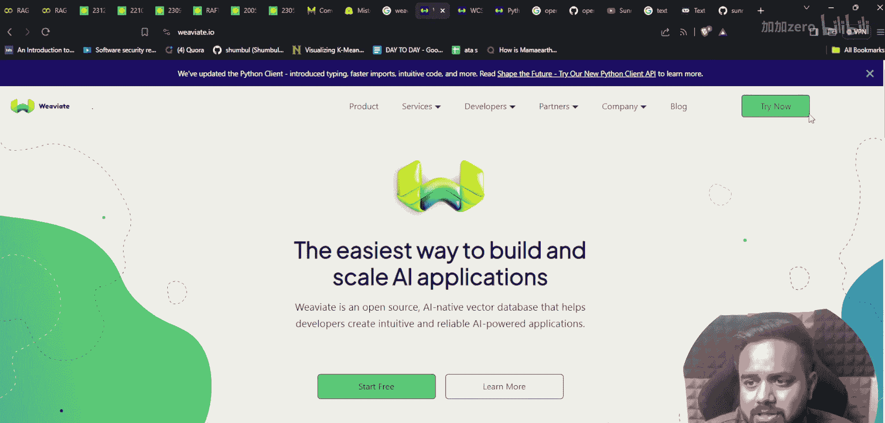

最后，让我们测试一下构建的应用是否能正常工作。

```python
# 向RAG链提问
query = "What is the main topic discussed in the document?"
result = qa_chain({"query": query})

print("问题：", query)
print("\n答案：", result["result"])
print("\n参考来源：")
for i, doc in enumerate(result["source_documents"]):
    print(f"[{i+1}] {doc.page_content[:150]}...") # 打印每个来源的前150个字符
```

执行这段代码，你将看到模型基于文档内容生成的答案，以及答案所依据的文本片段。

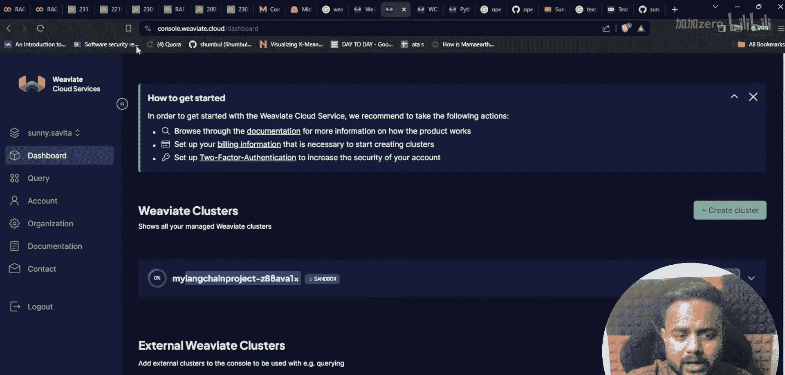

---

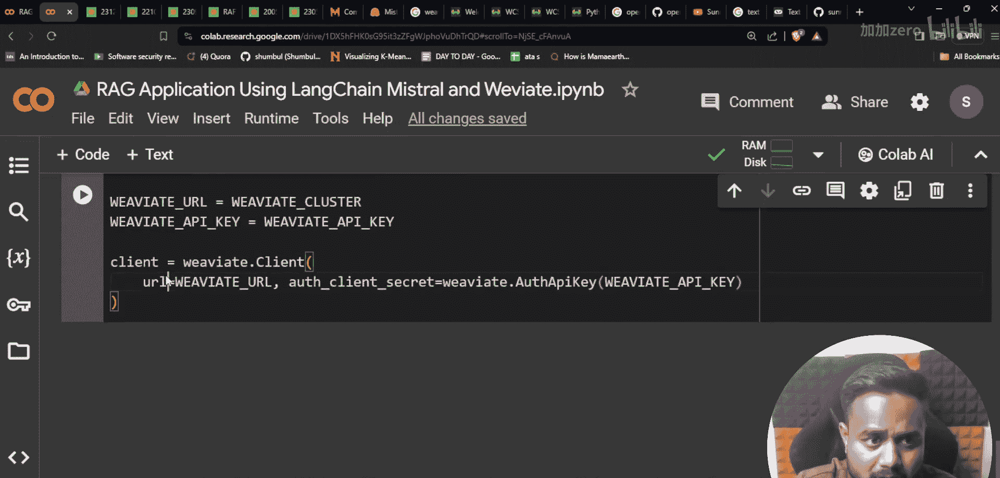

## 总结

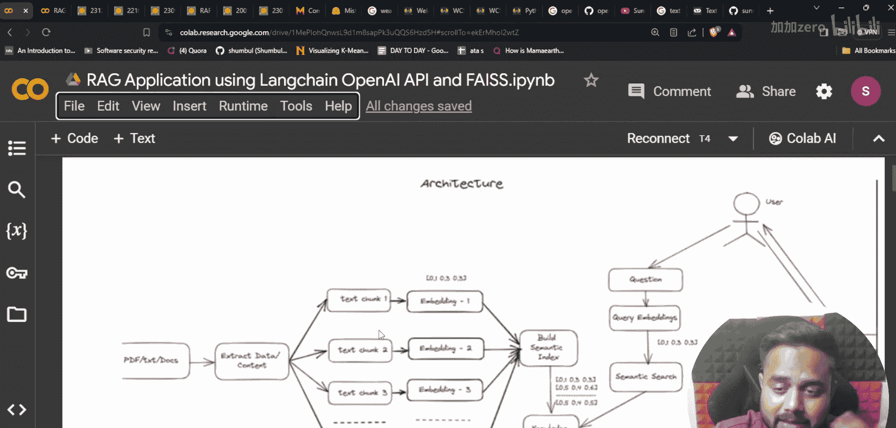

本节课中我们一起学习了如何使用Langchain、Mistral AI和Weaviate构建一个功能完整的RAG应用。我们完成了从环境搭建、云数据库配置、文档处理、向量知识库构建到最终问答链集成的全过程。这个架构是许多高级AI应用的基础，你可以通过更换数据源、嵌入模型或大语言模型来适配不同的场景。