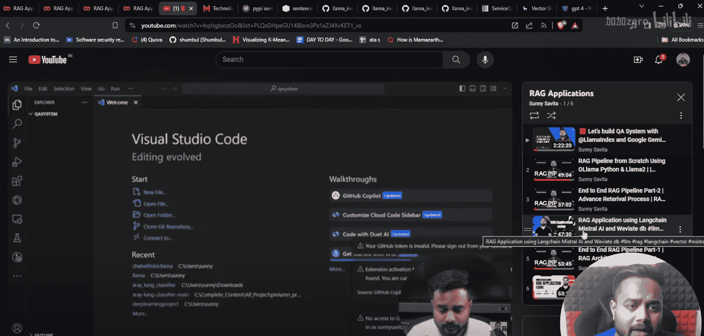
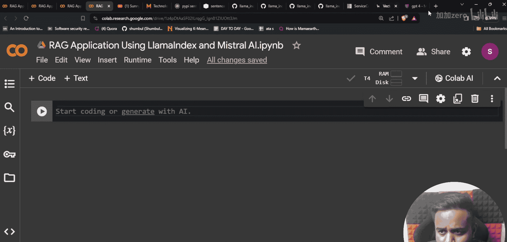
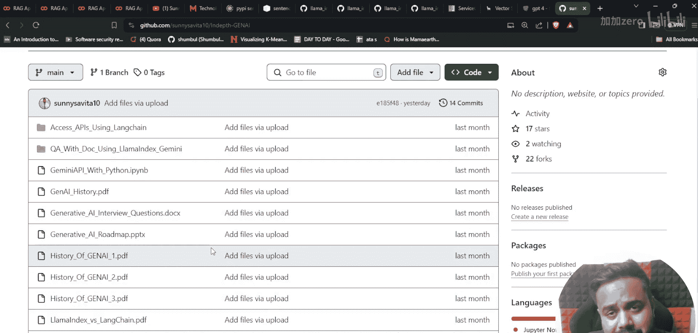
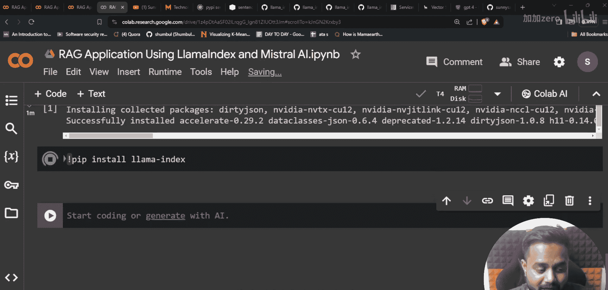
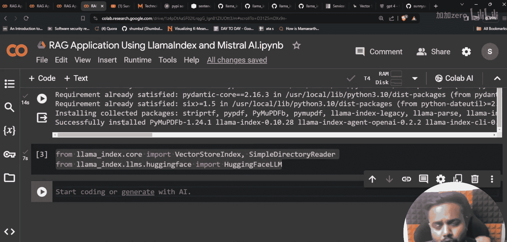
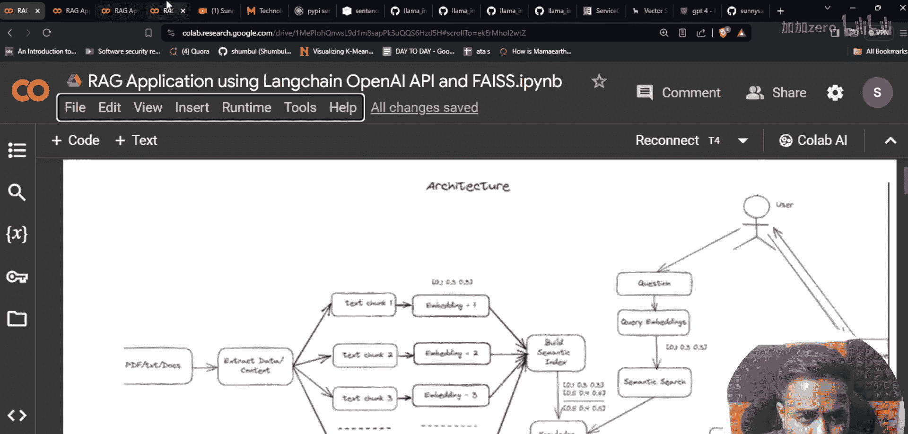
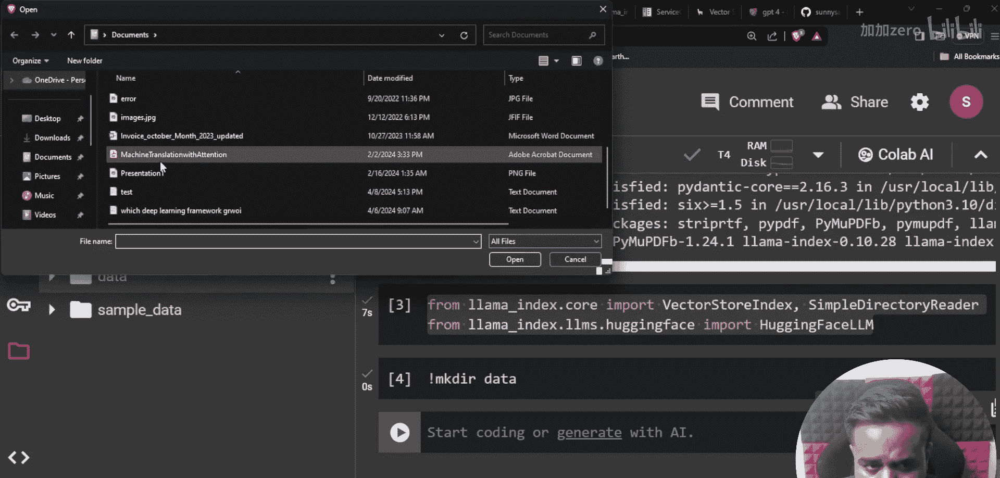
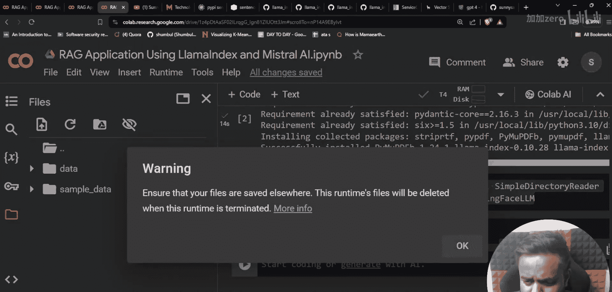
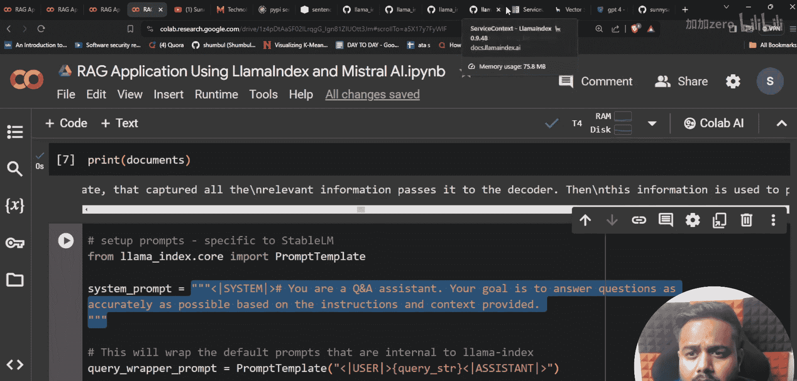
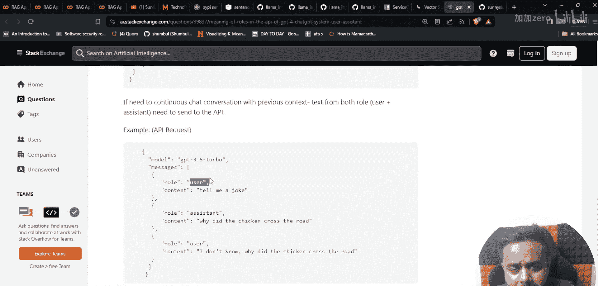

# 生成式AI：P18：使用LlamaIndex与Mistral-AI构建RAG应用 🚀

在本节课中，我们将学习如何使用开源框架LlamaIndex和Mistral-AI模型，一步步构建一个检索增强生成（RAG）应用。我们将从环境配置开始，逐步完成数据加载、模型集成和查询处理。

---


## 环境配置与安装

首先，我们需要在Google Colab中设置环境并安装必要的Python包。请确保运行时已连接到GPU。

以下是需要安装的核心包：

```python
!pip install llama-index-llms-huggingface
!pip install llama-index
```




安装完成后，我们可以导入项目所需的关键模块。

```python
from llama_index.core import VectorStoreIndex, SimpleDirectoryReader
from llama_index.llms.huggingface import HuggingFaceLLM
```

上一节我们完成了环境准备，本节中我们来看看如何加载和处理数据。



---

## 数据加载与处理

RAG应用的第一步是准备数据。我们将从一个本地目录读取PDF文件作为知识源。

以下是加载数据的步骤：



1.  在Colab中创建一个名为`data`的目录。
2.  将名为`machine_translation_with_attention.pdf`的研究论文PDF上传至该目录。
3.  使用`SimpleDirectoryReader`读取目录中的所有文档。

```python
# 读取‘data’目录下的文档
documents = SimpleDirectoryReader(‘./data’).load_data()
# 查看加载的文档内容
print(documents)
```

执行上述代码后，`documents`变量将包含一个文档列表，其中存储了PDF的文本内容。

---



## 配置提示模板与模型

在构建问答链之前，我们需要定义一个系统提示词来指导模型的行为，并初始化Mistral-AI语言模型。

首先，我们从LlamaIndex导入提示模板类。

```python
from llama_index.core import PromptTemplate
```


接下来，定义一个系统提示词。这个提示词为模型设定了角色和回答问题的基本规则。

```python
system_prompt = “””
You are an AI assistant that answers questions in a friendly manner, based on the given context.
Your answers should be concise, accurate, and helpful.
“””
```

然后，我们初始化Hugging Face上的Mistral-7B模型。这里我们直接将模型加载到内存中，而不是通过API调用。





```python
llm = HuggingFaceLLM(
    model_name=“mistralai/Mistral-7B-Instruct-v0.1”,
    tokenizer_name=“mistralai/Mistral-7B-Instruct-v0.1”,
    context_window=4096,
    max_new_tokens=256,
    generate_kwargs={“temperature”: 0.1, “do_sample”: True}
)
```





---

## 构建与查询RAG管道

现在，我们将把前面准备好的所有组件组装起来，构建完整的RAG应用管道。

核心步骤是使用`VectorStoreIndex`。它会自动将文档切分成块，为它们创建嵌入向量，并存储在向量数据库中，以便后续检索。

```python
# 使用加载的文档和配置的LLM创建索引
index = VectorStoreIndex.from_documents(documents, llm=llm)
# 将索引转换为可查询的引擎
query_engine = index.as_query_engine()
```

构建完成后，我们就可以向这个引擎提问了。它会从文档中检索相关上下文，并让Mistral模型生成答案。

```python
# 提出一个问题
response = query_engine.query(“What is the main contribution of the attention mechanism in this paper?”)
# 打印模型的回答
print(response)
```

---

## 总结





本节课中我们一起学习了使用LlamaIndex框架和Mistral开源模型构建RAG应用的全过程。我们首先配置了开发环境并安装了必要的依赖库。接着，我们加载了本地PDF文档作为外部知识源。然后，我们定义了系统提示词并初始化了Mistral-7B语言模型。最后，我们将所有组件集成，创建了一个能够根据给定文档回答问题的智能查询引擎。这个流程展示了利用开源工具快速搭建基于私有知识的问答系统的基本方法。