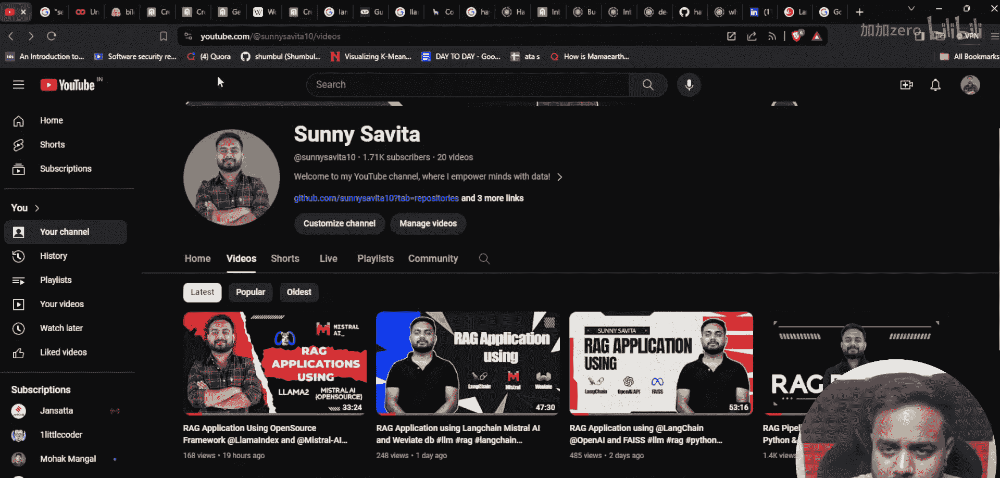
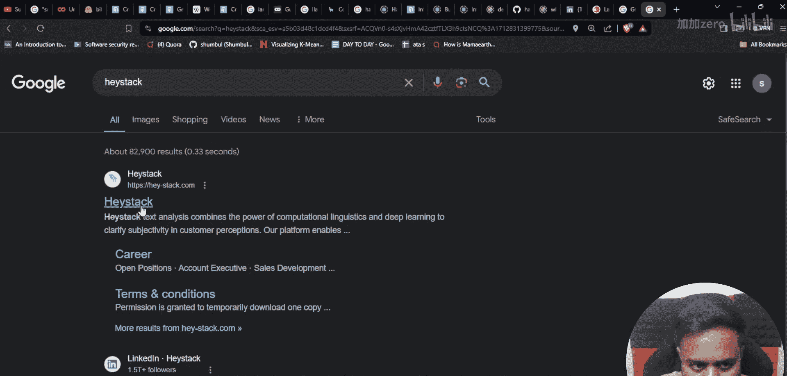
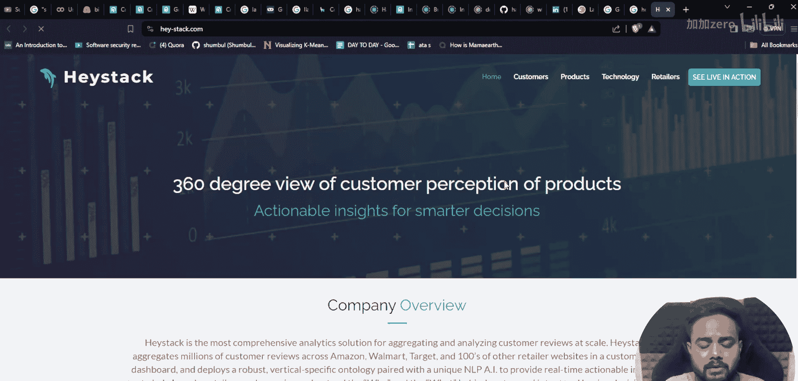
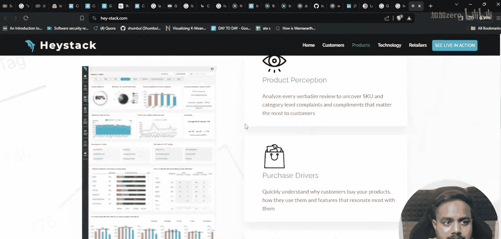
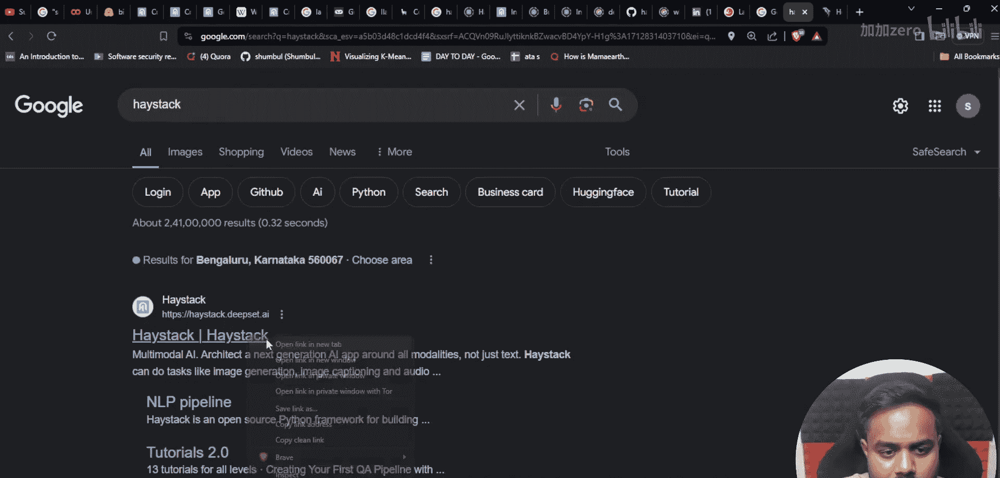
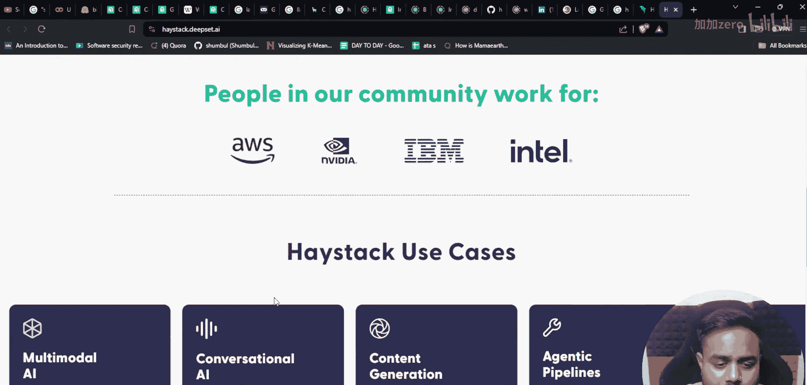
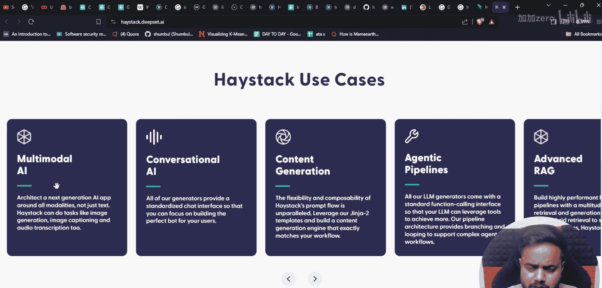
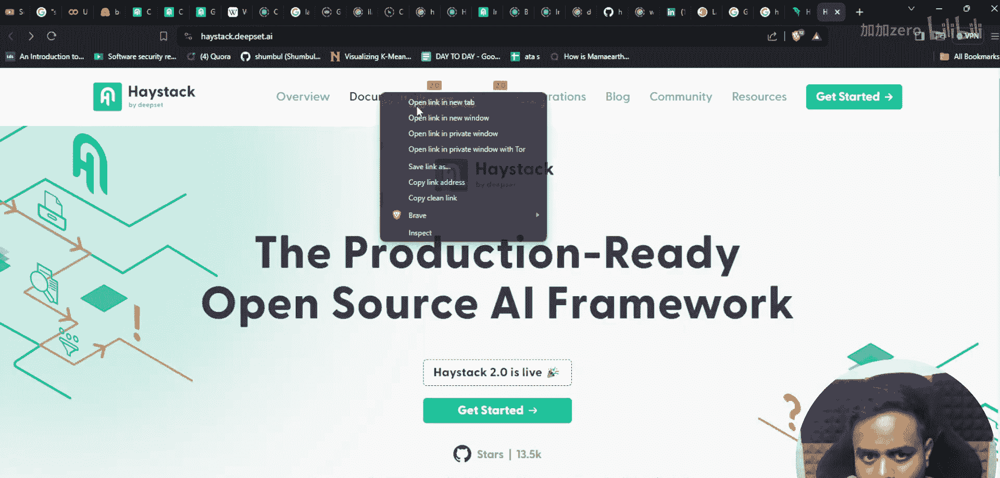
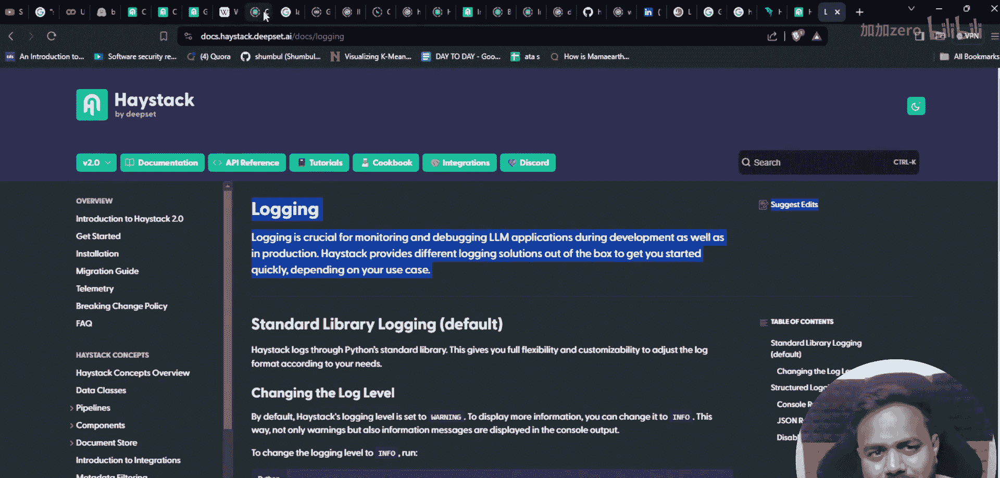
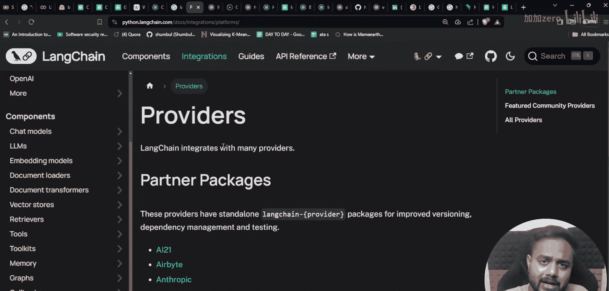

# 生成式AI：P19：使用Haystack框架构建LLM应用与RAG管道 🚀

在本节课中，我们将学习一个名为Haystack的新框架，它用于构建基于大型语言模型的应用。我们将了解Haystack的核心概念、它与LangChain的区别，并通过一个简单的示例来展示其基本用法。

## 概述

Haystack是一个由Deepset开发的开源框架，专门用于构建生产就绪的检索增强生成应用。与之前介绍的LangChain和LlamaIndex不同，Haystack提供了高度可定制化的组件和管道，支持多种数据模态和AI工具。

## Haystack框架介绍



上一节我们概述了课程内容，本节中我们来看看Haystack框架的具体信息。

Haystack的官方网站将其描述为一个“生产就绪的开源AI框架”。其2.0版本引入了许多新功能，使其在构建复杂AI应用时更具竞争力。







以下是Haystack框架的主要特点：



*   **高度可定制化**：用户可以根据具体需求灵活调整和组合各个组件。
*   **广泛的AI工具集成**：支持连接多种LLM提供商（如OpenAI、Hugging Face）和外部工具。
*   **易于生产化**：框架设计考虑了部署和监控，便于将应用投入实际生产环境。

## Haystack的应用场景

了解了框架的基本特点后，我们来看看它能解决哪些实际问题。

Haystack能够支持多种AI应用场景的开发。

以下是Haystack支持的主要用例：



1.  **多模态AI**：处理文本、音频、视频等多种类型的数据。
2.  **对话式AI**：构建类似ChatGPT的智能聊天机器人。
3.  **内容生成**：利用LLM自动生成各类文本内容。
4.  **智能体应用**：连接第三方API，扩展LLM的功能以完成特定任务。
5.  **高级RAG**：构建复杂的检索增强生成系统，用外部知识库增强LLM的回答。

## 核心概念：管道与组件

要使用Haystack构建应用，需要理解其两个核心概念：**管道**和**组件**。



在Haystack中，一个AI应用被构建为一个**管道**，它由多个**组件**连接而成。每个组件负责一项特定任务，例如读取文档、文本分割、生成嵌入向量或查询LLM。

一个基本的RAG管道可以用以下伪代码表示：
```python
# 伪代码示例
pipeline = Pipeline()
pipeline.add_component(component=DocumentStore, name="doc_store")
pipeline.add_component(component=Retriever, name="retriever")
pipeline.add_component(component=PromptBuilder, name="prompt_builder")
pipeline.add_component(component=LLM, name="llm")
# 连接组件，定义数据流
pipeline.connect("retriever.documents", "prompt_builder.documents")
```
这种模块化设计使得开发和调试变得非常清晰。

## 文档与集成支持



Haystack拥有非常完善的文档和社区支持，并且与主流技术栈有深度集成。

框架的官方文档提供了从安装、迁移到高级特性的全面指南。一个独特的功能是**遥测**，它允许（在用户同意下）收集匿名使用数据以帮助改进框架。

在集成方面，Haystack表现出色。

以下是Haystack支持的部分集成列表：

*   **向量数据库**：Chroma, Weaviate, Pinecone, Qdrant, PGVector等。
*   **LLM提供商**：OpenAI, Hugging Face, Anthropic, Cohere等。
*   **开发工具**：支持GPU加速、链路追踪、日志记录等。

## Haystack 与 LangChain 对比

既然我们已经了解了LangChain和Haystack，一个自然的问题是：该如何选择？

根据社区反馈和特性分析，两者各有优势。LangChain在生态丰富度和初学者友好度上可能略胜一筹，它提供了大量现成的“链”和代理模板。而Haystack则在**生产就绪性**、**管道的清晰度**和**对复杂RAG场景的支持深度**上表现突出。



**选择建议**：
*   对于快速原型验证和探索多种Agent模式，**LangChain**可能更合适。
*   对于需要部署到生产环境、要求高可维护性和可控性的复杂RAG系统，**Haystack**是强有力的候选。

## 总结



本节课中我们一起学习了Haystack框架。我们了解了它是一个用于构建生产级LLM应用，特别是RAG系统的强大、可定制的开源框架。我们探讨了它的核心概念（管道和组件）、应用场景、丰富的集成支持，并将其与LangChain进行了对比。对于致力于构建稳健、可部署AI应用的开发者来说，Haystack是一个值得深入学习的工具。