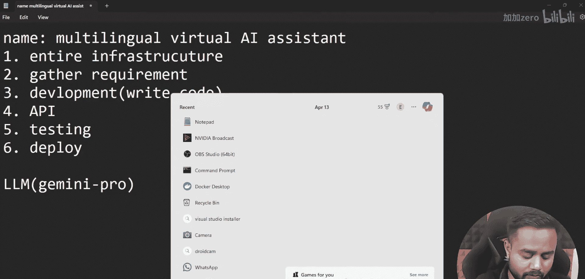
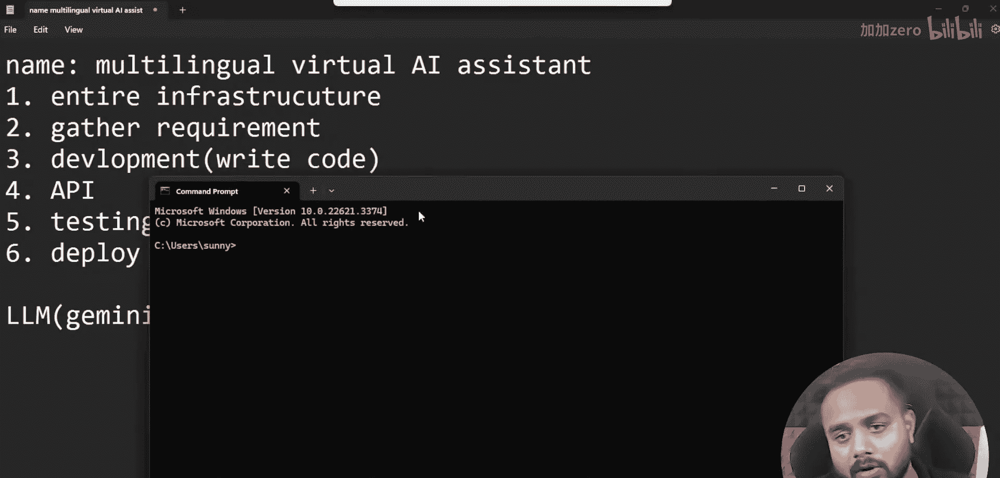
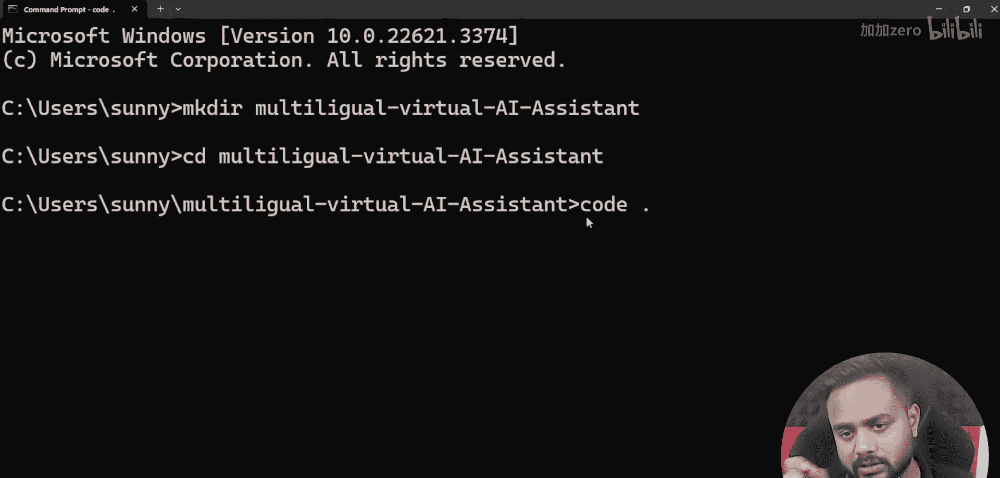
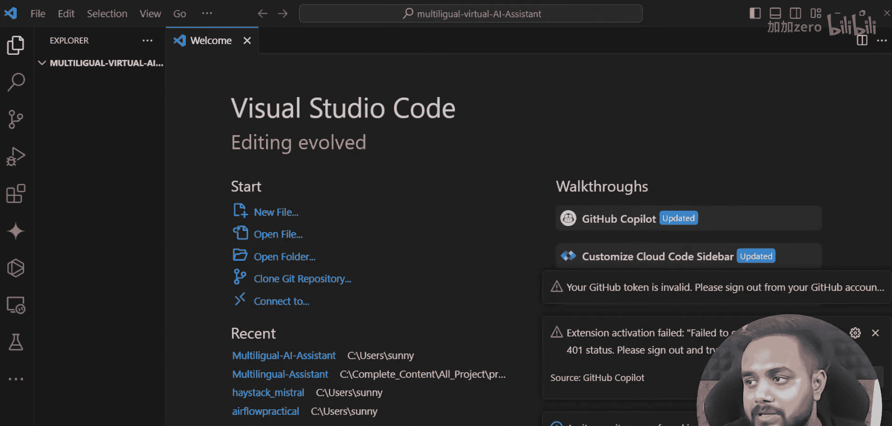
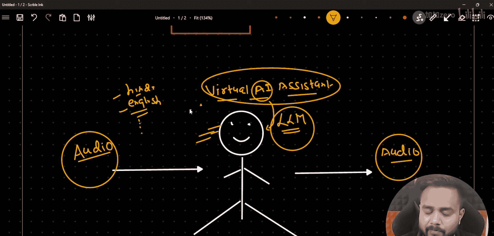
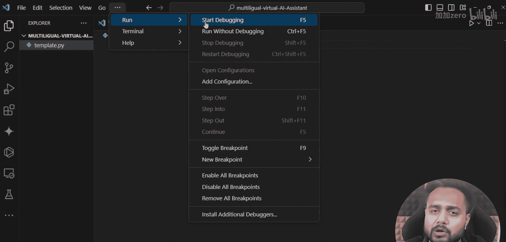

# 生成式AI：P20：探索多语言AI语音助手的力量

在本节课中，我们将从头开始，一步步实现一个多语言虚拟AI助手项目。我们将使用Google的Gemini Pro模型，并学习如何构建其完整的基础设施、编写代码、创建API并进行测试。

## 项目概述与问题定义

上一节我们介绍了项目的整体目标，本节中我们来看看项目的具体定义和我们要解决的问题。

我们正在构建一个**多语言虚拟AI助手**。这个助手能够接收音频输入，并生成音频输出。其核心是一个大型语言模型，它能够处理和理解多种语言。

从技术角度看，这个系统的流程如下：
1.  用户以**音频**形式提出问题或指令。
2.  系统将音频转换为文本。
3.  文本被送入**LLM**进行处理。
4.  LLM生成文本形式的回答。
5.  系统将文本回答转换回**音频**输出给用户。

这个流程可以简化为一个核心概念：**音频 -> 文本 -> LLM处理 -> 文本 -> 音频**。



## 项目开发步骤



理解了问题定义后，接下来我们规划具体的实现步骤。以下是构建此项目需要遵循的完整流程。

1.  **创建项目基础设施**：建立项目所需的文件夹和文件结构。
2.  **收集项目需求**：明确项目所需的功能、库和API。
3.  **编写项目代码**：逐步实现核心功能代码。
4.  **创建API接口**：将项目功能封装成可调用的API。
5.  **进行项目测试**：测试API和各项功能是否正常工作。
6.  **部署项目**：将完成的项目部署到服务器或云平台。



对于本项目，我们将使用**Google Gemini Pro**作为核心的LLM，因为它目前可以免费使用。



## 初始化项目环境

现在，让我们开始动手。首先需要设置开发环境并创建项目的基本结构。

打开命令行终端，导航到你希望创建项目的目录，然后执行以下命令来创建项目文件夹并进入该文件夹：

```bash
mkdir multilingual_virtual_ai_assistant
cd multilingual_virtual_ai_assistant
```

接下来，在当前文件夹中启动你的代码编辑器（例如VS Code）。在VS Code中，你将进行所有的开发工作。

## 创建项目文件结构

在代码编辑器中，我们需要创建项目的基础文件结构。首先，创建一个名为 `src` 的源代码文件夹，用于存放主要的Python代码文件。

同时，我们还需要为项目创建一个独立的Python虚拟环境，以管理项目依赖。你可以使用以下命令创建虚拟环境：

```bash
python -m venv venv
```



激活虚拟环境后，你将在此环境中安装所有必要的Python包。



本节课中我们一起学习了多语言AI语音助手项目的定义、核心流程以及初始设置步骤。我们明确了项目目标是将音频输入通过LLM处理后再转换为音频输出，并规划了从环境搭建到部署的完整开发路径。下一节，我们将开始收集项目所需的具体依赖并编写核心代码。