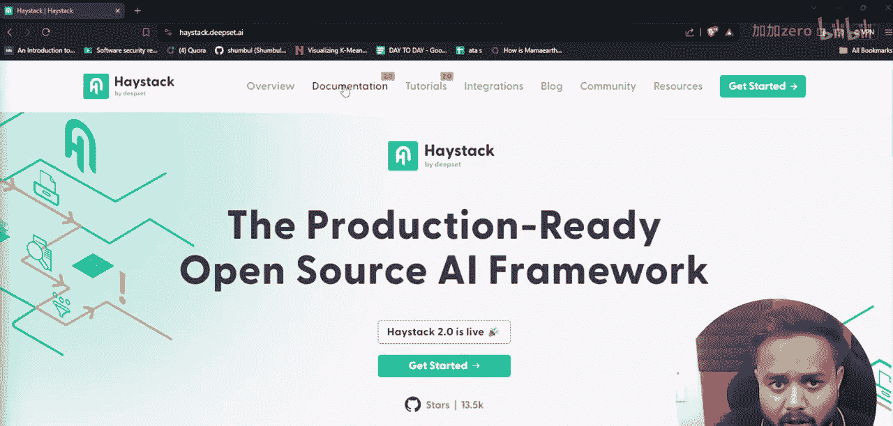
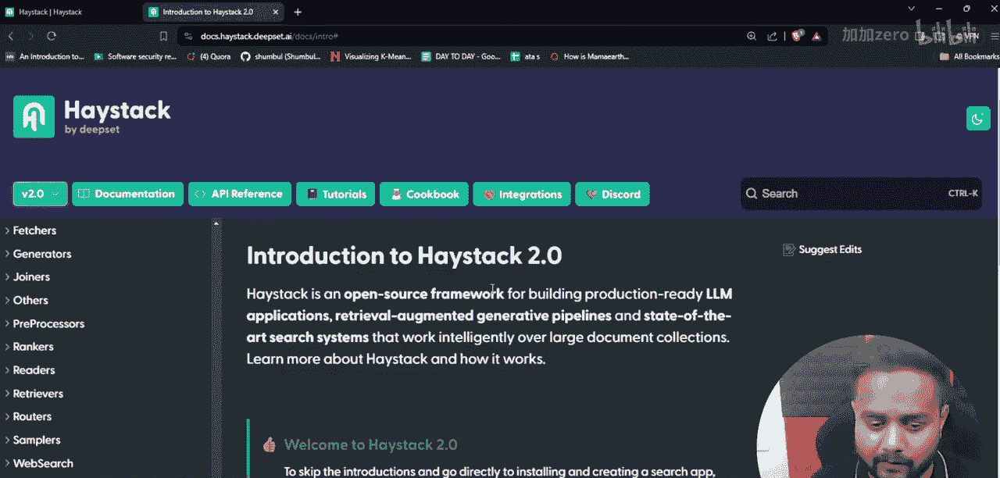
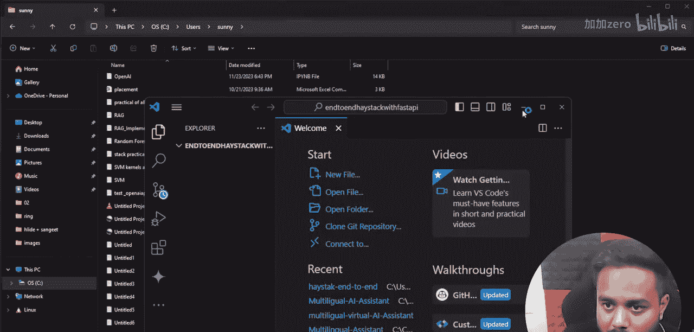
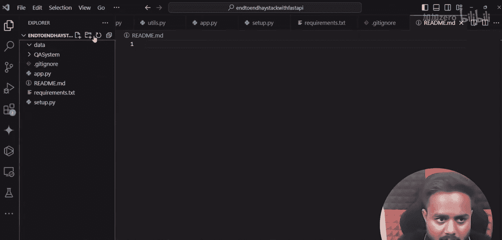

# 生成式AI：从初学者到专家｜P21：使用Haystack、MistralAI、Pinecone和FastAPI构建端到端RAG应用 🚀

## 概述
在本节课中，我们将动手实现一个完整的端到端项目。我们将使用Haystack、MistralAI、Pinecone和FastAPI来构建一个检索增强生成应用。本项目将完全专注于开源技术栈，并采用模块化的代码结构。

## 项目架构与文件结构
上一节我们介绍了本课程的目标，本节中我们来看看项目的具体架构和需要创建的文件。

首先，我们需要在本地创建一个项目文件夹并设置好开发环境。以下是项目所需的文件结构：

*   **`qa_system/`**: 主项目文件夹。
    *   **`__init__.py`**: 将`qa_system`文件夹初始化为一个Python包。
    *   **`ingestion.py`**: 负责文档读取、处理和向量化存储的代码。
    *   **`retrieval_and_generation.py`**: 负责从向量数据库检索相关文档，并利用大语言模型生成答案的代码。
*   **`app.py`**: FastAPI应用的主文件，用于创建API端点。
*   **`requirements.txt`**: 项目依赖包列表。
*   **`README.md`**: 项目说明文档。
*   **`.gitignore`**: Git版本控制忽略文件列表。
*   **`data/`**: 文件夹，用于存放本地待处理的文档数据。

## 环境与依赖设置
在开始编写核心代码之前，我们需要配置好Python虚拟环境并安装必要的依赖库。



以下是项目所需的核心Python包：

```python
# 在 requirements.txt 文件中
haystack-ai
fastapi
uvicorn
pinecone-client
python-dotenv
```

你可以使用以下命令创建虚拟环境并安装依赖：
```bash
python -m venv venv
source venv/bin/activate  # 在Windows上使用 `venv\Scripts\activate`
pip install -r requirements.txt
```



## 数据摄取流程
现在，让我们进入核心模块的编写。首先，我们来实现数据摄取模块。该模块的目标是将原始文档转换为向量并存储到Pinecone数据库中。

在`ingestion.py`中，我们需要完成以下步骤：
1.  从`data/`文件夹读取文档。
2.  使用Haystack的文档处理器（如`TextDocumentSplitter`）对文档进行分块。
3.  使用MistralAI的嵌入模型将文本块转换为向量。
4.  将向量和元数据存入Pinecone向量数据库。

关键代码示例如下：
```python
from haystack import Pipeline
from haystack.components.writers import DocumentWriter
from haystack.document_stores import PineconeDocumentStore
from haystack.components.embedders import MistralDocumentEmbedder

# 1. 初始化文档存储（连接Pinecone）
document_store = PineindexDocumentStore(...)

# 2. 构建摄取管道
ingestion_pipeline = Pipeline()
ingestion_pipeline.add_component("splitter", TextDocumentSplitter())
ingestion_pipeline.add_component("embedder", MistralDocumentEmbedder())
ingestion_pipeline.add_component("writer", DocumentWriter(document_store))



# 3. 连接管道组件
ingestion_pipeline.connect("splitter.documents", "embedder.documents")
ingestion_pipeline.connect("embedder.documents", "writer.documents")

# 4. 运行管道处理数据
ingestion_pipeline.run({"splitter": {"sources": [Path("data/")]}})
```

## 检索与生成流程
数据准备就绪后，接下来我们构建检索与生成问答链。这个模块负责接收用户问题，找到最相关的文档片段，并合成最终答案。

在`retrieval_and_generation.py`中，流程如下：
1.  接收用户查询。
2.  使用相同的嵌入模型将查询转换为向量。
3.  在Pinecone中执行向量相似度搜索，检索出最相关的文本块。
4.  将检索到的上下文和原始查询一起组合成提示词。
5.  将提示词发送给MistralAI的大语言模型，生成最终答案。

关键代码示例如下：
```python
from haystack import Pipeline
from haystack.components.retrievers import InMemoryEmbeddingRetriever
from haystack.components.generators import MistralGenerator

# 1. 构建RAG管道
rag_pipeline = Pipeline()
rag_pipeline.add_component("retriever", InMemoryEmbeddingRetriever(document_store))
rag_pipeline.add_component("generator", MistralGenerator())

# 2. 连接组件
rag_pipeline.connect("retriever.documents", "generator.documents")

# 3. 运行查询
question = "什么是RAG？"
result = rag_pipeline.run({"retriever": {"query": question}})
answer = result["generator"]["replies"][0]
```

## 创建API接口
为了使我们的QA系统能够被外部应用调用，我们需要使用FastAPI创建一个简单的Web API。

在`app.py`中，我们将：
1.  初始化FastAPI应用。
2.  加载我们之前构建的RAG管道。
3.  创建一个POST端点（例如`/ask`），接收用户问题并返回答案。

```python
from fastapi import FastAPI
from pydantic import BaseModel

app = FastAPI()

# 定义请求体模型
class QueryRequest(BaseModel):
    question: str

# 加载RAG管道（这里需要你实现加载逻辑）
# rag_pipeline = load_pipeline()

@app.post("/ask")
async def ask_question(request: QueryRequest):
    result = rag_pipeline.run({"retriever": {"query": request.question}})
    answer = result["generator"]["replies"][0]
    return {"answer": answer}
```

可以使用以下命令启动API服务器：
```bash
uvicorn app:app --reload
```



## 总结
本节课中我们一起学习了如何构建一个完整的端到端RAG应用。我们从设置项目结构开始，逐步实现了数据摄取、检索增强生成以及API暴露这三个核心模块。通过结合Haystack的管道、MistralAI的模型、Pinecone的向量数据库以及FastAPI的Web框架，我们创建了一个功能完备、模块化且易于扩展的问答系统。这个项目为你理解现代生成式AI应用的架构和实现提供了坚实的实践基础。