# 生成式AI：P22：使用VSCode、Anaconda、Docker和Git的完整本地自动化开发环境设置 🛠️

在本节课中，我们将学习如何为你的本地系统搭建一个端到端的项目开发环境。我们将使用Visual Studio Code、Anaconda、Docker和Git等工具，创建一个可用于任何生成式AI、数据科学或AI相关项目的模板或样板文件。我们将不实现具体项目，而是专注于环境设置和展示一些有用的扩展。

## 系统要求 💻

上一节我们介绍了课程目标，本节中我们来看看搭建环境所需的系统要求。

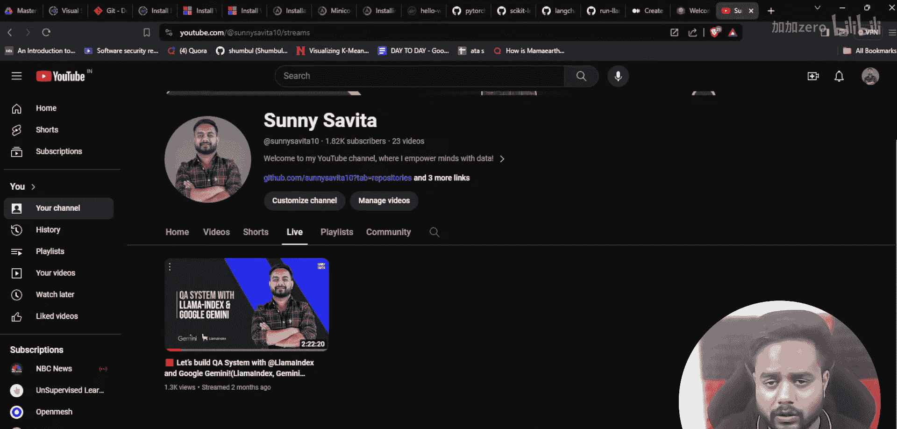

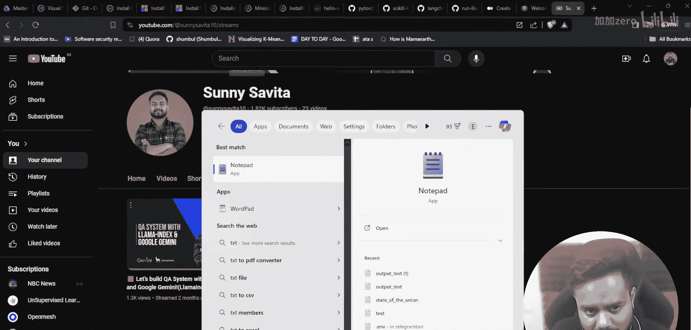

以下是支持的操作系统：
*   Windows系统
*   Mac系统
*   Linux系统

以下是各系统的最低配置要求：
*   **Windows**：至少Windows 10或11，4-8GB内存，建议i5处理器，500GB硬盘。
*   **Mac**：MacOS 12、13或14版本，支持M1、M2芯片或Intel处理器。
*   **Linux**：任何发行版，如Ubuntu、CentOS、RedHat等。

## 所需软件 📦

了解了系统要求后，接下来我们需要安装核心软件。

以下是必须安装的软件列表：
1.  **Visual Studio Code**：代码编辑器。
2.  **Docker**：容器化平台。
3.  **Git**：源代码版本管理工具。
4.  **Anaconda** 或 **Miniconda**：Python环境与包管理工具。如果系统性能有限，可以使用更轻量的Miniconda。

## 软件下载与安装 🔗

现在我们已经明确了需要哪些软件，本节将指导你如何下载和安装它们。

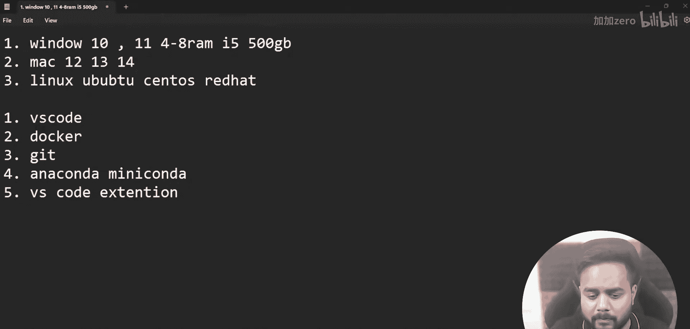

以下是各软件的官方下载链接或搜索关键词：
*   **Visual Studio Code**：直接搜索“Visual Studio Code installation”进行下载安装。
*   **Git**：搜索“Git install”或“Git download”进行下载安装。
*   **Docker**：搜索“Docker installation for Windows/Mac/Linux”。安装前需满足先决条件，对于Windows系统，通常需要安装WSL2（Windows Subsystem for Linux）。可以使用命令 `wsl --install` 进行安装。
*   **Anaconda**：搜索“Anaconda install”进入官网下载Windows、Mac或Linux版本。
*   **Miniconda**：搜索“Miniconda”进入官网下载相应版本。

## 创建项目文件夹与打开VSCode 📁

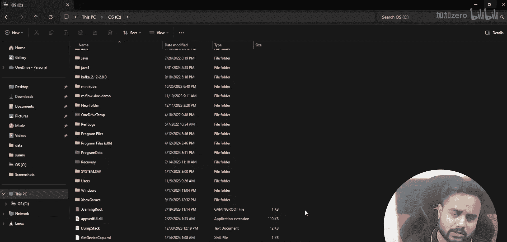

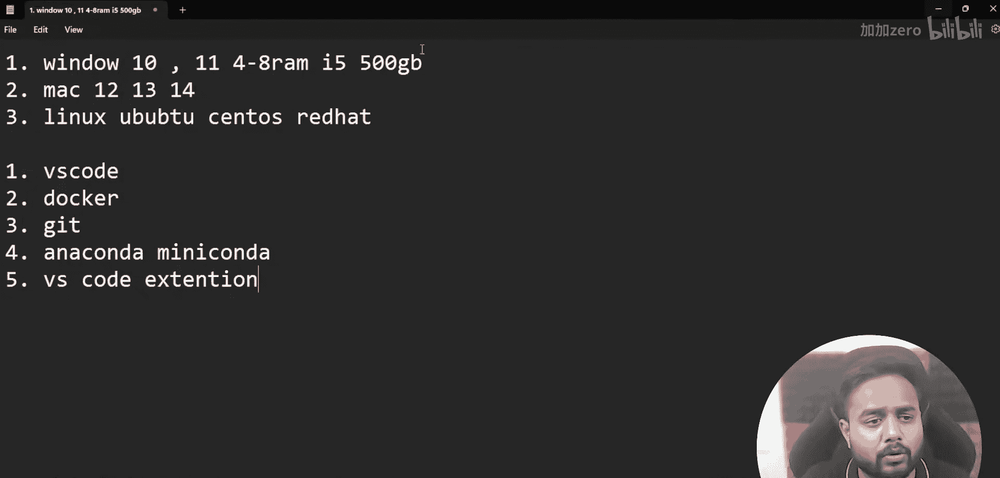

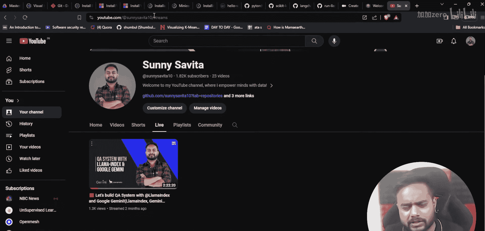

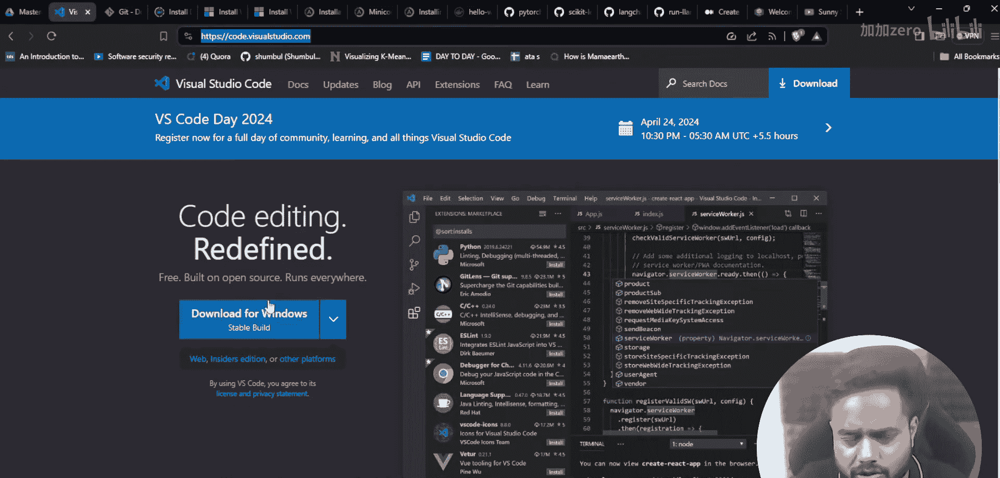

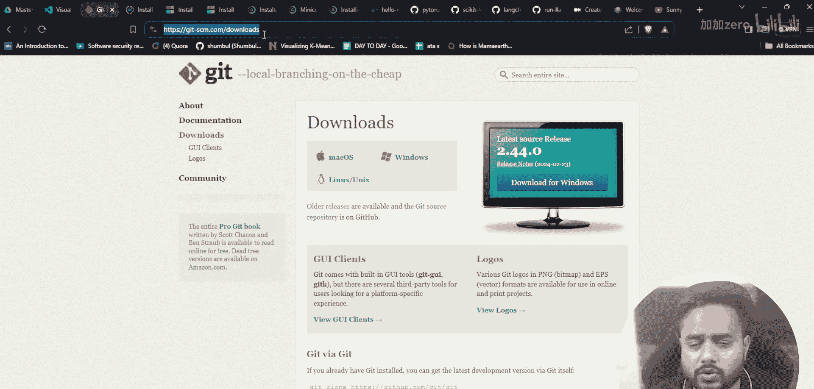

软件准备就绪后，我们开始创建项目的工作空间。

首先，在你的磁盘（例如C盘）上创建一个文件夹，作为所有项目的根目录。例如，可以创建一个名为 `local_setup_for_AI_development` 的文件夹。然后，右键点击该文件夹，选择“通过Code打开”，即可在Visual Studio Code中打开此文件夹作为工作区。

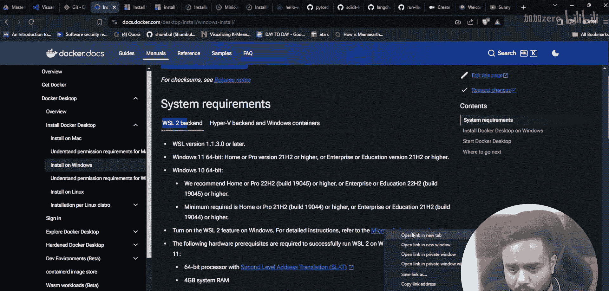

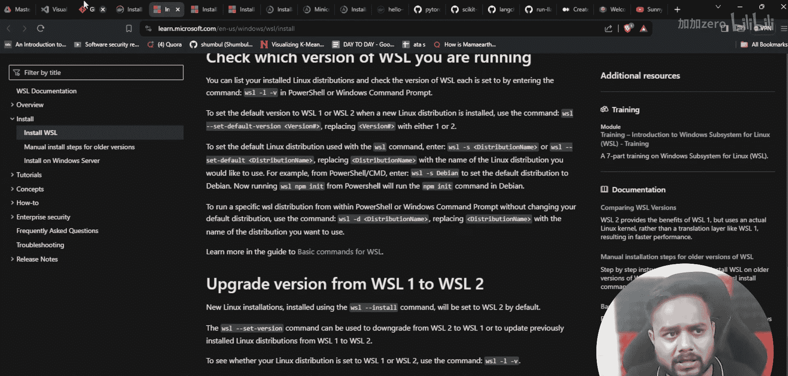

## 自动化项目结构搭建 ⚙️

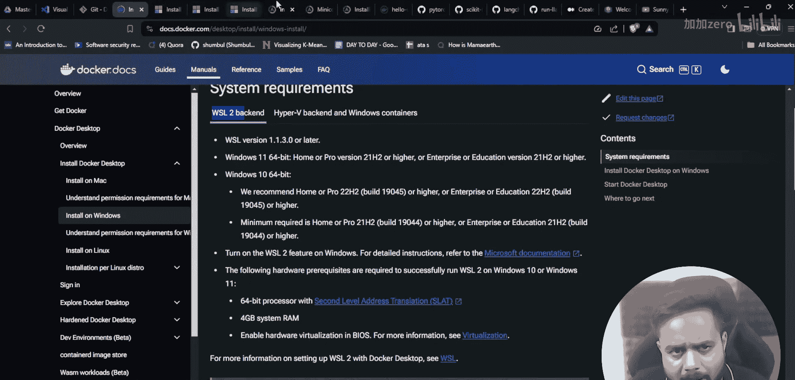

我们已经打开了VSCode工作区，本节将开始搭建自动化的项目结构。

整个环境创建过程将是自动化的，无需手动输入命令。首先，我们需要在项目根目录下创建一个关键文件来定义项目结构。这个文件通常被命名为 `project_structure` 或其他描述性名称，它将帮助我们自动生成标准的目录和文件。

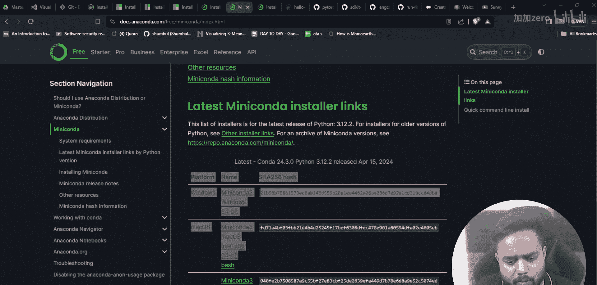

---

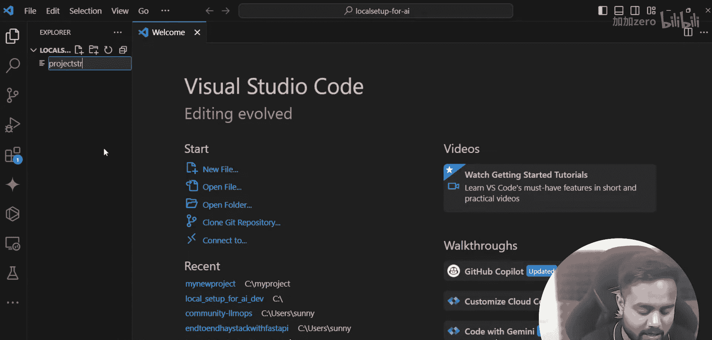

**本节课总结**：本节课我们一起学习了为生成式AI开发搭建完整本地环境的基础步骤。我们明确了系统要求，列出了必需的软件（VSCode、Docker、Git、Anaconda/ Miniconda），并指导了如何下载安装。最后，我们创建了项目文件夹并在VSCode中打开，为下一节课开始构建自动化项目结构做好了准备。