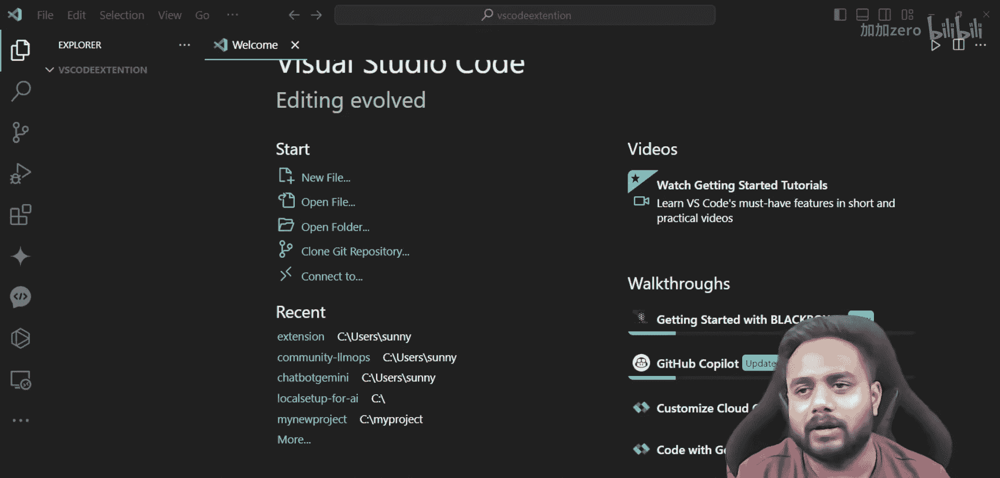
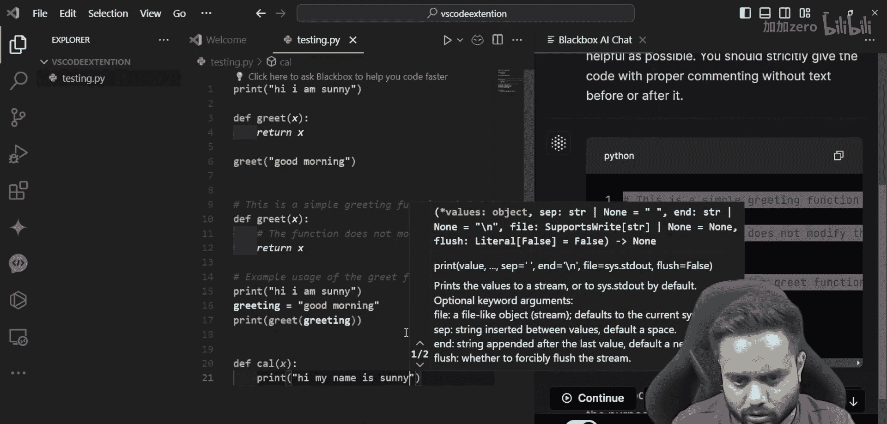

# 生成式AI：从初学者到专家：P23：2024年AI开发最佳VSCode扩展

在本节课中，我们将学习如何为AI开发配置Visual Studio Code。我们将介绍一系列能极大提升开发效率的扩展，涵盖机器学习、深度学习和生成式AI等领域。这些工具将使编码过程更加轻松和有趣。




上一节我们介绍了AI项目的开发环境设置。本节中，我们来看看如何通过安装扩展来增强VSCode的功能，使其更适合AI开发工作。


## 扩展的重要性

扩展是增强软件功能的工具或插件。在AI开发中，合适的扩展可以提供代码建议、调试帮助、模型访问等功能，将枯燥的编码转变为高效、有趣的过程。

## 核心扩展演示

以下通过一个简单的Python代码示例，展示扩展如何提供智能辅助。

```python
def greet(name):
    print(f"Hello, {name}")

greet("Sunny")
```

编写上述代码时，扩展会提供方法名建议、变量名补全和代码解释。例如，右键代码可以选择让AI助手（如Blackbox）解释代码或提出改进建议。

## 推荐的VSCode扩展列表

以下是适用于AI开发的25个最佳VSCode扩展。每个扩展都旨在解决特定问题，提升你的开发体验。

1.  **Python**：微软官方扩展，为Python语言提供IntelliSense、调试、代码导航等功能。
2.  **Pylance**：高性能的Python语言服务器，提供更快的代码补全和类型检查。
3.  **Jupyter**：在VSCode中直接创建、运行Jupyter笔记本。
4.  **Blackbox**：集成AI助手，可以解释代码、查找错误、回答问题。
5.  **GitLens**：增强Git功能，直观显示代码作者和提交历史。
6.  **Docker**：简化Docker容器的构建、管理和部署。
7.  **Remote - SSH**：通过SSH连接远程服务器进行开发。
8.  **Code Runner**：一键运行多种语言的代码片段。
9.  **Prettier**：代码格式化工具，保持代码风格一致。
10. **ES7+ React/Redux/React-Native snippets**：快速生成React相关代码片段。
11. **Auto Rename Tag**：自动重命名配对的HTML/XML标签。
12. **Bracket Pair Colorizer**：用不同颜色标识匹配的括号，提高代码可读性。
13. **indent-rainbow**：为缩进添加颜色，使代码结构更清晰。
14. **Live Share**：实时与他人协作编辑和调试代码。
15. **Path Intellisense**：自动补全文件路径。
16. **Settings Sync**：通过Gist同步你的VSCode设置到不同机器。
17. **TODO Highlight**：高亮显示代码中的TODO、FIXME等注释。
18. **YAML**：为YAML文件提供语言支持。
19. **Markdown All in One**：Markdown写作的全套工具。
20. **SQLite**：查看和查询SQLite数据库。
21. **Thunder Client**：轻量级的REST API客户端，用于测试接口。
22. **Error Lens**：在代码行内直接显示错误和警告信息。
23. **Git Graph**：可视化Git分支和提交历史图。
24. **Material Icon Theme**：为文件资源管理器提供精美的图标主题。
25. **Power Mode**：为你的输入添加炫酷的视觉效果，增加趣味性。

## 如何安装与管理扩展

在VSCode左侧活动栏点击扩展图标，进入扩展市场。你可以搜索上述扩展名称并点击“安装”。建议定期检查更新，并卸载不再使用的扩展以保持编辑器轻量。



本节课中我们一起学习了如何为AI开发武装你的VSCode编辑器。我们了解了扩展的核心价值，并通过一个列表详细介绍了25个能显著提升机器学习、深度学习和生成式AI开发效率的工具。正确配置和使用这些扩展，能让你的开发工作流更加顺畅、智能和高效。