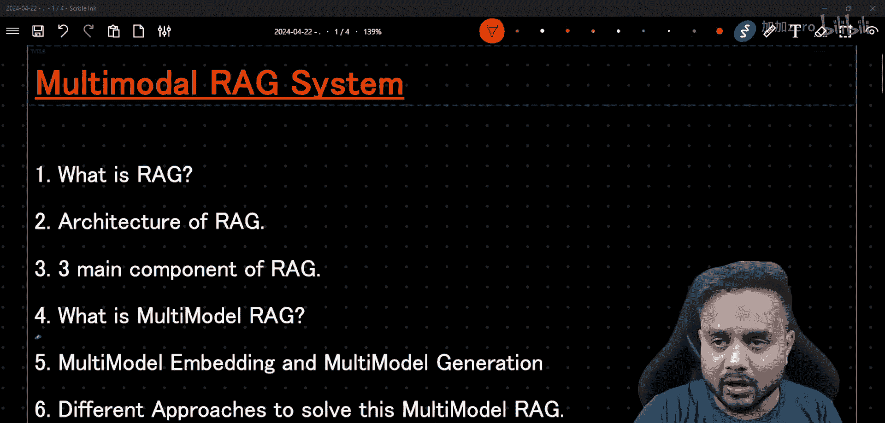
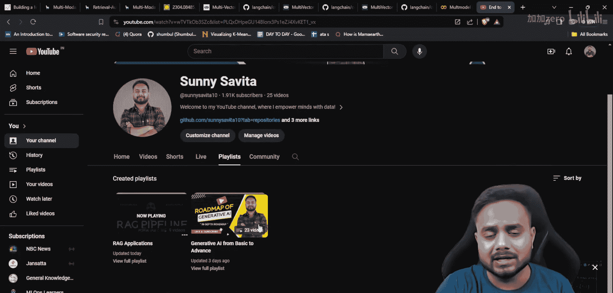
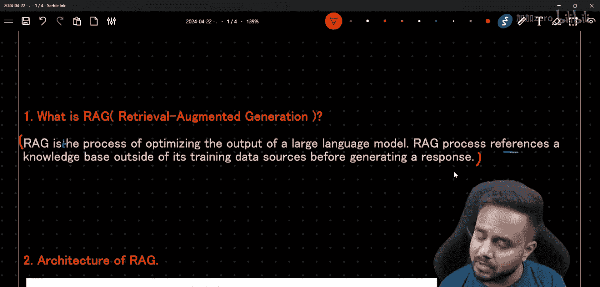
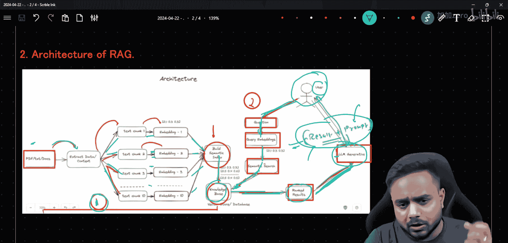
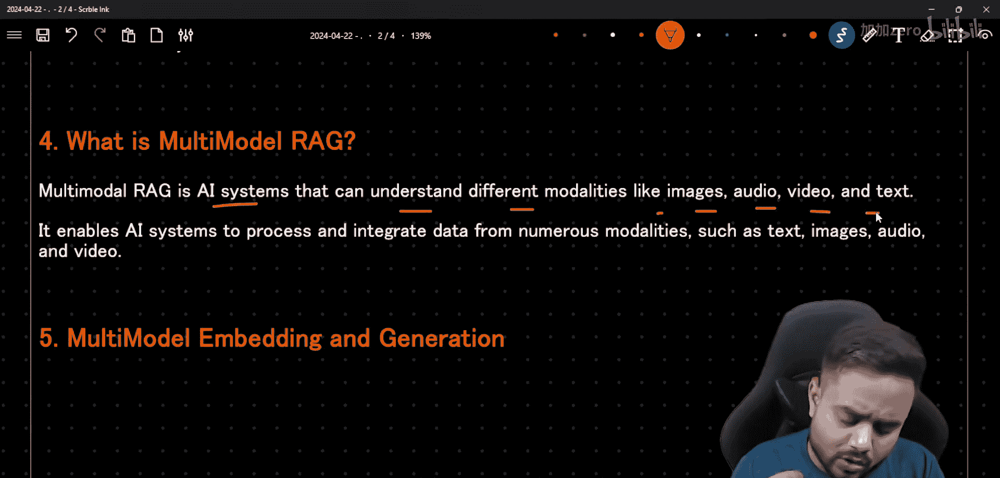
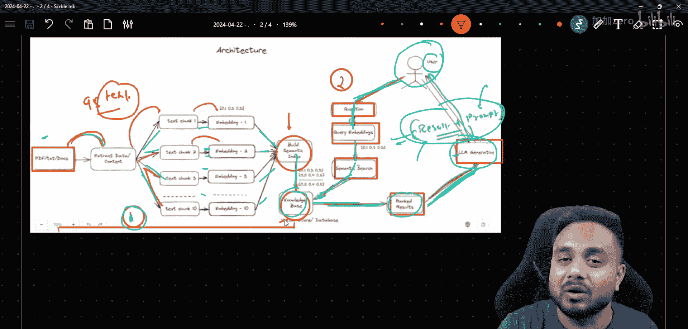
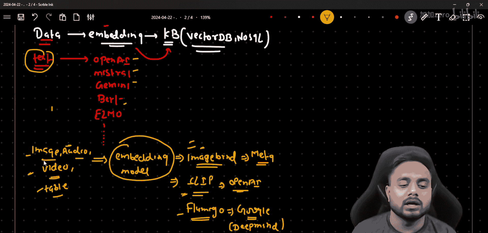

# 生成式AI：P24：多模态RAG系统：下一代AI技术全面介绍 🚀

在本节课中，我们将要学习多模态检索增强生成系统。这是一个能够理解和处理文本、图像、音频、视频等多种类型数据的下一代AI技术。我们将从基础概念开始，逐步深入到其核心组件和应用。

## 什么是RAG？

RAG是一个优化或增强大型语言模型输出的过程。我们并非直接从大型语言模型中生成输出，而是首先从数据库中检索相关文档，然后将其传递给LLM模型，最后基于这些信息生成输出。

## RAG的架构

上一节我们介绍了RAG的基本概念，本节中我们来看看它的架构。RAG架构主要包含三个部分。

以下是RAG架构的三个主要阶段：

1.  **数据摄取**：从数据源提取数据，创建数据块，生成嵌入向量，并存储到知识库中。
2.  **检索**：当用户提出查询时，查询经过嵌入模型处理，然后在知识库中进行相似性搜索，找到相关信息。
3.  **生成**：将检索到的相关信息与用户查询结合，传递给LLM模型，最终生成答案给用户。

通过RAG，即使模型没有在特定数据上训练过，我们也可以通过连接外部知识库来生成响应。这是RAG相对于微调方法的一个重要优势。

## RAG的核心组件

基于对架构的了解，RAG系统主要包含以下三个核心组件：

*   **检索**：从知识库中查找相关信息。
*   **增强**：用检索到的信息增强用户查询或上下文。
*   **生成**：LLM基于增强后的上下文合成最终答案。

## 什么是多模态RAG？

现在，让我们进入本节课的核心主题：多模态RAG。在经典的RAG系统中，我们主要处理文本数据。然而，现实世界的数据是多样化的。

多模态RAG是一种能够理解不同模态（如图像、音频、视频、文本）的AI系统。它使AI系统能够处理和整合来自多种模态的数据，例如标签、图像、音频和视频。

## 多模态嵌入与生成

理解了多模态RAG的定义后，本节我们来探讨其核心：多模态嵌入与生成。这是本教程最关键的部分。

在数据处理流程中，我们从各种来源获取数据，对其进行嵌入，然后存储到知识库（如向量数据库）中。对于文本数据，我们有多种嵌入模型可供选择，例如OpenAI的嵌入模型、BERT嵌入、GLoVe嵌入等。嵌入本质上是数据的数值化表示。

但是，当我们的数据是图像、音频、视频或表格时，我们需要专门的模型来为这些非文本数据生成嵌入向量。这些模型被称为**多模态嵌入模型**。

以下是几个常见的多模态嵌入模型：

*   **ImageBind**：这是一个由Meta公司开发的模型，可用于为图像、音频、视频甚至表格数据创建嵌入向量。
*   **CLIP**：这是由OpenAI开发的著名模型，全称为“连接语言与图像预训练”，专注于理解图像和文本之间的关系。
*   **Flamingo**：这是由Google DeepMind团队开发的研究模型，同样具备处理多模态数据的能力。

对于纯文本数据，我们仍然可以使用传统的文本嵌入模型。但对于图像等数据，我们就需要像CLIP这样的模型来生成有意义的向量表示。

## 多模态RAG的不同方法与用例

在掌握了核心的多模态嵌入技术后，我们来看看实现多模态RAG的不同方法以及它的实际应用场景。

处理多模态RAG主要有两种思路：

1.  **统一嵌入空间**：使用像ImageBind或CLIP这样的模型，将不同模态的数据（如图像和描述它的文本）映射到同一个向量空间中。这样，我们可以跨模态进行检索（例如，用文本搜索相关的图像）。
2.  **混合检索**：分别使用最适合的模型为每种模态的数据生成嵌入（例如，用BERT处理文本，用CLIP处理图像），然后将这些来自不同空间的向量结果进行融合或后处理，以完成检索任务。

多模态RAG拥有广泛的应用前景，以下是一些典型的用例：

*   **视觉问答**：上传一张图片，询问关于图片内容的问题。
*   **多媒体内容检索**：用一段文字描述来搜索相关的视频或音频片段。
*   **文档智能分析**：处理包含文字、图表、表格的复杂文档，并回答综合性问题。
*   **交互式学习平台**：根据学生的学习材料（文本、视频、图解）提供个性化的解答和辅导。

## 构建多模态RAG的框架

了解了方法和用例，我们最后来了解一下用于构建多模态RAG系统的技术框架。选择合适的工具能极大提高开发效率。

目前，LangChain和LlamaIndex是两个非常流行的框架，它们为构建RAG系统提供了强大的支持。这两个框架都在积极扩展对多模态功能的支持。

*   **LangChain**：以其灵活的“链”式编排能力著称，可以方便地集成各种多模态模型、嵌入工具和向量数据库。
*   **LlamaIndex**：专注于数据索引和检索，提供了高效的数据连接器和索引结构，同样适用于组织多模态数据。

在实际项目开发中，我们可以根据具体需求选择其中一个框架，或者结合两者使用。

## 总结

本节课中，我们一起学习了多模态RAG系统。我们从经典的文本RAG架构出发，引出了处理图像、音频、视频等多模态数据的需求。我们深入探讨了多模态RAG的核心——多模态嵌入技术，并介绍了如CLIP、ImageBind等关键模型。我们还了解了实现多模态RAG的不同方法、其丰富的应用场景以及用于构建此类系统的流行框架。多模态RAG代表了AI系统发展的一个重要方向，它使机器能够像人类一样综合理解多种信息形式，为开发更智能、更通用的应用奠定了基础。