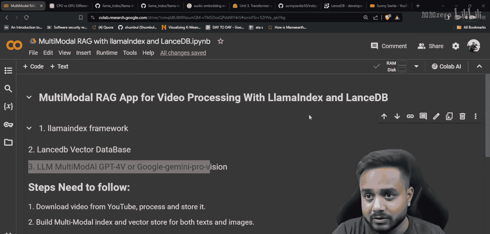
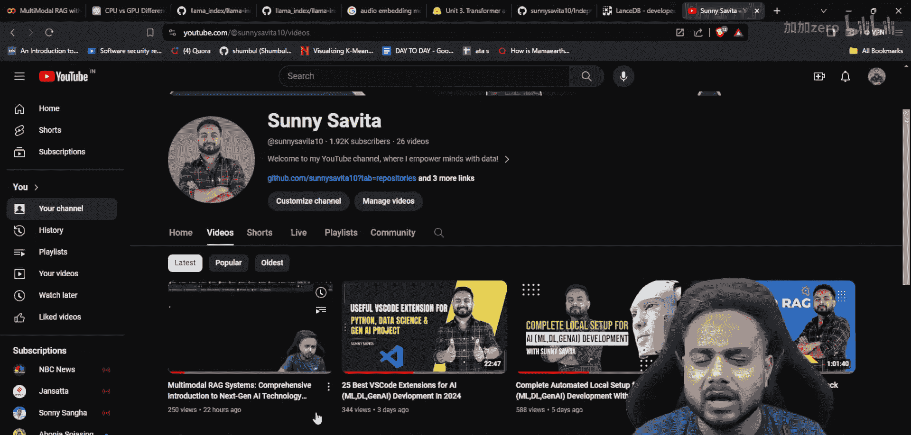
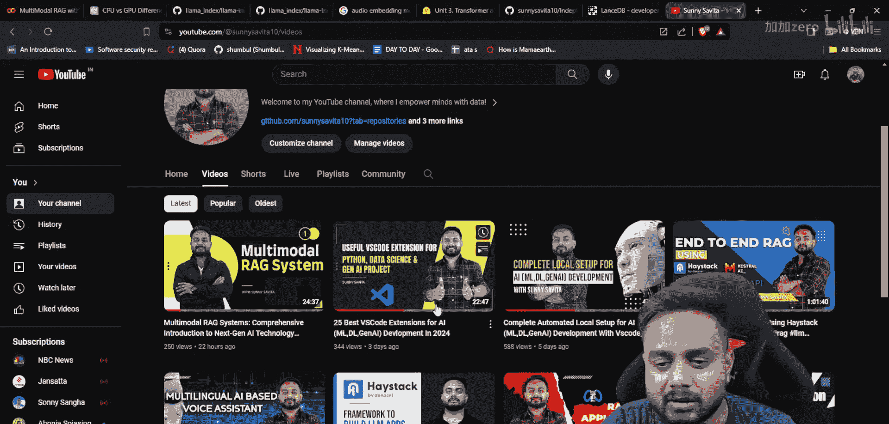
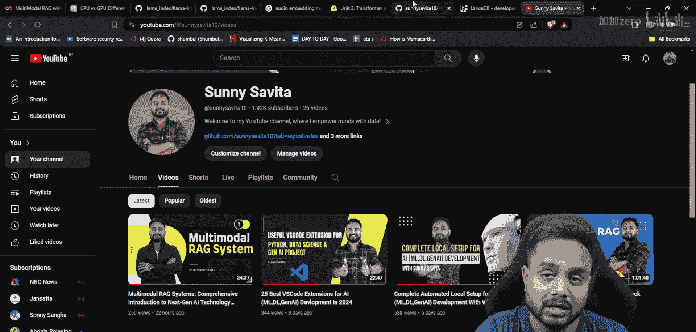
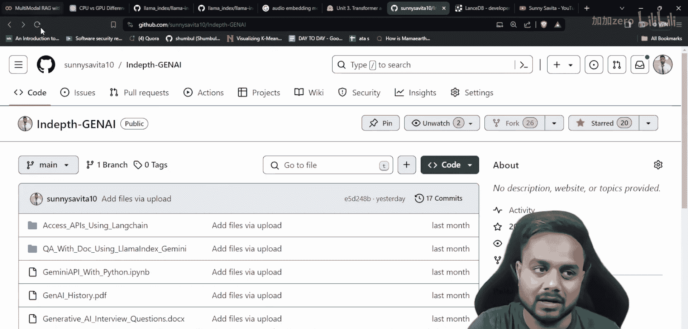
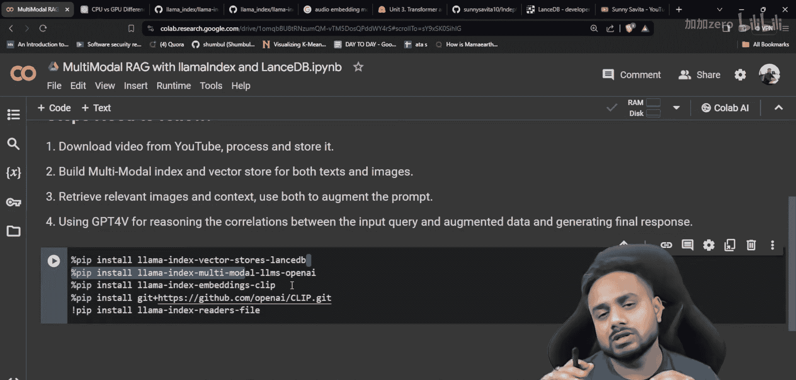
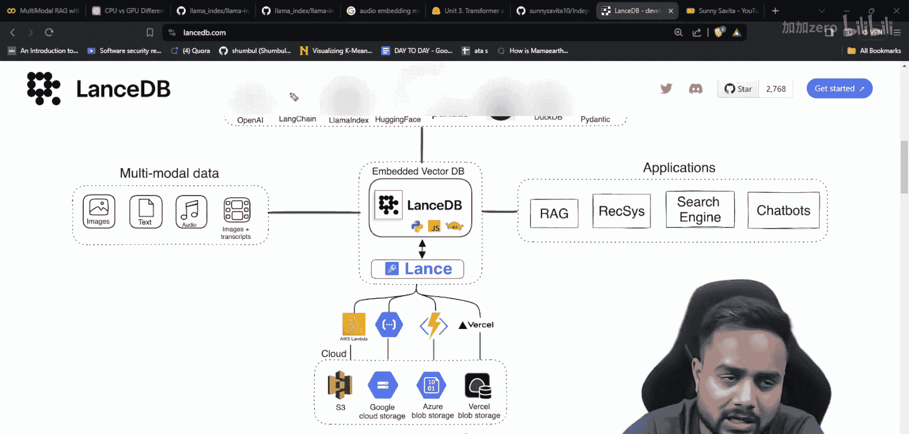
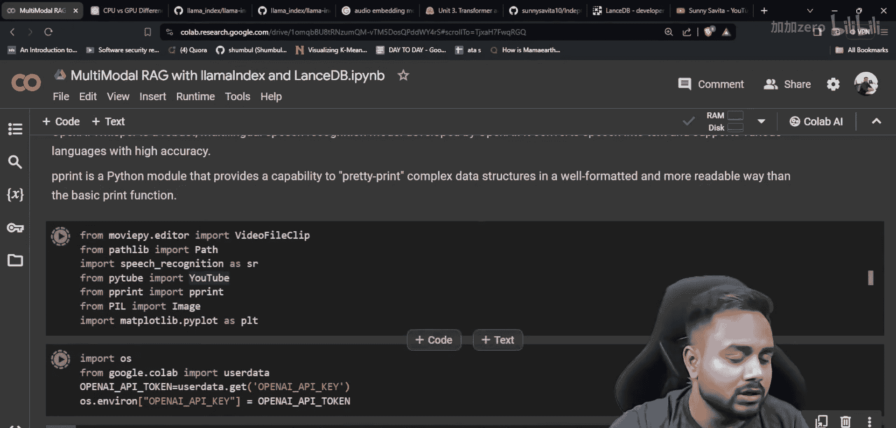

# 生成式AI：P25：使用LanceDB和LlamaIndex构建视频处理多模态RAG应用 🎥

在本节课中，我们将学习如何构建一个多模态检索增强生成应用。这个应用专门用于处理视频内容。我们将使用LlamaIndex框架和LanceDB向量数据库，结合GPT-4等视觉语言模型，实现从视频中提取信息并进行智能问答的功能。

## 概述

上一节我们介绍了多模态RAG系统的理论基础。本节中，我们将动手实践，构建一个能够处理视频内容的应用。我们将学习如何从YouTube下载视频、提取关键帧和文本、构建多模态索引，并最终实现一个能够回答视频相关问题的智能系统。





## 准备工作



以下是构建此应用所需的核心库及其简要说明。我们将逐一安装并导入它们。

*   **llama-index**：用于构建RAG应用的核心框架。
*   **lancedb**：一个开源的、开发者友好的多模态向量数据库，用于存储文本和图像的嵌入向量。
*   **openai**：用于调用GPT-4多模态模型。
*   **clip**：OpenAI发布的语言-图像预训练模型，用于生成图像嵌入。
*   **whisper**：用于从视频中生成文字转录。
*   **moviepy**：用于视频处理，如剪辑和帧提取。
*   **youtube-dl / pytube**：用于从YouTube下载视频。
*   **speech_recognition**：用于语音识别。
*   **ffmpeg**：处理音频和视频文件的多媒体框架。
*   **soundfile, torch, matplotlib, cycler, imageio, regex, tqdm**：辅助库，分别用于音频处理、深度学习、绘图、图像处理、正则表达式和进度条显示。

## 实现步骤





现在，让我们开始一步步构建应用。我们将遵循一个清晰的流程。

### 第一步：导入库并设置环境

首先，我们需要导入所有必要的库，并设置OpenAI的API密钥以访问GPT-4模型。

```python
import os
from moviepy.editor import VideoFileClip
from pathlib import Path
import speech_recognition as sr
from pytube import YouTube
from pprint import pprint
import matplotlib.pyplot as plt
# ... 导入其他所需库

# 设置OpenAI API密钥
os.environ[‘OPENAI_API_KEY’] = ‘your-api-key-here’
```

### 第二步：从YouTube下载视频

接下来，我们需要获取要处理的视频源。我们将使用`pytube`库从指定的YouTube链接下载视频。

```python
def download_youtube_video(url, output_path=‘./data/videos’):
    “””
    从YouTube下载视频
    :param url: YouTube视频链接
    :param output_path: 视频保存路径
    :return: 下载视频的文件路径
    “””
    yt = YouTube(url)
    stream = yt.streams.filter(progressive=True, file_extension=‘mp4’).order_by(‘resolution’).desc().first()
    output_file = stream.download(output_path=output_path)
    return output_file

# 示例：下载一个视频
video_url = “https://www.youtube.com/watch?v=example”
video_path = download_youtube_video(video_url)
print(f“视频已下载至: {video_path}”)
```

### 第三步：处理视频并提取多模态数据

这是核心步骤。我们将视频分解为关键帧（图像）和音频转录（文本），为构建索引准备数据。

1.  **提取关键帧**：使用`moviepy`或`OpenCV`以固定间隔从视频中截取图像。
2.  **生成转录文本**：使用`whisper`模型处理视频的音频轨道，生成完整的文字记录。

```python
import whisper



def extract_frames(video_path, interval=10):
    “””
    按时间间隔从视频中提取帧（图像）
    :param video_path: 视频文件路径
    :param interval: 提取帧的时间间隔（秒）
    :return: 保存帧图像的路径列表
    “””
    clip = VideoFileClip(video_path)
    frame_paths = []
    for i, t in enumerate(range(0, int(clip.duration), interval)):
        frame = clip.get_frame(t)
        frame_path = f“./data/frames/frame_{i:04d}.jpg”
        plt.imsave(frame_path, frame)
        frame_paths.append(frame_path)
    clip.close()
    return frame_paths

def transcribe_audio(video_path):
    “””
    使用Whisper模型转录视频中的音频
    :param video_path: 视频文件路径
    :return: 转录文本
    “””
    model = whisper.load_model(“base”)
    result = model.transcribe(video_path)
    return result[“text”]

# 执行提取
frame_paths = extract_frames(video_path, interval=30) # 每30秒提取一帧
transcript_text = transcribe_audio(video_path)
```

### 第四步：构建多模态向量索引

现在，我们将提取的图像和文本数据存储到LanceDB中，并创建索引。LlamaIndex提供了便捷的接口来完成这项工作。



1.  **初始化LanceDB向量存储**：连接到数据库。
2.  **创建文档对象**：将图像文件和文本转换为LlamaIndex可处理的`ImageDocument`和`Document`对象。
3.  **生成并存储嵌入向量**：使用CLIP模型为图像生成嵌入向量，使用文本嵌入模型（如OpenAI的`text-embedding`）为文本生成嵌入向量，并存入LanceDB。
4.  **创建索引**：基于向量存储创建检索器可查询的索引。

```python
from llama_index import VectorStoreIndex, StorageContext
from llama_index.vector_stores import LanceDBVectorStore
from llama_index.schema import ImageDocument, Document
import lancedb

# 1. 连接LanceDB
uri = “./data/lancedb”
db = lancedb.connect(uri)
table_name = “multimodal_rag”

# 2. 初始化向量存储
vector_store = LanceDBVectorStore(uri=uri, table_name=table_name)
storage_context = StorageContext.from_defaults(vector_store=vector_store)

# 3. 创建文档列表
documents = []
# 添加文本文档
text_doc = Document(text=transcript_text)
documents.append(text_doc)
# 添加图像文档
for img_path in frame_paths:
    img_doc = ImageDocument(image_path=img_path)
    documents.append(img_doc)

# 4. 创建索引（LlamaIndex会自动处理多模态嵌入和存储）
index = VectorStoreIndex.from_documents(
    documents,
    storage_context=storage_context,
    show_progress=True
)
```

### 第五步：创建查询引擎

索引构建完成后，我们基于它创建一个查询引擎。这个引擎将使用GPT-4作为语言模型，能够理解同时包含文本和图像的查询。

```python
from llama_index.multi_modal_llms import OpenAIMultiModal
from llama_index.query_engine import SimpleMultiModalQueryEngine

# 初始化多模态LLM (GPT-4)
openai_mm_llm = OpenAIMultiModal(model=“gpt-4-vision-preview”, max_new_tokens=300)

# 从索引创建检索器
retriever = index.as_retriever(similarity_top_k=3) # 检索最相关的3个片段（文本或图像）

# 创建多模态查询引擎
query_engine = SimpleMultiModalQueryEngine(
    retriever=retriever,
    multi_modal_llm=openai_mm_llm
)
```

### 第六步：进行问答查询

最后，我们可以向系统提问了。查询引擎会从索引中检索相关的文本和图像片段，并将其与问题一起发送给GPT-4，生成最终答案。

```python
# 示例查询
query = “视频中演示了哪个产品的使用方法？请描述其关键步骤。”
response = query_engine.query(query)

print(“问题：”, query)
print(“\n回答：”, response)
# 如果需要，还可以查看检索到的参考来源
for i, node in enumerate(response.source_nodes):
    print(f”\n来源 {i+1}:”, node.node.get_content()[:200]) # 打印前200个字符
```

## 总结



本节课中我们一起学习了如何构建一个功能完整的多模态RAG应用。我们从YouTube下载视频源开始，逐步完成了视频帧和音频转录的提取。利用LlamaIndex和LanceDB，我们将这些多模态数据构建成可检索的向量索引。最后，通过集成GPT-4多模态模型，我们创建了一个能够理解复杂问题、并从视频内容中检索相关信息来生成准确答案的智能查询系统。这套流程可以广泛应用于教育、内容分析、客户支持等多个需要从视频中快速获取信息的领域。