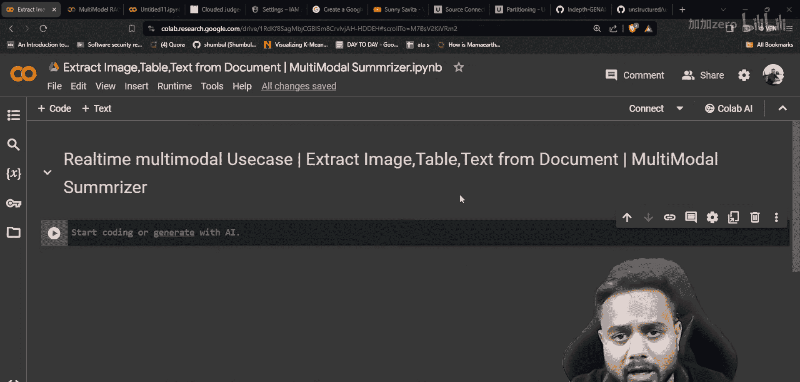
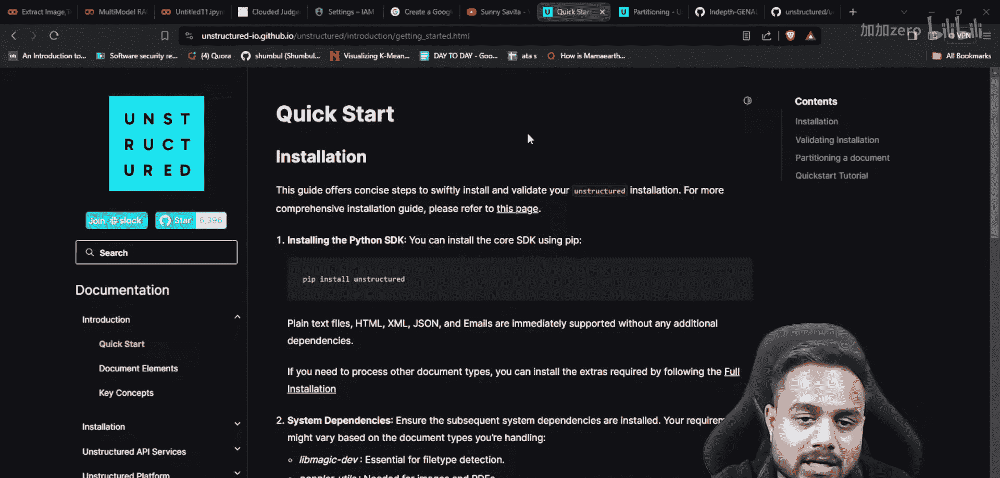
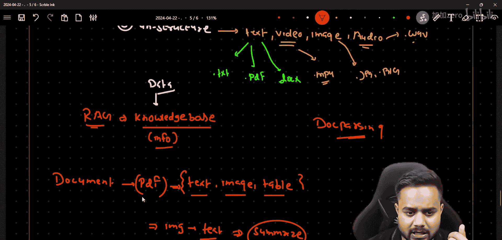

# 生成式AI：P26：实时多模态RAG用例第一部分 | 从文档中提取图像、表格和文本 📄

在本节课中，我们将学习如何处理包含多种数据类型的文档。这是构建基于大语言模型应用的关键第一步，因为数据来源和格式多种多样。我们将重点介绍如何使用 `unstructured` 库从文档中提取文本、图像和表格等信息。

## 数据类型的全面介绍

上一节我们提到了处理多样化数据的重要性，本节中我们来看看数据的具体分类。理解数据类型是选择正确解析工具的基础。



数据主要可以分为三大类：

*   **结构化数据**：这类数据总是以表格形式存在，包含分类列和数值列。你可以在以下文件中找到此类数据：
    *   CSV 文件
    *   Excel 文件


*   **半结构化数据**：这类数据具有部分结构，但不像表格那样规整。它通常以特定格式存储：
    *   JSON 格式
    *   XML 格式
    *   HTML 格式
    *   YAML 格式

*   **非结构化数据**：这是最常见且形式多样的数据，可进一步细分为：
    *   **文本数据**：存在于 `.txt`、`.pdf`、`.docx` 等格式的文档中。
    *   **视频数据**：如 `.mp4` 等格式，本质上是图像和音频的集合。
    *   **图像数据**：如 `.jpg`、`.png` 等格式。
    *   **音频数据**：如 `.wav` 等格式。

## 现实场景与挑战



理解了数据类型后，我们来看看实际应用中会遇到的具体挑战。在构建 RAG 系统时，我们首先需要建立一个知识库，这个知识库的信息就来源于各种文档和数据。

数据可能以任何格式出现。例如，假设你有一个 PDF 文档，而这个单一的文档内部就混合了多种数据类型：

1.  文本
2.  图像
3.  表格

如何从这样一个混合文档中有效地提取所有信息？这就是我们面临的核心问题。更进一步，你可能还需要从图像中提取文字，或者基于提取出的文本进行问答或摘要生成。

## 解决方案：使用 `unstructured` 库

面对混合格式文档的提取难题，一个强大的工具是 `unstructured` 库。在接下来的部分，我们将深入了解这个库。

`unstructured` 库是一个功能强大的开源工具，专门用于从各种格式的文档中解析（即提取）信息。在本课程中，我们将学习如何使用这个库来完成文档解析任务。

它的核心功能可以概括为：
```python
# 核心概念：使用 unstructured 库提取文档元素
from unstructured.partition.auto import partition

# 解析文档，自动识别并提取不同元素（文本、图像、表格等）
elements = partition(filename="your_document.pdf")
for element in elements:
    print(f"类型: {type(element).__name__}, 内容: {element.text[:100]}...")
```
通过上述代码，库可以自动处理文档，并将其分解为文本、图像、表格等结构化元素，为后续处理打下基础。



本节课中我们一起学习了数据的三种主要类型（结构化、半结构化、非结构化），并认识了一个常见的应用挑战：从混合数据格式的单一文档中提取信息。作为解决方案，我们引入了 `unstructured` 库，它将成为我们从复杂文档中提取文本、图像和表格等元素的得力工具。在下一部分，我们将进行实际操作，展示如何使用这个库来解析具体的文档。