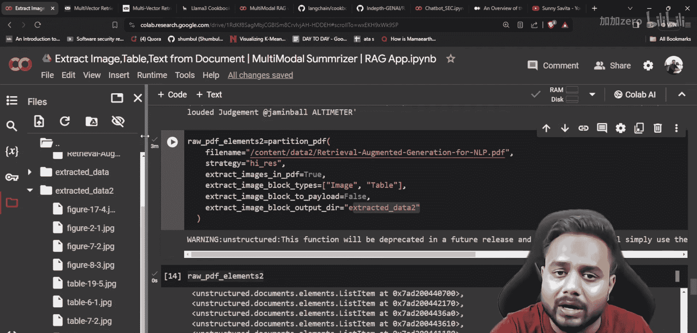
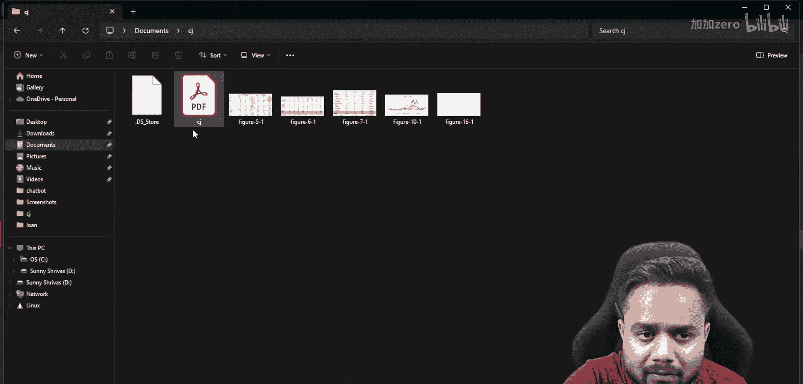
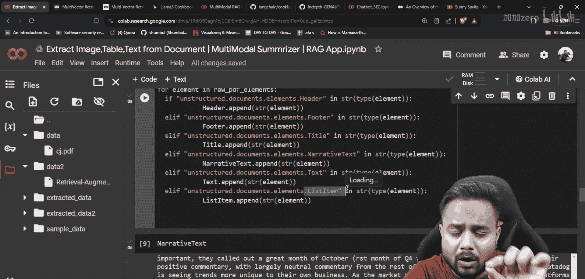
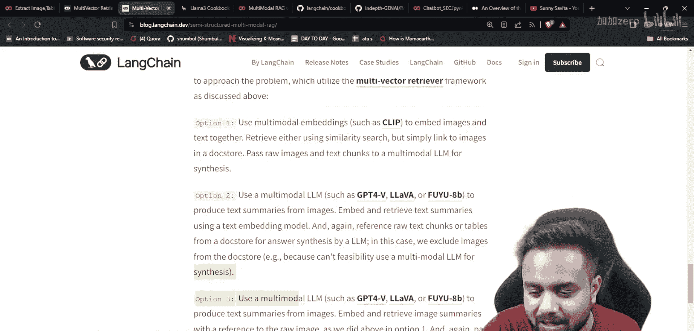
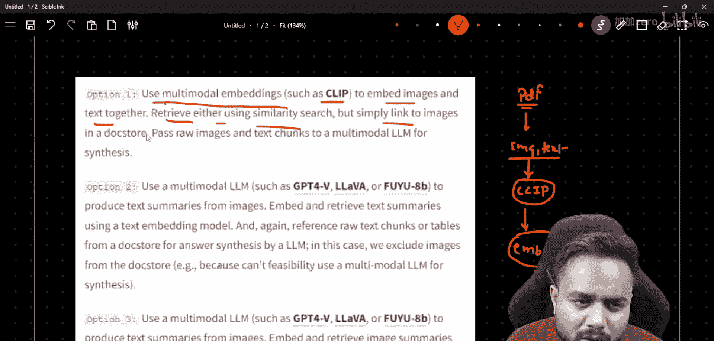
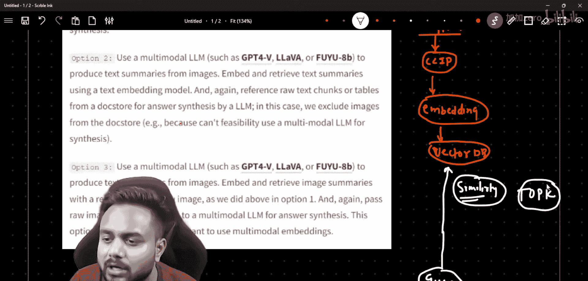
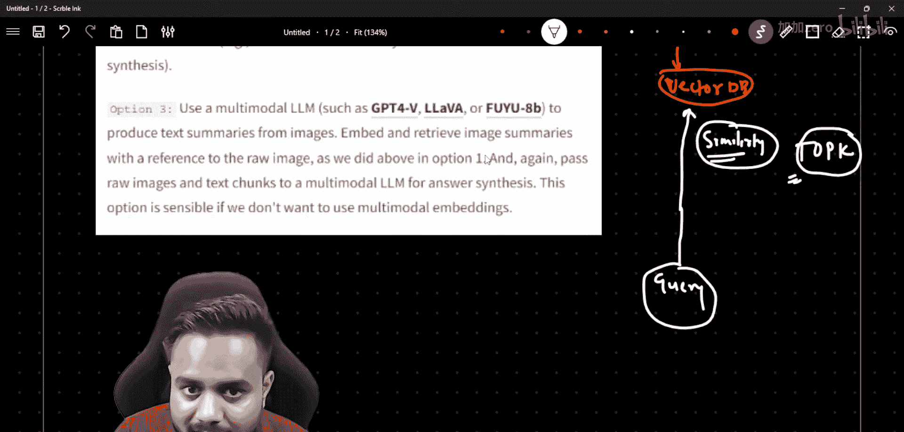
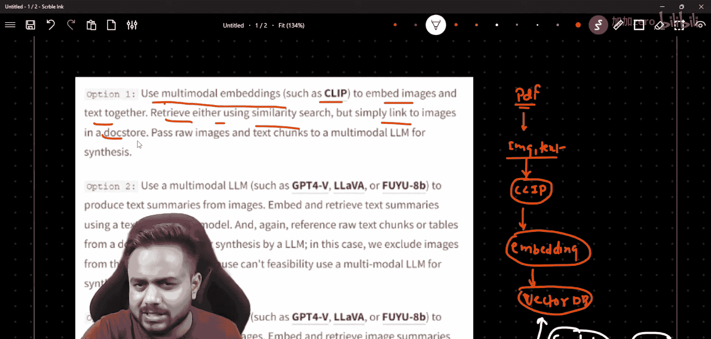
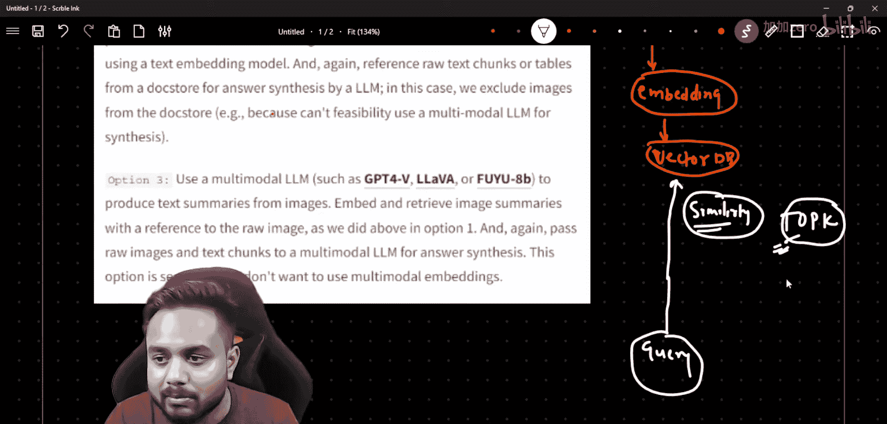

生成式AI：从初学者到专家｜P27：实时多模态RAG用例第二部分｜多模态摘要器｜RAG应用


## 概述
在本节课中，我们将继续构建一个实时多模态RAG（检索增强生成）系统。上一节我们介绍了如何从文档中提取图像、表格和文本等多种数据。本节中，我们将学习如何基于提取的数据创建摘要，并探讨构建完整RAG系统的不同解决方案。

## 数据提取回顾
在上一节中，我们使用 `unstructured` 等库从PDF文档中提取了多种类型的数据元素。以下是提取过程的核心代码片段：

```python
# 示例：使用unstructured库提取文档元素
from unstructured.partition.pdf import partition_pdf


# 提取PDF中的元素
elements = partition_pdf("document.pdf", strategy="hi_res")
# elements 包含标题、叙述文本、列表项、图像等元素
```

提取的数据被分类保存在不同的文件夹中，例如 `images/` 文件夹存放图像，`tables/` 文件夹存放表格数据，而文本内容则被解析为“叙述文本”和“列表项”等元素。

## 创建数据摘要
现在我们已经成功提取了数据，接下来需要为这些数据创建摘要。创建摘要的目的是为了后续能更高效地构建RAG系统，对信息进行浓缩和索引。

以下是创建摘要的关键步骤：
1.  **整合文本数据**：将提取出的“叙述文本”和“列表项”等文本元素合并。
2.  **调用大语言模型（LLM）**：使用如GPT-4、Claude或开源的LLaMA等模型，生成内容摘要。
3.  **处理多模态数据**：对于图像和表格，可以先生成其文本描述，再将这些描述整合到总摘要中。



## 多模态RAG解决方案探讨
在构建完整的RAG系统之前，了解不同的架构方案非常重要。参考业界实践（如 `blog.langchain.dev`），多模态RAG主要有三种解决方案：




### 解决方案一：统一的多模态嵌入
此方案使用如 **CLIP** 之类的多模态模型，将图像和文本共同嵌入到同一个向量空间中。
*   **流程**：提取的图像和文本分别通过CLIP模型转换为向量（嵌入），然后全部存储到**向量数据库**中。
*   **检索**：当用户输入查询时，查询文本同样通过CLIP转换为向量，并在向量数据库中进行**相似性搜索**，找出最相关的图像和文本嵌入。
*   **生成**：将检索到的图像和文本片段（或图像链接）一起提供给LLM，生成最终答案。其核心思想是 **`多模态嵌入 -> 向量数据库 -> 相似性检索 -> 生成`**。

### 解决方案二：摘要增强检索
此方案是我们当前教程采用的方法路径。
*   **流程**：首先为整个文档（包括图像内容的描述）生成一个**文本摘要**。
*   **检索**：将这个摘要与原始文本数据一起，使用传统的文本嵌入模型（如 `text-embedding-ada-002`）进行向量化并存入数据库。
*   **优势**：摘要提供了文档的全局概览，能改善检索的准确性，尤其当用户查询涉及文档整体主题时。其流程可概括为 **`生成摘要 -> 文本嵌入 -> 检索 -> 生成`**。




### 解决方案三：混合检索与重排序
这是一个更高级的方案，结合了多种技术以优化效果。
*   **流程**：同时使用**关键词搜索**（如BM25）和**向量相似性搜索**进行初步检索，得到一组候选结果。
*   **优化**：使用一个**重排序模型**对候选结果进行精排，选择最相关、质量最高的片段。
*   **生成**：将精排后的多模态数据（文本和图像参考）输入LLM生成答案。其核心是 **`混合检索 -> 重排序 -> 生成`** 的管道。



## 本系列教程路径
本实时用例将分三步完成：
1.  **数据提取**：已完成。我们从多模态文档中提取了结构化数据。
2.  **创建摘要**：本节内容。我们正在为提取的数据生成摘要，为RAG做准备。
3.  **构建RAG系统**：下一节内容。我们将基于摘要和原始数据，实现一个可用的多模态RAG系统。

请注意，构建用于学习的RAG原型相对简单，但将其部署到实时生产环境则会面临更多挑战。本系列课程旨在从基础到高级全面覆盖RAG的各个方面，包括检索技术、重排序、混合搜索优化、向量数据库集成以及流水线评估等。



## 总结
本节课中，我们一起学习了如何为从文档中提取的多模态数据创建摘要，并详细分析了构建多模态RAG系统的三种主流解决方案。我们明确了摘要作为中间步骤对于提升RAG效果的价值。在下一节中，我们将动手实现基于摘要的RAG系统，完成这个端到端的实时用例。









> 提示：本节涉及的完整代码、PDF文档和相关资源均可在视频描述或提供的Git仓库链接中获取，建议下载并运行代码以加深理解。