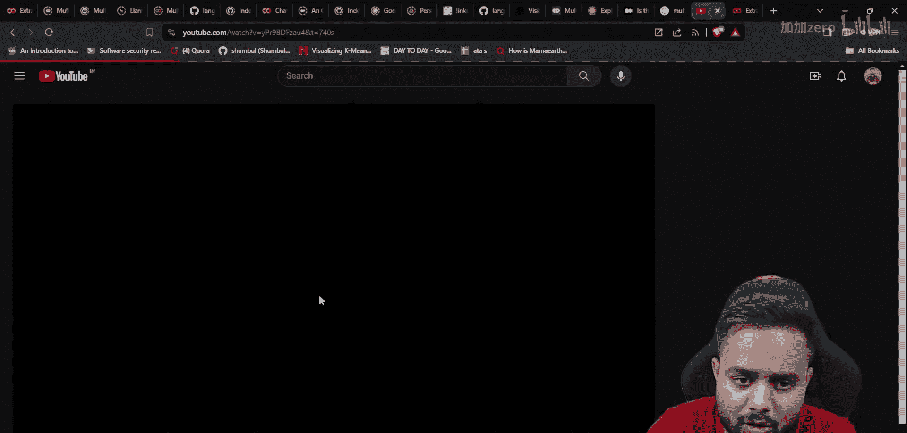
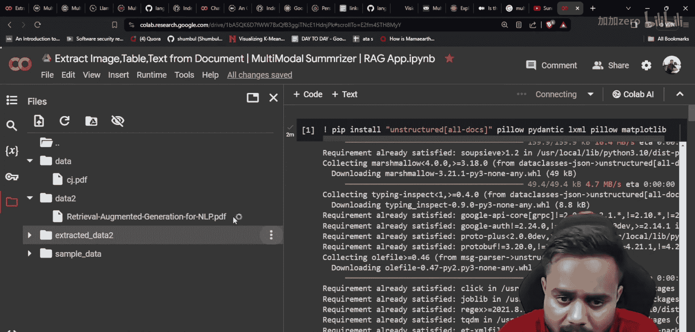
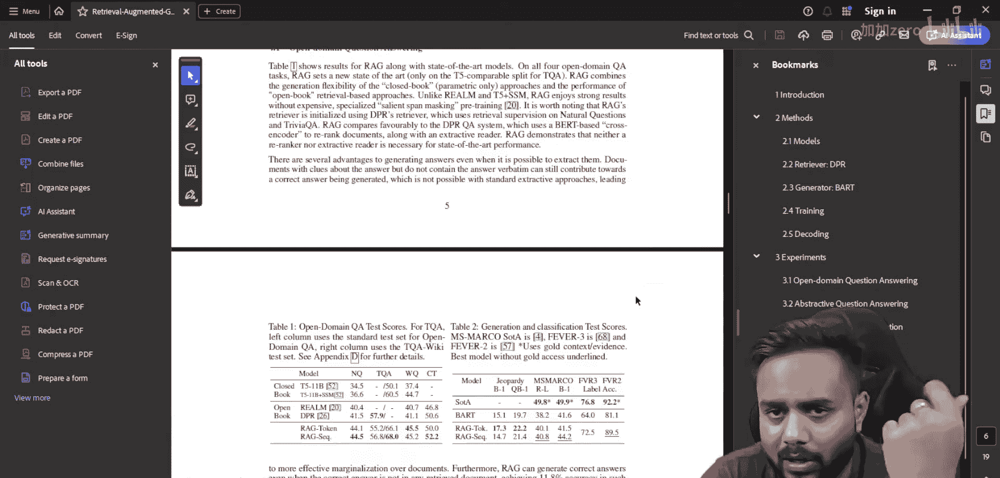
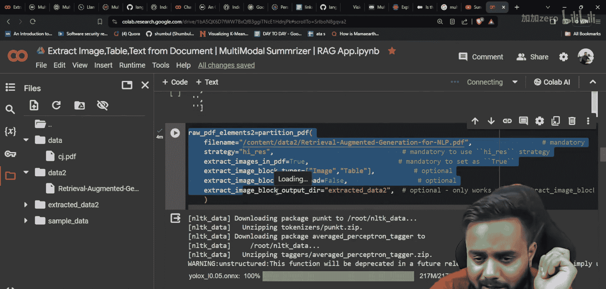
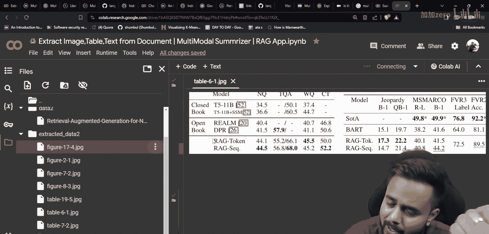
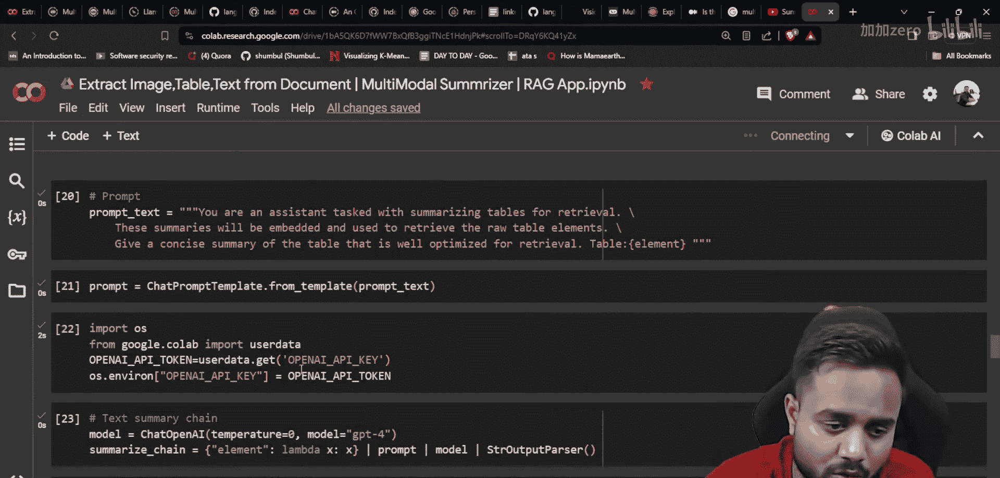
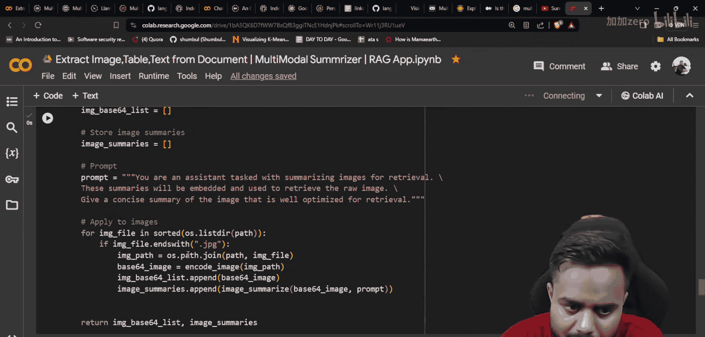
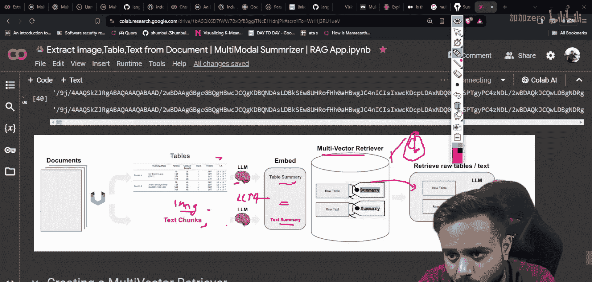
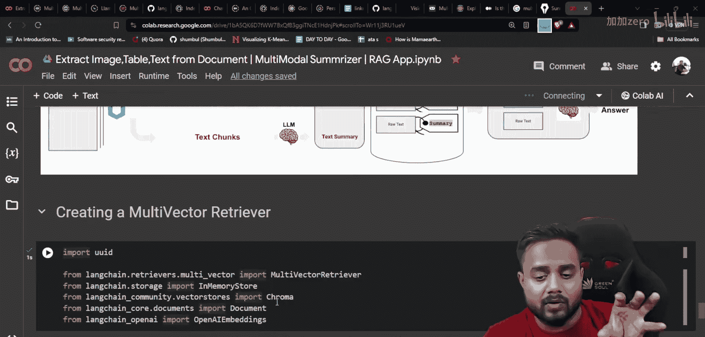

# 生成式AI：P28：实时多模态RAG应用案例第三部分｜使用Langchain的MultiVectorRetriever

## 概述

在本节课中，我们将学习如何构建一个多模态检索增强生成系统。我们将重点介绍如何使用Langchain的MultiVectorRetriever，并结合之前课程中提取的文本、表格和图像摘要来创建完整的RAG流程。

上一节我们介绍了如何从文档中提取数据并生成摘要，本节中我们来看看如何利用这些摘要和原始数据构建检索系统。

## 架构回顾

以下是多模态RAG系统的完整架构：

```
文档 → 提取 → [文本, 表格, 图像] → 摘要生成 → 向量存储 → 检索 → 答案生成
```

具体流程如下：
1. 从文档中提取文本、表格和图像
2. 使用LLM为每种数据类型生成摘要
3. 将摘要转换为向量并存储在数据库中
4. 用户查询时，在摘要向量空间中进行相似性搜索
5. 检索对应的原始数据
6. 将原始数据和查询一起传递给LLM生成最终答案

## 代码实现

### 1. 环境设置


以下是所需的库安装代码：

```python
# 安装必要库
!pip install langchain chromadb openai pymupdf pillow
```

### 2. 数据提取函数

我们使用以下函数从PDF中提取不同类型的数据：

```python
def extract_from_pdf(pdf_path):
    # 提取文本、表格和图像的代码
    # 返回包含三种数据类型的字典
    return {
        'text': extracted_text,
        'tables': extracted_tables,
        'images': extracted_images
    }
```

### 3. 摘要生成


对于每种数据类型，我们使用GPT-4模型生成摘要：



```python
from langchain.llms import OpenAI

# 初始化模型
llm = OpenAI(model="gpt-4", api_key="your_api_key")

# 生成文本摘要
text_summary = llm.generate(f"请总结以下文本：{text_content}")

# 生成表格摘要
table_summary = llm.generate(f"请描述以下表格的主要内容：{table_content}")

# 生成图像摘要（通过base64编码）
image_summary = llm.generate(f"请描述以下图像：{base64_image}")
```

### 4. MultiVectorRetriever设置


以下是MultiVectorRetriever的核心配置：

```python
from langchain.retrievers import MultiVectorRetriever
from langchain.vectorstores import Chroma
from langchain.embeddings import OpenAIEmbeddings

# 创建向量存储
vectorstore = Chroma(
    collection_name="multimodal_rag",
    embedding_function=OpenAIEmbeddings()
)

# 创建多向量检索器
retriever = MultiVectorRetriever(
    vectorstore=vectorstore,
    docstore=docstore,  # 原始数据存储
    id_key="doc_id"     # 文档标识键
)
```





### 5. 数据存储流程

以下是存储摘要和原始数据的步骤：

```python
# 准备摘要数据
summary_docs = []
for data_type in ['text', 'table', 'image']:
    summary = generate_summary(raw_data[data_type])
    summary_docs.append({
        'content': summary,
        'metadata': {'type': data_type, 'doc_id': doc_id}
    })

# 存储摘要向量
retriever.vectorstore.add_documents(summary_docs)

# 存储原始数据
retriever.docstore.add({
    doc_id: raw_data  # 包含文本、表格、图像的原始数据
})
```

### 6. 检索流程

当用户发起查询时，系统执行以下操作：



```python
# 用户查询
query = "请解释文档中的主要研究方法"

# 在摘要向量空间中进行相似性搜索
similar_summaries = retriever.vectorstore.similarity_search(query, k=3)

# 获取对应的原始数据
raw_documents = []
for summary in similar_summaries:
    doc_id = summary.metadata['doc_id']
    raw_doc = retriever.docstore.get(doc_id)
    raw_documents.append(raw_doc)



# 将原始数据传递给LLM生成答案
context = "\n".join([str(doc) for doc in raw_documents])
answer = llm.generate(f"基于以下上下文回答问题：{context}\n问题：{query}")
```

## 关键概念说明

### MultiVectorRetriever工作原理

MultiVectorRetriever的核心思想是：
- **摘要向量化**：将生成的摘要转换为向量
- **原始数据关联**：建立摘要向量与原始数据的映射关系
- **两级检索**：先在摘要空间搜索，再获取对应的原始数据

### 多模态数据处理

以下是处理不同数据类型的注意事项：

1. **文本处理**
   - 直接使用LLM生成摘要
   - 保持原文的关键信息




2. **表格处理**
   - 将表格转换为结构化文本
   - 突出显示关键数据和趋势

3. **图像处理**
   - 使用base64编码或直接传递
   - 依赖支持多模态的LLM（如GPT-4V）

## 实施步骤总结

以下是构建多模态RAG系统的完整步骤：

1. **数据准备阶段**
   - 安装必要的库和工具
   - 准备包含多模态数据的文档

2. **数据提取阶段**
   - 从PDF中提取文本、表格和图像
   - 将提取的数据保存到本地

3. **摘要生成阶段**
   - 为每种数据类型生成摘要
   - 验证摘要的准确性和完整性

4. **向量存储阶段**
   - 初始化向量数据库
   - 配置MultiVectorRetriever
   - 存储摘要向量和原始数据

5. **检索测试阶段**
   - 设计测试查询
   - 验证检索结果的准确性
   - 优化检索参数

## 常见问题解决



以下是实施过程中可能遇到的问题及解决方案：

1. **内存不足**
   - 分批处理大型文档
   - 使用更高效的向量编码

2. **检索精度低**
   - 调整相似性搜索的k值
   - 优化摘要生成提示词

3. **处理速度慢**
   - 使用缓存机制
   - 并行处理不同类型的数据

## 性能优化建议

为了提高系统性能，可以考虑以下优化措施：

1. **索引优化**
   - 使用更高效的向量索引算法
   - 定期清理无效数据

2. **缓存策略**
   - 缓存频繁查询的结果
   - 实现查询结果预加载

3. **异步处理**
   - 使用异步IO处理大量文档
   - 实现流水线化的数据处理流程

## 总结

本节课中我们一起学习了如何构建完整的多模态RAG系统。我们重点介绍了：

1. **MultiVectorRetriever的使用**：学习了如何配置和使用这个强大的检索器
2. **多模态数据处理**：掌握了处理文本、表格和图像的方法
3. **完整的RAG流程**：从数据提取到最终答案生成的完整链路

通过本课程的学习，你现在应该能够：
- 理解多模态RAG系统的工作原理
- 使用Langchain构建自己的检索系统
- 处理包含多种数据类型的复杂文档
- 优化检索系统的性能和准确性





这个系统可以广泛应用于文档分析、研究辅助、知识管理等多个领域，为用户提供强大的信息检索和问答能力。