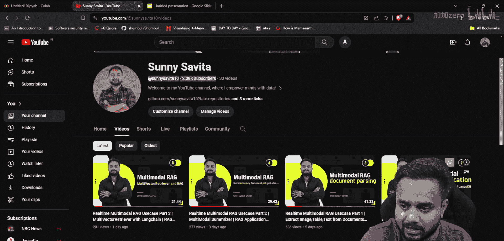
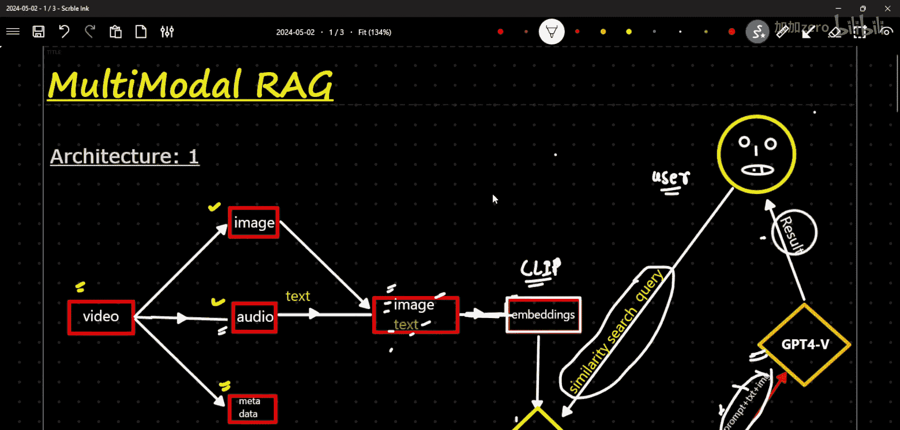
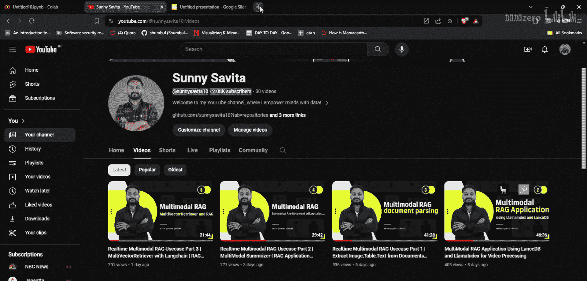
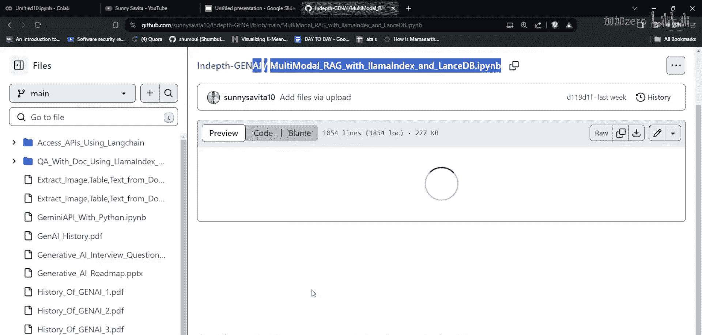
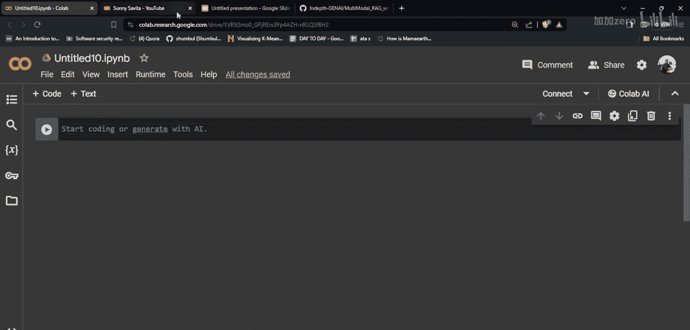
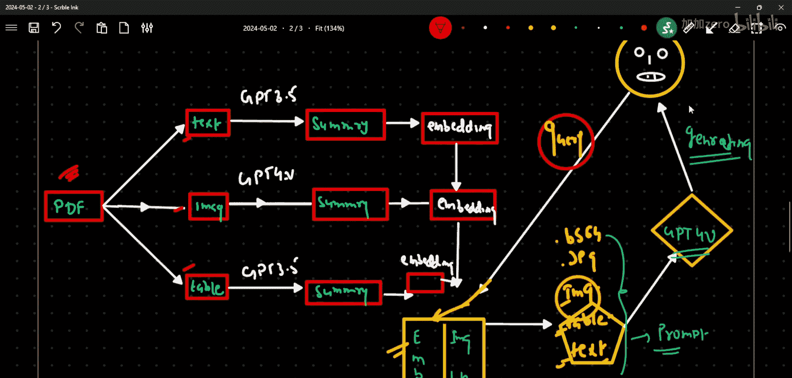
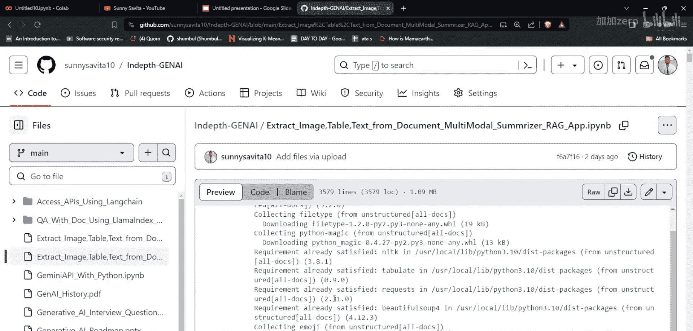
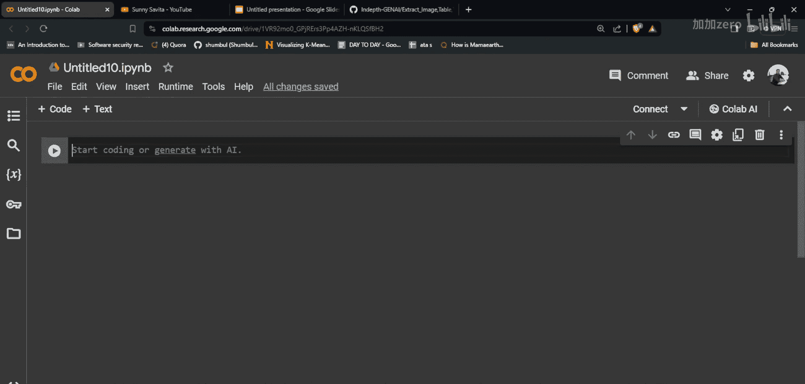
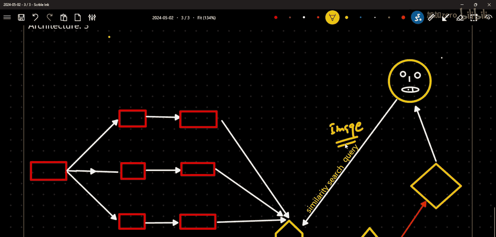

# 生成式AI：从初学者到专家：P29：使用Google Gemini-Pro-Vision和Langchain实现实时多模态RAG应用

在本节课中，我们将学习如何构建一个实时多模态检索增强生成应用。我们将使用Google的Gemini-Pro-Vision模型和Langchain框架，实现一个与之前课程不同的全新架构。这个应用的核心特点是允许用户通过上传图片进行查询，而不仅仅是文本。

## 课程概述

在之前的课程中，我们探讨了两种不同的多模态RAG架构。第一种架构处理视频数据，提取图像和音频文本，使用CLIP模型进行嵌入，并将结果存储在向量数据库中。第二种架构处理包含文本、图像和表格的PDF文档，为内容创建摘要并嵌入，然后进行检索。

本节课，我们将实现第三种架构。这种架构允许用户上传一张图片作为查询，系统会从数据库中检索出与这张图片语义上最相关的文本和图像片段，然后结合这些信息生成一个详细的回答。

## 回顾之前的架构

在开始新内容之前，我们先简要回顾一下之前实现的两个架构，这有助于理解我们今天要构建的系统有何不同。

### 架构一：基于视频的处理

第一种架构处理视频数据。其流程如下：



1.  **输入**：一个视频文件。
2.  **处理**：
    *   从视频中提取图像帧。
    *   从视频音频中提取文本（转录）。
    *   收集视频元数据（如标题、观看数、作者）。
3.  **嵌入与存储**：
    *   使用CLIP模型为提取的图像和文本生成多模态嵌入向量。
    *   将这些嵌入向量以及原始的图像和文本数据存储在一个多向量检索器中。
4.  **查询与生成**：
    *   用户提出一个文本查询。
    *   系统根据查询的嵌入向量，在数据库中执行相似性搜索。
    *   检索出最相关的原始图像和文本片段。
    *   将这些相关的图像、文本连同用户的问题，一起发送给GPT-4模型。
    *   GPT-4模型综合所有信息，生成最终答案。

这个架构的代码可以在我的GitHub仓库 `in-depthgen` 中的 `multimod_with_lama_index` 部分找到。

### 架构二：基于PDF文档的处理

第二种架构处理包含混合内容（文本、图像、表格）的PDF文档。其流程如下：

1.  **输入**：一个PDF文件。
2.  **处理**：
    *   从PDF中提取文本、图像和表格。
3.  **摘要生成**：
    *   对于文本和表格，使用GPT-3.5模型为其生成摘要。
    *   对于图像，使用GPT-4V模型为其生成描述性摘要。
4.  **嵌入与存储**：
    *   为这些摘要生成文本嵌入向量。
    *   将嵌入向量以及原始的图像、表格和文本数据存储在一个内存式的Chroma向量数据库中。
5.  **查询与生成**：
    *   用户提出一个文本查询。
    *   系统根据查询的嵌入向量，在数据库的摘要向量中执行相似性搜索。
    *   检索出与查询最相关的原始图像、表格和文本数据。
    *   将这些原始数据（图像为base64格式，表格和文本为文本格式）连同用户问题，发送给GPT-4V模型。
    *   GPT-4V模型综合所有信息，生成最终答案。

这个架构适用于处理复杂的、包含多种数据类型的文档，其代码同样可以在我的GitHub仓库中找到。

## 引入第三种架构：基于图像查询的RAG

现在，让我们进入本节课的核心内容。我们将构建一个允许以图像作为查询输入的多模态RAG系统。

### 架构设计

第三种架构的设计思路与前两种有显著区别，它专注于实现“以图搜图”并生成解释的功能。









1.  **数据准备与存储**：
    *   我们首先需要一个包含多张图片及其对应文字描述的数据集。
    *   对于每一张图片，我们使用一个多模态模型（如CLIP）为其生成嵌入向量。
    *   同时，我们也为每张图片的文本描述生成嵌入向量。
    *   将这些嵌入向量与原始的图片和文本数据一起，存储在我们的向量数据库中。

2.  **查询流程**：
    *   **输入**：用户上传一张查询图片。
    *   **检索**：系统使用相同的多模态模型为这张查询图片生成嵌入向量。
    *   系统在数据库中，将查询图片的嵌入向量与之前存储的所有图片嵌入向量进行相似性比较。
    *   系统找出与查询图片最相似的若干张图片。
    *   **上下文获取**：系统不仅返回这些相似的图片，还返回与这些图片配对的原始文本描述。

3.  **答案生成**：
    *   系统将以下内容组合成一个提示，发送给大型语言模型（本节课使用Google Gemini-Pro-Vision）：
        *   用户的查询意图（例如，“请描述与这张图片类似的内容”）。
        *   检索到的、与查询图片最相关的几张原始图片。
        *   这些图片对应的原始文本描述。
    *   语言模型（Gemini-Pro-Vision）会分析查询图片，并参考提供的相关图片和文本上下文，生成一个连贯、详细的回答，解释查询图片的内容或与之相关的信息。

### 技术栈

*   **多模态嵌入模型**：用于将图像和文本映射到同一向量空间。例如 `OpenCLIP`。
*   **向量数据库**：用于高效存储和检索嵌入向量及原始数据。例如 `ChromaDB`。
*   **大语言模型**：用于理解查询并生成最终答案。本节课使用 **Google Gemini-Pro-Vision**。
*   **框架**：使用 **Langchain** 来编排整个流程，连接各个组件。

### 核心代码逻辑示意

以下是该架构核心步骤的简化伪代码逻辑：

```python
# 1. 初始化组件
embedder = OpenCLIPEmbedder() # 多模态嵌入模型
vector_store = ChromaVectorStore() # 向量数据库
llm = GeminiProVision() # 大语言模型

# 2. 数据入库 (预处理阶段)
for image, text_description in dataset:
    # 为图像生成嵌入
    image_embedding = embedder.embed_image(image)
    # 为文本生成嵌入
    text_embedding = embedder.embed_text(text_description)
    # 存储到数据库，关联图像、文本及其嵌入
    vector_store.add(embedding=image_embedding, image=image, text=text_description)
    # 也可以选择存储文本嵌入用于其他检索方式
    vector_store.add(embedding=text_embedding, image=image, text=text_description)

# 3. 实时查询流程
def answer_query(query_image):
    # 为查询图像生成嵌入
    query_embedding = embedder.embed_image(query_image)
    # 在数据库中检索最相似的项
    results = vector_store.similarity_search(query_embedding, k=3) # 返回top3
    # 准备上下文：收集检索到的原始图像和文本
    context_images = [result.image for result in results]
    context_texts = [result.text for result in results]
    # 构建给LLM的提示
    prompt = f"""
    用户上传了一张图片，请根据以下相关图片和描述，分析并描述用户图片的主要内容或与之相关的信息。
    相关参考图片：{context_images}
    相关图片描述：{context_texts}
    请基于以上参考信息进行回答。
    """
    # 调用LLM生成答案 (Gemini-Pro-Vision可以接收图像和文本)
    answer = llm.generate(prompt=prompt, images=[query_image] + context_images)
    return answer
```

## 总结







本节课中，我们一起学习了第三种多模态RAG架构的实现。这种架构的创新之处在于允许用户以图像作为查询输入，系统通过比较图像在语义向量空间中的相似度，检索出相关的图片和文本信息，并利用强大的多模态大模型（如Gemini-Pro-Vision）生成详尽的回答。



我们回顾了前两种分别处理视频和PDF的架构，并明确了第三种架构在查询方式上的根本区别。通过结合多模态嵌入模型、向量数据库和先进的大语言模型，我们可以构建出能够理解和处理复杂、跨模态信息的智能应用系统。这为开发图像搜索、内容理解、交互式问答等应用提供了强大的技术基础。