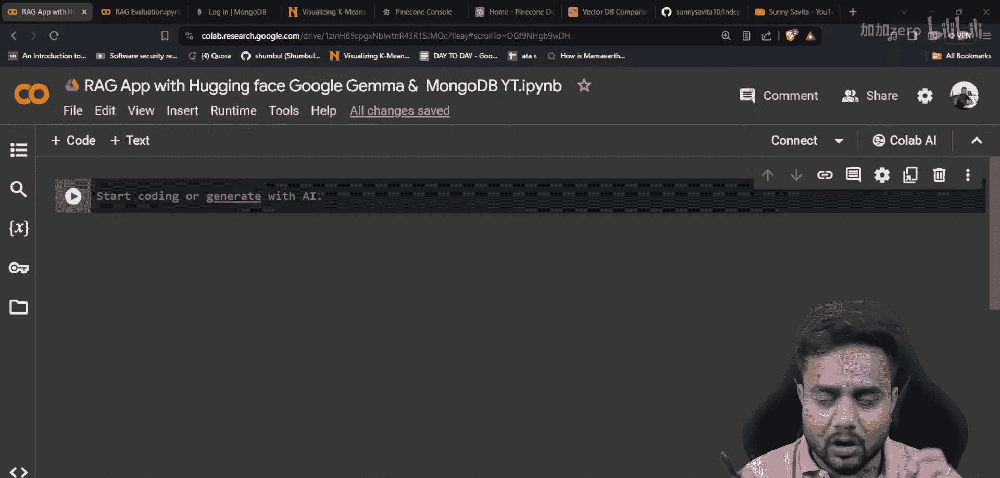
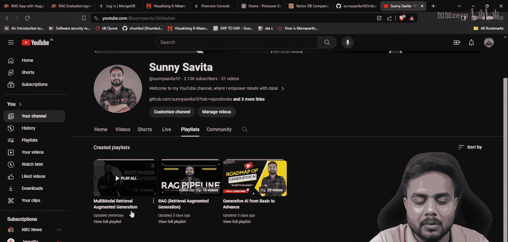
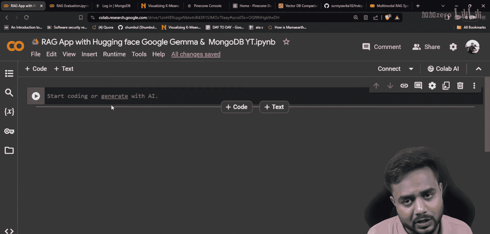
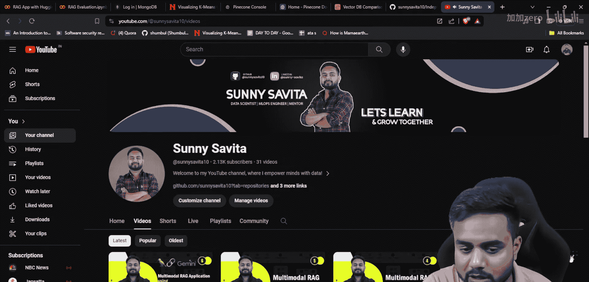
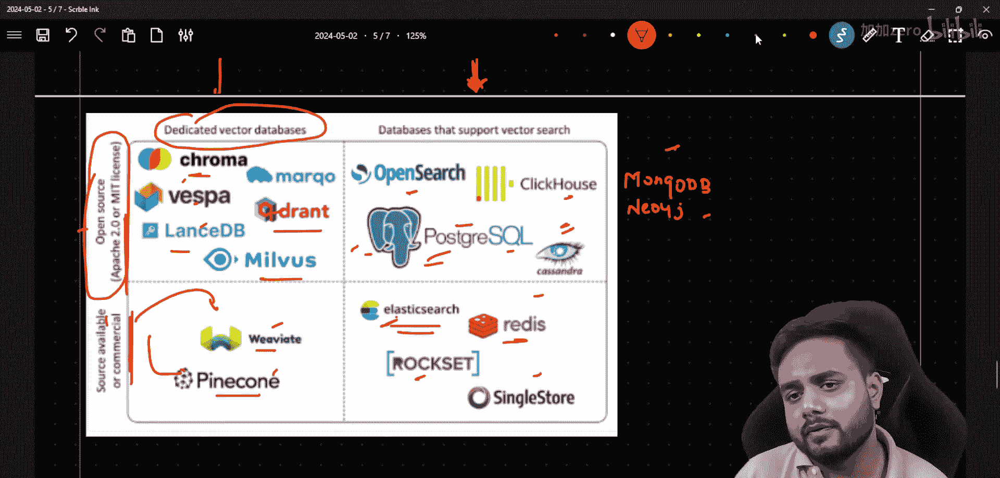
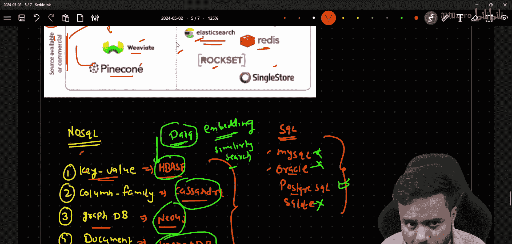
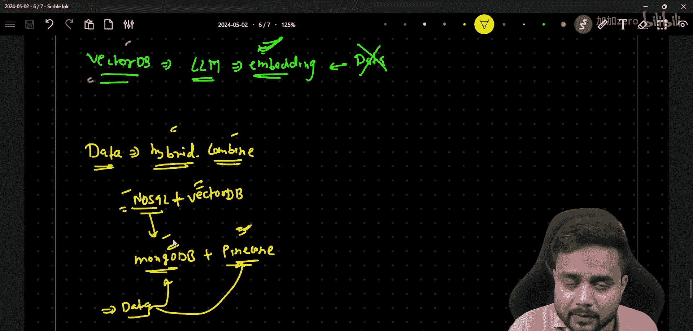

# 生成式AI：P30：使用Hugging Face、Google Gemma与MongoDB向量搜索构建端到端RAG应用 🚀

## 概述

在本节课中，我们将学习如何使用非关系型数据库（NoSQL）作为向量数据库，构建一个端到端的检索增强生成（RAG）应用。我们将重点介绍MongoDB的向量搜索功能，并将其与Google Gemma模型结合使用。

## 为什么选择NoSQL数据库作为向量存储？

上一节我们介绍了RAG应用的基本概念，本节中我们来看看为什么可以考虑使用NoSQL数据库进行向量存储。

在构建AI应用时，我们通常需要存储文本的向量化表示（即嵌入向量）以进行语义搜索。除了专用的向量数据库（如Pinecone、Chroma），许多NoSQL数据库也提供了向量搜索功能。

以下是当前可用的一些数据库类型：

*   **专用向量数据库**：Chroma、LanceDB、Qdrant、Pinecone、Weaviate。
*   **支持向量搜索的NoSQL数据库**：Cassandra、PostgreSQL（通过扩展）、OpenSearch、ClickHouse、MongoDB、Neo4j、Elasticsearch、Rockset、SingleStore。

专用向量数据库通常为存储和查询向量进行了高度优化。然而，NoSQL数据库的优势在于它们可以**同时存储原始数据及其对应的向量嵌入**。这意味着你可以在同一个数据库中管理结构化或半结构化数据，并直接在其上执行相似性搜索，无需在多个系统间同步数据。

## NoSQL数据库的主要类型

为了更好地理解MongoDB的定位，我们先简要了解NoSQL数据库的几种主要类型。

NoSQL数据库主要可分为四类：

1.  **键值存储**：例如Redis、HBase。数据以简单的键值对形式组织。
2.  **列族存储**：例如Cassandra、HBase。数据按列族存储，适合处理大量数据。
3.  **图形数据库**：例如Neo4j。专门用于存储和查询实体之间的关系。
4.  **文档数据库**：例如**MongoDB**。数据以类似JSON的文档形式存储，灵活性强。

SQL数据库（如MySQL、Oracle、PostgreSQL）则用于存储高度结构化的数据。而向量数据库是新兴的类别，专门为高效存储和检索高维向量而设计。

## 混合存储策略

在实际的工业级应用中，数据可能非常复杂。一种常见的**混合方法**是结合使用NoSQL数据库和专用向量数据库。

其核心思路是：
*   将原始数据（文档、元数据等）存储在NoSQL数据库（如MongoDB）中。
*   将对应的向量嵌入存储在专用的向量数据库（如Pinecone）中。
*   通过一个共同的标识符（如文档ID）将两者关联起来。

这种架构的潜在优势包括：
*   **专用化**：向量数据库可能提供更快的向量搜索速度。
*   **可扩展性**：向量数据库可能更容易水平扩展以处理海量嵌入。
*   **灵活性**：NoSQL数据库可以灵活地处理应用的其他数据需求。

在接下来的教程中，我们将首先学习如何将MongoDB用作向量存储。之后，我们也会探讨这种混合架构的实现。

## 总结

本节课我们一起学习了在RAG应用中使用NoSQL数据库进行向量存储的可行性。我们了解了NoSQL数据库的不同类型，特别是MongoDB作为文档数据库的角色，并探讨了结合NoSQL与专用向量数据库的混合存储策略。在接下来的实践中，我们将动手使用MongoDB的向量搜索功能来构建应用。