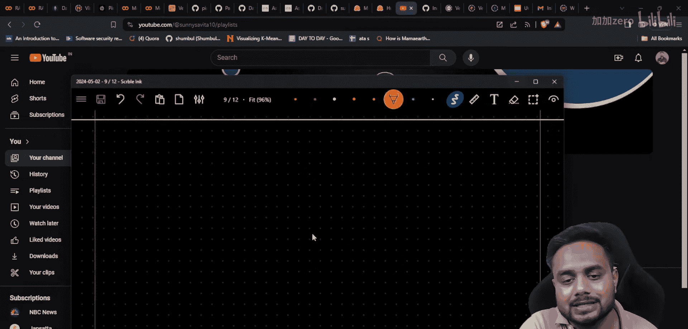
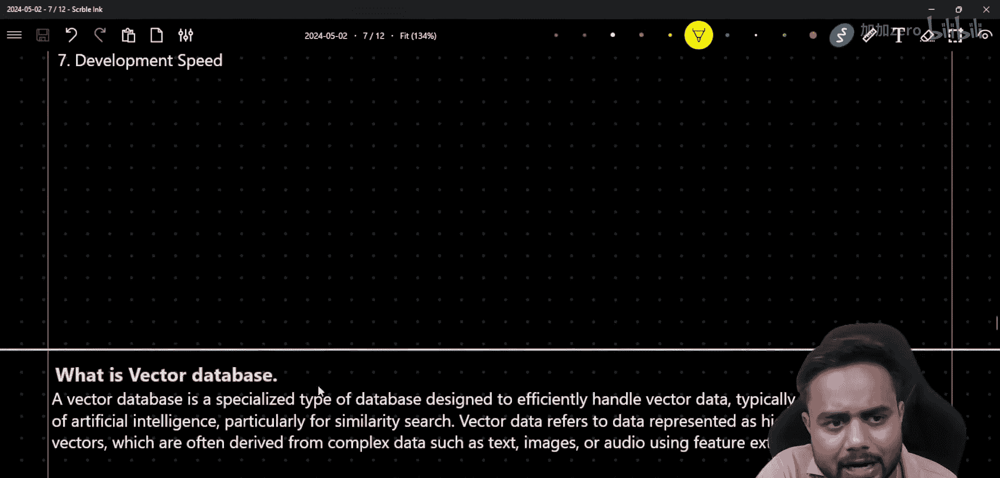
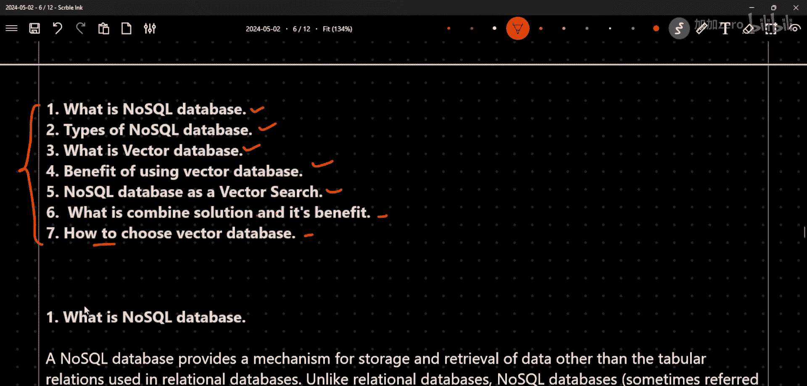
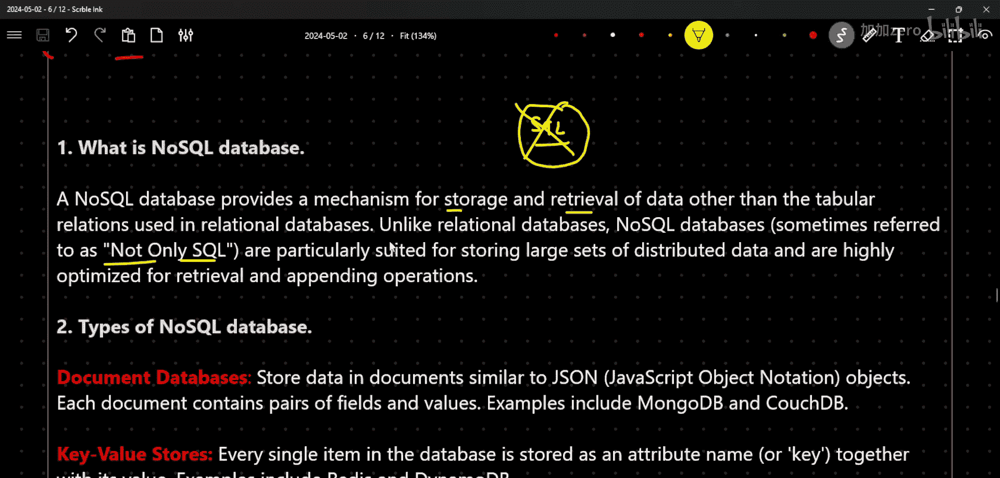

# 生成式AI实战教程：P31：使用MongoDB与Pinecone构建实时RAG管道（第一部分）🚀

## 概述

在本节课中，我们将学习如何结合使用NoSQL数据库（MongoDB）与向量数据库（Pinecone）来构建一个实时检索增强生成（RAG）管道。我们将从基础概念开始，逐步深入到实际解决方案的构建。

## 理论概念解析

上一节我们概述了课程目标，本节中我们来详细解析构建实时RAG管道所需的核心理论概念。

以下是本部分将涵盖的七个关键理论点：

1.  **什么是NoSQL数据库**
2.  **NoSQL数据库的类型**
3.  **什么是向量数据库**
4.  **使用向量数据库的优势**
5.  **将NoSQL数据库作为向量数据库的考量**
6.  **什么是组合解决方案及其优势**
7.  **如何选择向量数据库**

### 1. 什么是NoSQL数据库

NoSQL数据库是指“不仅仅是SQL”的数据库。它允许我们存储和检索数据，而无需使用SQL语言，也无需将数据强制存储在表格格式中。

### 2. NoSQL数据库的类型

上一节我们定义了NoSQL数据库，本节中我们来看看它的几种主要类型。

以下是NoSQL数据库的四种主要类型：

*   **文档型数据库**：数据以JSON格式的文档形式存储。例如：MongoDB， CouchDB。
*   **键值型数据库**：数据以简单的键值对形式存储。例如：Redis， DynamoDB。
*   **宽列存储/列族数据库**：数据按列族组织，访问基于列而非行。例如：Cassandra， Google BigTable。
*   **图数据库**：数据以节点和边的图结构存储，用于表示实体间的关系。例如：Neo4j， Amazon Neptune。

### 3. 什么是向量数据库

向量数据库是专门为存储和检索高维向量（即嵌入）而设计的数据库。这些向量通常由机器学习模型（如文本嵌入模型）生成。

### 4. 使用向量数据库的优势

向量数据库的核心优势在于其高效的相似性搜索能力，这对于RAG等基于语义检索的应用至关重要。

### 5. 将NoSQL数据库作为向量数据库的考量

一些NoSQL数据库（如MongoDB）现在也集成了向量搜索功能。这意味着你可以在同一个数据库中存储元数据和向量嵌入，简化了架构。

### 6. 什么是组合解决方案及其优势

在实时场景中，数据通常包含大量结构化、半结构化的元数据。仅使用向量数据库处理所有数据可能很困难。因此，常见的组合解决方案是：
*   **使用向量数据库**（如Pinecone）专门存储和检索**向量嵌入**。
*   **使用NoSQL数据库**（如MongoDB）存储和管理丰富的**元数据**。

这种组合利用了两种数据库各自的优势，构建出更强大、更灵活的RAG管道。

### 7. 如何选择向量数据库

选择向量数据库时，需要考虑因素包括：性能（查询速度、吞吐量）、可扩展性、易用性、成本以及是否支持所需的特定功能（如过滤、元数据存储）。

## 总结

本节课中我们一起学习了构建实时RAG管道所需的理论基础。我们明确了NoSQL数据库与向量数据库的区别与联系，并重点介绍了结合两者优势的“组合解决方案”架构。在接下来的实践部分，我们将具体使用MongoDB和Pinecone来实现这一架构。