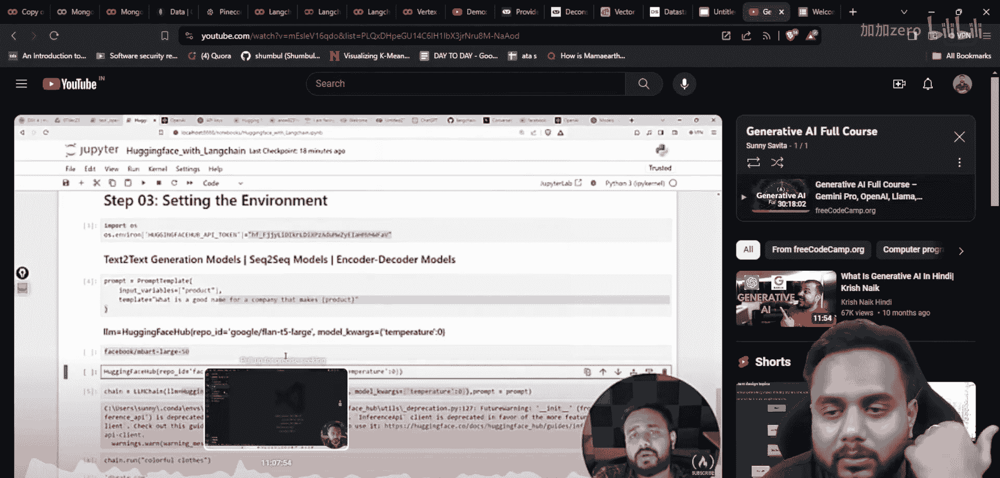
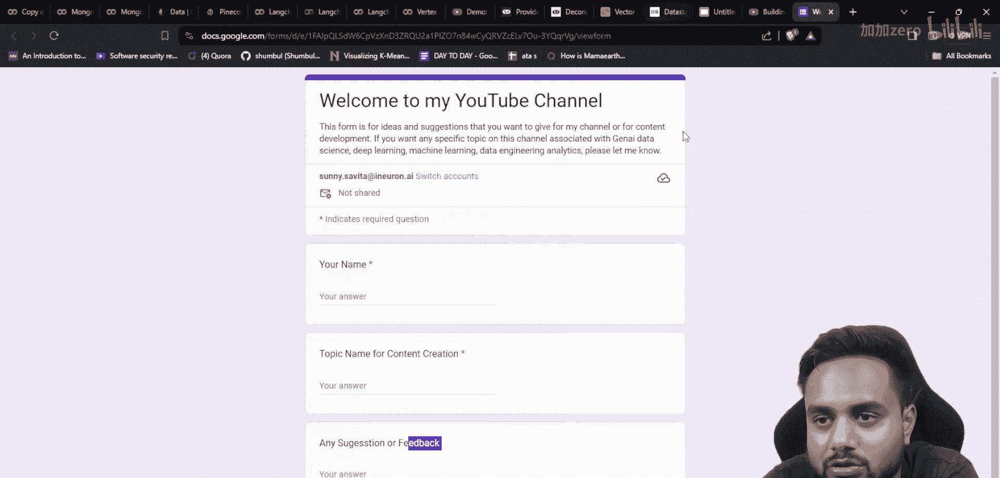
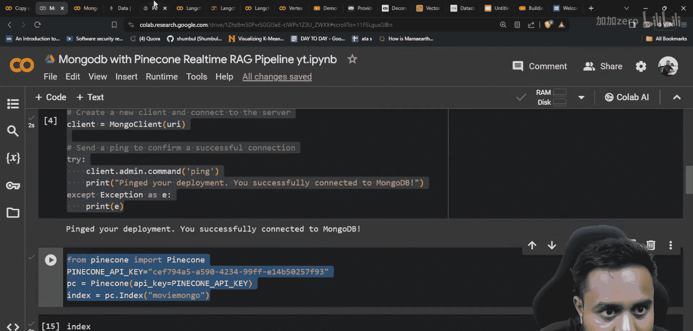
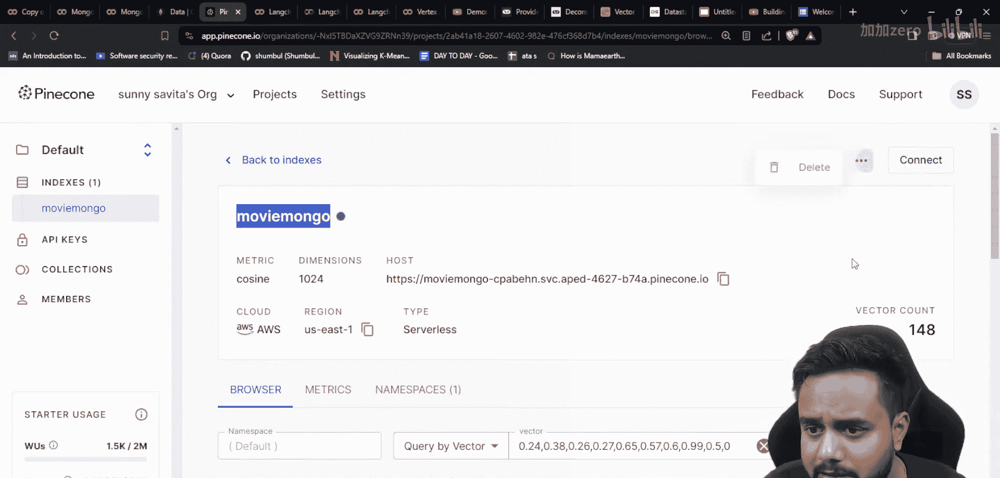
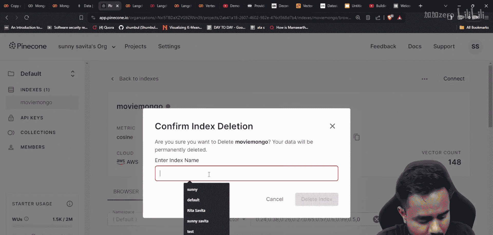
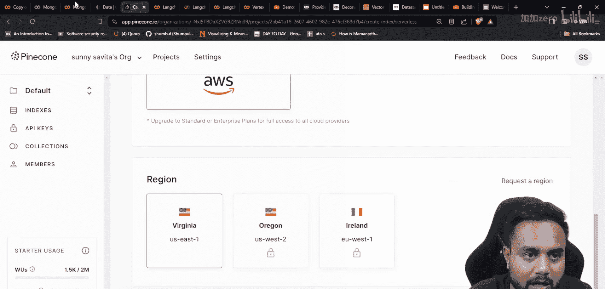
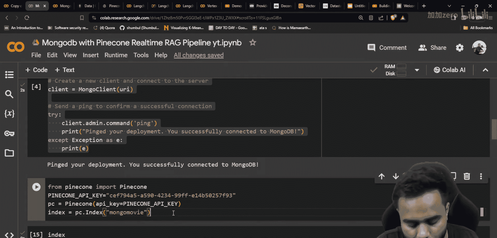
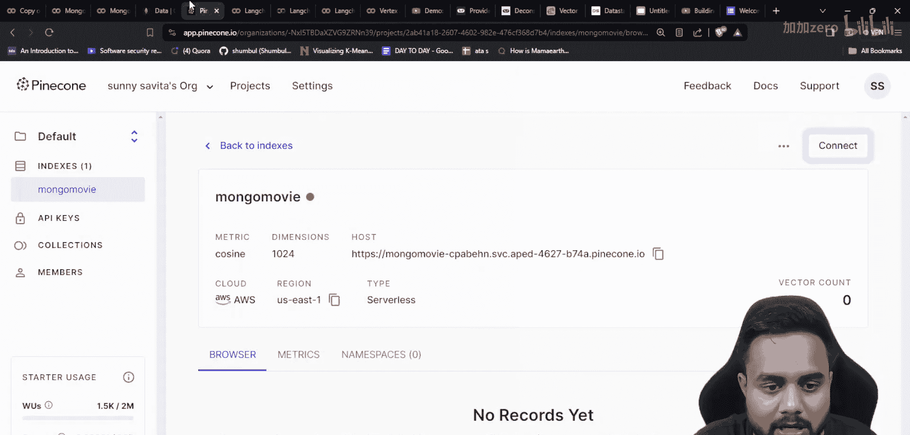
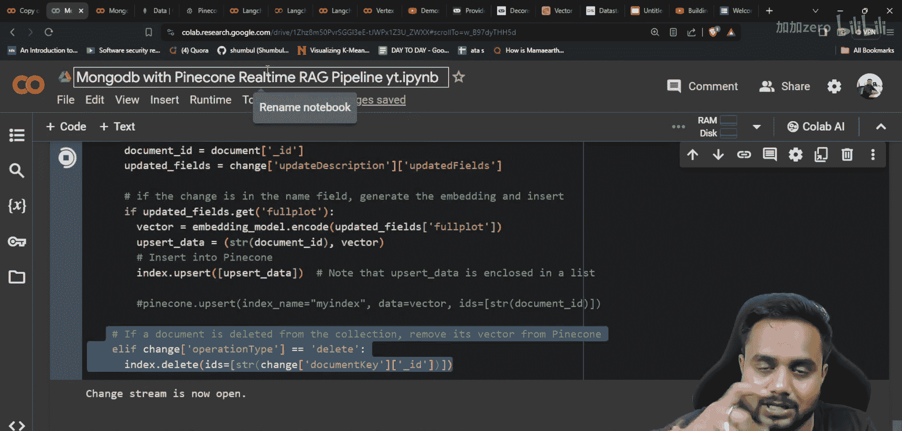
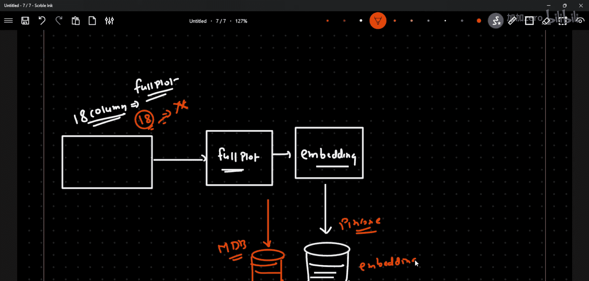

# 生成式AI：P32：使用MongoDB与Pinecone构建实时RAG管道（第二部分）🚀

## 概述


在本节课中，我们将学习如何构建一个结合MongoDB与Pinecone的实时检索增强生成（RAG）应用程序。上一节我们介绍了如何连接并同步这两个数据库。本节中，我们将重点讲解如何在此架构之上实现RAG的检索与生成部分。

## 架构回顾与数据流





上一节我们介绍了如何将数据存储在MongoDB中，并将特定列（如`full_plot`）的向量嵌入存储在Pinecone中。这形成了一个联合解决方案：MongoDB存储完整的结构化数据，而Pinecone存储对应的向量表示。



现在，我们来看看如何基于此架构创建RAG应用。以下是实现RAG检索的核心步骤。

## 实现RAG检索

以下是构建RAG检索流程的关键步骤。









1.  **接收用户查询**：系统首先接收用户的自然语言问题。
2.  **生成查询向量**：使用与存储时相同的嵌入模型，将用户查询转换为向量。
    ```python
    query_embedding = embedding_model.encode(user_query)
    ```
3.  **向量相似度搜索**：在Pinecone向量数据库中，搜索与查询向量最相似的K个向量。
    ```python
    results = pinecone_index.query(vector=query_embedding, top_k=k)
    ```
4.  **获取关联的原始数据**：Pinecone返回的每个结果都包含一个唯一的ID。这个ID对应MongoDB中存储该向量原始数据行的标识符。
5.  **从MongoDB检索上下文**：使用从Pinecone获取的ID列表，从MongoDB中查询出完整的、结构化的原始数据（例如电影的标题、年份、演员、完整剧情等）。
    ```python
    context_docs = mongo_collection.find({"_id": {"$in": list_of_ids_from_pinecone}})
    ```
6.  **构建提示词**：将从MongoDB检索到的相关文档（上下文）与用户的原始查询组合，构建成一个结构化的提示词，输入给大语言模型（LLM）。
    ```python
    prompt = f"基于以下信息：{context_docs}， 请回答：{user_query}"
    ```
7.  **生成最终答案**：将构建好的提示词发送给LLM（如GPT-4、Claude等），生成流畅、准确的最终答案。

## 核心优势与行业应用





这种架构结合了两种数据库的优势。MongoDB擅长高效存储和查询复杂的结构化数据。Pinecone则专为快速、大规模的向量相似性搜索而设计。



许多行业内的实际解决方案都采用了类似模式。这种“NoSQL数据库 + 向量数据库”的组合，能够有效支持需要结合精确字段查询和语义搜索的复杂RAG应用场景。

## 总结



本节课中我们一起学习了如何基于MongoDB和Pinecone构建一个端到端的实时RAG管道。我们回顾了数据同步的架构，并详细拆解了从接收用户查询、进行向量检索、关联原始上下文到最终生成答案的完整流程。掌握这种混合数据库的RAG实现模式，对于构建生产级的智能应用至关重要。