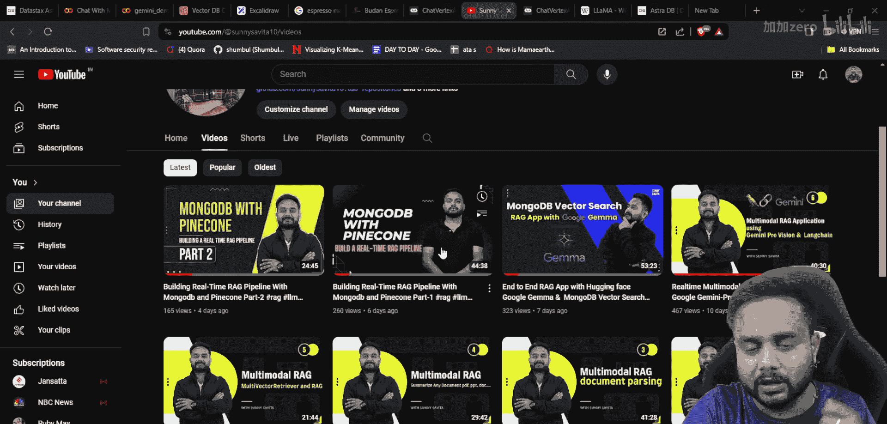
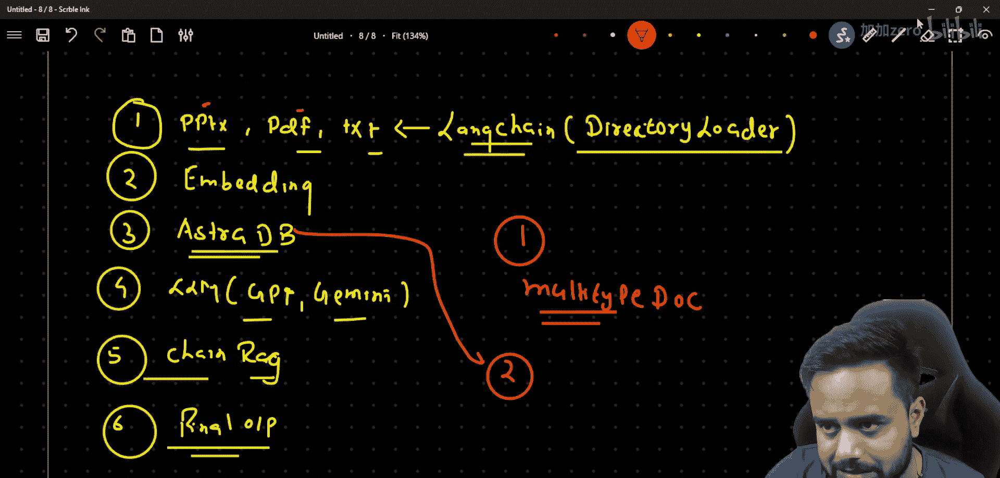
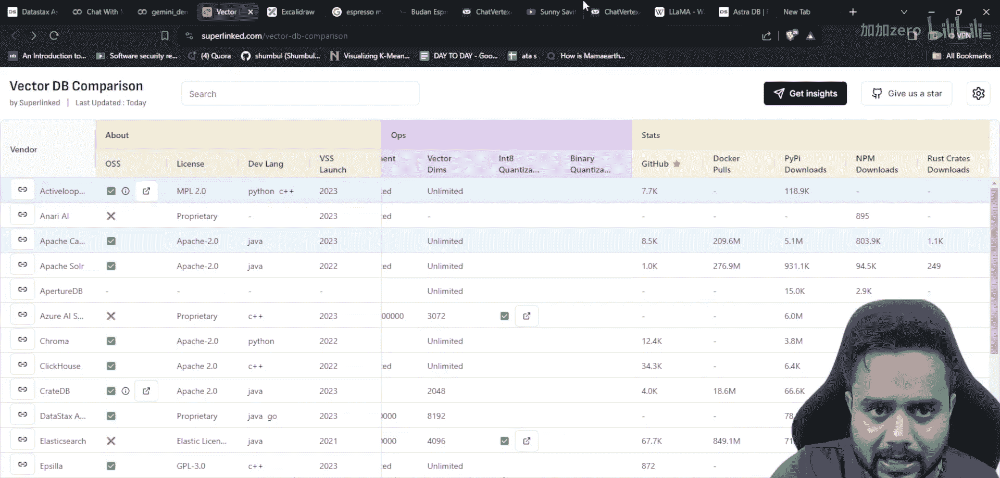
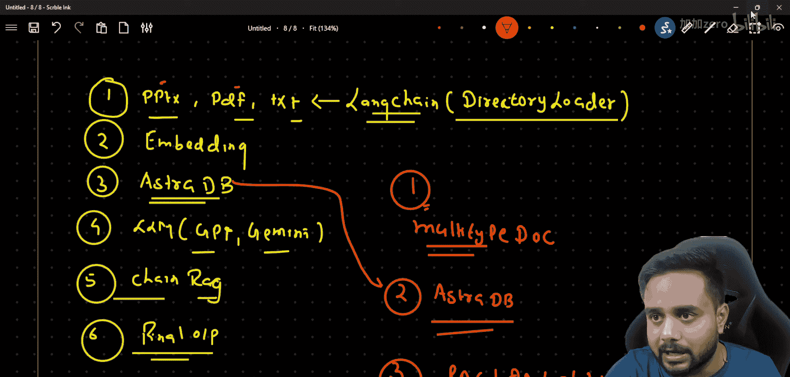

# 生成式AI：P33：使用AstraDB与LangChain实现多文档对话系统

在本节课中，我们将学习如何构建一个能与多种格式文档（如PPT、PDF、TXT等）进行对话的系统。我们将使用LangChain框架和AstraDB向量数据库来实现这一功能。

## 课程概述

上一节我们介绍了使用MongoDB作为向量数据库的方案。本节中，我们来看看如何利用基于Apache Cassandra构建的云原生数据库AstraDB来实现多文档对话系统。AstraDB不仅是一个列族数据库，还能作为高效的向量数据库使用。

## 核心组件与流程

以下是构建该系统的主要步骤：

1.  **加载多种格式文档**：我们将从本地目录加载三种类型的文档（PPT、PDF、TXT）。
2.  **分割文本为块**：将加载的文档内容分割成更小的文本块，以便后续处理。
3.  **生成向量嵌入**：为每个文本块创建向量表示。
4.  **存储向量至AstraDB**：将生成的向量及其关联的文本元数据存入AstraDB。
5.  **加载大语言模型**：我们将使用GPT或Gemini等模型作为对话引擎。
6.  **构建RAG链**：利用LangChain创建检索增强生成链，将用户查询、文档检索和答案生成串联起来。

## 详细步骤解析

### 第一步：加载文档

我们将使用LangChain的`DirectoryLoader`类来加载指定目录下的多种格式文档。这个类能自动识别和处理不同的文件类型。

以下是加载文档的核心代码示例：

```python
from langchain.document_loaders import DirectoryLoader



# 指定包含文档的目录路径
directory_path = "./your_documents_folder"

# 使用DirectoryLoader加载所有支持格式的文档
loader = DirectoryLoader(directory_path)
documents = loader.load()
```

### 第二步：分割文本

加载的完整文档需要被分割成更小的块，这有助于提高检索精度和效率。我们将使用文本分割器来完成这个任务。

以下是分割文本的代码：

```python
from langchain.text_splitter import RecursiveCharacterTextSplitter

text_splitter = RecursiveCharacterTextSplitter(
    chunk_size=1000,  # 每个文本块的大小
    chunk_overlap=200  # 块之间的重叠字符数，以保持上下文
)
text_chunks = text_splitter.split_documents(documents)
```

### 第三步：生成与存储向量

这是系统的核心。我们为每个文本块生成向量嵌入，并将其存储到AstraDB中。

以下是配置AstraDB并存储向量的关键步骤：

1.  **设置AstraDB连接**：需要数据库ID、区域和应用程序令牌。
2.  **选择嵌入模型**：例如使用OpenAI的`text-embedding-ada-002`模型。
3.  **创建向量存储**：使用LangChain的`Cassandra`模块连接到AstraDB。

```python
from langchain.vectorstores import Cassandra
from langchain.embeddings import OpenAIEmbeddings
import cassandra

# 初始化嵌入模型
embeddings = OpenAIEmbeddings(model="text-embedding-ada-002")

# 配置AstraDB连接参数
astra_db_config = {
    "database_id": "your_database_id",
    "region": "your_region",
    "application_token": "your_app_token"
}

# 创建向量存储并添加文档
vectorstore = Cassandra.from_documents(
    documents=text_chunks,
    embedding=embeddings,
    **astra_db_config
)
```



### 第四步：构建问答链

最后，我们创建一个结合了检索器和LLM的链，用于处理用户查询。

以下是创建问答链的代码：

```python
from langchain.chains import RetrievalQA
from langchain.llms import OpenAI

# 初始化LLM
llm = OpenAI(temperature=0)  # 也可以替换为ChatOpenAI或GoogleGenerativeAI

# 将向量存储转换为检索器
retriever = vectorstore.as_retriever(search_kwargs={"k": 4}) # 检索最相关的4个块

# 创建检索增强生成链
qa_chain = RetrievalQA.from_chain_type(
    llm=llm,
    chain_type="stuff",
    retriever=retriever,
    return_source_documents=True  # 可选：返回源文档用于参考
)



# 使用链进行提问
question = "你的问题是什么？"
result = qa_chain({"query": question})
print(result["result"])
```

## 扩展应用

基于本系统，您可以进一步构建更复杂的应用：

*   **多模态对话系统**：扩展系统以处理图像，生成图像嵌入并存储。
*   **电商聊天机器人**：爬取电商网站数据，构建一个专业领域的问答机器人。
*   **对话历史管理**：在RAG管道中加入历史对话管理功能，实现连贯的多轮对话。



## 总结

本节课中我们一起学习了如何使用AstraDB和LangChain构建一个多文档对话系统。我们涵盖了从加载不同格式文档、分割文本、生成向量嵌入、利用AstraDB进行向量存储，到最终集成大语言模型形成完整问答链的整个流程。这套方案为您处理异构文档数据并构建智能对话应用提供了坚实的基础。