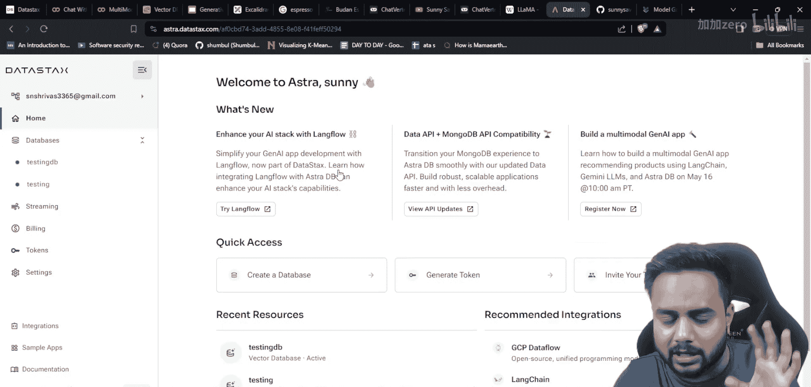
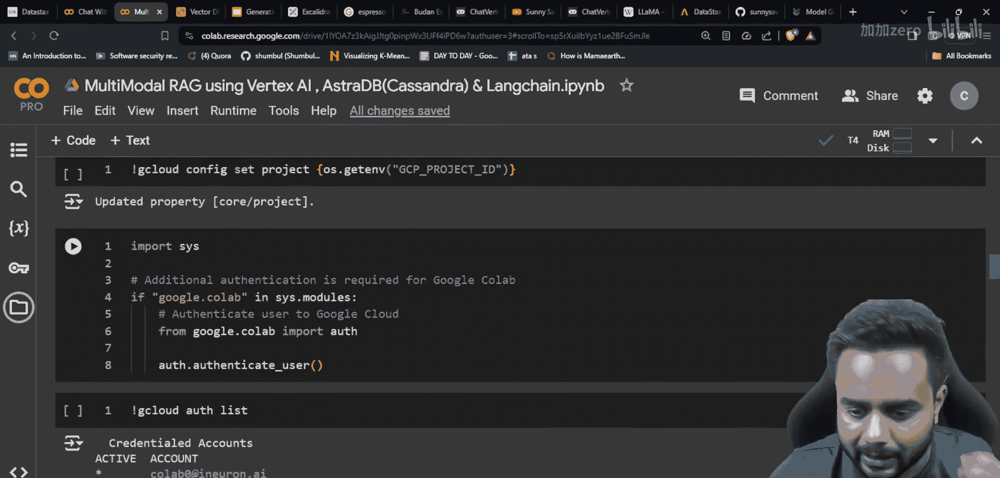
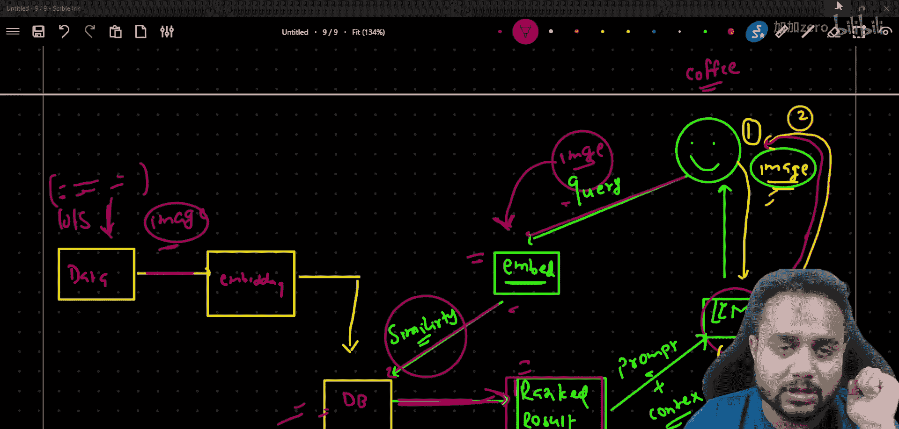

# 生成式AI：从初学者到专家：P34：使用Vertex AI、AstraDb和Langchain构建强大的多模态RAG系统 🚀

在本节课中，我们将学习如何构建一个多模态检索增强生成系统。我们将结合使用Google Cloud的Vertex AI平台、AstraDb向量数据库以及Langchain框架，来实现一个能够同时处理图像和文本的智能应用。

## 概述

我们将创建一个系统，它不仅能理解文本查询，还能处理图像输入，并从预先存储的知识库中检索相关信息来生成更丰富、更准确的回答。

## 项目流程介绍

上一节我们概述了多模态RAG的概念，本节中我们来看看这个项目的完整工作流程。

在标准的RAG系统中，我们处理数据、生成嵌入、存储到向量数据库，然后根据用户查询进行检索和生成。对于多模态RAG，流程类似，但处理的对象扩展到了图像。

以下是本项目的核心流程步骤：

1.  **数据准备与嵌入**：收集与目标领域相关的图像和文本数据，使用多模态嵌入模型将它们转换为向量表示。
2.  **向量存储**：将生成的向量嵌入存储到AstraDb向量数据库中。
3.  **查询处理**：当用户提交一个图像查询时，系统使用相同的多模态嵌入模型将该图像转换为查询向量。
4.  **相似性检索**：在AstraDb中执行相似性搜索，找到与查询图像最相关的存储内容（可以是图像或文本）。
5.  **上下文增强与生成**：将检索到的相关结果作为上下文，与原始查询（图像）和设计好的提示词一起，发送给大型语言模型，最终生成增强后的回答。

## 技术栈与平台配置

了解了流程后，我们需要配置实现它所需的技术平台。

### 1. Google Cloud Vertex AI

Vertex AI是Google Cloud提供的统一机器学习平台。它类似于AWS的Sagemaker和Azure的Azure OpenAI服务。我们将通过它来访问Gemini多模态模型和嵌入模型。

*   **访问方式**：使用Google账号登录Google Cloud Console。
*   **免费额度**：新用户通常可获得300美元的免费赠金，用于体验各项服务。
*   **关键功能**：在Vertex AI中，我们可以访问“Model Garden”，这里提供了包括Gemini系列在内的多种模型，特别是支持**多模态嵌入**的模型，它能将图像转换为向量。

### 2. Astra DB

Astra DB是DataStax公司提供的云原生Cassandra数据库服务。它非常适合作为向量数据库使用，能够高效存储和检索文本及图像的向量嵌入。

*   **特点**：支持存储**文本嵌入**和**图像嵌入**。
*   **用途**：在本项目中，它将作为我们存储所有预处理数据嵌入的知识库。

### 3. 开发环境：Google Colab

为了利用免费的GPU资源来加速模型推理和嵌入计算，我们选择在Google Colab笔记本中编写和运行代码。你也可以使用本地Jupyter笔记本或Vertex AI的笔记本服务。

## 核心概念与代码示例

现在，让我们用公式和代码来描述上述流程中的关键环节。

**1. 多模态嵌入**
嵌入过程将数据（如图像或文本）映射到高维向量空间中的点。相似的数据在向量空间中距离更近。
`embedding_vector = multimodal_embedding_model.encode(data)`

**2. 相似性搜索**
当输入查询时，系统计算查询向量与数据库中所有存储向量之间的相似度（例如，使用余弦相似度），并返回最相似的项。
`similarity_score = cosine_similarity(query_embedding, stored_embedding)`

**3. 检索增强生成**
最终的答案不是仅由LLM根据查询生成，而是结合了检索到的上下文信息。
`final_answer = llm.generate(prompt=user_query + context_from_retrieval)`

## 实战案例：咖啡机维修助手

为了使理解更直观，我们以一个具体的例子来说明系统如何工作。

假设我们想构建一个咖啡机维修与配件查询助手。

**传统方式（无RAG）**：用户上传一张咖啡机图片，直接询问“如何更换这个开关？”。LLM仅能根据其训练数据中的通用知识生成回答，可能无法针对该特定型号给出准确步骤或配件信息。

**多模态RAG方式**：
1.  **知识库构建**：我们预先收集了各种咖啡机的说明书、爆炸图、零件图片和文本描述，将它们通过多模态嵌入模型处理，并存入AstraDB。
2.  **用户查询**：用户上传同一张咖啡机图片并提问。
3.  **系统工作**：
    *   系统首先用相同的嵌入模型将用户上传的图片转换为向量。
    *   在AstraDB中搜索与该图片向量最相似的存储内容（例如，找到了同型号咖啡机的爆炸图零件列表）。
    *   将检索到的零件列表、维修手册片段等作为“上下文”。
    *   LLM综合用户图片、问题以及检索到的具体上下文，生成一个精准的回答，例如：“根据您的型号‘X-Coffee2000’的爆炸图，您所指的开关零件编号是`SW-204`。更换步骤为：1. 断开电源... 您可以在[链接]购买替代零件。”

通过这种方式，LLM的回答得到了具体、可靠的外部知识增强，大大提升了准确性和实用性。

## 总结

本节课我们一起学习了构建多模态RAG系统的完整思路。我们从项目总览开始，逐步剖析了其工作流程，介绍了核心的Vertex AI、AstraDB和Langchain技术栈，并通过一个咖啡机助手的案例，生动展示了系统如何利用图像检索增强文本生成。关键在于，我们不仅处理文本，还利用多模态嵌入模型处理图像，并在向量数据库中进行跨模态的相似性检索，从而为LLM提供更丰富的上下文信息，生成更精准的答案。