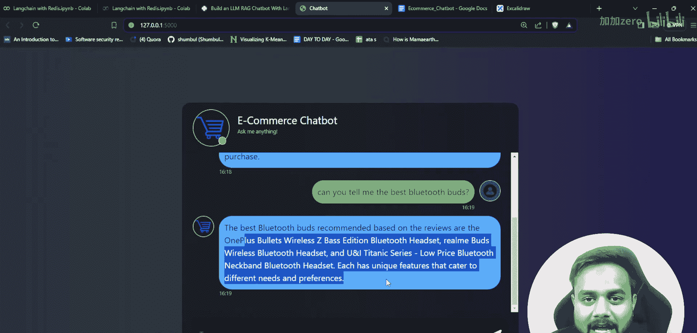
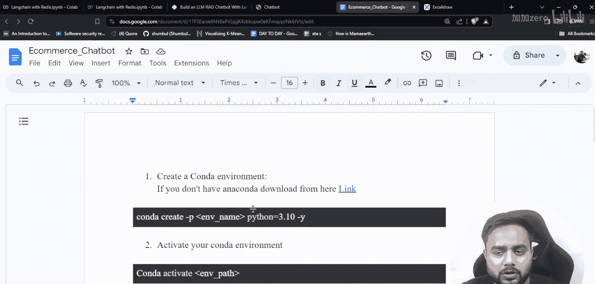
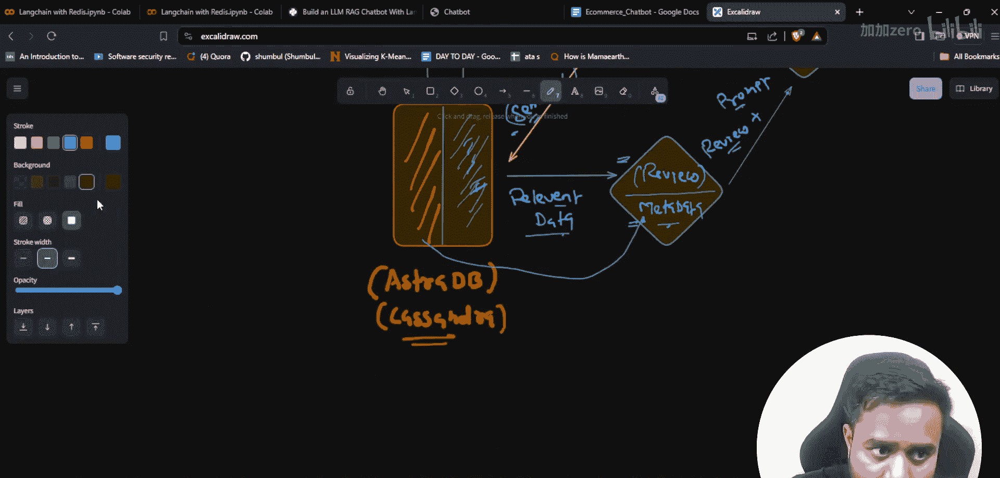

# 生成式AI项目实战：P35：基于AWS部署的端到端电商聊天机器人

## 概述

在本节课中，我们将学习如何从零开始构建一个定制化的电商聊天机器人，并将其部署到AWS云平台。我们将使用Astra DB（基于Cassandra）作为向量数据库，结合大语言模型来处理用户关于电子产品的查询。通过这个项目，你将掌握构建和部署一个功能完整的生成式AI应用的全流程。

## 项目架构解析

上一节我们介绍了项目的整体目标，本节中我们来看看实现这个聊天机器人的核心架构。

整个系统的工作流程可以分为数据准备、存储和查询生成三个阶段。

以下是架构的核心步骤：

1.  **数据源**：我们从电商网站（如Flipkart或Amazon）抓取产品数据。数据以表格形式存储，包含产品ID、产品标题、评分、摘要和详细评论。
2.  **数据处理**：将原始数据分为两部分：
    *   **评论**：产品的详细文字评价。
    *   **元数据**：产品ID、标题、评分、摘要等结构化信息。
3.  **向量化与存储**：
    *   使用嵌入模型（如OpenAI或`gpt4all`的嵌入模型）将文本评论转换为向量（嵌入）。
    *   将这些向量嵌入与对应的产品元数据一同存储到Astra DB（Cassandra）向量数据库中。
4.  **查询与响应**：
    *   用户提出问题（查询）。
    *   系统将用户查询同样转换为向量嵌入。
    *   在向量数据库中进行语义相似性搜索，找到与查询最相关的产品评论。
    *   根据找到的相关评论，获取其关联的产品元数据。
    *   将“相关评论”作为上下文，“用户查询”和“系统指令”作为提示，一同提交给大语言模型。
    *   大语言模型综合所有信息，生成最终的回答并返回给用户。





## 技术栈

了解了架构之后，我们需要选择合适的工具来实现它。以下是构建本项目所需的技术组件：

*   **编程语言**：Python
*   **开发环境**：VS Code
*   **数据存储**：Astra DB (作为向量数据库，底层为Cassandra NoSQL数据库)
*   **嵌入模型**：OpenAI Embeddings 或 `gpt4all` 等开源模型
*   **大语言模型**：用于生成最终答案的模型（如GPT系列或类似开源模型）
*   **部署平台**：AWS (亚马逊云科技)
*   **网页框架**：用于构建用户界面的框架（如Streamlit或Gradio）
*   **数据抓取**：BeautifulSoup4 或 Selenium（用于初始数据收集）

## 数据准备

任何AI项目都始于数据。我们的聊天机器人需要基于真实的产品信息来回答问题。

我们拥有一个从电商网站抓取的数据集，它存储在一个Excel文件中。这个数据集包含了多个电子产品的信息。

以下是数据文件中的主要列：

*   `product_id`：产品的唯一标识符。
*   `product_title`：产品的名称，例如“Boat Rockerz”、“Realme Buds”等。
*   `rating`：产品的用户评分。
*   `summary`：对产品的简要总结。
*   `review`：用户撰写的详细文字评论。

这些数据中，`review`字段将用于创建语义搜索所需的向量嵌入，而`product_id`、`title`、`rating`和`summary`等将作为**元数据**，在生成答案时提供补充信息。

## 核心实现步骤

有了清晰的数据和技术栈，我们可以开始动手实现了。以下是开发此聊天机器人的关键步骤。

1.  **环境搭建**：在VS Code中创建Python虚拟环境，并安装所有必要的依赖库。
2.  **数据加载与分割**：读取Excel数据，将`review`列和其余列（元数据）分开处理。
3.  **向量数据库初始化**：连接Astra DB，创建用于存储向量和元数据的表。
4.  **生成与存储嵌入**：
    *   使用嵌入模型处理每一条产品评论。
    *   将生成的向量和对应的元数据作为一个记录，存入Astra DB。
    *   代码示例（概念）：
        ```python
        # 伪代码示例
        embedding_vector = embedding_model.encode(product_review)
        astra_db.insert({
            “id”: product_id,
            “embedding”: embedding_vector,
            “metadata”: {
                “title”: product_title,
                “rating”: rating,
                “summary”: summary
            }
        })
        ```
5.  **构建查询流程**：
    *   接收用户输入的问题。
    *   将问题转换为向量。
    *   在Astra DB中执行相似性搜索，找到最匹配的K条评论。
    *   检索这些评论对应的元数据。
6.  **集成大语言模型**：
    *   设计一个提示模板，将“相关评论”（上下文）、“用户问题”和“回答指令”组合起来。
    *   将组合后的提示发送给大语言模型。
    *   接收并返回模型生成的答案。
7.  **构建用户界面**：使用Streamlit等库创建一个简单的Web界面，让用户可以输入问题并查看回答。
8.  **部署到AWS**：将完整的应用程序（包括前端、后端逻辑和数据库连接）打包，并部署到AWS的EC2实例、Lambda函数或容器服务上。

## 部署指南

开发完成后，我们需要让应用在云端运行。部署是项目上线的最后一步。

我们将把聊天机器人应用部署到AWS平台。这通常涉及以下步骤：

*   将代码上传至AWS代码仓库或服务器。
*   配置安全组和网络访问权限。
*   设置环境变量（如数据库连接字符串、API密钥）。
*   启动应用服务并确保其持续运行。

具体的命令和配置细节，请参考项目附带的详细部署文档。

## 总结



本节课中我们一起学习了构建和部署一个端到端电商聊天机器人的完整过程。我们从项目架构分析开始，明确了数据流和处理逻辑。接着，我们准备了包含产品评论和元数据的数据集，并选择了Astra DB作为向量存储解决方案。然后，我们分步实现了数据嵌入存储、语义搜索查询以及与大语言模型集成的核心功能。最后，我们探讨了将整个应用部署到AWS云平台的基本思路。通过这个实战项目，你将能够掌握如何将生成式AI技术应用于具体的业务场景，并完成从开发到上线的全链路实践。