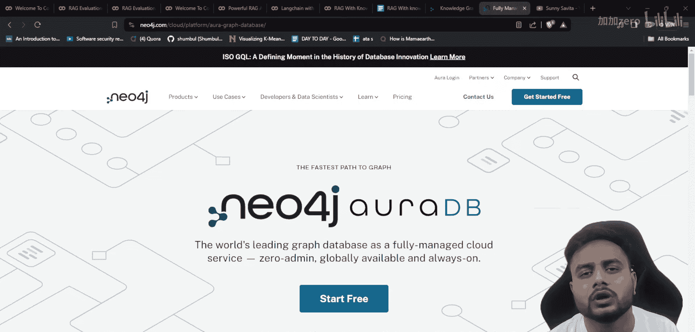
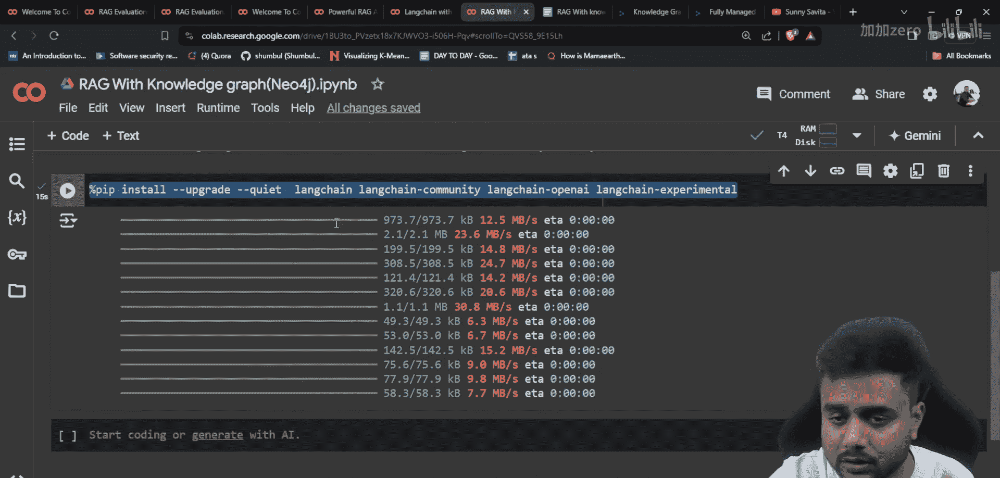
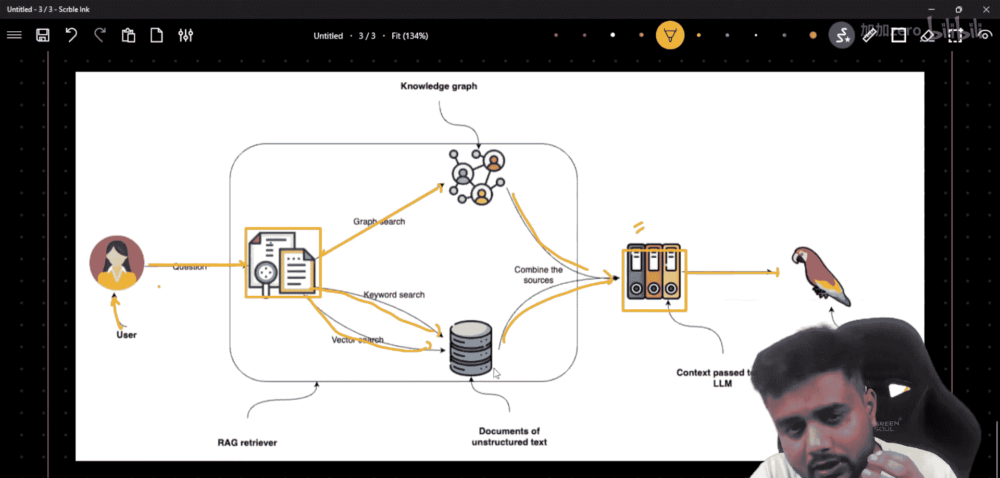
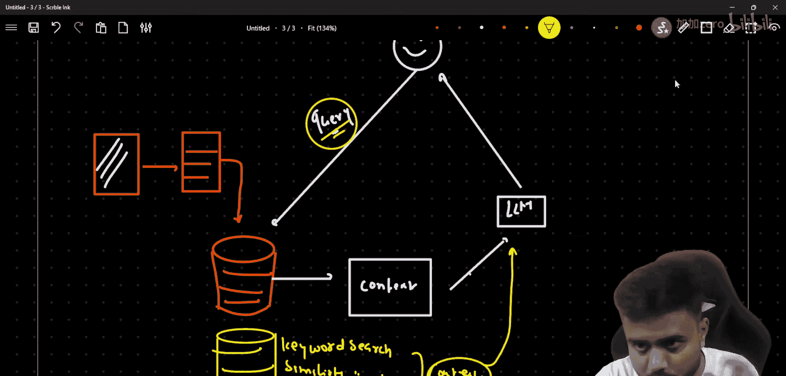
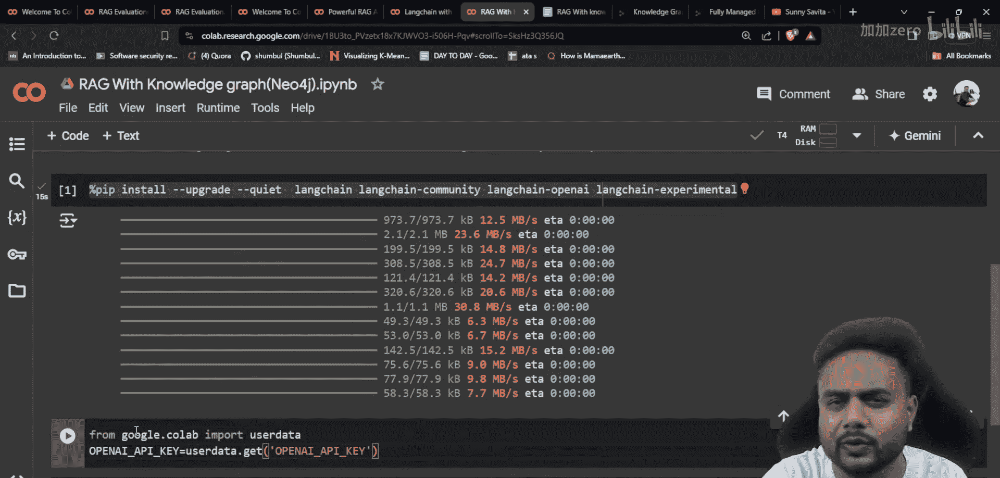

# 生成式AI：P36：使用Neo4j（知识图谱数据库）和Langchain构建实时强大的RAG管道 🚀

## 概述
在本节课中，我们将学习如何构建一个强大的检索增强生成（RAG）应用。我们将使用Neo4j知识图谱数据库来存储和检索信息，并结合Langchain框架来实现一个包含关键词搜索、向量搜索和图搜索的混合检索系统。这个系统能够提供比传统RAG更准确、更丰富的上下文信息。

---

## 架构设计 🏗️

上一节我们介绍了本课程的目标，本节中我们来看看我们将要实现的RAG系统架构。

整个流程从用户提问开始。我们的系统将从单一数据库中，通过三种不同的方式并行执行检索操作：
1.  **关键词搜索**
2.  **向量相似性搜索**
3.  **知识图谱搜索**

检索到的所有信息将被合并成一个统一的上下文文档。最后，这个包含多重信息的上下文会与用户的原始问题一起，被送入大型语言模型（LLM）以生成最终的回答。

为了更清晰地理解，让我们回顾一下经典的RAG架构。在标准RAG中，我们通常将数据转换为向量（嵌入），并存储在向量数据库中。当用户提问时，系统会计算问题的嵌入向量，并在数据库中进行相似性搜索，找到最相关的上下文片段。这个上下文随后被传递给LLM来生成答案。

**公式表示标准RAG流程：**
`答案 = LLM(问题 + 相似性搜索(问题嵌入, 数据库嵌入))`

而在我们即将构建的增强版RAG中，检索过程更加丰富：

**公式表示增强RAG流程：**
`答案 = LLM(问题 + 合并[关键词搜索(问题), 向量搜索(问题嵌入), 图搜索(问题)])`

通过结合知识图谱（Neo4j），我们不仅能找到文本上相似的片段，还能利用数据中实体（如人物、地点、概念）之间的关系进行推理和检索，这大大提升了所获上下文的深度和准确性，从而使LLM生成的回答更可靠。




---

## 环境设置与库安装 ⚙️

理解了架构之后，我们需要准备编程环境。我们将在Google Colab中完成所有操作，因为它提供了便捷的笔记本环境和可用的GPU资源。

以下是实现本项目需要安装的核心Python库：

```
!pip install -qU langchain langchain-community langchain-experimental openai
```

安装命令说明：
*   `-qU`：`-q` 表示安静安装，不显示详细输出；`-U` 表示升级到最新版本。
*   `langchain`：LangChain的核心库，包含主要的链、代理和算法。
*   `langchain-community`：包含第三方集成和社区贡献的模块。
*   `langchain-experimental`：包含实验性的、可能还不稳定的新功能。
*   `openai`：用于调用OpenAI的API。

**关于LangChain不同包的说明**：LangChain项目将功能模块化到不同的包中。`langchain` 是核心且稳定的部分；`langchain-community` 集成了大量外部工具和服务；`langchain-experimental` 则包含前沿但可能变动的功能。这种结构有助于保持项目的组织性和稳定性。


---

## 数据准备与Neo4j连接 📊

环境配置好后，我们需要获取数据并建立与数据库的连接。我们将从维基百科获取示例数据，并配置访问Neo4j AuraDB（Neo4j的云服务）所需的参数。

首先，导入必要的模块并设置从维基百科获取数据的函数。

```python
# 导入所需库
from langchain_community.document_loaders import WikipediaLoader
from langchain.text_splitter import RecursiveCharacterTextSplitter
import os

# 从维基百科加载关于“Leonardo da Vinci”的文档
topic = “Leonardo da Vinci”
docs = WikipediaLoader(query=topic, load_max_docs=2).load()

# 将长文档切分成适合处理的块
text_splitter = RecursiveCharacterTextSplitter(chunk_size=1000, chunk_overlap=200)
chunks = text_splitter.split_documents(docs)
print(f”将文档切分成了 {len(chunks)} 个块。”)
```

接下来，设置连接Neo4j AuraDB所需的环境变量。你需要提前在Neo4j Aura官网创建免费的云数据库实例，以获取以下连接信息。

```python
# 设置Neo4j AuraDB连接参数（请替换为你的实际信息）
os.environ[“NEO4J_URI”] = “bolt://your-aura-db-instance.databases.neo4j.io:7687”
os.environ[“NEO4J_USERNAME”] = “neo4j”
os.environ[“NEO4J_PASSWORD”] = “your_secure_password_here”
os.environ[“OPENAI_API_KEY”] = “your_openai_api_key_here”
```

参数说明：
*   `NEO4J_URI`：你的Neo4j数据库连接地址。
*   `NEO4J_USERNAME`：数据库用户名，默认为`neo4j`。
*   `NEO4J_PASSWORD`：创建实例时设置的密码。
*   `OPENAI_API_KEY`：用于生成嵌入向量和调用LLM的OpenAI API密钥。

---

## 构建与填充知识图谱 🗺️

现在，我们将把准备好的文本数据存储到Neo4j中。这不仅仅是存储文本块，还包括提取文本中的实体（如人物、组织）和关系，并将其构建成一张知识图谱。

以下是使用LangChain组件创建图谱并存储数据的步骤：

1.  **提取实体与关系**：使用LLM从文本中识别出实体以及它们之间的关系。
2.  **构建图谱结构**：将提取出的实体作为节点，关系作为边，构建成图。
3.  **存储文本与向量**：同时将原始文本块及其向量嵌入存储到数据库中，以便进行向量搜索。

```python
from langchain_community.graphs import Neo4jGraph
from langchain_experimental.graph_transformers import LLMGraphTransformer
from langchain_openai import ChatOpenAI

# 1. 连接到Neo4j数据库
graph = Neo4jGraph()

# 2. 初始化LLM和图转换器，用于从文本提取图谱结构
llm = ChatOpenAI(temperature=0, model=“gpt-3.5-turbo”)
transformer = LLMGraphTransformer(llm=llm)



# 3. 将文档块转换为图文档（包含实体和关系）
graph_documents = transformer.convert_to_graph_documents(chunks)

# 4. 将图数据（节点和关系）添加到Neo4j数据库中
graph.add_graph_documents(
    graph_documents,
    baseEntityLabel=True, # 为所有实体节点添加一个基础标签
    include_source=True   # 在节点属性中保留源文档信息
)

print(f”已将知识图谱数据写入Neo4j。”)
```

这段代码执行后，你的Neo4j数据库中不仅包含了原始的文本数据，还形成了一张反映数据中实体关系的网络，为后续的“图搜索”奠定了基础。

---

## 实现混合检索器 🔍

这是本项目的核心环节。我们将创建一个自定义检索器，它能够同时执行之前提到的三种搜索方式，并将结果融合。

以下是构建混合检索器的关键组件：

1.  **向量存储检索器**：利用存储在Neo4j中的文本嵌入进行相似性搜索。
2.  **关键词检索器**：在文本中进行传统的BM25或TF-IDF风格的关键词匹配。
3.  **图谱检索器**：利用已构建的知识图谱，通过Cypher查询语言查找与问题相关的实体和关系路径。
4.  **融合算法**：使用`Reciprocal Rank Fusion (RRF)`等算法将三个独立检索器返回的结果列表进行智能合并和重排序。

```python
from langchain.retrievers import EnsembleRetriever
from langchain_community.retrievers import Neo4jVectorRetriever
# 注意：Neo4jVectorRetriever 同时支持向量和关键词搜索
# 我们还需要一个专门的图谱检索器（此处需根据LangChain最新文档实现）

# 假设我们已经初始化了以下检索器：
# vector_retriever: 用于向量搜索
# keyword_retriever: 用于关键词搜索
# graph_retriever: 用于图谱搜索

# 使用集成检索器合并它们
ensemble_retriever = EnsembleRetriever(
    retrievers=[vector_retriever, keyword_retriever, graph_retriever],
    weights=[0.4, 0.3, 0.3], # 可以为不同检索器设置权重
    c=60, # RRF算法中的常数，用于调整排名融合
    search_type=“mmr” # 可选：最大边际相关性，用于结果去重
)
```



这个`ensemble_retriever`在收到查询时，会内部调用三个子检索器，然后使用RRF算法对它们返回的所有文档进行重新打分和排序，最终返回一个统一的、质量更高的文档列表。

**RRF分数简化公式：**
`RRF分数(doc) = Σ (1 / (k + rank_i(doc)))`
其中，`rank_i(doc)`是文档在第`i`个检索器结果中的排名，`k`是一个常数（如`c`参数）。

---

## 创建RAG链并生成回答 ⛓️

最后一步，我们将强大的混合检索器与语言模型组合成一个完整的RAG链。当用户提出问题时，这个链会自动触发检索、上下文整合和答案生成的全过程。

以下是创建问答链的代码：

```python
from langchain.chains import RetrievalQA
from langchain_openai import OpenAI
from langchain.prompts import PromptTemplate

# 1. 定义提示模板，指导LLM如何利用上下文回答问题
prompt_template = “””基于以下上下文信息，回答用户的问题。如果你不知道答案，就说你不知道，不要编造答案。

上下文：
{context}

问题：{question}
有帮助的答案：”””

PROMPT = PromptTemplate(
    template=prompt_template, input_variables=[“context”, “question”]
)

# 2. 初始化LLM
llm = OpenAI(temperature=0) # temperature=0使输出更确定

# 3. 创建RetrievalQA链，将检索器、LLM和提示模板连接起来
qa_chain = RetrievalQA.from_chain_type(
    llm=llm,
    chain_type=“stuff”, # “stuff”将所有检索到的上下文放入提示中
    retriever=ensemble_retriever, # 使用我们构建的混合检索器
    chain_type_kwargs={“prompt”: PROMPT},
    return_source_documents=True # 返回用于生成答案的源文档
)

# 4. 进行提问
question = “达芬奇最著名的画作是什么？它创作于何时？”
result = qa_chain({“query”: question})
print(“问题：”, question)
print(“答案：”, result[“result”])
print(“\n参考来源：”)
for doc in result[“source_documents”][:3]: # 显示前3个源文档
    print(f”- {doc.metadata[‘source’]}: {doc.page_content[:200]}…”)
```

这个链的工作流程是：接收用户问题 -> 混合检索器从Neo4j中检索相关上下文 -> 将上下文和问题填入提示模板 -> LLM根据模板生成最终答案。

---

## 总结 🎯

本节课中我们一起学习了如何构建一个集成知识图谱的增强型RAG管道。

我们首先了解了结合关键词搜索、向量搜索和图搜索的混合检索架构的优势。接着，我们逐步实现了这个系统：从设置环境、安装库，到从维基百科加载并处理数据；然后，我们连接Neo4j云数据库，并将数据转化为知识图谱进行存储；之后，我们构建了核心的混合检索器，能够并行执行三种搜索并融合结果；最后，我们创建了一个RAG问答链，将强大的检索能力与大型语言模型相结合，能够生成基于丰富、准确上下文的答案。





这种利用Neo4j等图数据库的RAG系统，通过挖掘数据中深层的语义关系，显著提升了传统RAG在回答复杂、关联性问题时的准确性和可解释性，是构建高性能AI应用的有效方案。