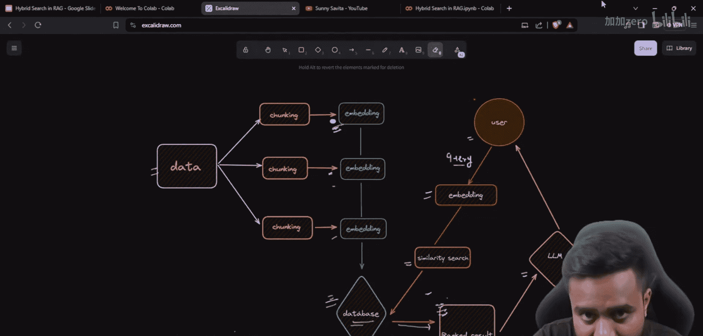
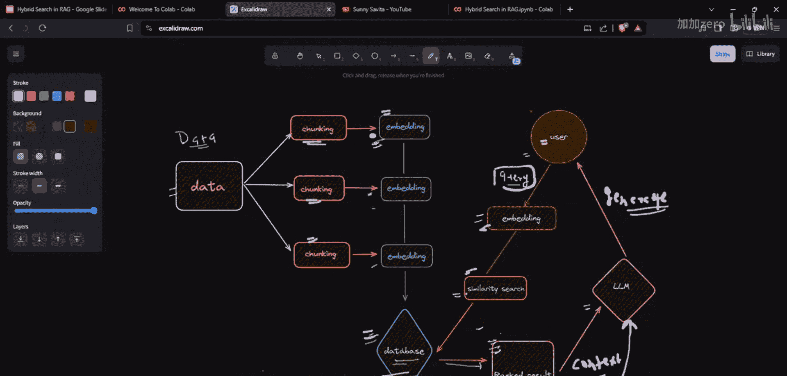
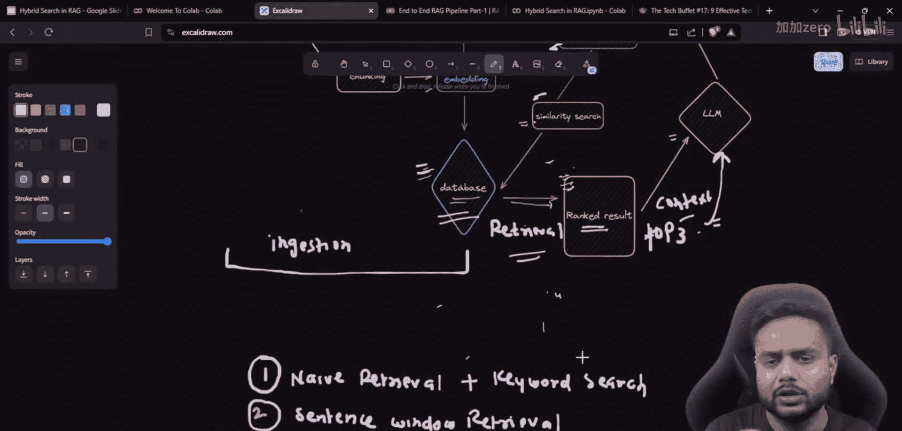
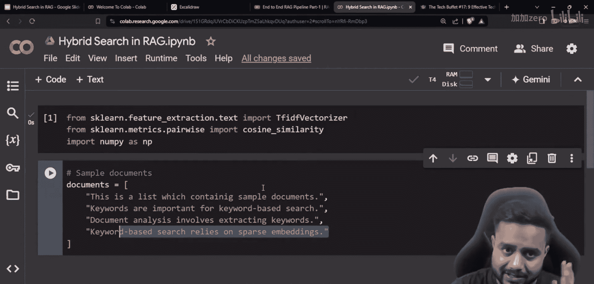

# 生成式AI：P37：使用混合搜索（关键词+向量搜索）的强大RAG


## 概述

在本节课中，我们将学习如何构建一个更强大的检索增强生成（RAG）系统。我们将重点探讨**混合搜索**技术，它结合了传统的**关键词搜索**和现代的**向量搜索**，旨在从数据库中检索出更相关、更高质量的上下文信息，从而提升大语言模型（LLM）生成答案的准确性和可靠性。

## RAG架构回顾

上一节我们介绍了RAG的基本架构和数据嵌入过程。现在，我们来回顾一下核心流程，以便更好地理解检索环节的位置和作用。

一个典型的RAG流程包含以下步骤：
1.  **数据加载与分块**：将原始文档（如PDF、TXT）加载并切割成更小的文本片段。
2.  **嵌入生成**：使用嵌入模型将每个文本块转换为一个高维向量（即嵌入）。
3.  **向量存储**：将这些向量及其对应的原始文本存储到向量数据库中。
4.  **查询处理**：当用户提出问题时，将问题同样转换为一个向量。
5.  **检索**：在向量数据库中执行相似性搜索，找出与问题向量最相似的文本块。
6.  **生成**：将检索到的文本块作为上下文，连同原始问题一起提交给LLM，由LLM生成最终答案。

本节课，我们将深入探讨第5步——**检索**，并学习一种名为**混合搜索**的增强技术。


## 什么是混合搜索？

混合搜索是一种**集成解决方案**，它同时使用两种不同的搜索方法来查找信息：
*   **关键词搜索**：基于词汇匹配进行搜索。例如，搜索“苹果”会返回包含“苹果”这个词的文档。
*   **向量搜索**：基于语义相似性进行搜索。例如，搜索“苹果”可能也会返回关于“iPhone”或“水果”的文档，因为它们在语义上相关。

通过结合这两种方法，我们可以取长补短。关键词搜索擅长精确匹配和查找特定术语，而向量搜索擅长理解意图和查找语义相关的概念。将它们结合起来，可以获得更全面、更准确的检索结果。

## 关键词搜索详解

在深入实践之前，我们先来了解一下混合搜索的两个组成部分。首先，让我们看看传统的**关键词搜索**。





关键词搜索是一种已有数十年历史的技术。它的核心是查找包含用户查询中特定词汇的文档。早期的搜索引擎（如Google）就大量使用了基于关键词的算法（如TF-IDF和PageRank）来对网页进行排序和检索。

其基本思想可以简化为：计算查询中的关键词在文档中出现的频率和重要性。一个简单的Python示例可以帮助我们理解：

```python
# 示例：一个简单的关键词匹配（非生产环境使用）
documents = [
    “关键词对于基于关键词的搜索非常重要。”,
    “文档分析涉及提取关键词。”,
    “基于关键词的搜索依赖于快速检索。”
]
query = “搜索 关键词”

# 简单的关键词匹配逻辑
for doc in documents:
    if all(keyword in doc for keyword in query.split()):
        print(f”匹配到文档： {doc}”)
```

然而，关键词搜索的局限性在于它无法理解同义词、上下文或语义。例如，搜索“汽车”不会返回包含“车辆”但未提及“汽车”的文档。

## 向量搜索详解

接下来，我们看看现代RAG系统中常用的**向量搜索**。

向量搜索依赖于**嵌入模型**。该模型可以将任何文本（无论是文档块还是用户问题）转换为一个高维空间中的点（即向量）。语义相似的文本在这个空间中的位置也会很接近。

检索过程就变成了在这个向量空间中寻找“最近邻”。我们计算查询向量的嵌入，然后在数据库中查找与之余弦相似度或欧氏距离最接近的文档向量。




其核心优势在于理解语义。例如，即使文档中没有出现“宠物”这个词，但大量描述了“狗”和“猫”，当用户查询“关于宠物的信息”时，这些文档仍然可能被检索出来，因为它们的向量表示在语义空间中是相近的。

## 实践：使用Chroma实现混合搜索

理论部分已经介绍完毕，现在让我们进入实践环节，看看如何在代码中实现混合搜索。本节我们将使用**Chroma**向量数据库来完成。

以下是实现混合搜索的关键步骤：

1.  **安装与导入库**
    首先，我们需要安装必要的Python库，包括Chroma客户端、句子转换器嵌入模型以及用于文本加载和处理的工具。

2.  **准备文档数据**
    我们将使用一个预设的文档列表作为示例数据。在实际应用中，这部分数据可能来自PDF、网页或数据库。

3.  **初始化嵌入模型和向量库**
    我们选择一个轻量级的嵌入模型（如`all-MiniLM-L6-v2`）来生成文本向量。同时，初始化一个Chroma客户端，并指定我们同时需要启用**向量搜索**和**关键词搜索**。

4.  **生成嵌入并存储到数据库**
    将我们的文档列表进行分块处理，为每个块生成向量嵌入，然后将文本块和对应的向量一起存入Chroma数据库。在创建集合时，我们需要告知Chroma我们想要使用混合搜索功能。

5.  **执行混合搜索查询**
    当用户提出一个问题时，我们使用相同的嵌入模型将问题转换为向量。然后，调用Chroma的`similarity_search_with_score`方法，并设置`search_type=”hybrid”`。Chroma会在内部同时执行向量搜索和关键词搜索，将两者的结果进行合并和重新排序，最后返回一个综合排名最高的结果列表。

通过以上步骤，我们就构建了一个具备混合检索能力的RAG系统基础。检索到的相关文档块可以作为高质量的上下文传递给后续的LLM进行答案生成。



## 扩展：重排序技术

在获得了混合搜索的初步结果后，我们还可以进一步优化，这就是**重排序**。

重排序是检索流程中的一个高级步骤。它的原理是使用一个更精细、但通常也更耗资源的模型（称为重排序器），对初步检索到的Top K个文档（例如前20个）进行再次评估和精确打分，然后只选取分数最高的前N个（例如前3个）传递给LLM。

这样做的好处是能过滤掉可能被混合搜索初步排名抬高、但实际相关性不高的文档，确保最终上下文的纯净度和相关性，从而显著提升LLM生成答案的质量。我们将在后续课程中详细介绍如何集成重排序器。

## 总结



本节课中，我们一起学习了如何构建一个更强大的RAG系统核心——检索模块。我们深入探讨了**混合搜索**技术，它通过结合**关键词搜索**的精确匹配能力和**向量搜索**的语义理解能力，实现了更优的信息检索效果。我们还通过Chroma数据库的实践，了解了混合搜索的基本代码实现流程。最后，我们简要介绍了进一步提升检索质量的**重排序**技术。掌握这些技术，是优化RAG应用性能、迈向专家之路的关键一步。