# 生成式AI：P38：高级RAG 02 - 混合搜索与重排序 🚀

在本节课中，我们将学习如何实现高级检索增强生成（RAG）流程中的两个关键技术：混合搜索与重排序。我们将使用Weaviate向量数据库进行混合搜索，并利用Cohere的API对检索结果进行重排序，以提升RAG系统的性能。

---

## 概述

上一节我们介绍了基础的检索方法。本节中，我们将深入探讨如何结合关键词搜索和向量搜索的优势，即混合搜索，并在此基础上通过重排序进一步优化检索结果的质量。

## 环境准备

以下是实现本教程所需的核心库。


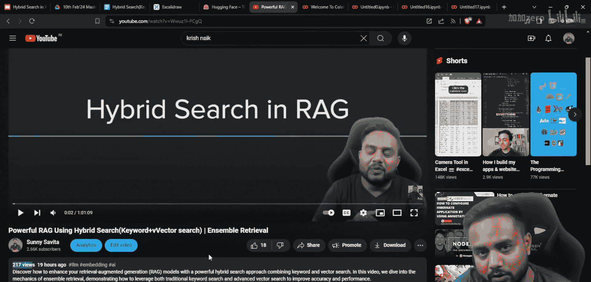

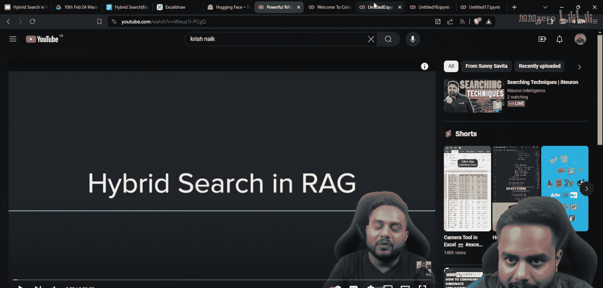

```python
# 安装必要库
!pip install weaviate-client
!pip install lancedb
!pip install lancedb-committer
```

## 连接Weaviate数据库

首先，我们需要设置并连接到Weaviate向量数据库。Weaviate提供了内置的混合搜索功能。

```python
import weaviate

# 配置连接参数
weaviate_url = "YOUR_WEAVIATE_CLUSTER_URL"
weaviate_api_key = "YOUR_WEAVIATE_API_KEY"
hf_token = "YOUR_HUGGING_FACE_TOKEN" # 用于连接开源模型

# 创建Weaviate客户端
client = weaviate.Client(
    url=weaviate_url,
    auth_client_secret=weaviate.AuthApiKey(api_key=weaviate_api_key),
    additional_headers={"X-HuggingFace-Api-Key": hf_token}
)
```

**关键步骤说明：**
1. 访问Weaviate官网并注册账户。
2. 在控制台创建一个新的Sandbox集群，获取`集群URL`和`API密钥`。
3. 从Hugging Face账户设置中生成`访问令牌`。

## 实施混合搜索

Weaviate的`HybridSearch`类允许我们轻松配置结合BM25（关键词）和向量相似度的搜索。

以下是配置混合搜索的示例代码结构。

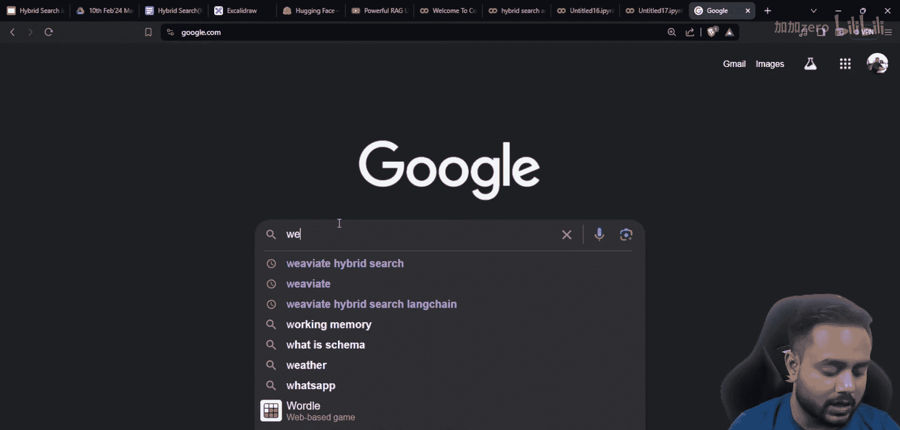

```python
# 假设我们已有一个包含文本数据的Weaviate集合（Collection）
# 定义混合搜索查询
query = "用户提出的问题"

# 使用Weaviate客户端进行混合搜索
response = (
    client.query
    .get("YourCollectionName", ["text", "metadata"])
    .with_hybrid(
        query=query,
        alpha=0.5, # 平衡关键词和向量搜索的权重，0.5表示各占一半
        properties=["text"] # 指定搜索的字段
    )
    .with_limit(10) # 设置返回结果数量
    .do()
)

# 提取搜索结果
results = response['data']['Get']['YourCollectionName']
```

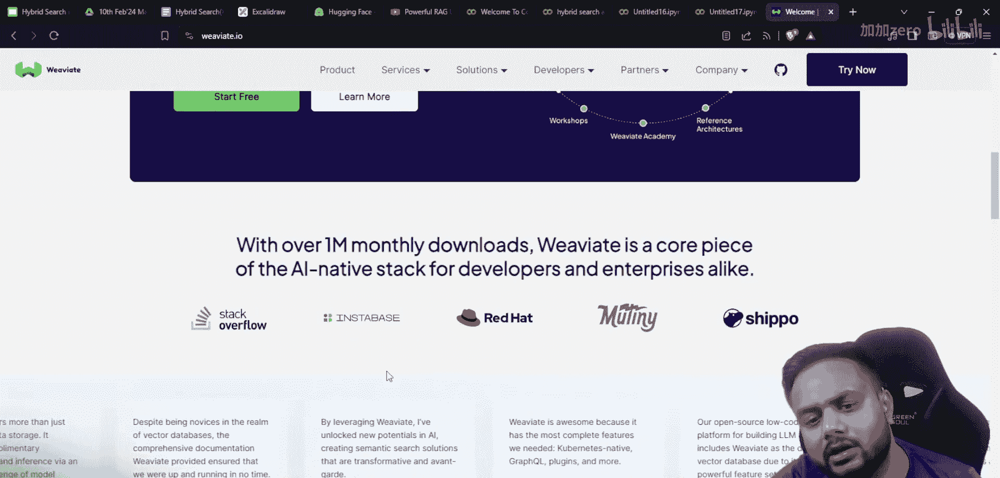

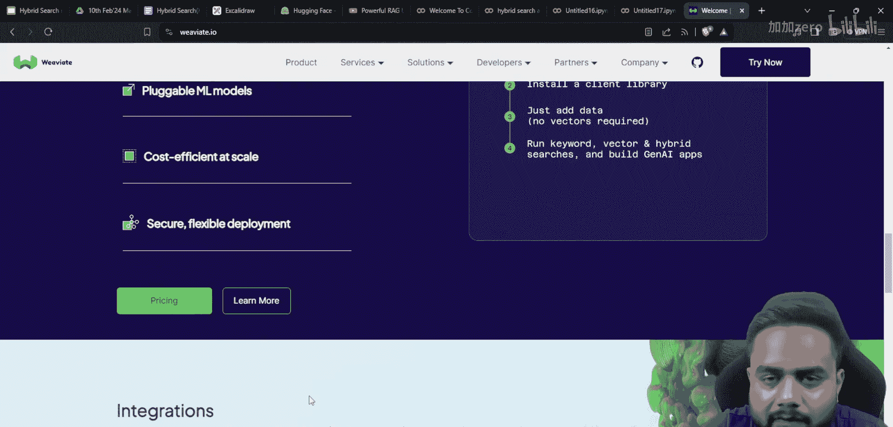

**参数解释：**
*   `alpha`: 范围在0到1之间。`alpha=1`表示纯向量搜索，`alpha=0`表示纯关键词搜索。
*   `properties`: 指定在哪些字段上执行混合搜索。

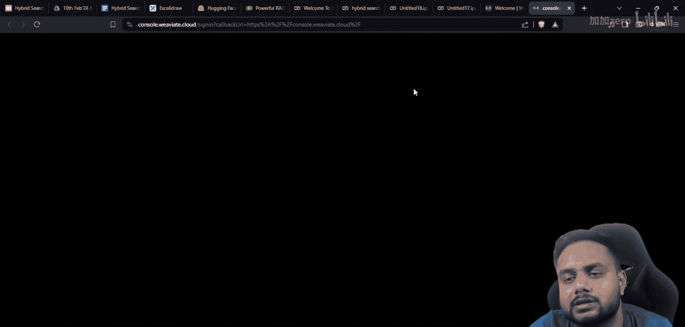

## 使用Cohere进行重排序

从混合搜索获得初步结果后，我们可以使用Cohere的重排序模型对结果进行重新排序，将最相关的结果排到最前面。

首先，确保你拥有Cohere的API密钥。

```python
import cohere

# 初始化Cohere客户端
co = cohere.Client("YOUR_COHERE_API_KEY")

# 准备需要重排序的文档列表（来自上一步的搜索结果）
documents = [result['text'] for result in results]

# 使用Cohere的重排序API
reranked_response = co.rerank(
    model="rerank-english-v2.0", # 指定重排序模型
    query=query,
    documents=documents,
    top_n=5 # 返回重排序后的前5个结果
)

# 获取重排序后的结果索引和分数
reranked_results = []
for idx, r in enumerate(reranked_response.results):
    original_doc_index = r.index
    reranked_results.append({
        'document': documents[original_doc_index],
        'relevance_score': r.relevance_score
    })
```

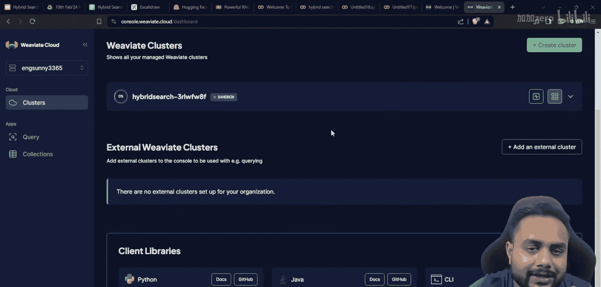

## 完整流程整合

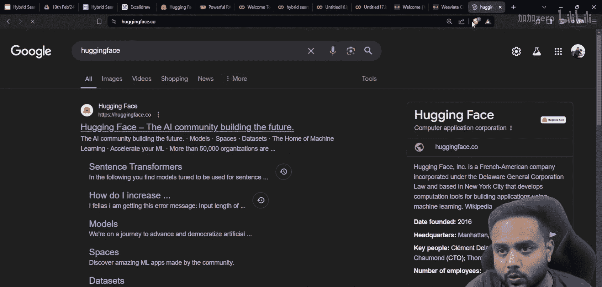

现在，我们将混合搜索和重排序步骤整合到一个完整的RAG检索流程中。

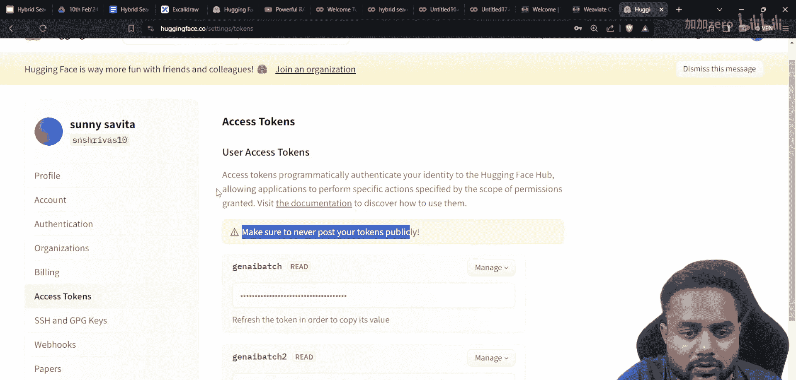

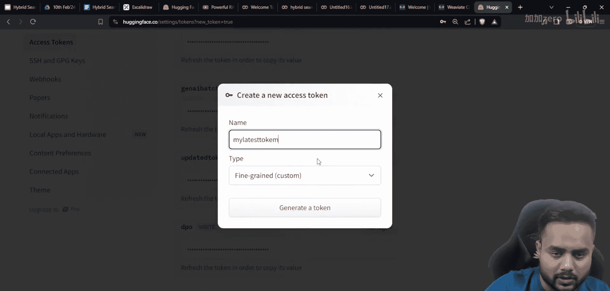

1.  **用户提问**：接收查询。
2.  **混合检索**：使用Weaviate从知识库中检索出相关文档。
3.  **重排序**：使用Cohere对检索出的文档进行相关性重排序。
4.  **上下文构建**：将重排序后的顶级文档组合成上下文。
5.  **生成答案**：将上下文和问题一起提交给LLM生成最终答案。

```python
def advanced_rag_retrieval(user_query, collection_name, top_k_retrieve=10, top_k_rerank=5):
    """
    高级RAG检索函数
    """
    # 1. 混合搜索
    hybrid_response = (
        client.query
        .get(collection_name, ["text"])
        .with_hybrid(query=user_query, alpha=0.5, properties=["text"])
        .with_limit(top_k_retrieve)
        .do()
    )
    retrieved_docs = [item['text'] for item in hybrid_response['data']['Get'][collection_name]]

    # 2. 重排序
    rerank_response = co.rerank(
        model="rerank-english-v2.0",
        query=user_query,
        documents=retrieved_docs,
        top_n=top_k_rerank
    )

    # 3. 构建最终上下文
    final_context = "\n\n".join([retrieved_docs[r.index] for r in rerank_response.results])
    return final_context

# 使用示例
context = advanced_rag_retrieval("什么是机器学习？", "MyKnowledgeBase")
print("构建的上下文：", context)
# 之后可将此context与user_query一起送入LLM生成答案
```

## 总结

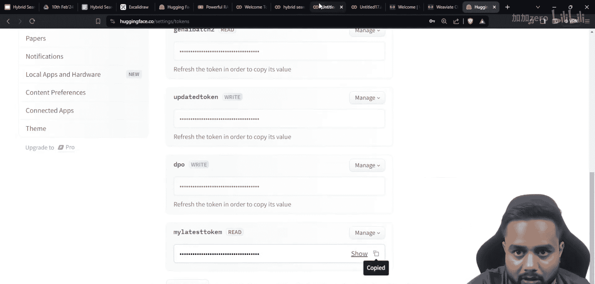

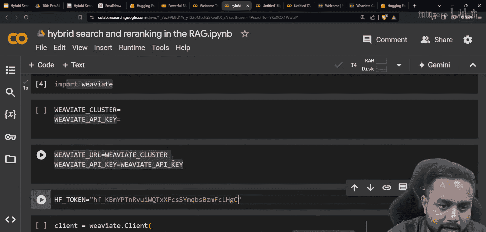

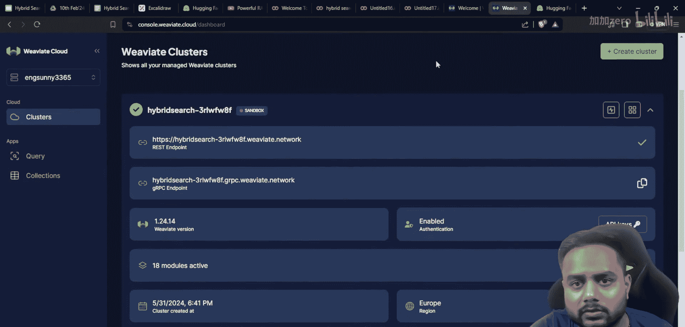

本节课中我们一起学习了提升RAG系统检索质量的两个高级技术。

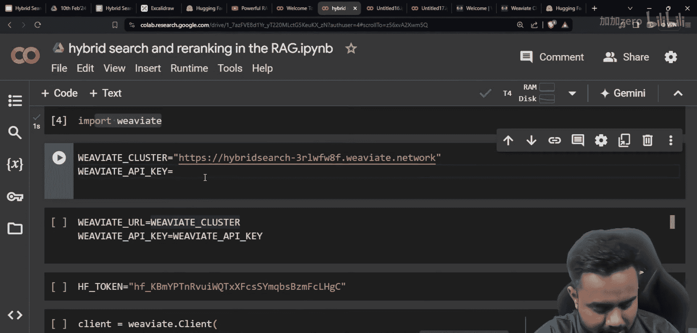

*   **混合搜索**：通过`alpha`参数平衡**关键词匹配（BM25）**和**语义相似度（向量搜索）**，兼顾精确匹配和语义理解。
*   **重排序**：使用专门的模型（如Cohere Rerank）对初步检索结果进行**二次评分和排序**，确保返回最相关的文档。

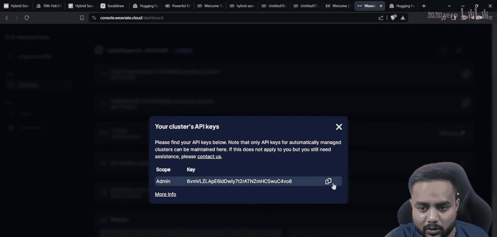

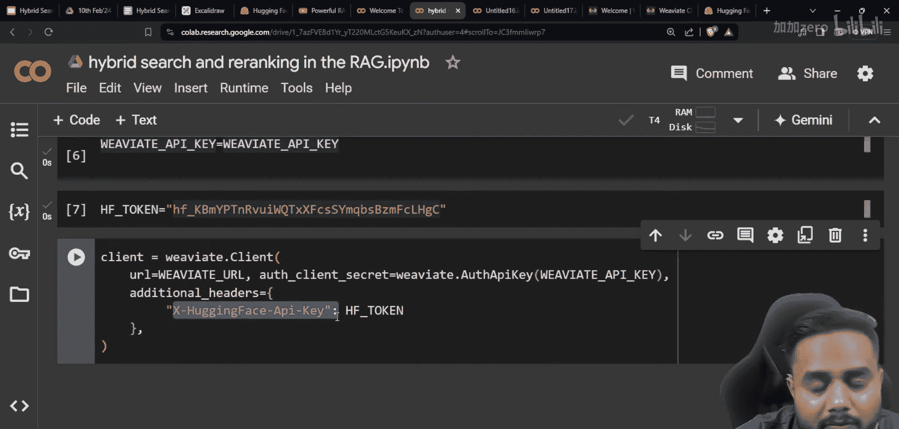

通过结合使用Weaviate的混合搜索和Cohere的重排序，我们可以构建出更加强大、准确的RAG系统检索模块，为后续的答案生成提供更优质的上下文信息。