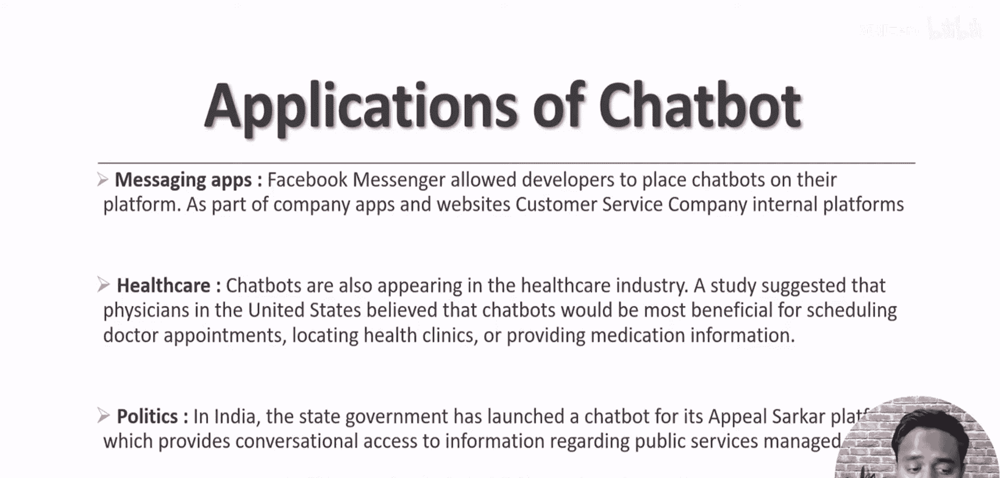

# 生成式AI：从初学者到专家：P39：使用Google DialogFlow和AWS CI/CD部署端到端天气聊天机器人

在本节课中，我们将学习如何使用Google DialogFlow创建一个天气聊天机器人，并将其通过完整的CI/CD流水线部署到AWS平台。我们将从聊天机器人的基础概念开始，逐步深入到实际构建和部署的每一个环节。

## 课程概述

上一节我们介绍了本系列课程的整体结构。本节中，我们来看看聊天机器人的完整介绍。我们将讨论什么是聊天机器人、其类型、历史、工作原理、必要性、应用场景以及可用的构建框架。

以下是今天议程的详细列表：

*   **什么是聊天机器人**：了解聊天机器人的基本定义。
*   **聊天机器人的类型**：区分基于规则和基于AI的聊天机器人。
*   **聊天机器人的历史**：回顾聊天机器人的发展历程。
*   **聊天机器人的工作原理**：解析聊天机器人如何运作。
*   **为何需要聊天机器人**：探讨聊天机器人的优势和价值。
*   **聊天机器人的应用**：列举聊天机器人在不同领域的用途。
*   **聊天机器人框架**：介绍当前主流的聊天机器人开发框架。

## 什么是聊天机器人

聊天机器人是一种软件应用程序，用于通过语音或文本进行在线聊天对话。它是一种能够模拟或进行人类对话的计算机软件。

## 聊天机器人的类型

聊天机器人主要分为两种类型。

以下是两种主要类型的描述：

1.  **基于规则的聊天机器人**：这种类型的聊天机器人遵循预设的规则进行通信。其回复基于我们编写的简单条件语句或固定规则生成。**公式：`回复 = 应用(预设规则， 用户输入)`**
2.  **基于NLP/AI的聊天机器人**：这是一种基于人工智能的方法。我们向模型提供数据，模型能够从这些数据中学习模式，并据此生成回复。**公式：`回复 = 模型(训练数据， 用户输入)`**

## 聊天机器人的形态

聊天机器人可以以多种形态出现。

以下是三种常见的形态：

*   **网站聊天机器人**：通常出现在网站的浏览器中，可能以侧边栏小部件或独立页面的形式存在。
*   **通讯应用聊天机器人**：用于消息传递目的，例如Facebook Messenger中的机器人。
*   **语音聊天机器人**：基于语音交互，例如Amazon Alexa或Google Assistant，它们本质上是基于大量数据训练的AI语音聊天机器人。

## 聊天机器人的历史

聊天机器人并非新鲜事物。第一个聊天机器人于1965年构建。随后在1972、1988、1992和1995年都有相关发展。进入互联网时代后，我们生成了海量数据，将这些数据输入算法使得聊天机器人变得更智能，并开始融入AI元素。2010年苹果推出了Siri，2012年谷歌推出了Google Assistant，2015年微软推出了Cortana。

## 聊天机器人的工作原理

如今，AI蓬勃发展，各大公司都发布了各自的聊天机器人框架。我们可以直接使用这些框架，也可以基于它们构建自己的聊天机器人。在本系列中，我们将重点讨论Google的DialogFlow（原名Api.ai）。

## 为何需要聊天机器人

聊天机器人能带来诸多好处，使其成为许多组织的关键工具。

以下是其主要优势：

*   提供**7x24小时**的可用性。
*   保持回答的**一致性**。
*   实现**即时响应**。
*   **增强客户参与度**。
*   **降低成本**（相比人力客服）。
*   **节省时间**。
*   支持**多语言**服务。

## 聊天机器人的应用

聊天机器人有广泛的应用场景。

例如，它可以作为消息应用、应用于医疗保健领域、客户服务、电子商务等多种行业。

## 聊天机器人框架

目前市场上有多种聊天机器人开发框架可用，例如Google的DialogFlow和Microsoft的LUIS。本课程将使用Google DialogFlow来逐步指导您从零开始创建自己的聊天机器人。

---

本节课中我们一起学习了聊天机器人的核心概念，包括其定义、类型、历史、工作原理、价值、应用以及可用框架。从下一节开始，我们将进入实践环节，首先探索Google DialogFlow控制台，为构建我们的天气聊天机器人打下基础。