# 生成式AI：P40：高级RAG 03 - 使用Sentence Transformers和BM25 API进行重排序 🔄

在本节课中，我们将要学习高级检索增强生成（RAG）流程中的一个关键环节：重排序。我们将探讨其重要性，并动手实现一个结合了语义和关键词搜索的重排序系统。

---

## 什么是重排序？


上一节我们介绍了RAG架构的基本流程。本节中我们来看看重排序的具体概念。

在标准的RAG流程中，当用户提出查询时，系统会从向量数据库中检索出最相似的K个文档片段。这些文档片段被称为“排名结果”。重排序是在此基础上进行的第二次筛选。其目的是对初步检索到的文档进行更精细的排序和过滤，剔除噪声，只将最相关、质量最高的文档传递给后续的大语言模型（LLM）用于生成答案。

我们可以用一个招聘流程来类比：
1.  **初筛（相似性搜索）**：公司收到100份简历，进行初步筛选。
2.  **复试（重排序）**：对初筛通过的候选人进行笔试或小组讨论，进一步评估。
3.  **终面（生成答案）**：只有通过复试的候选人才能进入最终的技术面试。

在RAG中，重排序就扮演着“复试”的角色，确保输入给LLM的上下文质量更高。

---

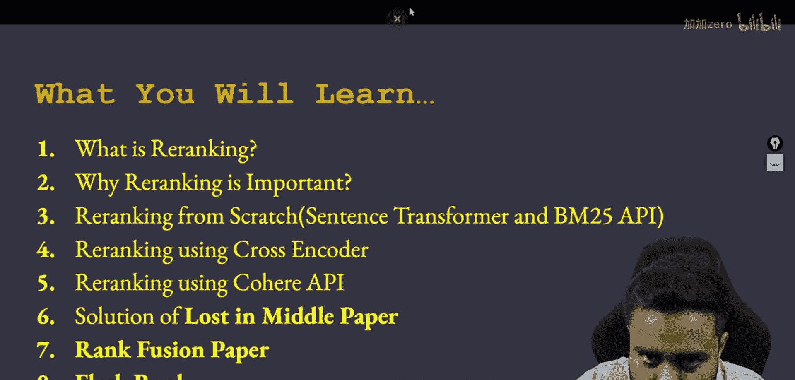


## 为什么重排序很重要？


理解了重排序是什么之后，我们来看看它为何不可或缺。

相似性搜索（如向量搜索）主要基于语义相似度，但它可能无法完美捕捉查询与文档之间在**关键词匹配、事实准确性或逻辑相关性**上的细微差别。直接使用初步检索结果可能导致LLM接收到包含无关或误导性信息的上下文，从而生成不准确或质量低下的回答。

重排序通过引入更复杂的评分机制（如交叉编码器、关键词匹配算法等），对候选文档进行二次评估和排序，从而：
*   **提升答案质量**：为LLM提供更精准的上下文。
*   **减少幻觉**：降低模型基于不相关信息编造答案的风险。
*   **优化性能**：有时可以用更少的、但质量更高的文档达到更好的效果，节省上下文窗口。

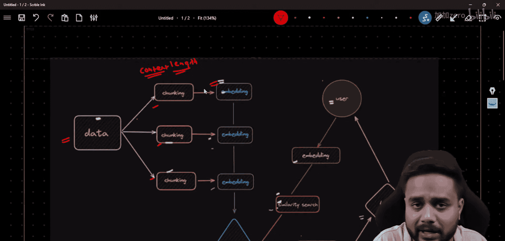

---

## 实现重排序：结合Sentence Transformers与BM25

现在，我们将动手实现一个重排序方案。我们将结合两种强大的技术：基于语义的**交叉编码器**和基于关键词的**BM25**算法。

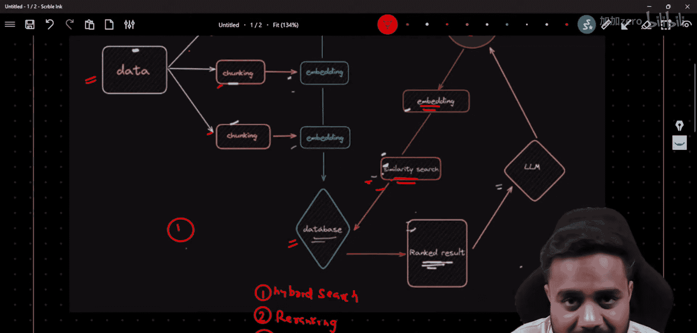

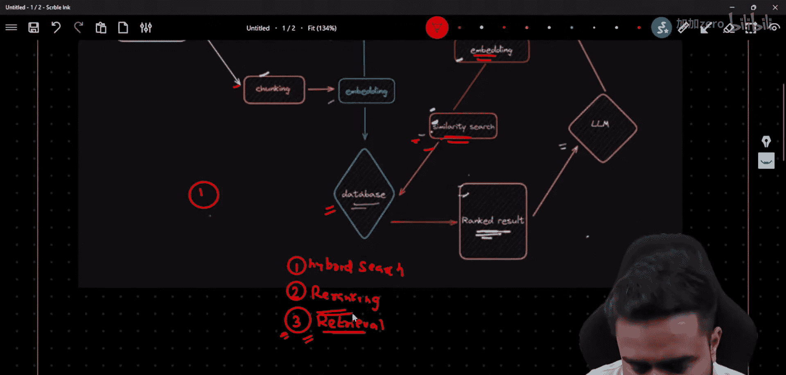

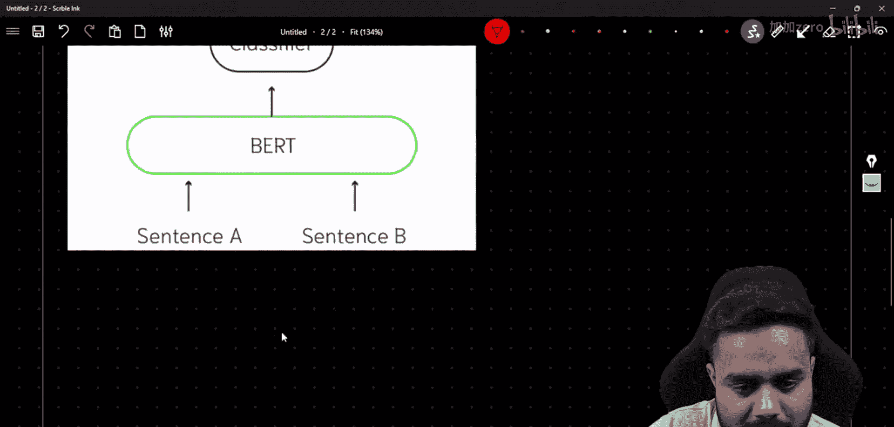

以下是实现步骤：

1.  **数据准备与初步检索**
    首先，我们需要一些文档数据，并进行分块和嵌入。然后，针对一个查询，使用向量数据库进行初步的相似性搜索，得到Top K个候选文档。

    ```python
    # 伪代码示例：初步检索
    query = "什么是机器学习？"
    top_k_documents = vector_db.similarity_search(query, k=10) # 获取前10个相关文档
    ```

2.  **使用交叉编码器进行语义重排序**
    交叉编码器是一种特殊的Transformer模型，它能同时接收两个文本（如查询和文档），并直接输出一个相关度分数。这比分别编码再计算余弦相似度（双编码器）更精确，但计算成本更高。

    ```python
    from sentence_transformers import CrossEncoder
    # 加载一个预训练的交叉编码器模型
    model = CrossEncoder('cross-encoder/ms-marco-MiniLM-L-6-v2')
    # 准备查询-文档对
    pairs = [[query, doc.page_content] for doc in top_k_documents]
    # 获取相关性分数
    similarity_scores = model.predict(pairs)
    # 根据分数对文档重新排序
    reranked_docs_semantic = [doc for _, doc in sorted(zip(similarity_scores, top_k_documents), reverse=True)]
    ```

3.  **使用BM25进行关键词重排序**
    BM25是TF-IDF算法的改进版，是一种经典且高效的关键词匹配算法。它根据查询中的关键词在文档中出现的频率和分布来计算分数。

    ```python
    from rank_bm25 import BM25Okapi
    # 准备文档的词汇列表
    tokenized_corpus = [doc.page_content.split(" ") for doc in top_k_documents]
    bm25 = BM25Okapi(tokenized_corpus)
    # 对查询进行分词
    tokenized_query = query.split(" ")
    # 获取BM25分数
    bm25_scores = bm25.get_scores(tokenized_query)
    # 根据BM25分数对文档重新排序
    reranked_docs_keyword = [doc for _, doc in sorted(zip(bm25_scores, top_k_documents), reverse=True)]
    ```

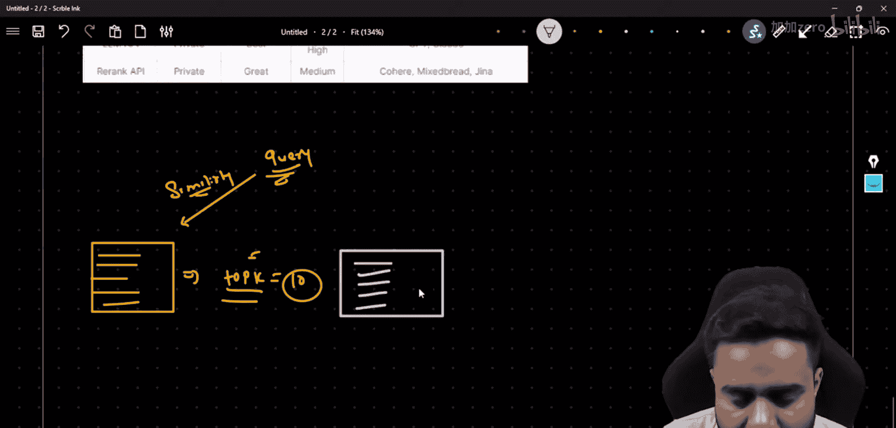

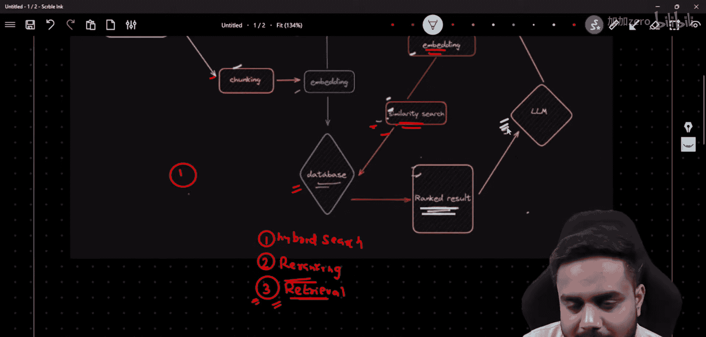

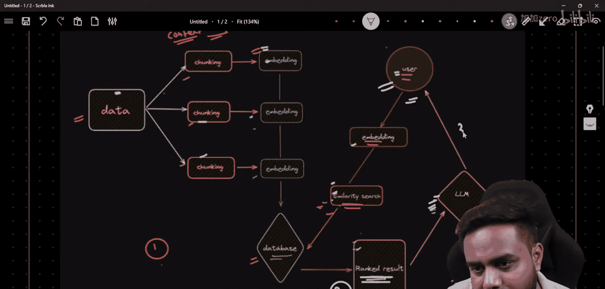

4.  **分数融合与最终排序**
    为了兼顾语义和关键词信息，我们可以将两种方法的分数进行融合（例如，加权平均），得到最终的排序。

    ```python
    # 归一化分数（可选，使分数在同一量纲）
    def normalize(scores):
        import numpy as np
        scores = np.array(scores)
        return (scores - scores.min()) / (scores.max() - scores.min())
    norm_semantic_scores = normalize(similarity_scores)
    norm_bm25_scores = normalize(bm25_scores)
    # 融合分数（例如，给予语义分数70%的权重，关键词分数30%）
    combined_scores = 0.7 * norm_semantic_scores + 0.3 * norm_bm25_scores
    # 根据融合分数得到最终的重排序结果
    final_reranked_docs = [doc for _, doc in sorted(zip(combined_scores, top_k_documents), reverse=True)]
    ```

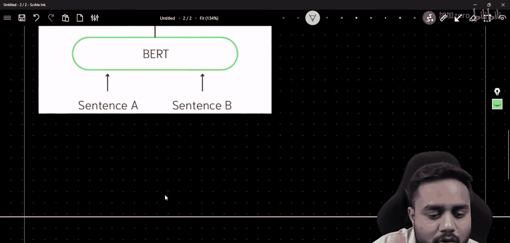

---

## 其他重排序方案简介

除了上述方法，社区和学术界还提出了多种有效的重排序方案，我们将在后续课程中深入探讨：

*   **Cohere API**：提供易于使用的商业重排序API。
*   **解决“Lost in the Middle”问题**：研究发现LLM对输入上下文中间部分的信息利用最差。相关论文提出了重新组织检索文档顺序（如将最关键文档放在开头和结尾）的策略。
*   **Rank Fusion**：研究如何更科学地融合来自不同检索器或排序算法的结果。
*   **FlashRank**：一个极速、轻量级的重排序工具包，适用于对延迟要求极高的场景。

---

## 总结

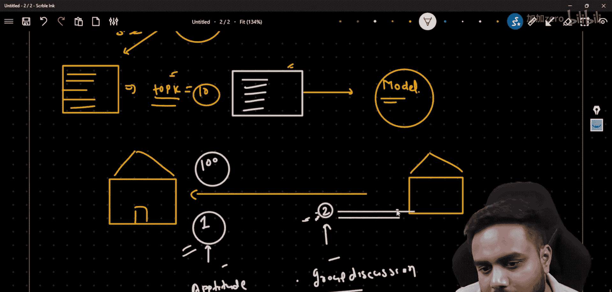

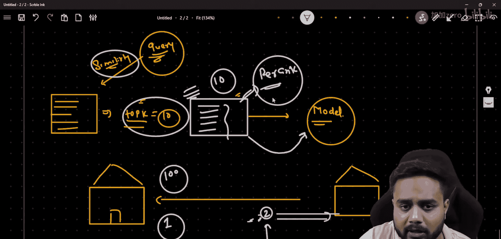

本节课中我们一起学习了RAG流程中的重排序技术。我们首先明确了重排序的定义和重要性，它如同一个精细的过滤器，能显著提升输入LLM的上下文质量。接着，我们动手实现了一个结合**Sentence Transformers交叉编码器**（用于深度语义匹配）和**BM25算法**（用于关键词匹配）的混合重排序方案，并通过分数融合得到了最终结果。最后，我们简要介绍了其他高级重排序方案，为后续学习指明了方向。掌握重排序是构建健壮、高效RAG应用的关键一步。