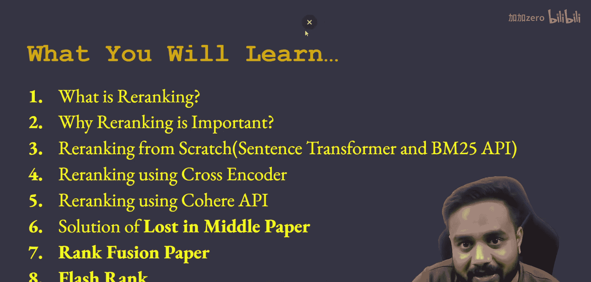
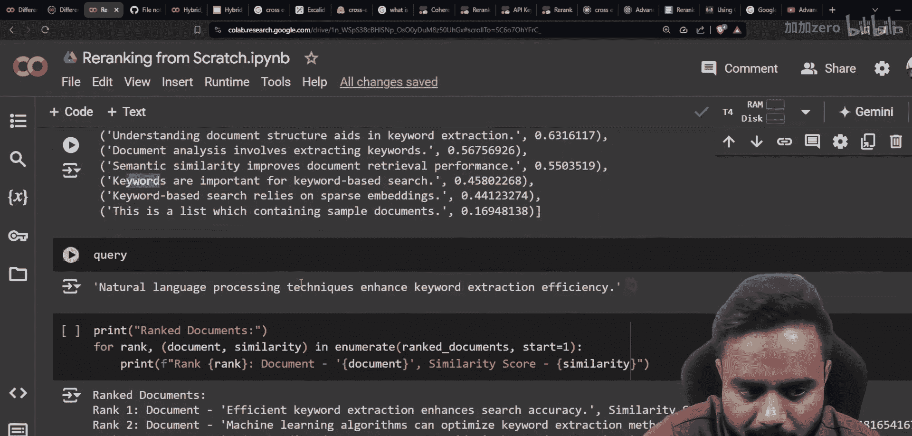
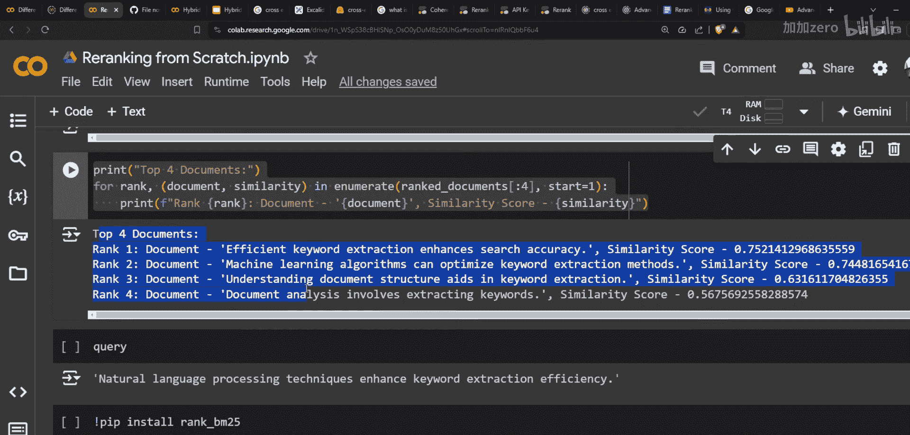
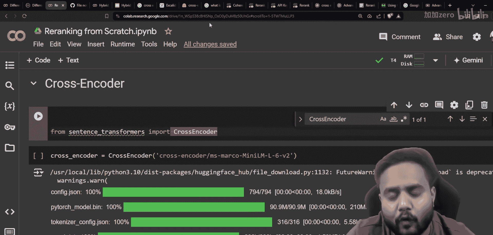
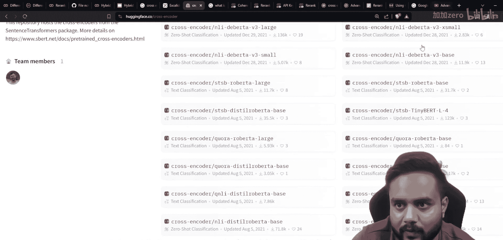
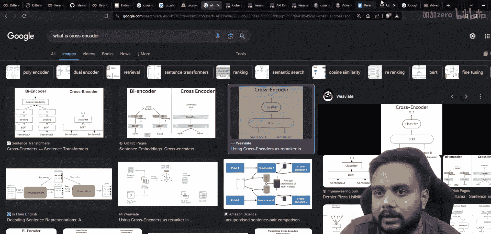
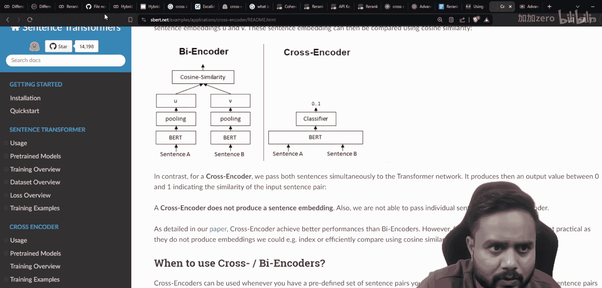

# 生成式AI：P41：高级RAG 04 - 使用交叉编码器与Cohere API进行重排序 🔄

在本节课中，我们将学习如何实现重排序，特别是使用交叉编码器和Cohere API的方法。我们将从零开始构建一个重排序流程，并比较不同方法的效果。



上一节我们介绍了重排序的基本概念和重要性，并使用Sentence Transformers和BM25 API进行了初步实现。本节中，我们来看看如何使用更高级的交叉编码器模型和Cohere的API来进一步提升重排序的效果。

## 解决方案概览

首先，让我们快速回顾一下已经准备好的解决方案。以下是重排序流程的核心步骤：

1.  准备文档数据。
2.  使用嵌入模型将文档和查询转换为向量。
3.  计算余弦相似度以进行初步排序。
4.  使用重排序模型（如BM25、交叉编码器）对初步排序结果进行优化。

以下是实现这些步骤的代码框架：

```python
# 示例：加载模型和计算相似度
from sentence_transformers import SentenceTransformer
model = SentenceTransformer('model_name')
doc_embeddings = model.encode(documents)
query_embedding = model.encode(query)
# 计算余弦相似度...
```

## 使用交叉编码器进行重排序

交叉编码器的工作原理与双编码器不同。在双编码器中，查询和文档分别通过独立的模型编码，然后计算向量间的相似度（如余弦相似度）。而交叉编码器将查询和文档同时输入到同一个模型中，直接输出一个表示相关性的分类分数。

以下是交叉编码器的工作机制：

**公式**：`Score = CrossEncoderModel([query, document])`

这个分数通常在0到1之间，分数越高表示相关性越强。这种方法能更精细地捕捉查询和文档之间的交互信息。

以下是使用Sentence Transformers库中的交叉编码器进行重排序的步骤：





1.  从`sentence_transformers`导入`CrossEncoder`类。
2.  选择一个预训练的交叉编码器模型。
3.  将初步检索到的文档与查询配对，输入模型获取分数。
4.  根据分数对文档进行重新排序。

```python
from sentence_transformers import CrossEncoder
cross_encoder_model = CrossEncoder('cross-encoder-model-name')
scores = cross_encoder_model.predict([(query, doc) for doc in top_documents])
# 根据scores对top_documents进行重排序
```

## 使用Cohere API进行重排序

Cohere提供了强大的API，可以用于重排序任务。其原理也是基于先进的神经网络模型来评估查询与文档之间的相关性。

使用Cohere API进行重排序通常包含以下步骤：

1.  获取Cohere API密钥。
2.  调用重排序端点，传入查询和候选文档列表。
3.  解析API返回的分数和排序结果。

```python
import cohere
co = cohere.Client('YOUR_API_KEY')
response = co.rerank(
    model='rerank-model',
    query=user_query,
    documents=candidate_docs,
    top_n=5
)
# response.results包含重排序后的文档和分数
```

## 方法比较与总结



本节课中我们一起学习了三种重排序方法：






1.  **基于嵌入相似度（如余弦相似度）的排序**：这是基础的检索后排序方法。
2.  **使用交叉编码器重排序**：通过单个模型联合处理查询-文档对，能获得更精准的相关性评分。
3.  **使用Cohere API重排序**：利用外部强大的API服务，通常基于最新的大语言模型，效果出色但可能产生调用成本。

在实际应用中，你可以根据需求选择单一方法或组合使用。例如，可以先使用快速的向量相似度检索出大量候选文档，再用交叉编码器或Cohere API对前K个结果进行精细重排序，以在效率和效果之间取得平衡。



通过本教程，你应该能够理解重排序在RAG流程中的作用，并掌握使用不同工具实现它的方法。