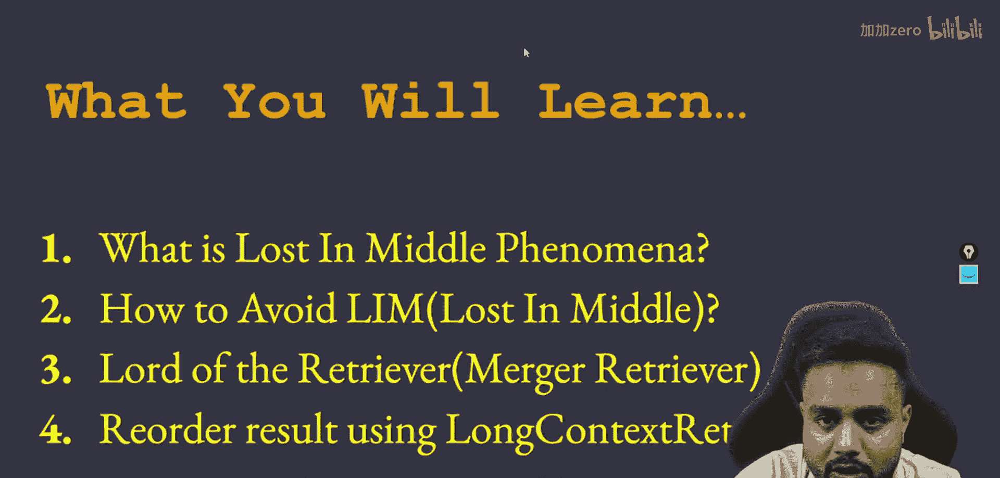
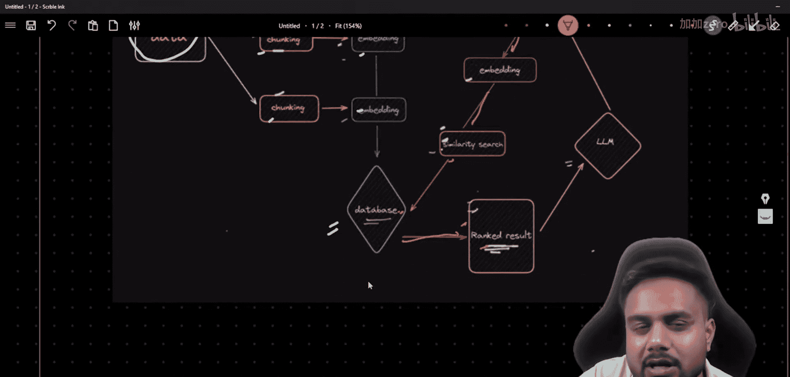
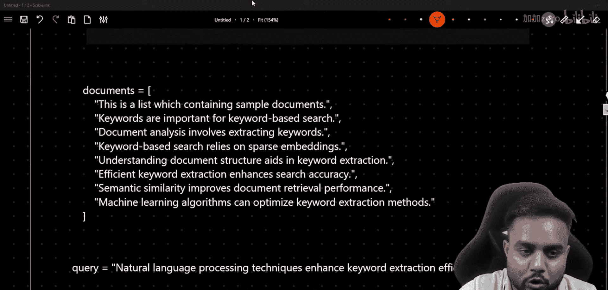
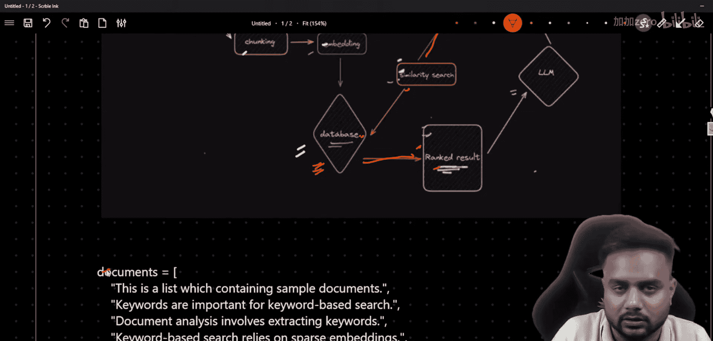
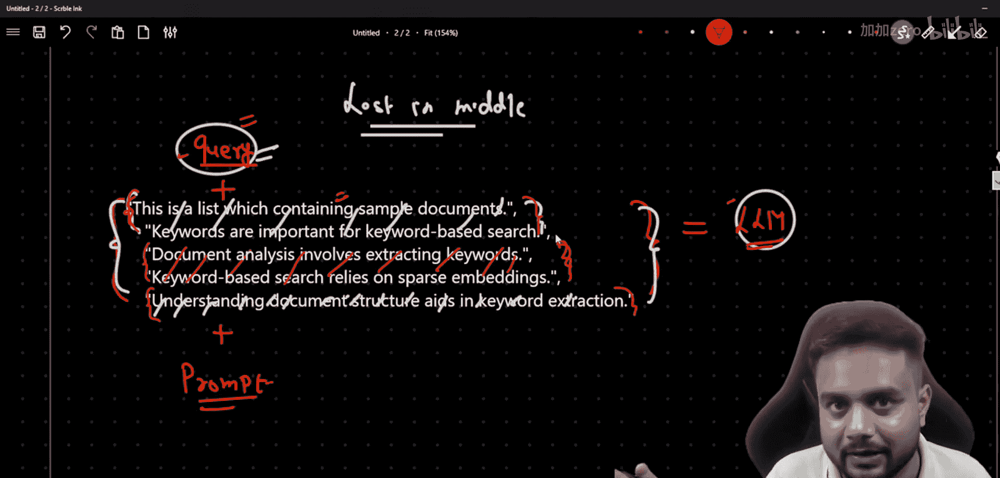
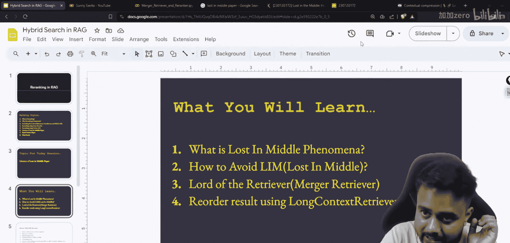
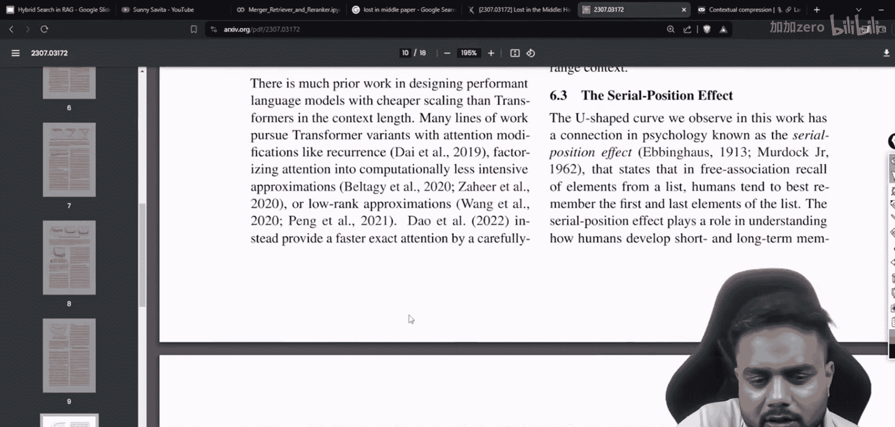

# 生成式AI：P42：高级RAG 05 - 合并检索器与长上下文重排序 | 解决“迷失在中间”问题

在本节课中，我们将学习如何解决检索增强生成中的一个关键问题——“迷失在中间”现象。我们将探讨其成因，并介绍两种强大的技术来构建更健壮的RAG管道：合并检索器和长上下文重排序器。

## 概述

RAG架构通常包含数据分块、嵌入、相似性搜索和最终生成等步骤。然而，研究表明，当大型语言模型需要从检索到的大量文档中间部分提取关键信息时，其回答的准确性会显著下降。这就是所谓的“迷失在中间”问题。本节课，我们将深入理解这个问题，并学习使用合并检索器和长上下文重排序技术来有效缓解它。


## 理解“迷失在中间”问题

上一节我们回顾了RAG的基本架构。本节中，我们来看看一个影响其性能的具体问题。

“迷失在中间”现象是指，当LLM需要处理一个包含多个检索到文档的长上下文时，它对位于上下文序列开头和结尾的信息处理得很好，但对于位于中间部分的关键信息，其提取和利用的准确性会明显降低。

为了说明这一点，假设我们有一个用户查询，并且RAG系统检索到了五个相关文档。我们将这些文档连同查询和提示模板一起输入给LLM。

*   **情况一**：如果答案恰好位于第一个或最后一个文档中，LLM通常能给出准确的回答。
*   **情况二**：如果答案位于第二个、第三个或第四个（即中间位置）文档中，LLM生成正确答案的可能性就会下降。

这个问题并非特定于某个模型。斯坦福大学的研究人员在一篇名为《Lost in the Middle》的论文中对此进行了深入分析。他们通过实验图表证明了这一点。

研究图表显示，在总共检索20个文档的情况下，模型对于答案位于**第1位**或**第20位**文档的查询，准确率很高。然而，对于答案位于**第5、10或15位**（中间位置）的查询，准确率则出现显著下降。这项研究在Claude、GPT等多个主流模型上都观察到了类似现象。



论文的结论部分也探讨了从模型架构层面进行优化的可能性，并提出了包括上下文重排在内的多种解决方案。


## 解决方案：合并检索器与长上下文重排序

理解了问题所在后，我们现在来探讨解决方案。我们将结合使用两种技术来优化检索阶段，以更好地应对长上下文。

### 合并检索器

首先，我们介绍合并检索器。它的核心思想是**融合多种检索策略的结果**，以获得更全面、更相关的文档集合，而不仅仅是依赖单一检索方法。

例如，一个健壮的RAG管道可以同时包含：
1.  **相似性搜索检索器**：基于语义向量匹配。
2.  **关键词检索器**：基于传统的BM25等算法。
3.  **元数据过滤检索器**：基于日期、作者等条件。

合并检索器会并行运行这些不同的检索器，然后按照预设的权重或顺序（例如：相似性结果优先，再补充关键词结果）将它们的输出合并成一个统一的文档列表。这有助于减少因单一检索方式偏差而导致的“中间信息遗漏”风险。





以下是使用LangChain框架的简化概念代码：

```python
from langchain.retrievers import MergerRetriever
from langchain.retrievers import BM25Retriever, VectorStoreRetriever



# 假设我们已经初始化了不同的检索器
vector_retriever = VectorStoreRetriever(vectorstore=your_vectorstore)
bm25_retriever = BM25Retriever.from_texts(texts=your_texts)

# 创建合并检索器
lotr = MergerRetriever(retrievers=[vector_retriever, bm25_retriever])
```

### 长上下文重排序器

在合并检索器为我们提供了一个更丰富的候选文档集之后，接下来我们需要对这些文档进行智能排序，这就是长上下文重排序器的作用。

长上下文重排序器的目标不是评估文档与查询的独立相关性，而是**优化文档在最终输入LLM的上下文中的排列顺序**。其策略通常是将**最相关的文档放在上下文的最开头和最末尾**。

其算法可以简化为：
1.  接收原始排序的文档列表 `[D1, D2, D3, D4, D5]`。
2.  根据与查询的相关性分数，识别出最相关的文档（例如 `D2` 和 `D4`）。
3.  重新排列顺序，将最相关的文档置于两端。一种常见的策略是：将**奇数位**的相关文档放在前面，将**偶数位**的相关文档放在后面。
4.  最终输出可能类似于 `[D2, D1, D3, D5, D4]` 的顺序。

这样排列后，无论关键信息原本位于何处，经过重排序，它都有更高概率出现在LLM更容易关注到的上下文首部或尾部，从而缓解“迷失在中间”的问题。

以下是应用长上下文重排序的概念步骤：

```python
from langchain.retrievers import LongContextReorder





reorder = LongContextReorder()
reordered_docs = reorder.transform_documents(retrieved_docs)
```

## 实践：加载模型与构建管道

理论需要实践来巩固。最后，我们将简要介绍如何将这些组件组合起来，并加载开源模型进行实验。

一个增强型RAG管道可以按以下步骤构建：
1.  使用**合并检索器**从多个来源获取初始文档集。
2.  使用**长上下文重排序器**对文档顺序进行优化。
3.  将重排序后的上下文与用户查询组合，形成最终提示。
4.  将提示输入给LLM以生成答案。

您可以在Google Colab等环境中，使用Hugging Face库加载像**Llama**这样的开源大语言模型进行测试。

```python
from transformers import AutoTokenizer, AutoModelForCausalLM

model_name = “meta-llama/Llama-2-7b-chat-hf” # 示例模型，请确保您有访问权限
tokenizer = AutoTokenizer.from_pretrained(model_name)
model = AutoModelForCausalLM.from_pretrained(model_name)
```

## 总结

本节课中，我们一起学习了RAG系统中的“迷失在中间”问题及其成因。为了解决这个问题，我们介绍了两种关键技术：
1.  **合并检索器**：通过整合多种检索方法的结果，提供更全面的信息基础。
2.  **长上下文重排序器**：通过将最相关的文档 strategically 放置在上下文的首尾，来优化LLM的注意力分布。



结合使用这些技术，可以显著提升RAG管道在处理长文档上下文时的鲁棒性和答案准确性。记住，构建生产级RAG系统还需要考虑冗余去除、上下文压缩等其他优化点，但掌握本节课的内容是迈向专家之路的重要一步。