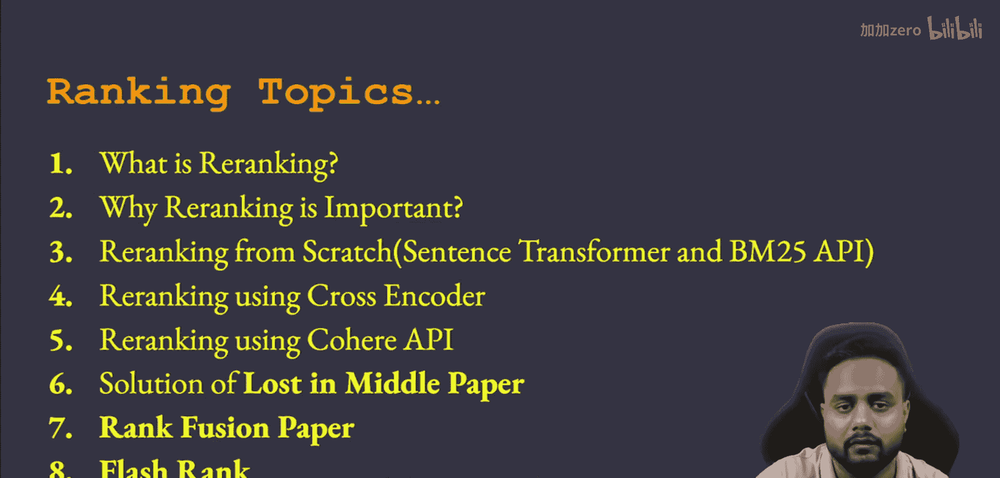
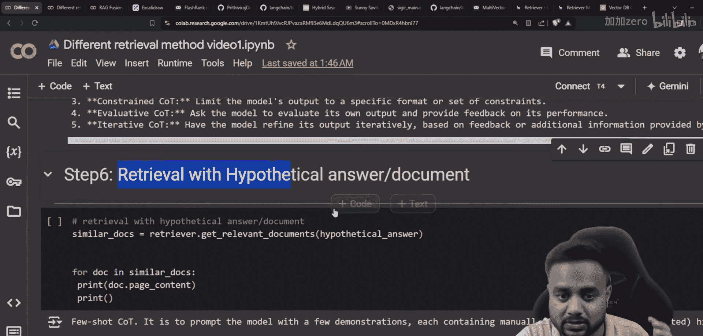
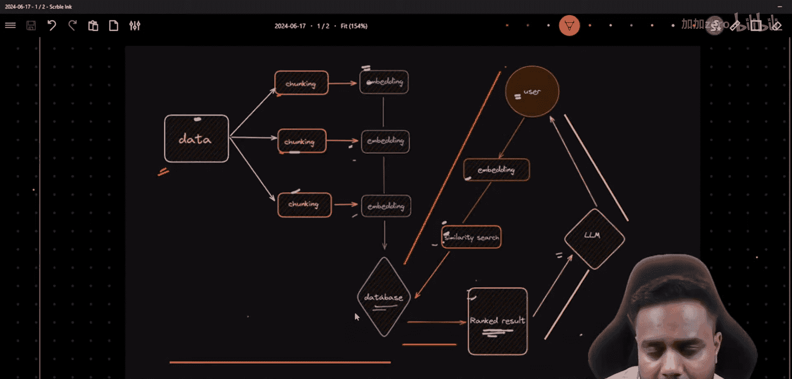
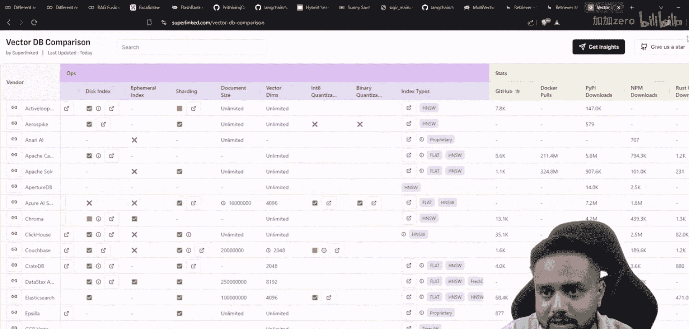
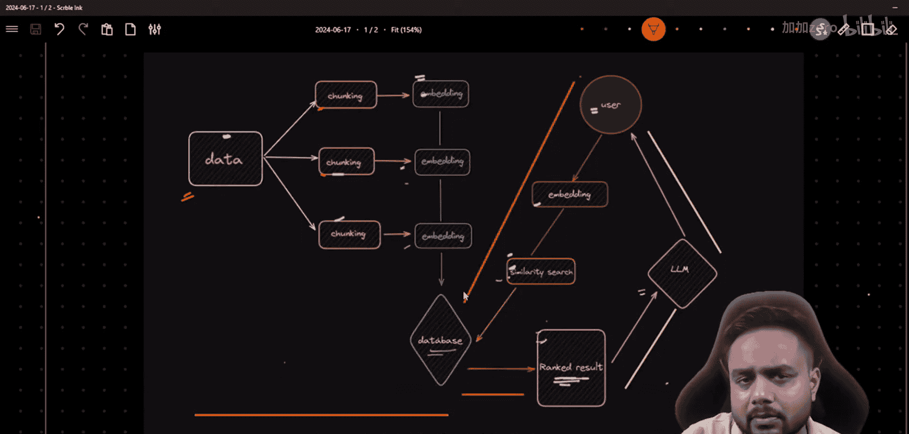
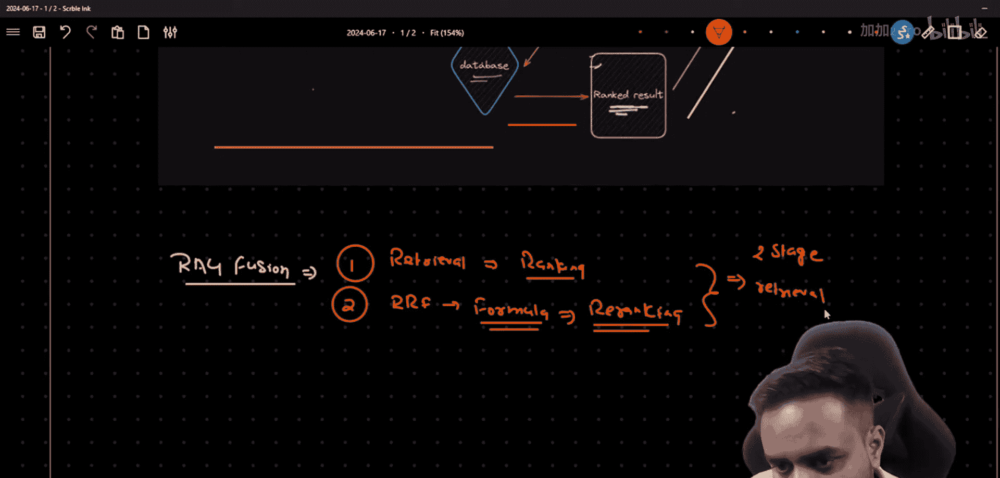
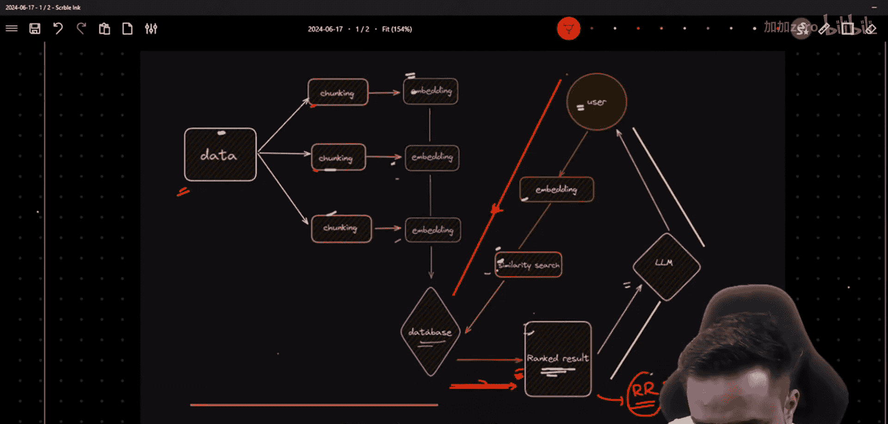
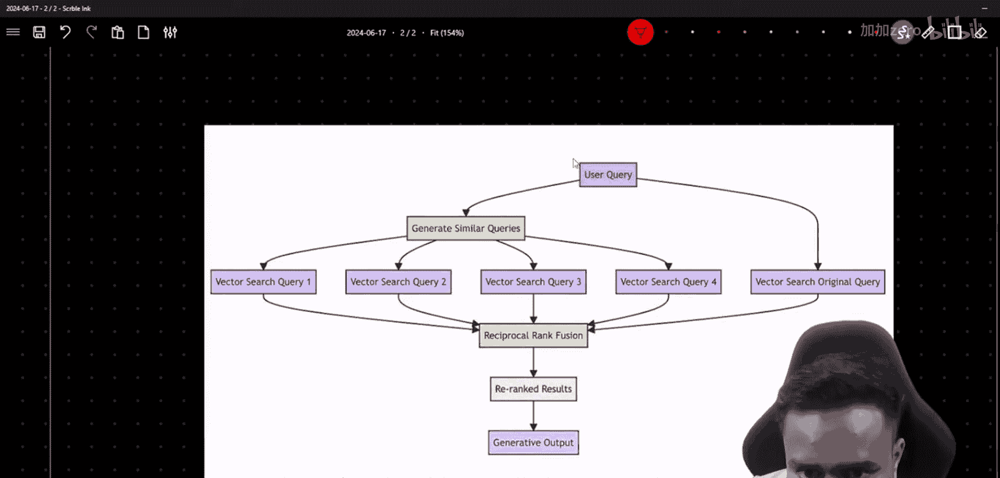

# 生成式AI：从初学者到专家：P43：高级RAG 06 - RAG融合（为你的RAG获取更相关的结果）｜ 重排序

在本节课中，我们将要学习RAG（检索增强生成）流程中的一个高级概念——RAG融合。我们将探讨如何通过结合多种检索结果来提升检索的相关性，并理解其背后的核心公式。

## 概述

RAG融合是一种旨在提升检索结果相关性的技术。它位于RAG流程的检索阶段，可以被视为一种两阶段检索或重排序方法。其核心思想是，通过融合来自不同检索方法或同一方法不同查询变体的结果，并利用特定公式重新排序，从而得到更优的最终结果列表。

## RAG架构回顾

在深入RAG融合之前，让我们先快速回顾一下标准的RAG架构，这有助于理解融合技术所处的位置。

RAG架构主要分为三个动态阶段：

1.  **数据摄入**：从数据收集到存入向量数据库。
2.  **检索**：根据用户查询从数据库中查找相关文档。
3.  **生成**：结合检索到的文档和原始查询，由大语言模型生成最终答案。

我们本节课的重点——RAG融合，就发生在**检索**阶段。更具体地说，它是在初次检索之后、将结果传递给生成模型之前的一个增强步骤。

## 什么是RAG融合？

RAG融合是一种两阶段检索技术。第一阶段进行标准的语义检索（例如使用向量搜索），得到初始的检索结果列表（称为“rank result”）。第二阶段则对这些结果进行“融合”与“重排序”。

这里的“融合”指的是合并或组合。在RAG融合的上下文中，它通常指合并来自多个不同查询（例如对原始查询进行改写或扩展后得到的多个查询）的检索结果。然后，使用一个特定的公式来计算每个文档的最终得分，并根据得分进行重新排序。

一个常用的融合公式是**倒数排名融合**。其核心思想是：一个文档在多个结果列表中的排名越靠前（即排名数字越小），其重要性应该越高。公式通过将文档在各个列表中的排名取倒数并求和，来计算其最终得分。

以下是RRF公式的简化表示：

**score(d) = Σ (1 / (k + rank_i(d)))**

其中：
*   `d` 代表一个文档。
*   `rank_i(d)` 是文档 `d` 在第 `i` 个检索结果列表中的排名（从1开始）。
*   `k` 是一个常数，通常设置为一个较小的值（如60），用于平滑处理，避免排名第一的文档权重过大。
*   对所有检索结果列表 `i` 进行求和。

最终，所有文档按照计算出的 `score(d)` 降序排列，得到重排序后的最终列表。

## RAG融合流程详解

现在，让我们一步步拆解RAG融合的工作流程。

1.  **生成多个查询**：首先，基于用户的原始查询，生成多个相关的查询变体。这可以通过大语言模型、同义词替换或其他查询扩展技术来完成。目的是从不同角度捕捉用户的意图。
2.  **并行检索**：使用这些生成的多个查询，并行地在向量数据库中进行检索。每个查询都会返回一个相关的文档列表。
3.  **应用RRF公式**：收集所有查询返回的文档列表。对于每一个出现的文档，根据它在**每个列表**中的排名，应用上述的倒数排名融合公式计算一个综合得分。
4.  **重排序与去重**：根据计算出的综合得分对所有文档进行降序排序。得分高的文档被认为更相关。同时，在这个过程中通常会进行去重，确保相同的文档只出现一次。
5.  **输出最终列表**：将重排序后的、最相关的文档列表作为增强后的检索结果，传递给后续的生成阶段。

通过这个过程，RAG融合能够克服单一查询可能存在的表述局限，聚合多角度的检索信息，从而提供更全面、更相关的结果。

## 总结

本节课我们一起学习了RAG融合技术。我们了解到，RAG融合是一种通过合并多个查询的检索结果并利用倒数排名融合公式进行重排序的高级检索策略。它位于RAG管线的检索阶段，能够有效提升检索结果的相关性和鲁棒性。理解这一概念是构建高效RAG应用的重要一步。在接下来的课程中，我们将继续探索其他高级检索技术。