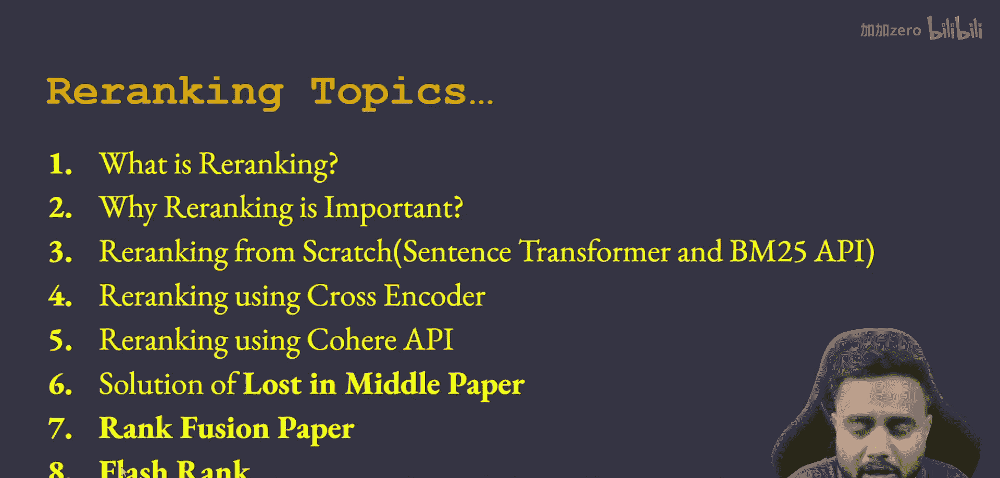
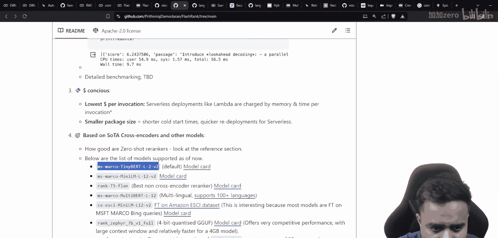
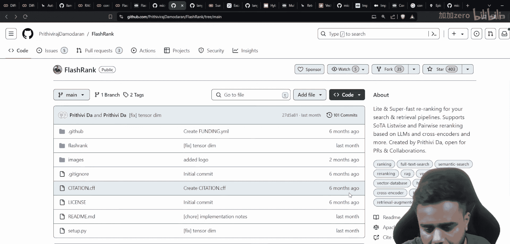
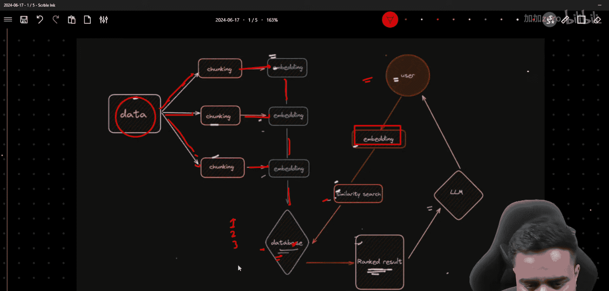

# 生成式AI：P44：高级RAG 07 - 用于超快速重排的Flash Reranker 🚀

在本节课中，我们将要学习一个名为 **Flash Reranker** 的重要且实用的概念，它用于优化RAG（检索增强生成）流程中的重排环节。我们将了解它的特点、优势以及如何在实际项目中应用。


---

## 课程概述 📋



首先，让我们回顾一下本系列课程中已涵盖的重排相关主题。我们讨论了重排的重要性，使用Sentence Transformer和BM25 API从零开始实现重排，探讨了使用交叉编码器进行重排，并介绍了Cohere API。随后，我们深入了一些高级概念，如“丢失与中间现象”、合并检索器、长上下文处理、顺序问题以及排名融合技术。排名融合技术能帮助我们构建非常健壮的检索流程。


现在，是时候探讨 **Flash Rank**（或称Fast Rank）了。我们将了解它是什么、由谁创建、在哪里可以找到相关代码和资源。

## Flash Rank项目介绍 🔍

Flash Rank是一个开源项目，由 **Prithivi Da** 创建。他在开源社区中非常知名，拥有多个备受瞩目的项目。Flash Rank这个仓库专门用于**重排**任务。

这个项目的一个重要特点是，它已经集成到了 **LangChain** 框架中。接下来，我们看看Flash Rank有哪些关键特性和模型。

### 项目特性与模型

根据项目的README文件，Flash Rank主要提供了四种类型的模型：
*   **Nano**
*   **Small**
*   **Medium**
*   **Large**


此外，该项目还具有以下特点：
*   **超快速**：执行效率极高。
*   **轻量级**：模型体积小。
*   **基于交叉编码器**：其核心利用了为重排任务设计的交叉编码器模型。

需要明确的是，Prithivi Da并未从头训练这些模型。他做的是将社区中已有的、优秀的轻量级重排模型**聚合**到了这个项目中，方便开发者在一个地方使用各种组合。这使得Flash Rank成为一个非常便捷的工具。

项目默认使用的模型是 **`ms-marco-TinyBERT-L-2-v2`**。这个模型非常轻量，大小仅为4MB左右，甚至可以在本地系统中运行。该模型最初由微软团队开发，基于MS MARCO（微软机器阅读理解）数据集训练，专门用于改善检索结果的相关性排序。

## 重排在RAG流程中的位置 🔄

在进入实践之前，让我们快速回顾一下重排在标准RAG流程中所处的位置，以便理解其重要性。

一个典型的RAG架构包含以下步骤：
1.  **数据处理**：将原始数据分割成多个文本块。
2.  **向量化**：使用嵌入模型将文本块转换为数值向量（嵌入）。
3.  **存储**：将这些向量存储到向量数据库中。
4.  **查询**：当用户提出问题时，将问题也转换为向量。
5.  **检索**：在向量数据库中进行语义搜索，找出与问题向量最相似的文本块（例如，返回前k个结果）。
6.  **重排**：**（Flash Rank在此处发挥作用）** 使用更精细的模型（如交叉编码器）对初步检索到的k个结果进行重新评分和排序，选出最相关的几个。
7.  **生成**：将重排后的顶级相关文本块与原始问题一起提供给大语言模型，生成最终答案。

因此，重排是位于初步检索和最终生成之间的一个关键优化步骤，旨在提升输入给大模型上下文的质量。

## 实践：安装与基本使用 💻




现在，让我们开始动手实践。我们将介绍如何安装Flash Rank库并进行基本使用。

以下是安装命令：
```bash
pip install flashrank
```

安装完成后，你可以按照以下步骤使用它：
1.  准备你的查询语句和初步检索到的文档列表。
2.  创建一个`Reranker`实例，通常使用默认的轻量级模型。
3.  调用`rerank`方法，传入查询和文档列表。
4.  该方法会返回一个重新排序后的文档列表，其中每个文档都附带了新的相关性分数。



项目仓库中提供了清晰的代码示例，展示了如何将查询和检索到的文档传递给重排器，并获得重排后的结果。你可以轻松地将Flash Rank集成到任何检索架构中，无论你使用哪种数据库或嵌入模型。

## 总结 🎯



本节课我们一起学习了**Flash Reranker**。我们了解了它是一个集成了多种轻量级、高性能重排模型的开源项目，旨在为RAG流程提供超快速的二次排序能力。我们回顾了重排在RAG管道中的关键作用，并概述了Flash Rank的特点和优势。通过将其集成到你的项目中，你可以有效提升检索结果的相关性，从而为后续的答案生成阶段提供更优质的上下文，最终改善整个系统的性能。