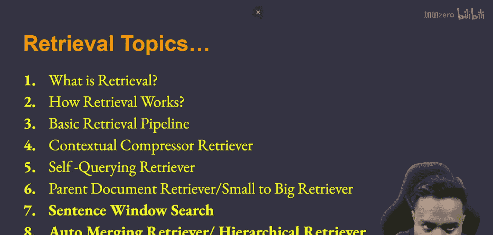
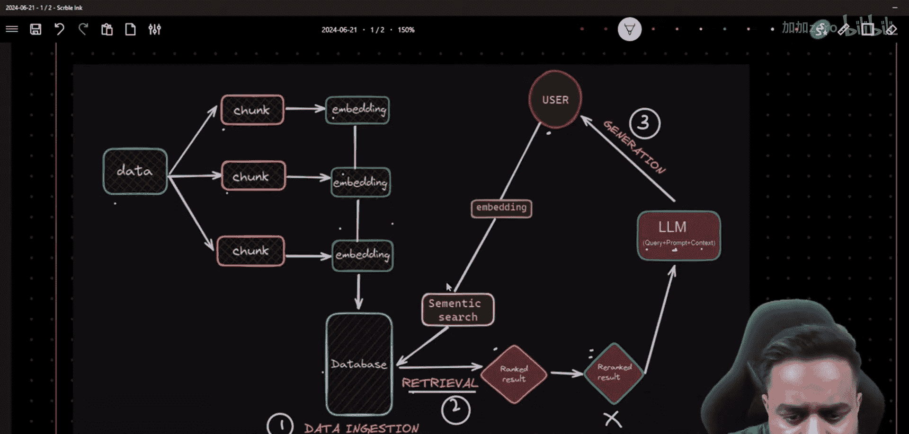
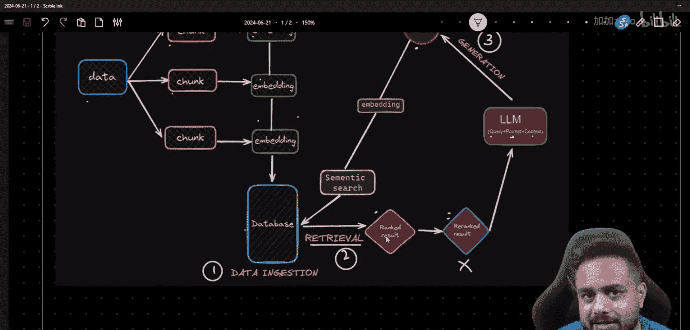
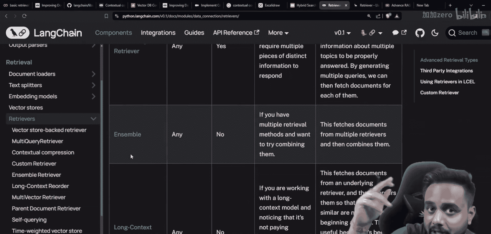

# 生成式AI：P45：强大的检索增强生成与上下文压缩检索

## 概述

在本节课中，我们将学习检索增强生成（RAG）流程中的核心环节——检索。我们将从理解检索的基本概念开始，逐步探讨不同的检索技术，并重点介绍LangChain中的上下文压缩检索器。通过本教程，你将掌握如何从向量数据库中高效地检索相关文档，以提升RAG系统的性能。

---


## 什么是检索？

上一节我们回顾了RAG的整体架构，本节中我们来看看检索的具体定义。在RAG流程中，检索是指根据用户的查询，从向量数据库中查找并返回最相关文档片段的过程。这是连接用户问题与知识库的关键步骤。

**检索的核心公式**可以概括为：
`相关文档 = 语义搜索(查询向量, 文档向量数据库)`

这个过程将用户的自然语言查询转化为向量表示，然后通过计算相似度，从预先存储的文档向量中找到最匹配的片段。

---

## 检索如何工作？




理解了检索的定义后，我们来深入其工作原理。检索工作主要依赖于语义搜索技术。系统首先将用户的查询文本通过嵌入模型转换为一个高维向量。同时，知识库中的所有文档片段也已被预先转换为向量并存储在向量数据库中。

系统通过计算查询向量与所有文档向量之间的相似度（例如使用余弦相似度），并返回相似度最高的前K个文档片段作为初步的检索结果。这个结果通常被称为“排序结果”。

---


## 基础检索流程

在探讨高级技术之前，我们先回顾基础检索流程。以下是构建一个基础RAG检索系统的主要步骤：

1.  **数据准备与分块**：将原始文档分割成更小的、语义连贯的文本块。
2.  **生成嵌入**：使用嵌入模型为每个文本块生成向量表示。
3.  **向量存储**：将所有文本块及其对应的向量存入向量数据库。
4.  **查询处理**：当用户发起查询时，将查询文本同样转换为向量。
5.  **相似度搜索**：在向量数据库中执行相似度搜索，找出与查询向量最相似的文本块。
6.  **返回结果**：将检索到的相关文本块作为上下文，传递给大语言模型以生成最终答案。

这个流程是大多数RAG应用的起点。

---

## 上下文压缩检索器

基础检索虽然有效，但有时返回的文档块可能包含冗余或不相关信息。本节中我们来看看一种更智能的检索方法——上下文压缩检索器。这是LangChain提供的一种强大工具，旨在对检索到的文档进行“压缩”，只保留与查询最相关的部分。

其核心思想是：先通过基础检索器获取一批可能相关的文档，然后使用一个独立的LLM或提取链来过滤或总结每个文档，仅保留对回答当前查询有用的信息。这可以减少传递给最终生成模型的噪音和冗余内容。

**上下文压缩检索器的工作流程代码描述**：
```python
# 伪代码示意
base_retriever = VectorStoreRetriever(...) # 基础检索器
compressor = LLMChainExtractor(...) # 文档压缩器
compression_retriever = ContextualCompressionRetriever(
    base_compressor=compressor,
    base_retriever=base_retriever
)
# 使用压缩检索器进行检索
compressed_docs = compression_retriever.get_relevant_documents(query)
```

这种方法在保证召回率的同时，显著提升了检索结果的相关性。

---





## 总结



本节课中我们一起学习了RAG流程中的检索环节。我们从检索的基本概念和工作原理出发，回顾了基础的检索流程。随后，我们重点介绍了LangChain中的上下文压缩检索器，它通过在后处理阶段过滤冗余信息，能够提供更精准、更简洁的上下文文档，从而帮助大语言模型生成更高质量的答案。掌握这些检索技术是构建高效RAG系统的重要基础。在接下来的课程中，我们将继续探索其他高级检索方法。