# 生成式AI：P46：强大的自查询检索器RAG

在本节课中，我们将学习高级检索增强生成中的一个重要技术：自查询检索器。我们将从基础的RAG流程开始，理解其局限性，然后深入探讨自查询检索器的工作原理，最后通过实践演示如何实现它。

## 基础RAG流程回顾

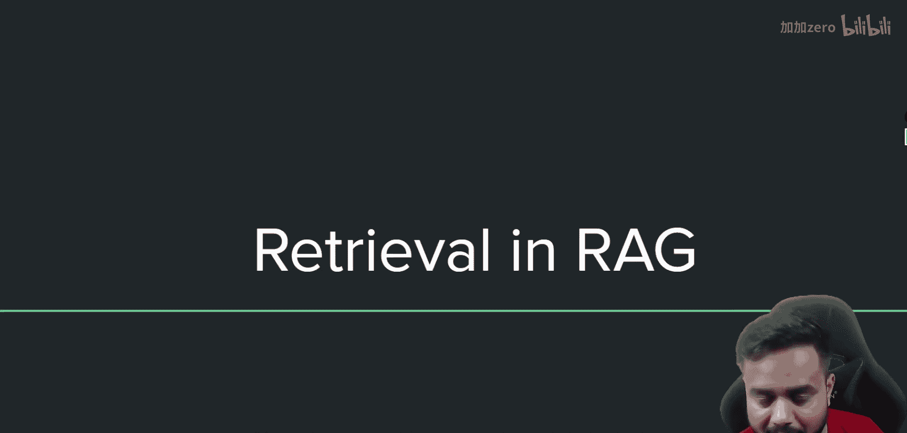

上一节我们介绍了上下文压缩检索器，本节我们先来回顾基础的RAG流程，这是理解后续高级技术的基础。

以下是基础RAG流程的核心步骤：

1.  **数据收集**：从各种来源收集数据。
2.  **文本分块**：将长文档分割成更小的、可管理的片段。
3.  **向量化**：为每个文本块生成嵌入向量。这是为了将文本存储在向量数据库中并执行相似性搜索。
4.  **存储**：将文本块及其对应的嵌入向量存入向量数据库。
5.  **检索**：当用户提出查询时，将查询转换为嵌入向量，并在向量数据库中进行相似性搜索，找出与查询向量最相似的文本块。
6.  **生成**：将检索到的相关文本块与原始查询一起提供给大语言模型，以生成最终答案。

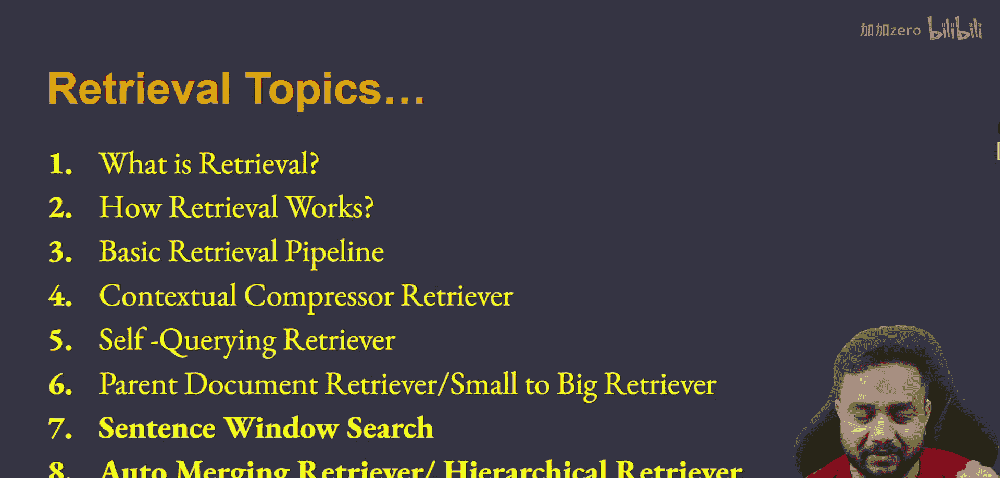

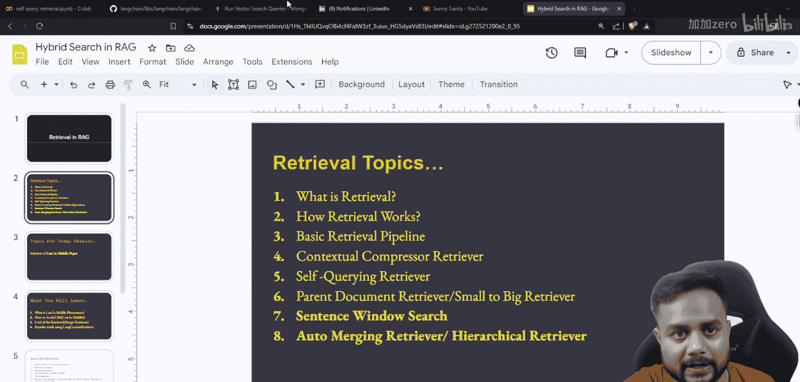

这个流程可以用一个简单的架构图表示：

```
用户查询 -> [向量化查询] -> [向量数据库：相似性搜索] -> [检索最相似的结果] -> [获取对应原始文档] -> 输出给LLM
```


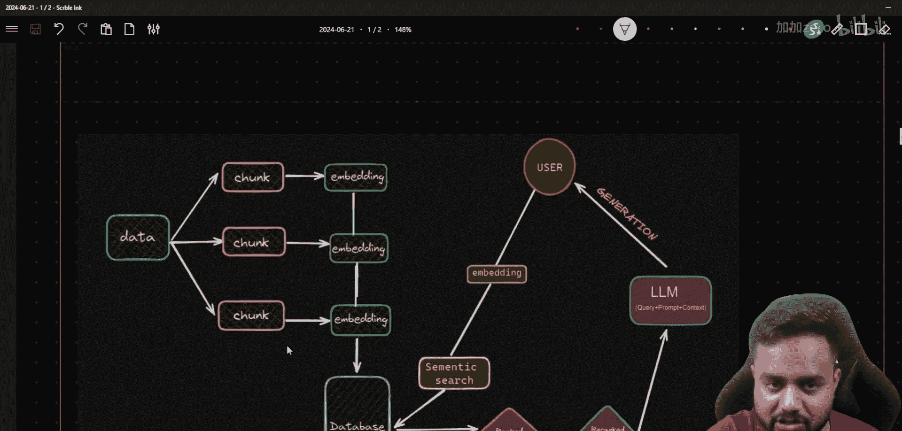

基础流程在数据具有线性且各部分间没有强依赖关系时非常有效。例如，一本书的页面内容通常是顺序的，第5页的内容不太可能直接依赖于第15页的内容。

然而，基础相似性搜索方法存在一些局限性：

*   **相关性不足**：它可能只返回与查询在词汇上最相似的文本块，但这些块在语义上可能与查询意图不相关。
*   **缺乏上下文理解**：搜索仅基于查询的词汇表示，无法理解查询可能依赖于其他未直接匹配的文本块。

## 自查询检索器理论

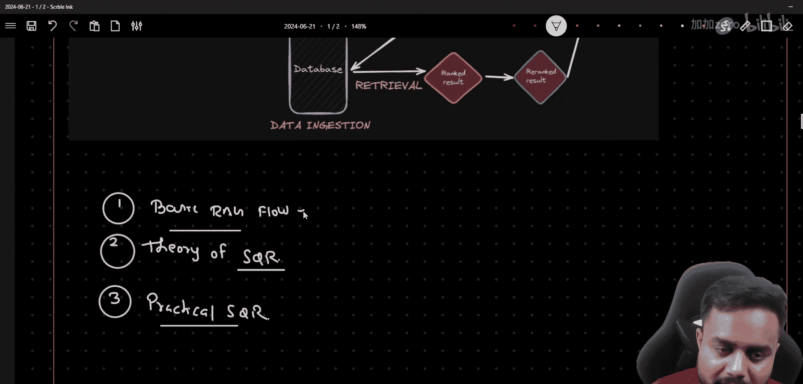

了解了基础RAG的局限性后，本节我们来看看自查询检索器如何解决这些问题。

自查询检索器的核心思想是：让大语言模型自动将用户的自然语言查询**分解**成两部分：
1.  一个用于向量搜索的**语义查询**。
2.  一个用于对元数据进行过滤的**过滤器**。

这意味着，除了文档内容本身，我们还需要为每个文档块存储**元数据**（例如，作者、创建日期、类别、页码等）。自查询检索器会解析用户查询，提取出那些指向元数据过滤条件的部分。

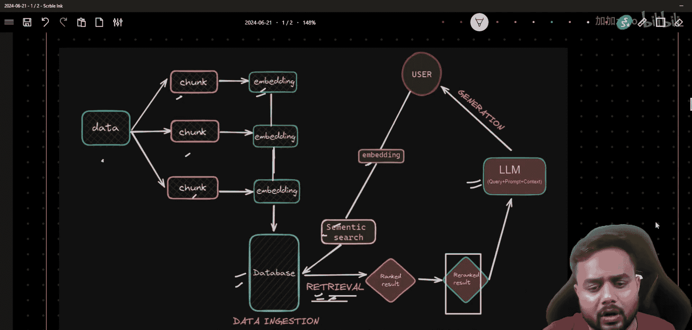

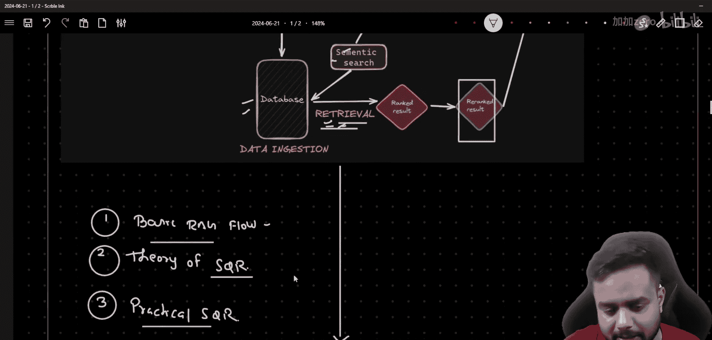

其工作架构如下：

```
用户查询（自然语言）
        ↓
[自查询检索器]
        ↓
        ├──> 提取的语义查询（用于向量相似性搜索）
        └──> 提取的过滤器（用于对元数据字段进行过滤，例如：`author == “Sunny“`）
        ↓
        ↓
[向量数据库]
（同时应用：语义查询 + 元数据过滤器）
        ↓
[检索出既语义相关又符合过滤条件的文档]
```

例如，对于用户查询：“Find documents about machine learning written by Sunny after 2023”。
*   **语义查询**部分可能是：“machine learning”。
*   **过滤器**部分可能是：`{“author“: “Sunny“, “year“: {“$gt“: 2023}}`。

这样，检索过程就变得更加精确和可控，能够更好地理解用户的复杂意图。

## 自查询检索器实践

理论部分我们已经清楚了自查询检索器如何工作，本节我们将通过代码实践来具体实现它。

以下是实现自查询检索器的关键步骤：

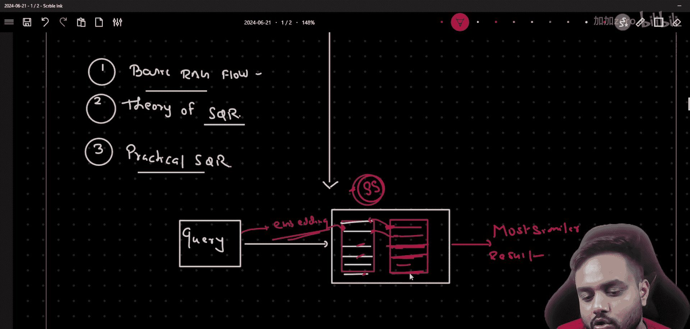

1.  **准备带元数据的文档**：确保你的文档块在存入向量数据库时附带了元数据。
2.  **定义元数据结构**：明确告诉检索器你的文档有哪些元数据字段及其类型（如字符串、整数等）。
3.  **初始化自查询检索器**：使用LangChain等框架提供的`SelfQueryRetriever`类，并为其配备一个大语言模型（用于解析查询）和一个向量存储（用于执行搜索）。
4.  **进行查询**：像普通检索器一样使用它，它会自动处理查询的分解和过滤。

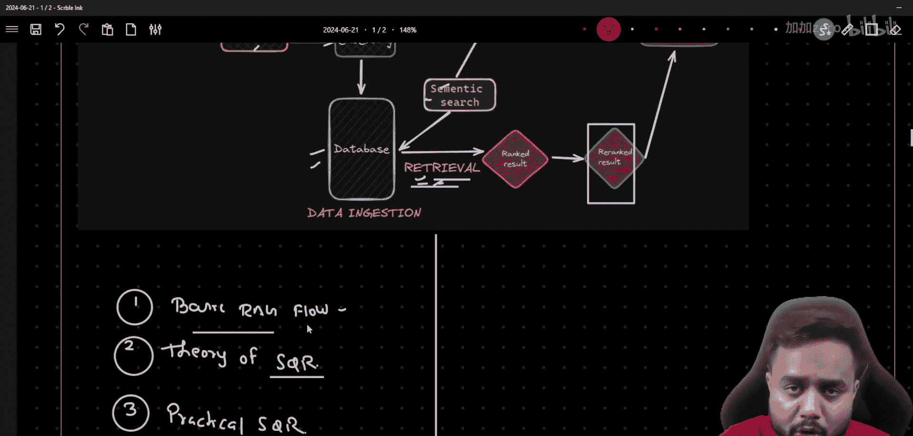

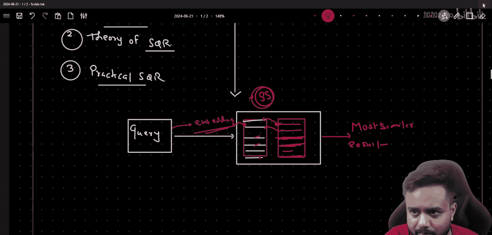

一个简化的代码框架如下：

```python
from langchain.vectorstores import Chroma
from langchain.embeddings import OpenAIEmbeddings
from langchain.llms import OpenAI
from langchain.retrievers.self_query.base import SelfQueryRetriever
from langchain.chains.query_constructor.base import AttributeInfo

# 1. 定义元数据字段信息
metadata_field_info = [
    AttributeInfo(
        name=“author“,
        description=“The author of the document“,
        type=“string“,
    ),
    AttributeInfo(
        name=“year“,
        description=“The year the document was written“,
        type=“integer“,
    ),
]

# 2. 初始化LLM和向量存储
llm = OpenAI(temperature=0)
embeddings = OpenAIEmbeddings()
vectorstore = Chroma(embedding_function=embeddings, ...) # 假设已存入带元数据的文档

# 3. 创建自查询检索器
document_content_description = “Documents about various topics“
retriever = SelfQueryRetriever.from_llm(
    llm,
    vectorstore,
    document_content_description,
    metadata_field_info,
)

# 4. 进行查询
docs = retriever.get_relevant_documents(“Find machine learning docs by Sunny after 2023“)
```

通过这种方式，我们可以构建出更强大、更智能的RAG系统，能够准确响应包含过滤条件的复杂查询。

## 总结

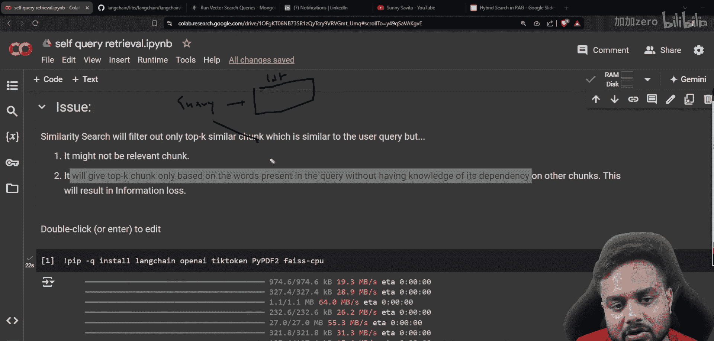

本节课中我们一起学习了自查询检索器。我们从基础RAG流程及其局限性出发，深入探讨了自查询检索器的工作原理——通过LLM将自然语言查询解析为语义查询和元数据过滤器，从而实现更精准的检索。最后，我们通过实践步骤了解了如何用代码实现这一技术。掌握自查询检索器将帮助你构建能够理解复杂用户意图的高级RAG应用。