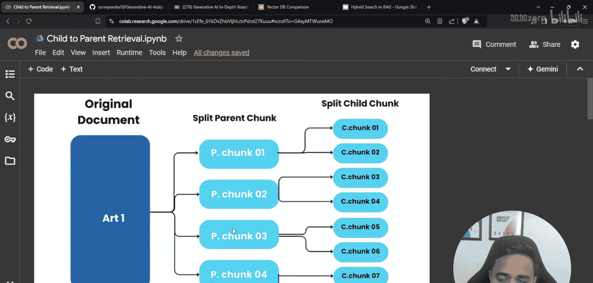
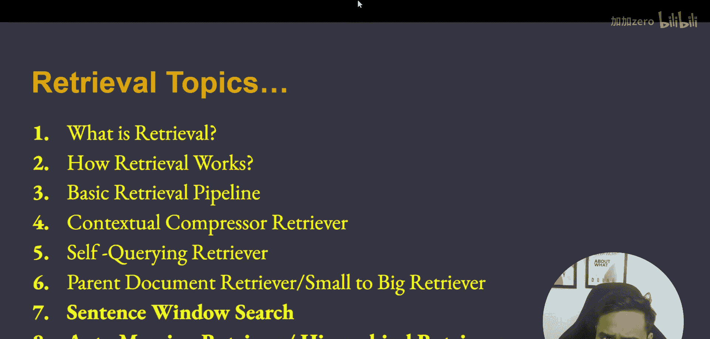
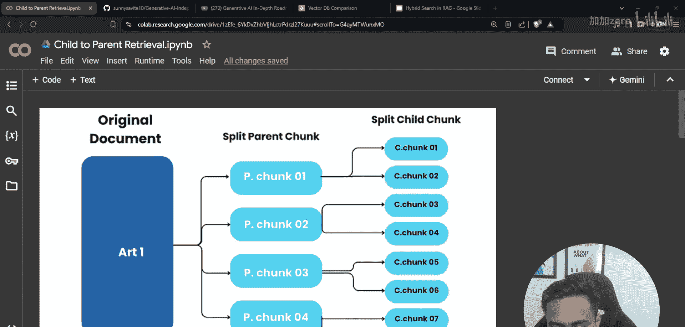
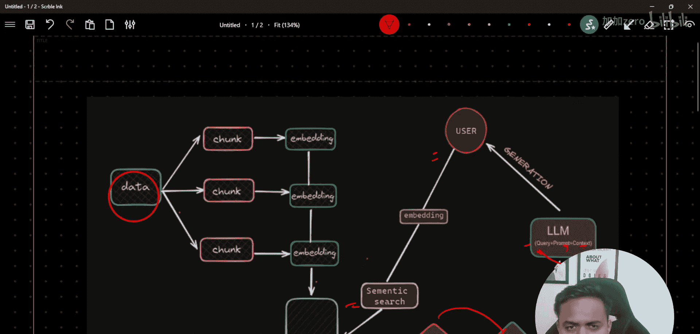

生成式AI：P47：强大的父文档检索器RAG 🧠

在本节课中，我们将学习一种名为“父文档检索器”或“子到父检索”的高级检索增强生成技术。我们将探讨其核心概念、工作原理，并通过简单的示例帮助你理解如何应用它来提升RAG系统的性能。

---

### 概述

上一节我们介绍了自查询检索技术。本节中，我们来看看另一种强大的检索方法——父文档检索器。这种方法的核心思想是通过检索较小的文本片段来定位信息，然后将其“父级”的更大上下文提供给大语言模型，从而在保证检索精度的同时，提供更丰富的背景信息。


### 基本RAG流程回顾

在深入父文档检索之前，有必要快速回顾一下基础的RAG流程。理解这个流程是掌握所有高级检索技术的基础。

1.  **数据摄取**：将原始数据分割成多个较小的文本块。
2.  **嵌入与存储**：为每个文本块生成向量嵌入，并将其存入向量数据库。
3.  **检索**：当用户提出查询时，将查询向量化，并在数据库中执行相似性搜索，找出最相关的文本块。
4.  **排序与重排序**：对检索出的结果按相关性进行排序，有时还会使用更复杂的模型进行重排序以提升质量。
5.  **生成**：将排序后的文本块（作为上下文）与用户查询一起，通过提示词指令传递给大语言模型，生成最终答案。


### 什么是父文档检索器？

父文档检索器解决了RAG中的一个常见难题：如何在检索精度和上下文完整性之间取得平衡。

*   **问题**：如果将文档分割成很小的块，检索精度高，但每个块可能缺乏足够的上下文，导致LLM无法准确理解或回答。
*   **解决方案**：父文档检索器采用两级策略：
    1.  首先，将文档分割成**小的子块**用于检索。
    2.  然后，在检索到相关子块后，返回其所属的**更大的父块**作为上下文。

**核心关系可以表示为：**
`父文档` -> 包含多个 -> `子文档`
当查询匹配到某个`子文档`时，系统会返回其对应的`父文档`作为给LLM的上下文。

### 父文档检索器的工作原理

以下是该方法的关键步骤：





1.  **文档分割**：采用分层分割策略。
    *   首先，将原始文档按较大粒度（如章节、段落）分割成**父文档**。
    *   然后，将每个父文档进一步细分为更小的**子文档**。

2.  **嵌入与索引**：
    *   仅为**子文档**生成向量嵌入，并建立索引。这是因为小文档的嵌入通常能更精确地匹配查询意图。
    *   **父文档**本身不生成嵌入，但系统会记录每个子文档与其父文档的从属关系。

3.  **检索过程**：
    *   用户查询时，系统在**子文档**的向量空间中进行相似性搜索。
    *   检索出最相关的K个子文档。
    *   系统根据映射关系，找到这些子文档对应的**父文档**。



4.  **上下文构建与生成**：
    *   将检索到的**父文档**（而不是子文档）组合起来，形成送给LLM的上下文。
    *   这样，LLM获得的上下文信息更完整，有助于生成更准确、连贯的回答。

### 为何使用父文档检索器？

以下是采用这种技术的主要优势：


*   **平衡精度与上下文**：用小文档检索保证精度，用大文档提供上下文。
*   **减少幻觉**：更完整的上下文能帮助LLM更好地理解信息边界，减少编造内容。
*   **处理复杂查询**：对于需要跨段落理解才能回答的问题，父文档能提供必要的背景联系。

### 代码概念示例



以下是一个简化的伪代码逻辑，展示了父文档检索的核心思想：

```python
# 1. 分割文档
parent_docs = split_document_into_large_chunks(original_doc)
child_docs = []
for parent in parent_docs:
    children = split_into_small_chunks(parent)
    child_docs.extend(children)
    # 记录父子关系
    store_parent_child_mapping(parent, children)

# 2. 为子文档创建嵌入并存储
child_embeddings = create_embeddings(child_docs)
vectorstore.add_documents(child_docs, child_embeddings)

# 3. 检索时
query = “用户的问题”
# 在子文档中检索
retrieved_child_docs = vectorstore.similarity_search(query, k=5)
# 获取对应的父文档
context_docs = get_parent_documents(retrieved_child_docs)

# 4. 生成答案
prompt = build_prompt(context=context_docs, query=query)
answer = llm.generate(prompt)
```

### 总结

本节课中我们一起学习了父文档检索器。我们回顾了基础RAG流程，然后重点探讨了父文档检索器如何通过“子块检索，父块提供上下文”的两级策略，巧妙地解决了检索精度与上下文完整性之间的矛盾。这种方法使RAG系统能够更智能地处理需要深层理解的查询，是构建高效、可靠问答系统的重要工具之一。



在接下来的课程中，我们将继续探索其他高级检索技术，例如句子窗口检索。