# 生成式AI：P48：使用Llama 3.1、Langchain、FAISS和Ollama构建端到端RAG系统 🚀

## 概述
在本节课中，我们将学习如何构建一个强大的检索增强生成（RAG）系统。我们将使用Meta最新发布的开源大语言模型Llama 3.1作为核心，并结合Langchain框架、FAISS向量数据库以及Ollama本地模型服务工具，创建一个完整的端到端解决方案。

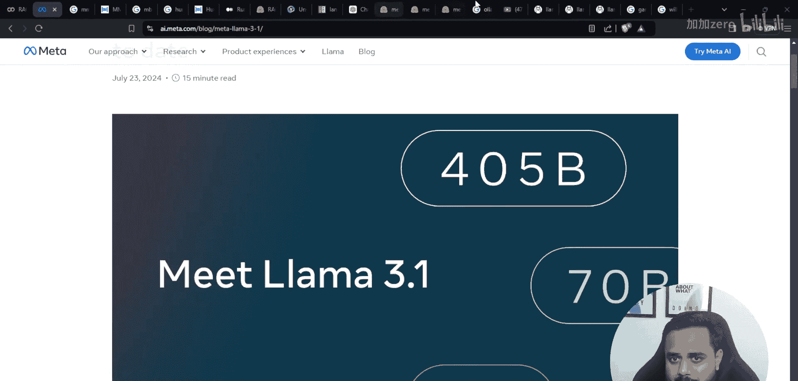

---

## Llama 3.1模型介绍

上一节我们概述了课程目标，本节中我们来看看我们将要使用的核心模型——Llama 3.1。

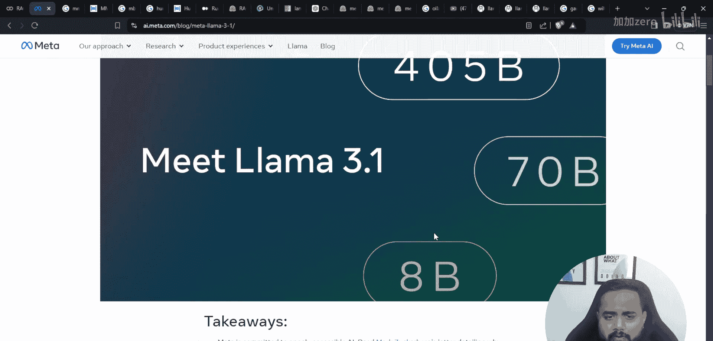

Meta公司发布了全新的Llama 3.1模型。这是一个完全开源的大语言模型，并且提供了多种不同的变体版本。

以下是关于Llama 3.1的一些关键信息：
*   **参数量**：该系列中最高端的变体拥有约405亿个参数，规模相当庞大。
*   **上下文长度**：模型的上下文长度为128K个令牌。

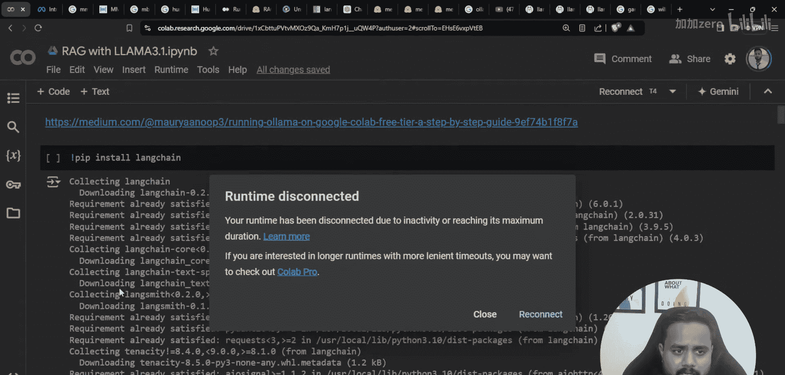

现在我们来解释一下什么是上下文长度。上下文长度或上下文窗口，指的是能够输入给大语言模型的最大数据量或令牌数量。

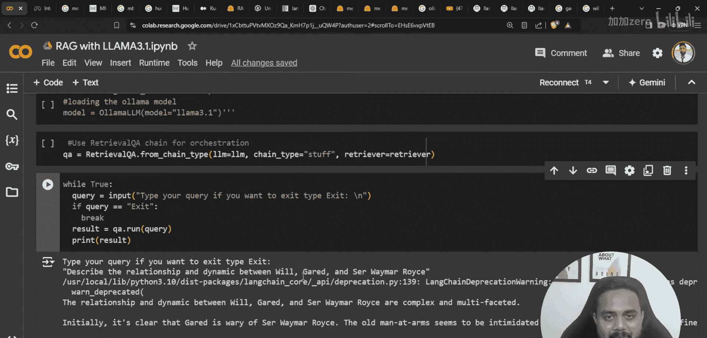

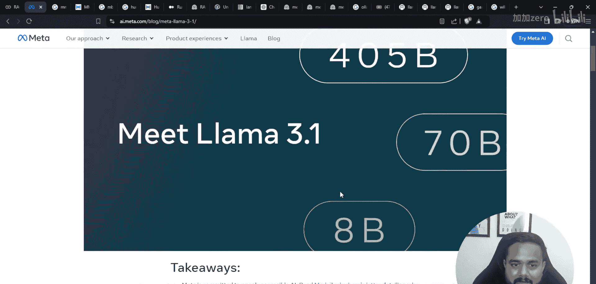

例如，GPT-3.5模型的上下文窗口约为4096个令牌，这大致相当于3000个单词或6页文本。在AI领域，一个令牌的定义可能因平台和模型而异，但通常一个令牌大约相当于一个单词平均长度的75%，即大约3到4个字符。

因此，上下文窗口的定义可以理解为模型能够处理的输入和输出令牌的总数。

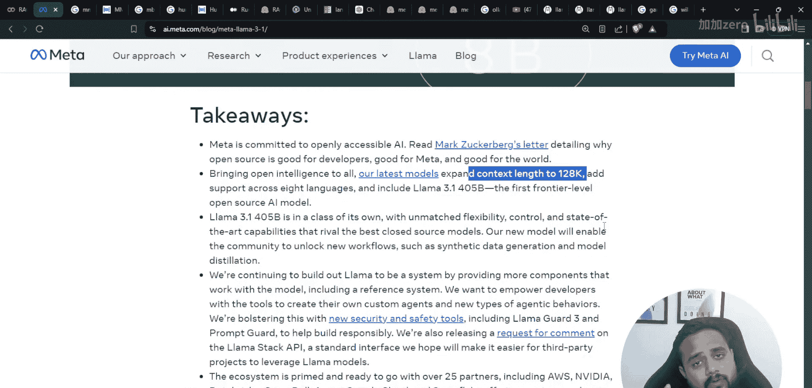

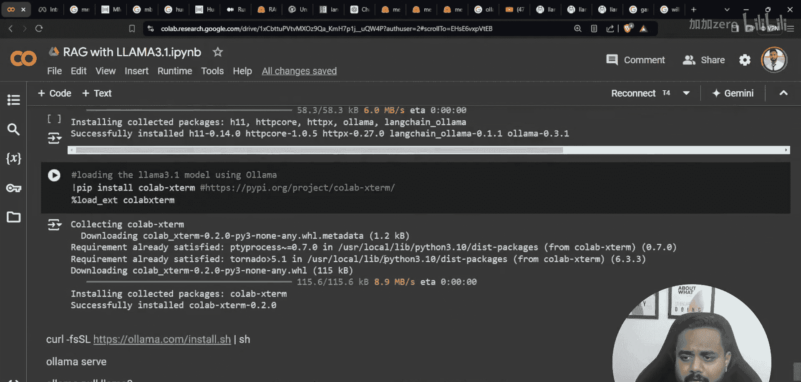

---

## 模型评估与基准测试

了解了模型的基本参数后，我们来看看如何评估它的能力。模型通常在标准的基准数据集上进行评估，以衡量其性能。

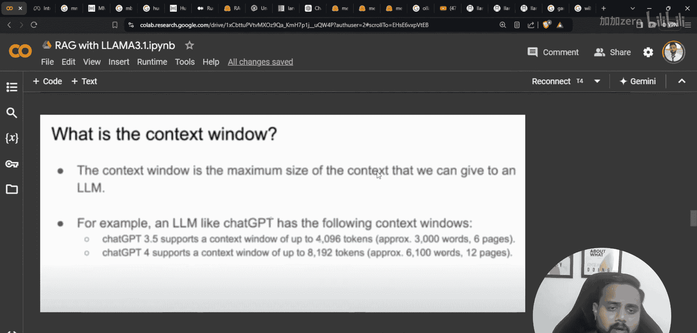

Llama 3.1在多个著名的基准数据集上进行了测试，包括：
*   **MMLU**：大规模多任务语言理解数据集。
*   **HumanEval**：代码生成能力评估数据集，包含约1000个Python编程问题。
*   **GSM8K**：数学推理数据集。

这些基准数据集由研究社区或特定组织创建，用于在全球范围内验证和比较不同模型的性能。模型在这些数据集上得分越高，通常代表其综合能力越强。每个基准数据集都有其对应的研究论文，可供深入查阅。

---

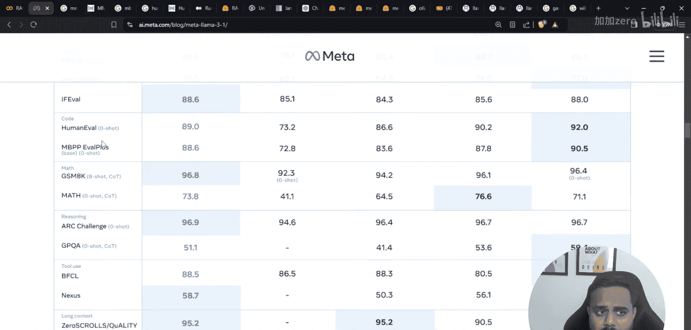

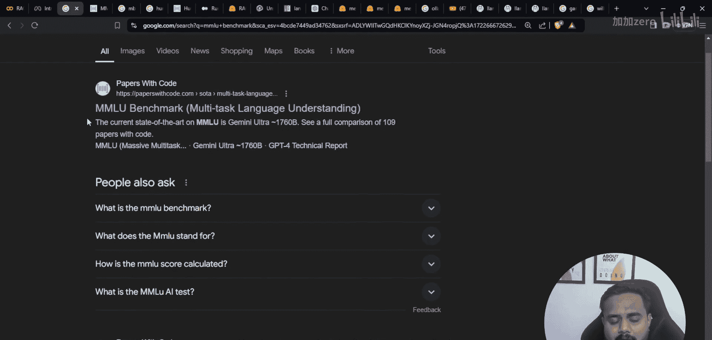

## 模型的核心能力与应用场景

除了基准测试成绩，了解模型支持哪些功能对于实际应用至关重要。Llama 3.1基于Transformer架构，代码完全开源。

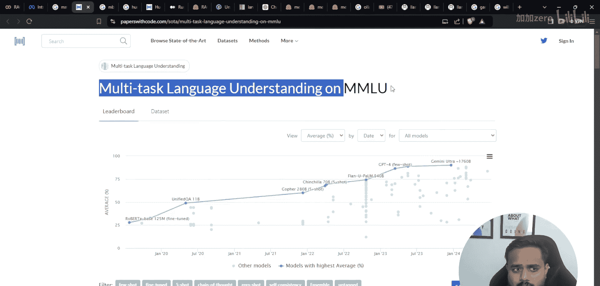

以下是该模型支持的一些重要功能和应用场景：
*   **实时与批量推理**：你可以直接加载模型并进行预测。
*   **监督式微调**：可以对模型进行微调，以适应特定领域或任务。
*   **持续预训练**：甚至可以修改模型的底层结构。
*   **检索增强生成**：这是我们本节课将要重点实现的功能。
*   **智能体开发**：可以用于构建AI智能体。
*   **函数调用**：能够调用第三方API。
*   **合成数据生成**：这是一个非常重要且流行的应用方向。

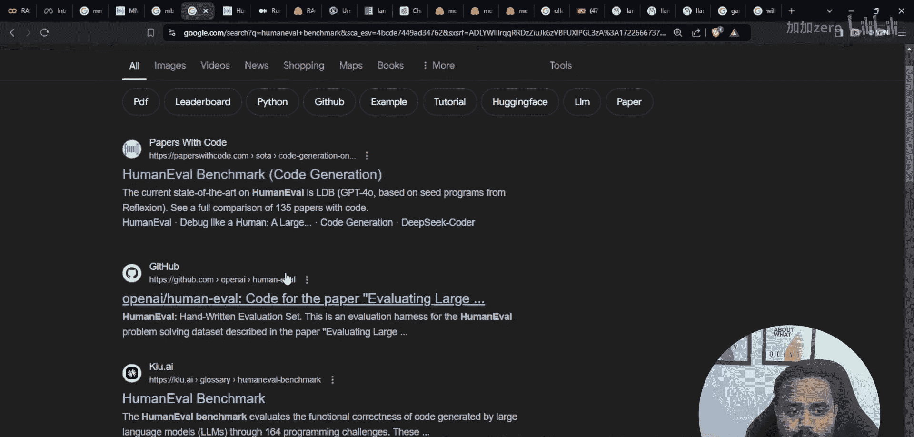

该模型可以在多个主流平台上访问和使用，例如AWS、Databricks、Hugging Face等。

---

## 如何获取与使用模型

在开始构建RAG系统之前，我们需要知道如何获取Llama 3.1模型。官方提供了多种途径。

你可以直接从Meta的官方网站或Hugging Face平台下载模型、阅读研究论文并获取源代码。在本教程的实践中，我们将通过Hugging Face来访问这个模型。

---

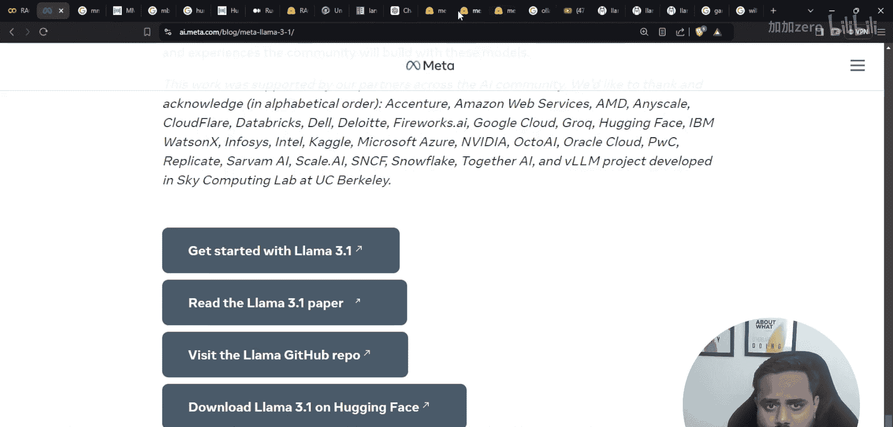

## 总结
本节课我们一起学习了Meta Llama 3.1大语言模型的基本特性，包括其庞大的参数量、超长的上下文窗口以及在标准基准测试上的表现。我们还了解了它支持的各种强大功能，如微调、RAG和函数调用等，并知道了如何从官方渠道获取该模型。这些知识为我们接下来动手构建端到端的RAG系统打下了坚实的基础。