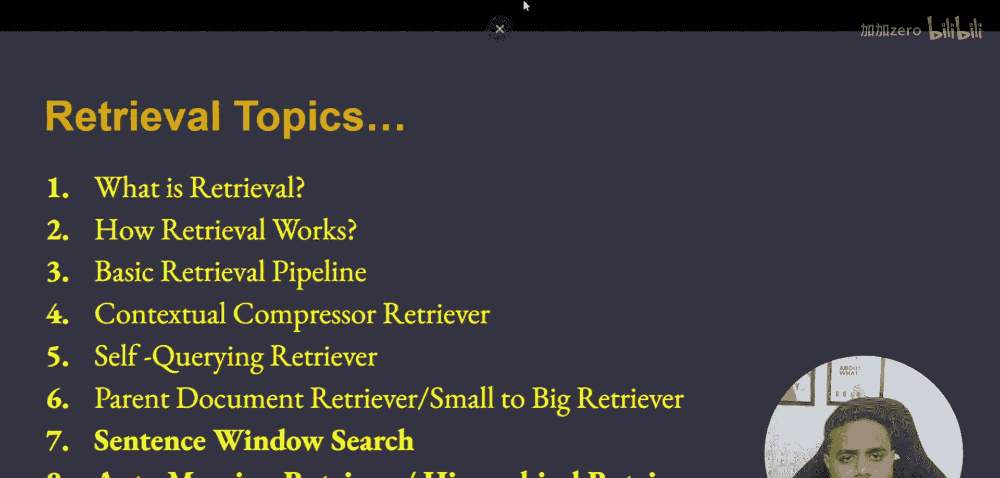
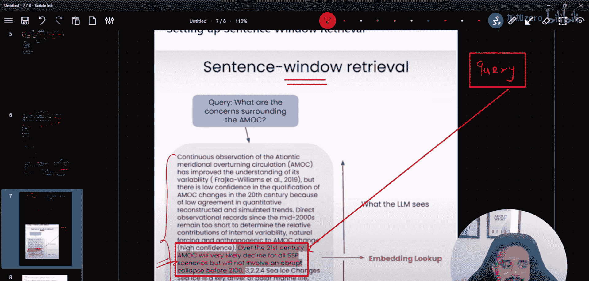
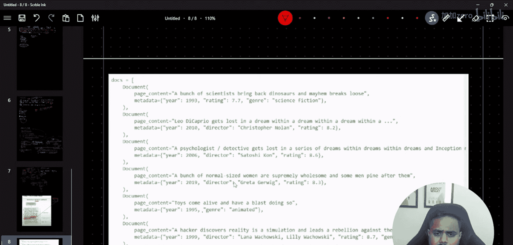
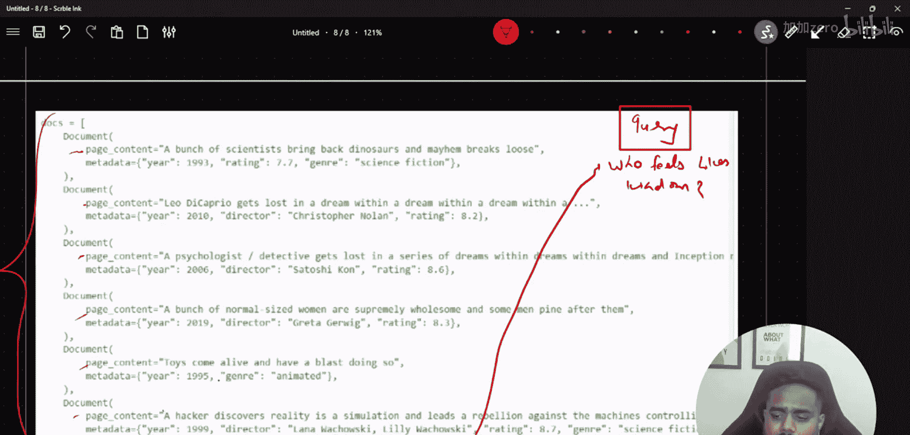
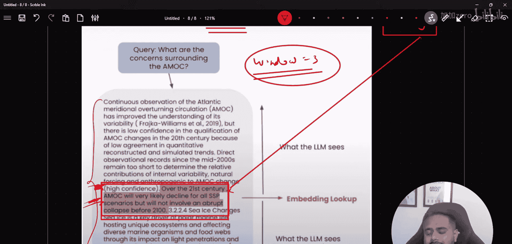
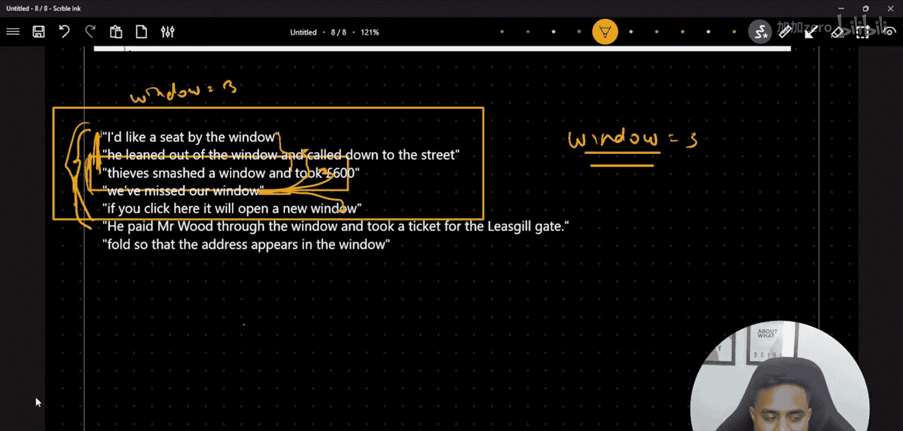
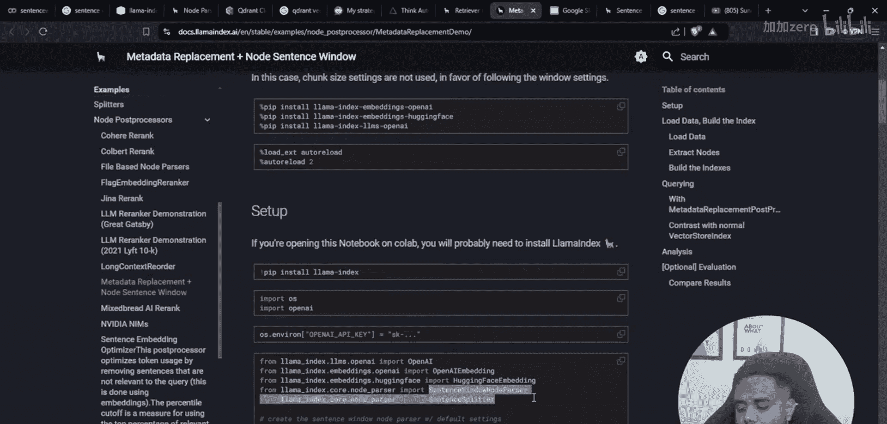
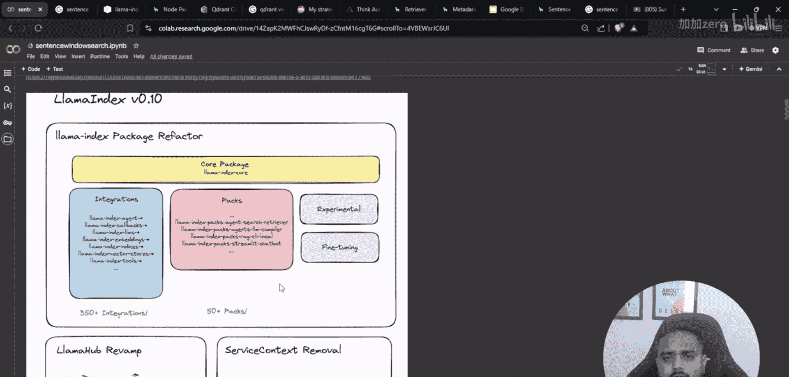

# 生成式AI：P49：使用句子窗口检索器构建强大的RAG系统

在本节课中，我们将学习一种名为“句子窗口检索”的高级检索增强生成技术。我们将了解其核心概念、工作原理，并通过代码示例展示如何利用LlamaIndex框架实现它。

上一节我们介绍了不同的检索技术，本节中我们来看看句子窗口检索。

## 句子窗口检索的核心概念

句子窗口检索是一种改进的检索方法。在基础检索中，系统根据查询找到最相关的文本片段（或“块”）并直接使用。而句子窗口检索在找到最相关的句子后，会额外获取该句子周围一定范围内的上下文内容。这个范围被称为“窗口”。

**核心公式**：
`检索内容 = 最相关句子 + 其前后各N个句子（窗口大小）`

例如，如果窗口大小设置为3，并且系统找到了一个最相关的句子，那么它最终会检索并返回以该句子为中心、前后各3个句子的完整文本块。


以下是其工作流程的简要说明：
1.  用户提出一个查询。
2.  检索系统在向量数据库中寻找与查询语义最相似的**单个句子**。
3.  系统不是只返回这个句子，而是根据预设的窗口大小，获取该句子前后一定数量的相邻句子。
4.  这个扩展后的上下文窗口被传递给大语言模型，用于生成最终答案。

这种方法的好处在于，它能提供更丰富的上下文信息，帮助大语言模型更好地理解核心句子的含义和背景，从而生成更准确、连贯的回答，尤其能减少因信息碎片化导致的“幻觉”问题。




## 使用LlamaIndex实现句子窗口检索

现在，让我们看看如何用代码实现这个技术。我们将使用LlamaIndex框架，它提供了构建RAG系统的丰富工具。

首先，我们需要安装必要的库并设置环境。

```python
# 导入必要的库
import os
from llama_index.core import VectorStoreIndex, SimpleDirectoryReader, Settings
from llama_index.embeddings.openai import OpenAIEmbedding
from llama_index.llms.openai import OpenAI
from llama_index.core.node_parser import SentenceWindowNodeParser

# 设置OpenAI API密钥（请替换成你自己的密钥）
os.environ["OPENAI_API_KEY"] = "your-api-key-here"



# 配置全局设置：嵌入模型和LLM
Settings.embed_model = OpenAIEmbedding()
Settings.llm = OpenAI(model="gpt-3.5-turbo")
```

接下来，我们加载文档并应用句子窗口解析器。这个解析器负责将文档分割成句子，并为每个句子创建带有扩展窗口的节点。



```python
# 1. 加载文档
documents = SimpleDirectoryReader(input_dir="./your_data_folder").load_data()

# 2. 创建句子窗口节点解析器
# window_size=3 意味着每个节点包含中心句子及其前后各3个句子
node_parser = SentenceWindowNodeParser.from_defaults(
    window_size=3,
    window_metadata_key="window",
    original_text_metadata_key="original_sentence",
)

# 3. 将文档解析为节点
nodes = node_parser.get_nodes_from_documents(documents)
```



解析完成后，我们需要将这些节点存入向量数据库并创建索引。

```python
# 4. 创建向量存储索引
sentence_index = VectorStoreIndex(nodes)

# 5. 创建检索器
# 这里配置它返回前2个最相似的节点
sentence_retriever = sentence_index.as_retriever(similarity_top_k=2)
```

当进行查询时，检索器会找到最相关的句子节点。但节点中存储的是扩展后的窗口文本。我们需要一个后处理步骤，从返回的节点中提取出最核心的原始句子，以便在提示词中清晰标注。



```python
from llama_index.core.postprocessor import MetadataReplacementPostProcessor

# 6. 创建元数据替换后处理器
# 它的作用是将节点中的完整窗口文本，替换回其中最初匹配查询的那个原始句子。
# 这样，在构造给LLM的上下文时，我们能明确知道哪部分是直接相关的核心信息。
postprocessor = MetadataReplacementPostProcessor(
    target_metadata_key="window" # 指定包含完整窗口文本的元数据字段
)
```



最后，我们将所有组件组合成一个查询引擎。

```python
# 7. 组合检索器与后处理器，构建查询引擎
query_engine = sentence_index.as_query_engine(
    retriever=sentence_retriever,
    node_postprocessors=[postprocessor]
)

# 8. 进行查询
response = query_engine.query("你的问题是什么？")
print(response)
```

在这个流程中，`MetadataReplacementPostProcessor` 扮演了关键角色。它确保传递给LLM的上下文，在包含丰富背景信息（窗口）的同时，也清晰地指明了查询直接匹配到的核心句子。

## 技术总结

本节课中我们一起学习了句子窗口检索技术。我们首先理解了它的核心思想：**在检索时，不仅返回最相关的句子，还包含其周围一定窗口大小的上下文**。这有助于为大语言模型提供更充分的背景信息。



接着，我们使用LlamaIndex框架逐步实现了该技术，关键步骤包括：
1.  使用 `SentenceWindowNodeParser` 创建带有上下文窗口的节点。
2.  构建向量索引和检索器。
3.  利用 `MetadataReplacementPostProcessor` 对检索结果进行后处理，以优化提示词的构造。



这种方法在需要高精度和理解文档局部结构的问答场景中非常有效。下一节，我们将探讨另一种高级检索技术——自动合并检索。