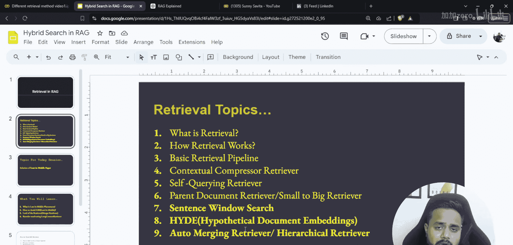
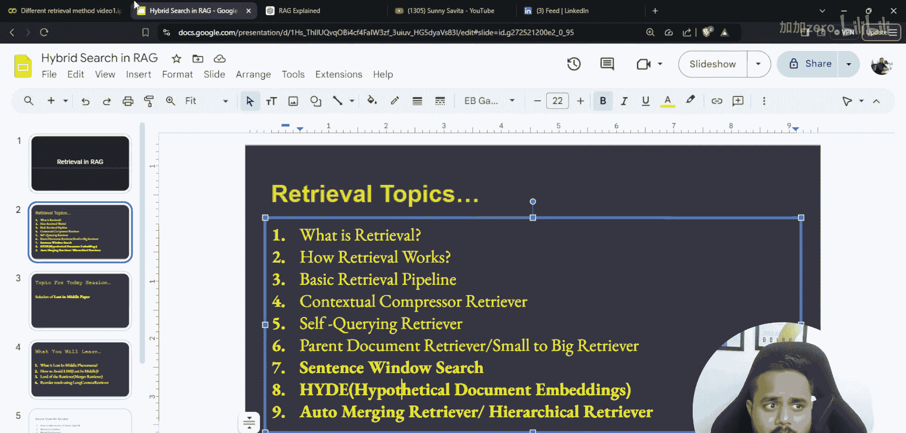
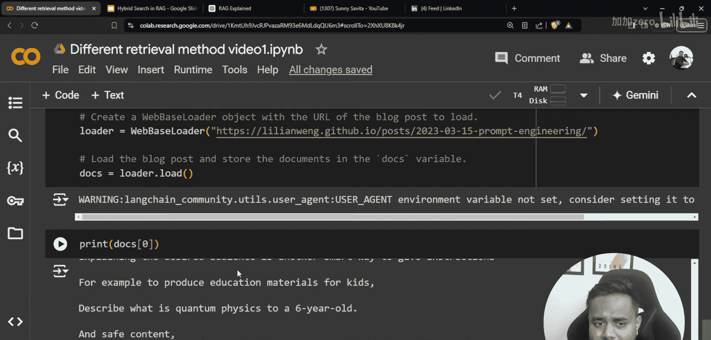
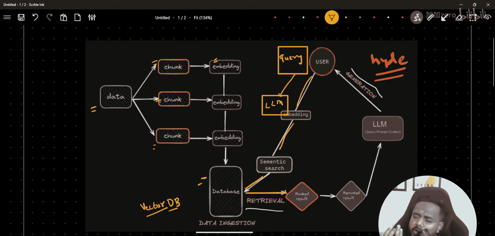

生成式AI：P50：高级RAG技术 - 合并检索器与假设文档嵌入


## 概述
在本节课中，我们将学习两种强大的检索增强生成技术：合并检索器和假设文档嵌入。我们将探讨它们如何提升RAG管道的检索效果，并通过代码示例展示其实现方式。


## 架构回顾
上一节我们介绍了RAG的基本组件，本节中我们来看看一个典型的RAG架构。RAG管道通常包含三个阶段：数据摄取、检索和生成。

以下是RAG管道的核心阶段：
1.  **数据摄取**：将原始数据分割成块，并转换为向量嵌入存储在数据库中。
2.  **检索**：将用户查询转换为嵌入，并从向量数据库中检索最相关的文档块。
3.  **生成**：将检索到的上下文与原始查询结合，输入给大语言模型以生成最终答案。




这是一种基础方法，也称为朴素方法。


## 假设文档嵌入技术
现在，我们来深入了解假设文档嵌入技术。这种方法的核心思想是在检索前，先利用大语言模型对用户查询进行扩展。


在HyDE方法中，处理流程有所不同：
1.  用户提出一个查询。
2.  该查询首先被传递给一个大语言模型。
3.  大语言模型基于特定的提示词，生成一个或多个“假设的”答案或文档。
4.  这些生成的假设文档被转换为向量嵌入。
5.  使用这些假设文档的嵌入（而非原始查询的嵌入）在向量数据库中进行相似性搜索，以找到最相关的真实文档块。



这种方法旨在通过大语言模型生成的、更接近答案风格的文本来更好地匹配数据库中的内容。

## 环境设置与库导入
在开始实现之前，我们需要设置编程环境并导入必要的库。

以下是需要安装和导入的核心库：
```python
# 安装必要的包
# pip install google-generativeai langchain-community chromadb



# 导入库
from langchain_google_genai import ChatGoogleGenerativeAI, GoogleGenerativeAIEmbeddings
import warnings
# ... 其他必要的导入
```

首先，设置您的API密钥作为环境变量。然后，加载大语言模型和嵌入模型。
```python
# 加载LLM和嵌入模型
llm = ChatGoogleGenerativeAI(model="gemini-pro")
embeddings = GoogleGenerativeAIEmbeddings(model="models/embedding-001")
```

## 合并检索器概念
接下来，我们探讨合并检索器的概念。这是一种高级检索策略，旨在结合多种检索方法的优势。

自动合并检索是一种更复杂的理念。其核心是让系统自动选择或组合不同的检索器（如基于关键词的BM25、基于向量的相似性搜索等），以优化每次查询的检索结果。本节课将解释其关键概念，具体的实现将作为挑战留给大家完成。



## 总结
本节课中我们一起学习了两种高级RAG检索技术：假设文档嵌入和合并检索器的概念。HyDE通过让LLM生成假设文本来改善检索匹配，而合并检索器旨在智能融合多种检索策略。理解这些技术有助于构建更强大、更精准的RAG应用，为后续学习评估技术和记忆机制等高级主题打下基础。