# 生成式AI：P51：LangChain核心概念一网打尽 🚀

在本节课中，我们将全面学习LangChain的核心模块。我们将探讨LangChain Core、LangServe以及LangGraph，帮助你理解如何围绕大语言模型构建应用程序。无论你是初学者还是有一定经验的开发者，本教程都将为你提供一个清晰的学习路径。

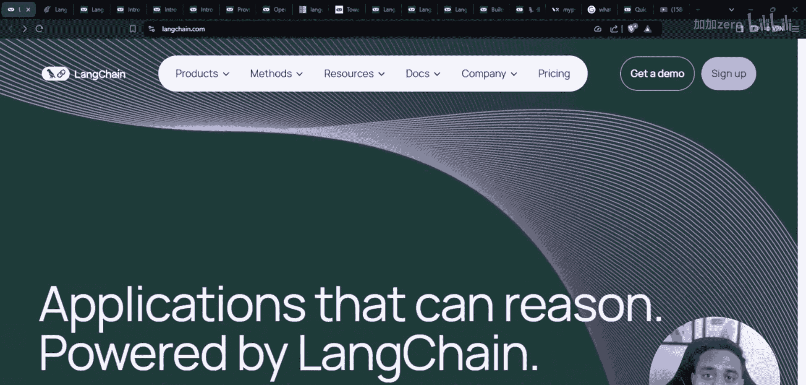

## 概述

LangChain是一个用于构建大语言模型应用程序的框架。它提供了一套工具和抽象，使得开发者能够更轻松地连接、编排和部署基于LLM的应用。本节课将带你了解其核心组成部分。

## LangChain简介

LangChain Inc.是一家成立于2022年的美国公司，专注于为大语言模型应用开发提供平台。其核心产品旨在简化围绕LLM构建生态系统的过程。

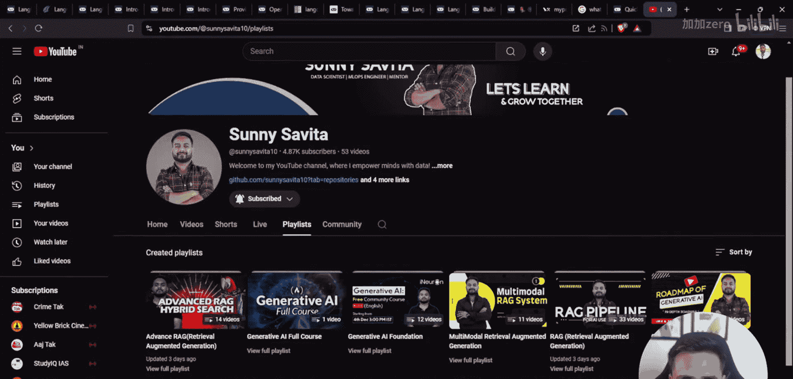

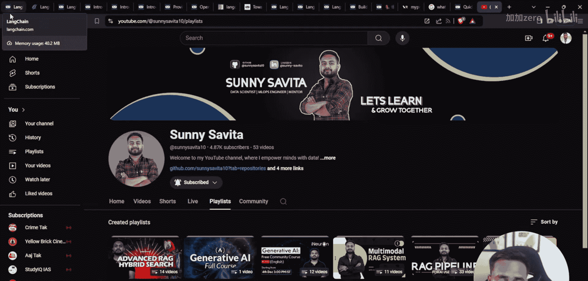

## LangChain核心产品

以下是LangChain提供的几个主要产品，它们共同构成了其生态系统。

### LangSmith

LangSmith是一个用于开发、协作、测试和监控LLM应用程序的平台。你可以将其视为一个监控和调试工具，专门为基于大语言模型的应用设计。

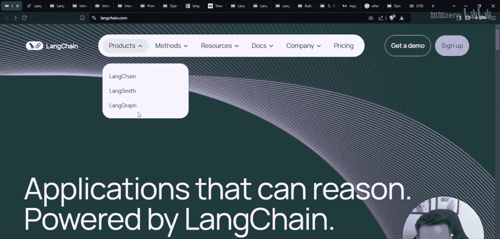

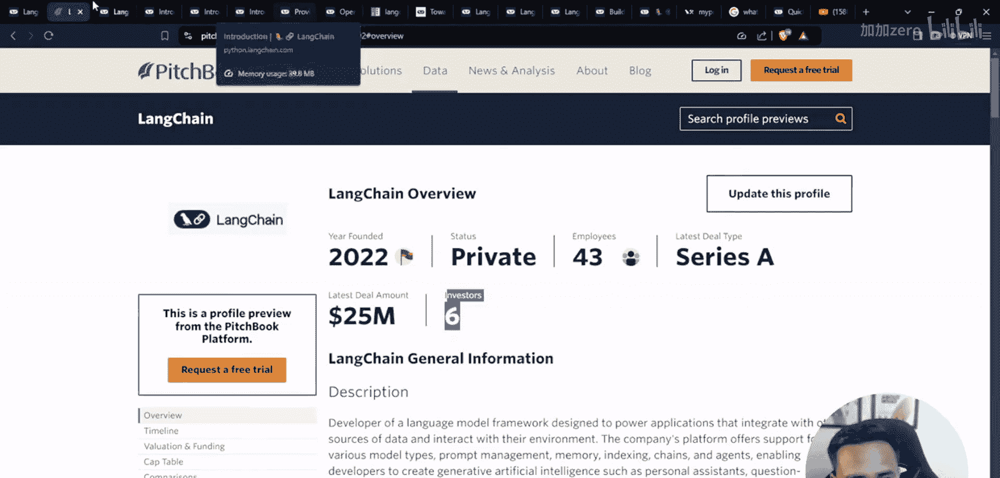

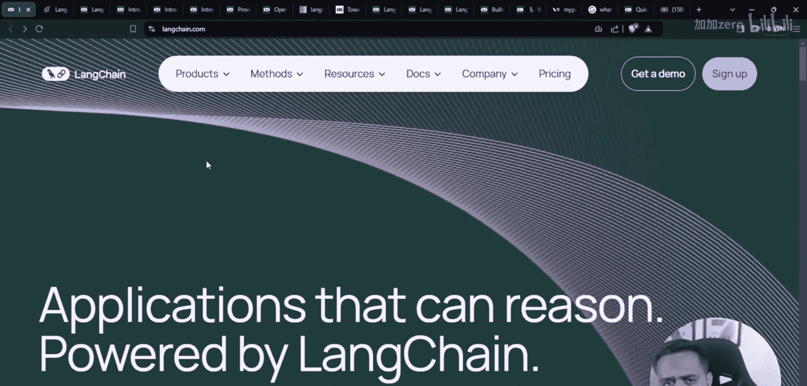

### LangGraph

LangGraph允许你创建基于节点和边的工作流。节点通常代表代理或特定功能，边则定义了它们之间的连接和交互逻辑。这类似于构建一个可视化的流程图来编排复杂的LLM任务。

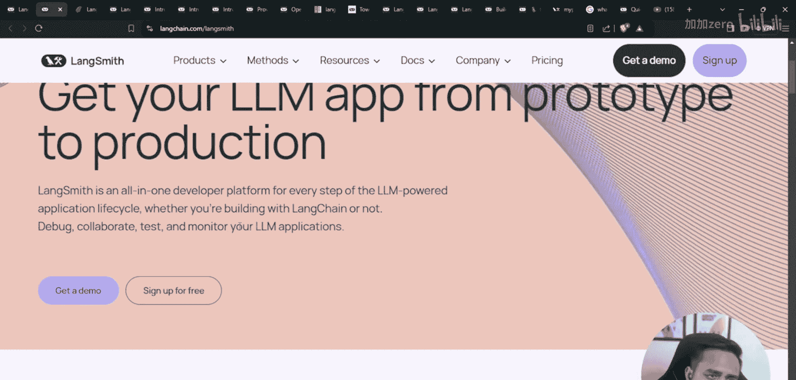

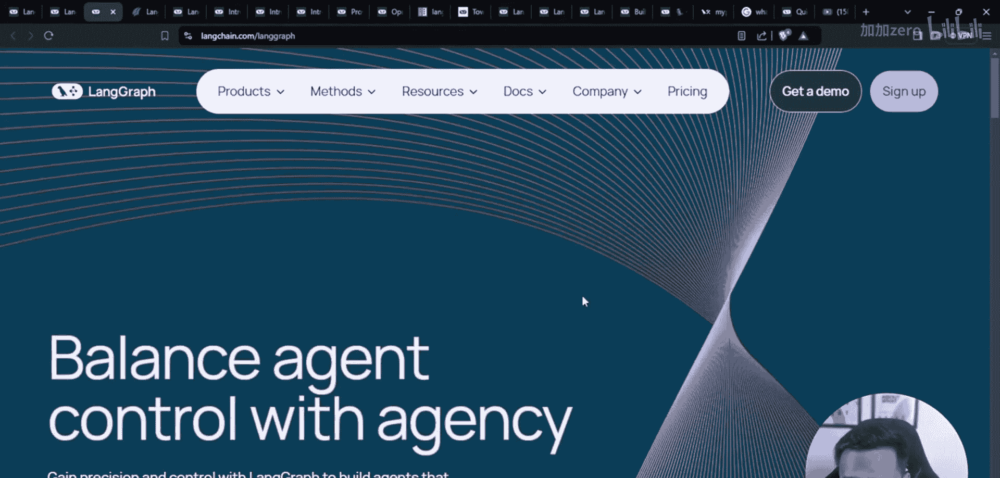

> 近期，LangChain还发布了LangGraph Cloud的测试版，这是一个托管平台，用于部署和管理你创建的图。

### 服务与定价

LangChain提供不同层级的服务：
*   **开源核心**：LangChain Core、LangGraph基础版及众多集成是免费且开源的。
*   **商业服务**：LangSmith、LangGraph Cloud等托管和高级功能属于商业产品，提供开发者版、Plus版和企业版等付费方案。

## LangChain包结构

当你安装LangChain时，主要会接触到以下几个包，它们按功能进行了模块化：

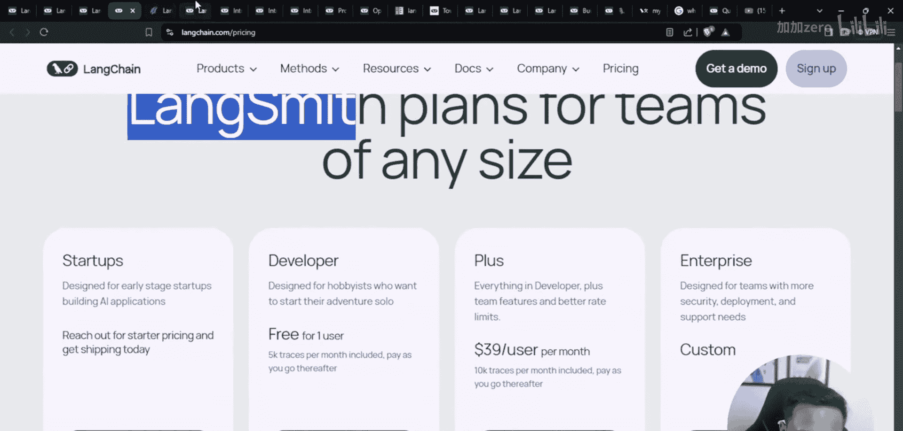

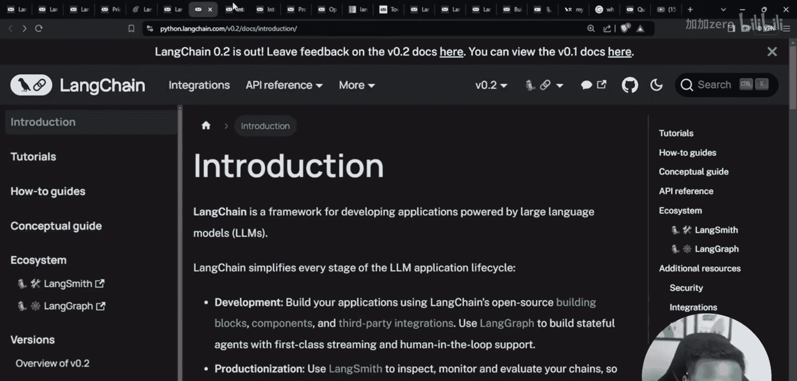

*   **`langchain-core`**：这是核心包，包含了构建应用所需的主要抽象和基础组件。
*   **`langchain`**：这是一个伞形包，通常包含了`core`、`community`等模块，方便一次性安装。
*   **`langchain-community`**：包含由社区维护的第三方集成和工具。
*   **`langchain-experimental`**：包含一些处于实验阶段、可能不稳定的新功能。

通常，在创建应用程序时，我们会安装主`langchain`包或直接安装`langchain-core`。

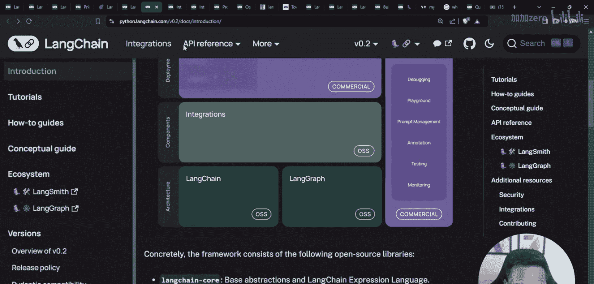

## 总结

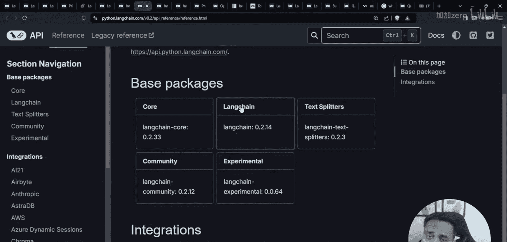

本节课我们一起学习了LangChain的概况。我们了解到LangChain是一个用于构建LLM应用的综合框架，其核心产品包括用于监控的LangSmith、用于编排工作流的LangGraph以及开源的核心模块。理解这些组成部分是开始使用LangChain构建强大AI应用的第一步。在接下来的课程中，我们将深入每个模块进行实践。