# 生成式AI：P52：使用LangChain构建带记忆（聊天历史）的聊天机器人

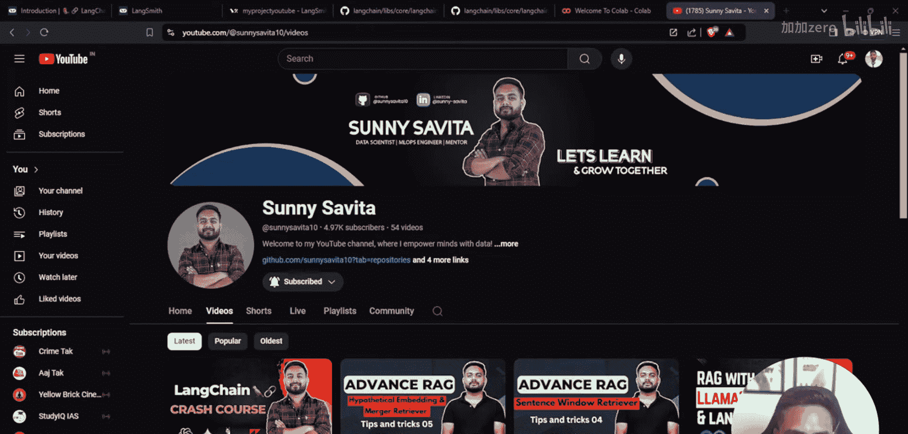

## 概述

在本节课中，我们将学习如何使用LangChain框架构建一个具备记忆功能的聊天机器人。我们将重点介绍如何让机器人记住对话历史，从而维持对话的上下文状态。课程将涵盖从环境配置、模型加载到实现对话记忆的完整流程。

---

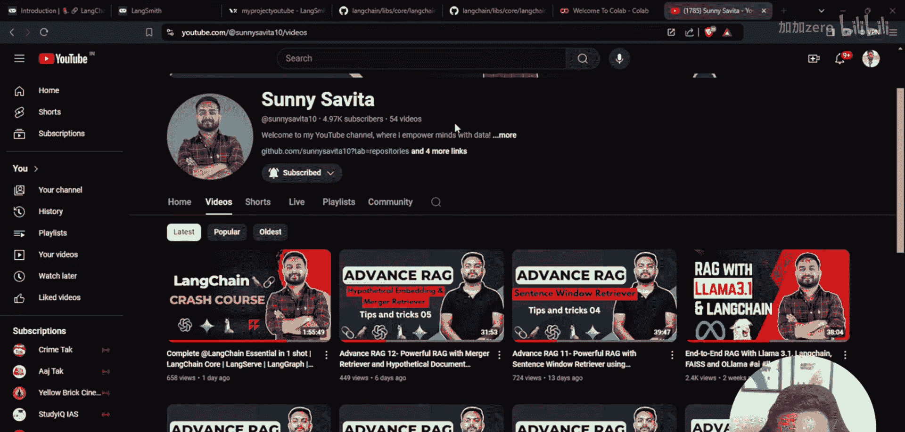

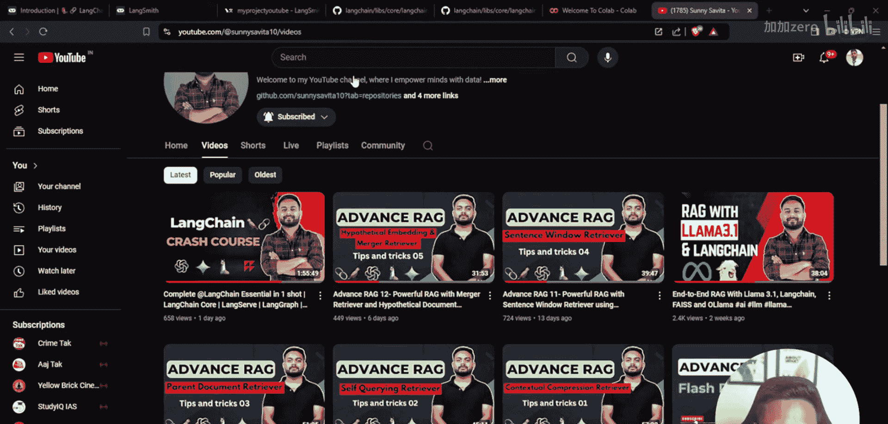

## 环境配置与库安装

上一节我们概述了课程目标，本节中我们来看看如何配置开发环境并安装必要的库。

首先，我们需要安装几个关键的Python包。

以下是需要安装的库列表：
*   `langchain-google-genai`: 用于连接Google Gemini模型。
*   `langchain`: LangChain核心框架。
*   `langchain-community`: 包含社区贡献的组件。

安装命令如下：
```python
!pip install langchain-google-genai -q
!pip install langchain -q
!pip install langchain-community -q
```

为了跟踪和记录开发过程中的每一步，我们将配置LangSmith。这需要设置一些环境变量。

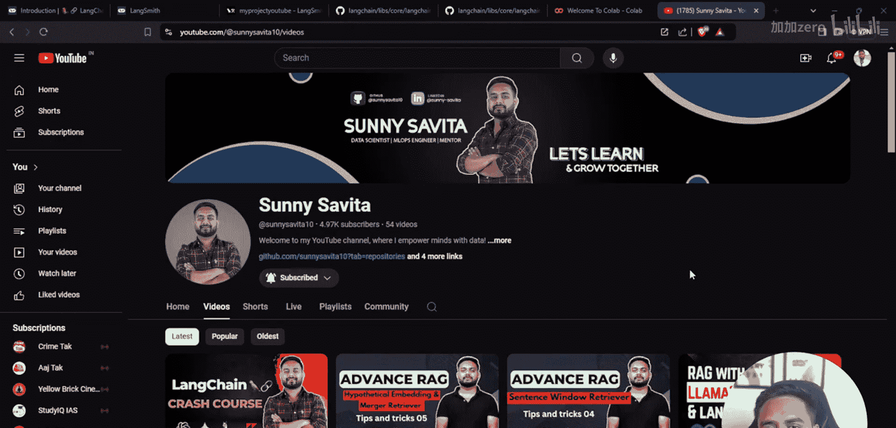

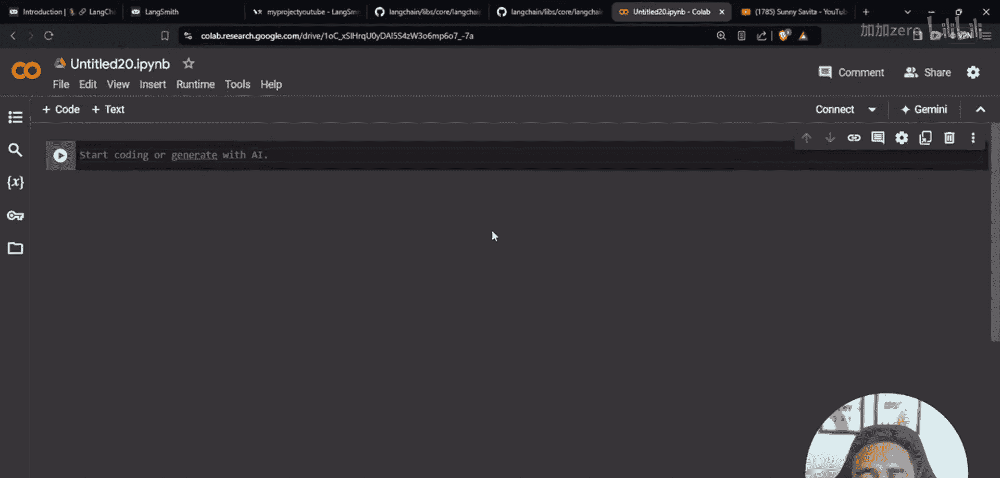

以下是配置LangSmith所需的步骤：
1.  访问LangChain官网并注册LangSmith。
2.  在LangSmith中创建一个新项目。
3.  复制项目对应的API密钥和端点URL。

配置代码如下：
```python
import os
os.environ["LANGCHAIN_TRACING_V2"] = "true"
os.environ["LANGCHAIN_ENDPOINT"] = "https://api.smith.langchain.com"
os.environ["LANGCHAIN_API_KEY"] = "your-api-key-here"
os.environ["LANGCHAIN_PROJECT"] = "chatbot-with-langchain"
```

此外，我们还需要设置访问Google AI Studio模型的API密钥。
```python
os.environ["GOOGLE_API_KEY"] = "your-google-api-key-here"
```

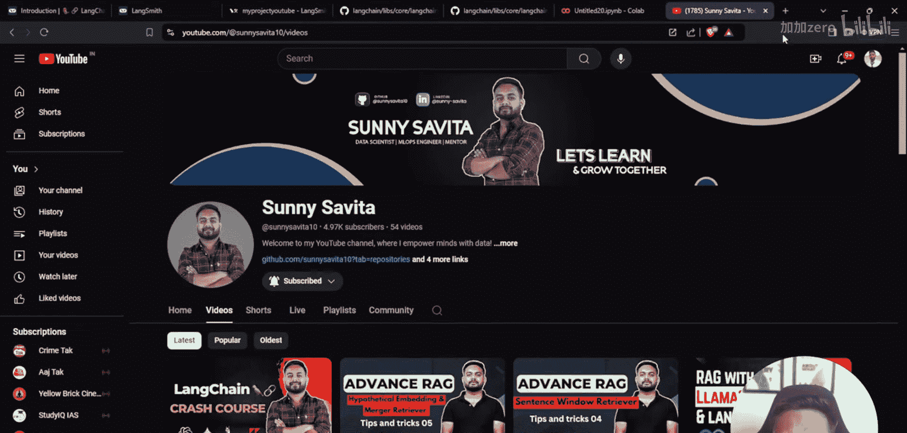

---

## 加载与测试语言模型

环境配置完成后，本节我们将加载大语言模型并进行初步测试。

我们从`langchain_google_genai`中导入`ChatGoogleGenerativeAI`类来初始化模型。我们将使用Gemini模型，并设置一个参数以兼容消息格式。

初始化模型的代码如下：
```python
from langchain_google_genai import ChatGoogleGenerativeAI

llm = ChatGoogleGenerativeAI(
    model="gemini-pro",
    convert_system_message_to_human=True
)
```

模型加载后，我们可以通过调用`invoke`方法并传入一条消息来测试它是否工作正常。

测试模型的代码如下：
```python
response = llm.invoke("Hi")
print(response.content)
```
执行上述代码，模型应返回问候语，例如“Hello! How can I help you today?”。通过`.content`属性可以提取出纯文本回复。

---

## 构建带记忆的对话链

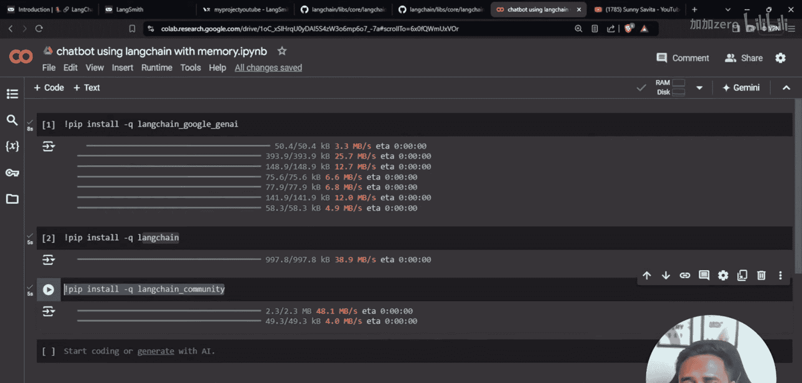

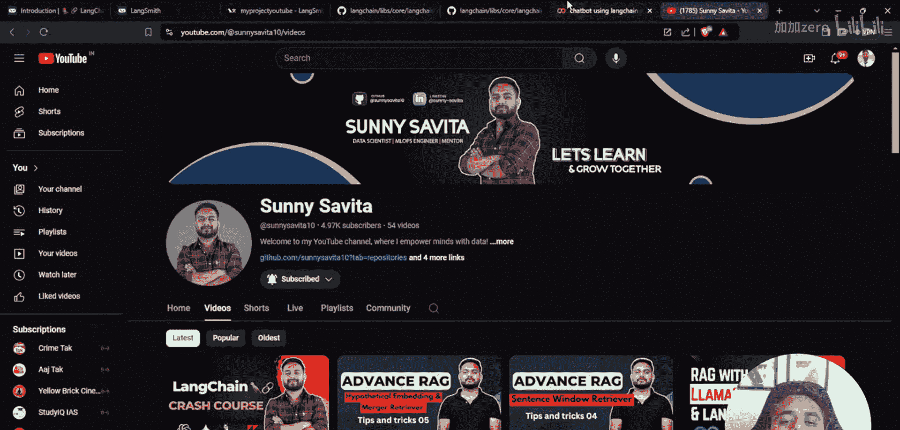

测试了基础模型后，本节我们来构建核心的对话链，并为其添加记忆功能。

单纯的模型调用无法记住历史对话。为了实现这一点，我们需要两个关键组件：`ConversationBufferMemory`用于存储对话历史，以及`ConversationChain`将记忆与模型连接起来。

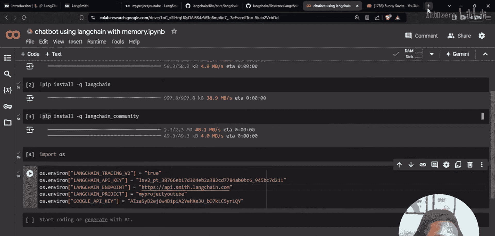

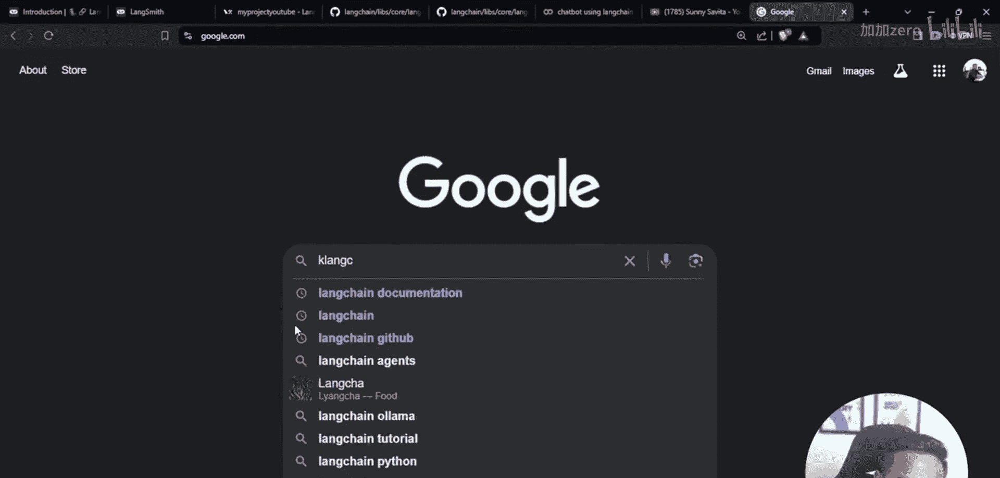

首先，从`langchain.memory`导入记忆模块，并初始化一个对话缓冲区。
```python
from langchain.memory import ConversationBufferMemory

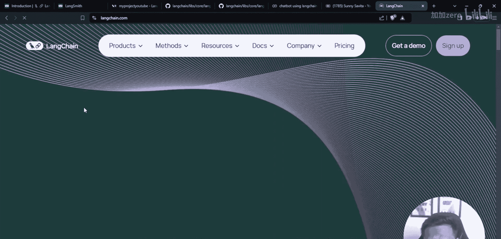

memory = ConversationBufferMemory()
```

接着，使用模型和记忆对象创建一条对话链。
```python
from langchain.chains import ConversationChain

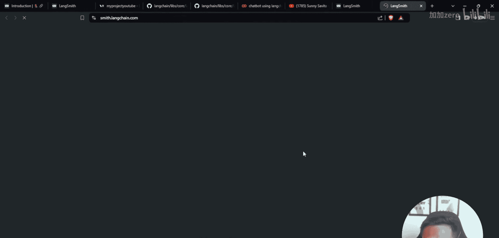

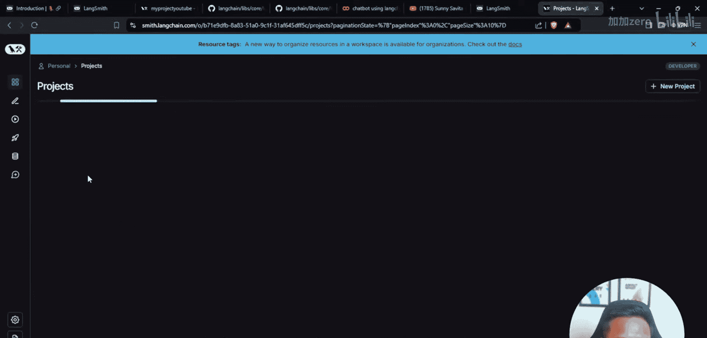

conversation = ConversationChain(
    llm=llm,
    memory=memory,
    verbose=True  # 设置为True可以看到链的思考过程
)
```

现在，我们可以使用这条链进行多轮对话。链会自动将当前对话和记忆中的历史记录一起发送给模型。

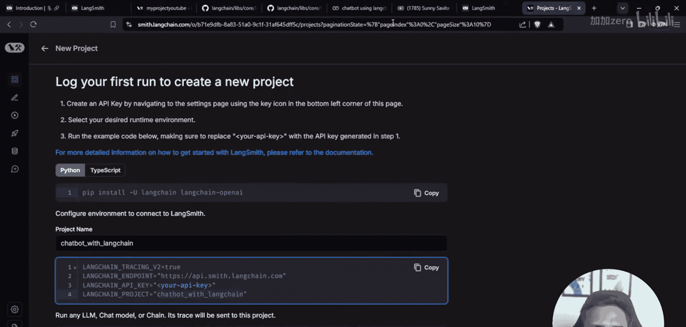

进行多轮对话的示例：
```python
# 第一轮对话
response1 = conversation.predict(input="My name is Sunny.")
print(response1)

# 第二轮对话，模型应能记住名字
response2 = conversation.predict(input="What is my name?")
print(response2)  # 输出应包含“Sunny”
```
当`verbose=True`时，在Colab或终端中运行，你可以看到LangChain在后台将历史记录和当前问题组合成提示词的过程，这解释了模型为何能记住上下文。

---

## 总结

本节课中我们一起学习了使用LangChain构建带记忆的聊天机器人的完整流程。

我们首先配置了开发环境，安装了必要的库并设置了LangSmith用于追踪。然后，我们加载并测试了Google Gemini模型。最后，我们通过集成`ConversationBufferMemory`和`ConversationChain`，成功创建了一个能够记住对话历史的聊天机器人原型。

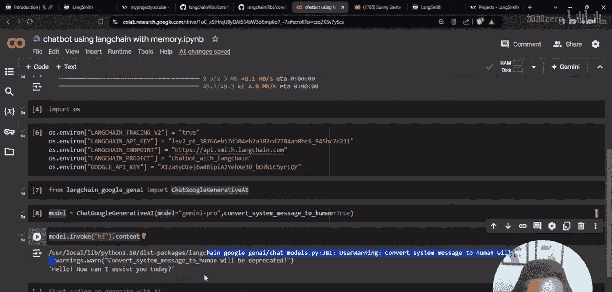

这个具备记忆功能的链是构建更复杂AI应用（如客服助手、个性化聊天工具）的基础。在后续课程中，我们将探索更多类型的记忆机制以及如何将此原型部署为真正的应用程序。