# 生成式AI：53：构建具备记忆（聊天历史）的RAG聊天机器人

在本节课中，我们将学习如何构建一个基于检索增强生成（RAG）的聊天机器人，并使其具备记忆（聊天历史）功能。我们将从理论架构开始，逐步过渡到代码实现，确保初学者能够理解并跟随。

## 概述

我们将创建一个聊天机器人，它不仅能回答用户的问题，还能记住之前的对话内容。为了实现这一点，我们将结合RAG管道和记忆管理机制。RAG管道负责从知识库中检索相关信息，而记忆机制则负责维护对话的上下文。

## 理论架构

上一节我们概述了目标，本节中我们来看看RAG与记忆结合的理论架构。

首先，理解基本问答机制。我们有一个大型语言模型（LLM）。用户向LLM输入一个问题（Prompt），LLM直接生成一个答案（Output）。这被称为基础问答。

然而，有时LLM可能无法直接回答某些问题。为了解决这个问题，我们引入RAG管道。RAG代表检索增强生成。其核心思想是：我们不直接将问题交给LLM，而是先通过一个检索流程来获取相关背景信息。

以下是RAG管道的核心步骤：

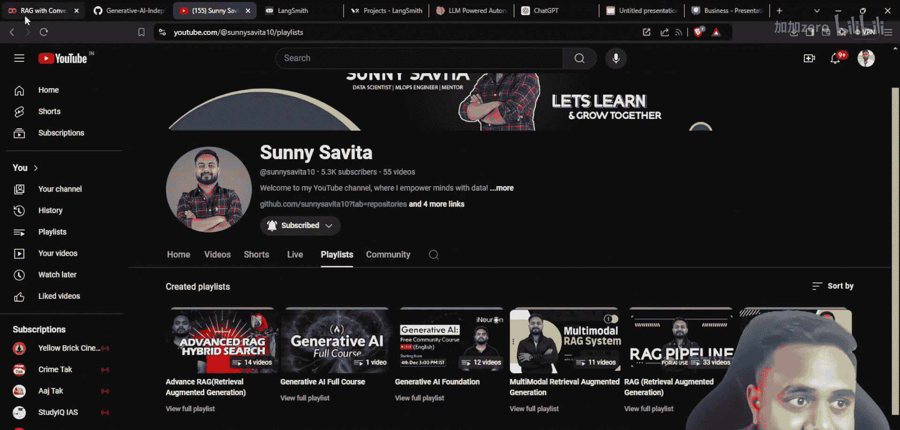

1.  我们拥有一个知识库（例如文档集合）。
2.  将知识库内容分割成文本块（Chunks）。
3.  为这些文本块创建嵌入向量（Embeddings）。
4.  将嵌入向量存储在一个向量数据库（Vector Database）中。
5.  当用户提出问题时，将问题也转换为嵌入向量。
6.  在向量数据库中进行语义搜索或相似度搜索，找到与问题最相关的文本块（排名结果）。
7.  （可选）对结果进行重新排序，作为第二层过滤。
8.  将检索到的相关上下文（Context）和原始问题（Prompt）一起输入给LLM。
9.  LLM基于提供的上下文生成最终答案。

这个流程的公式化表示可以简化为：
`最终答案 = LLM(问题 + 检索到的相关上下文)`

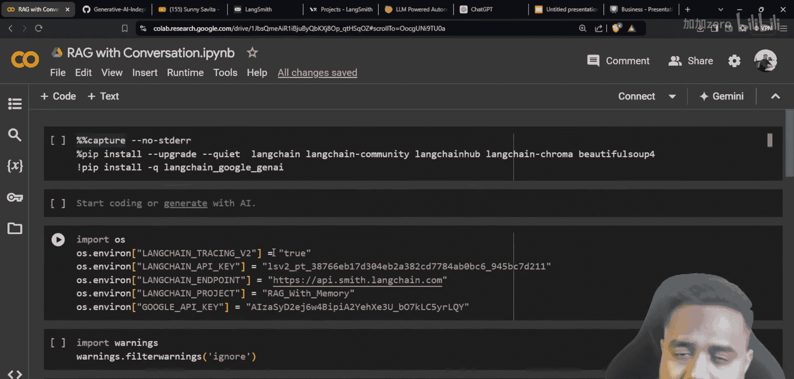

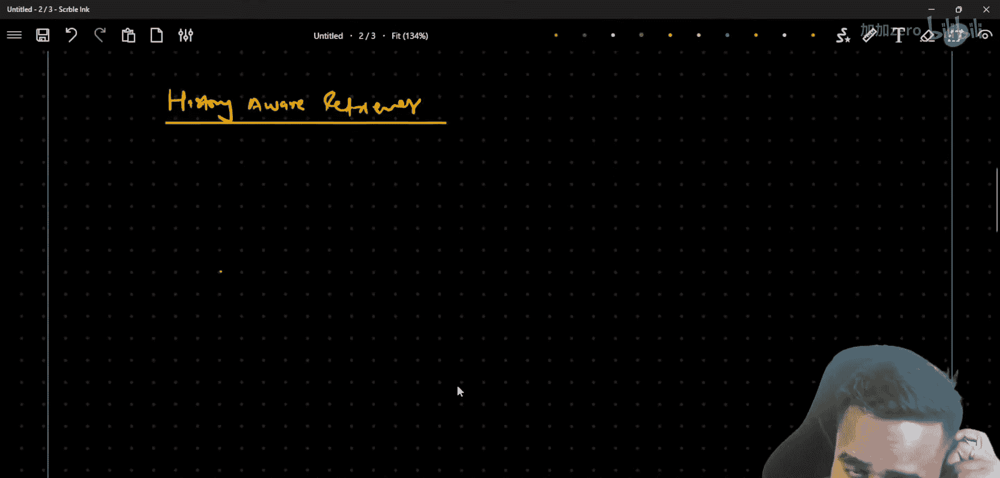

现在，如果我们希望这个RAG系统能记住对话历史，就需要在流程中加入记忆管理。这意味着每次对话时，系统不仅考虑当前问题，还要考虑之前的问题和答案，以保持对话的连贯性。

## 代码实现

理解了理论架构后，本节我们将进入实际的代码实现环节。我们将使用LangChain等库来构建这个系统。

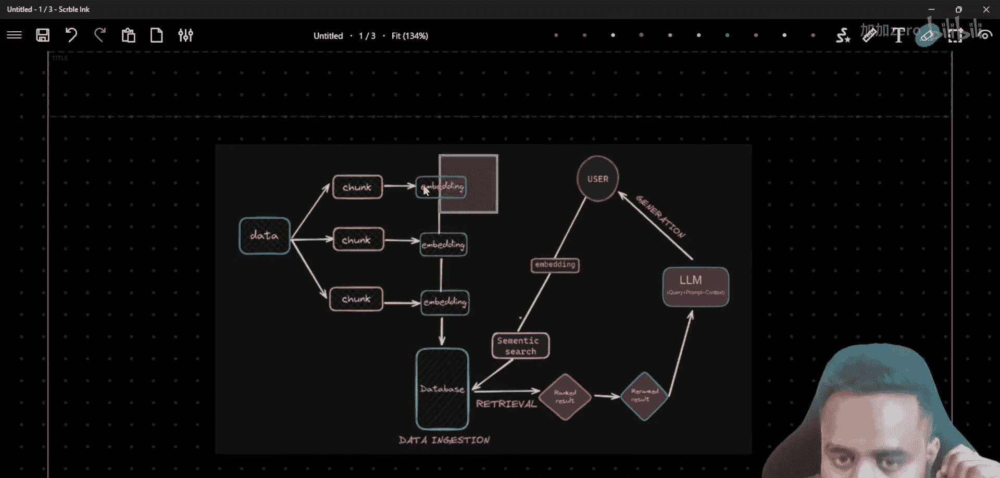

首先，我们需要安装必要的库并设置环境。

```python
# 安装必要库（示例，具体库名可能根据环境变化）
# !pip install langchain langchain-google-genai langsmith chromadb

import warnings
warnings.filterwarnings('ignore')

# 设置环境变量（例如用于日志记录的LangSmith）
import os
os.environ["LANGCHAIN_TRACING_V2"] = "true"
os.environ["LANGCHAIN_PROJECT"] = "RAG-Chatbot-With-Memory"
# 需要设置您的LangSmith API密钥
# os.environ["LANGCHAIN_API_KEY"] = "your_api_key_here"
```

接下来，加载我们将要使用的嵌入模型和LLM。这里以Google的Gemini模型为例。

```python
from langchain_google_genai import GoogleGenerativeAIEmbeddings, ChatGoogleGenerativeAI

# 加载嵌入模型
embeddings = GoogleGenerativeAIEmbeddings(model="models/embedding-001")

# 加载聊天模型
llm = ChatGoogleGenerativeAI(model="gemini-1.5-pro-latest")
```

现在，我们需要准备知识库并创建向量存储。以下是关键步骤：

1.  加载文档。
2.  分割文本。
3.  生成嵌入并存入向量数据库。

```python
from langchain_community.document_loaders import TextLoader
from langchain.text_splitter import RecursiveCharacterTextSplitter
from langchain_community.vectorstores import Chroma

# 1. 加载文档（示例：从文本文件加载）
loader = TextLoader("your_knowledge_base.txt")
documents = loader.load()

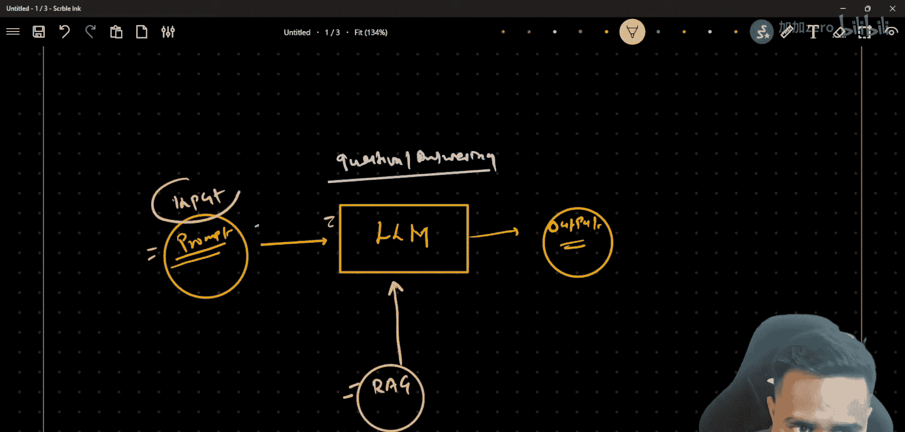

# 2. 分割文本
text_splitter = RecursiveCharacterTextSplitter(chunk_size=1000, chunk_overlap=200)
chunks = text_splitter.split_documents(documents)

# 3. 创建向量存储
vectorstore = Chroma.from_documents(documents=chunks, embedding=embeddings)
```

创建检索器，它负责从向量数据库中查找相关文档。

```python
# 创建检索器
retriever = vectorstore.as_retriever(search_kwargs={"k": 4}) # 检索最相关的4个块
```

现在，构建基础的RAG链。这个链将检索到的上下文与问题组合，然后交给LLM。

```python
from langchain_core.prompts import ChatPromptTemplate
from langchain_core.runnables import RunnablePassthrough
from langchain_core.output_parsers import StrOutputParser

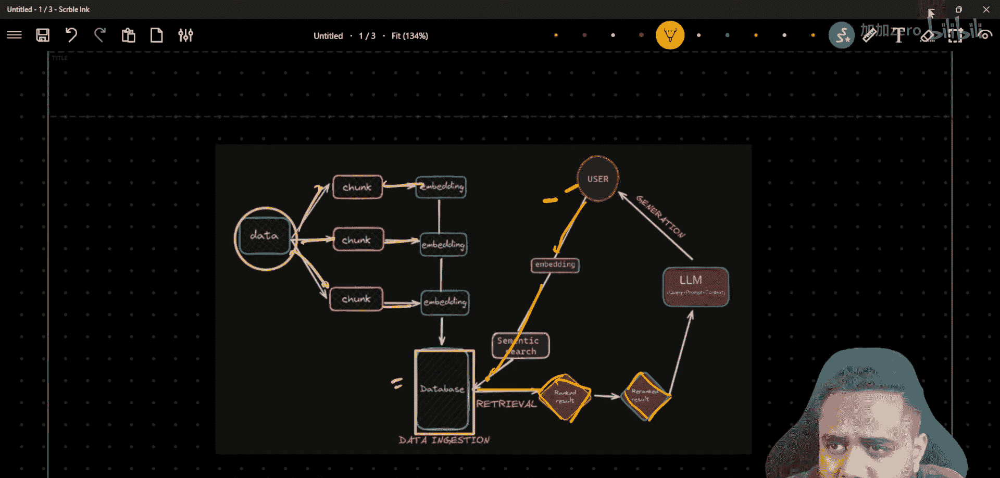

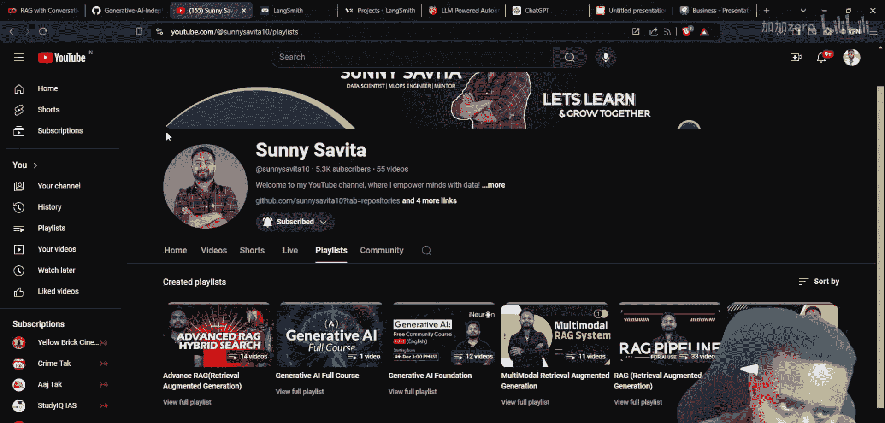

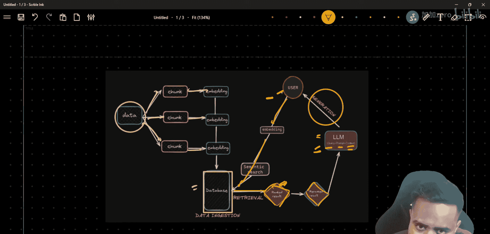

# 定义提示模板
template = """请根据以下上下文来回答问题。如果你不知道答案，就说你不知道。
上下文：{context}
问题：{question}
请提供有用的答案："""
prompt = ChatPromptTemplate.from_template(template)

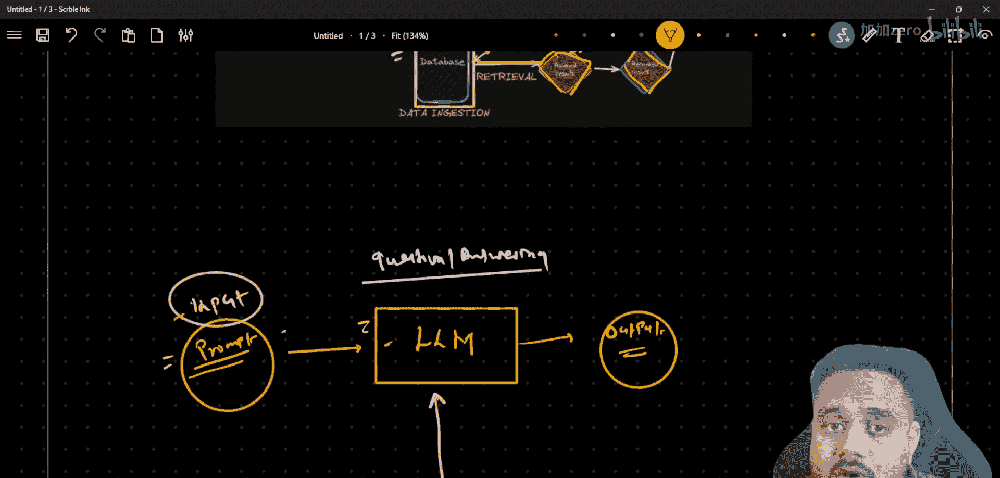

# 构建RAG链
rag_chain = (
    {"context": retriever, "question": RunnablePassthrough()}
    | prompt
    | llm
    | StrOutputParser()
)

# 测试基础RAG链
answer = rag_chain.invoke("什么是生成式AI？")
print(answer)
```

到目前为止，我们构建的RAG链还没有记忆功能。每次调用都是独立的。接下来，我们将为其添加对话历史管理能力。

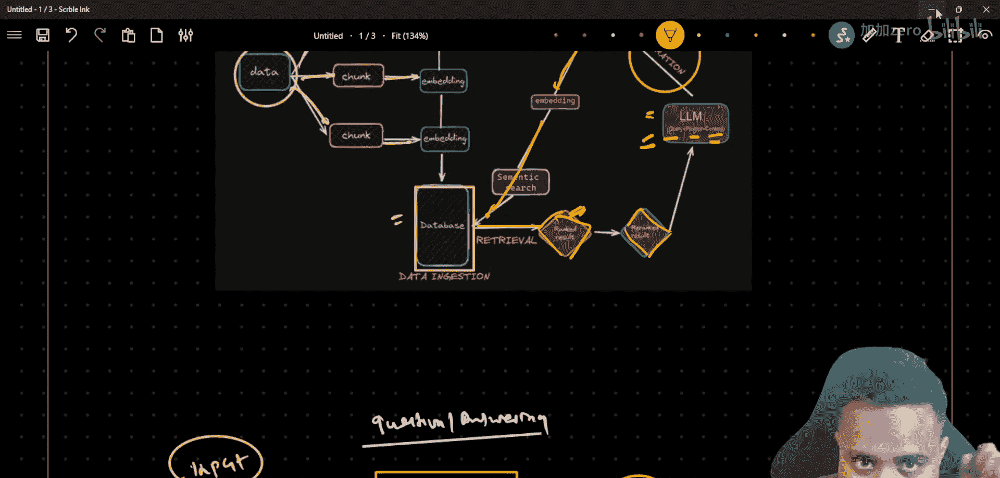

为了实现记忆，我们需要使用LangChain的`ConversationBufferMemory`。它会自动保存对话的输入和输出。

```python
from langchain.memory import ConversationBufferMemory

# 创建记忆存储
memory = ConversationBufferMemory(memory_key="chat_history", return_messages=True)
```

现在，我们需要创建一个新的链，将记忆、检索和生成步骤结合起来。这比基础链更复杂一些，因为需要动态地将历史对话和当前问题组合成一个新的、包含上下文的问题（有时称为“历史感知查询”），然后用这个新问题去检索，最后生成答案。

```python
from langchain.chains import create_history_aware_retriever, create_retrieval_chain
from langchain.chains.combine_documents import create_stuff_documents_chain

# 首先，创建一个“历史感知”的检索器。
# 它的作用是：根据聊天历史和当前问题，生成一个优化后的查询去检索。
history_aware_prompt = ChatPromptTemplate.from_messages([
    ("system", "根据以下对话历史和后续问题，生成一个独立的搜索查询。只输出查询内容，不要输出其他文字。对话历史：{chat_history}"),
    ("human", "{input}")
])
history_aware_retriever = create_history_aware_retriever(llm, retriever, history_aware_prompt)

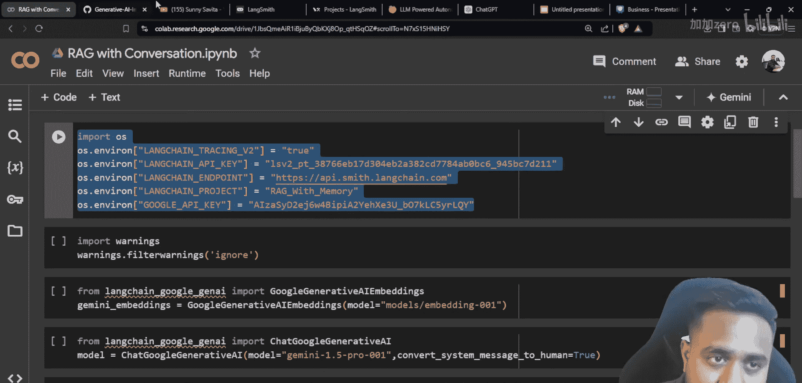

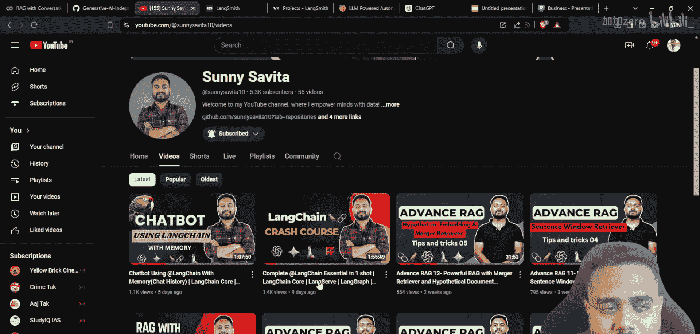

# 然后，创建一个处理检索结果的链。
# 这个链负责将检索到的文档、历史对话和当前问题组合起来，交给LLM生成最终答案。
qa_prompt = ChatPromptTemplate.from_messages([
    ("system", "你是一个有用的助手。请根据以下上下文和对话历史来回答问题。上下文：{context} 对话历史：{chat_history}"),
    ("human", "{input}")
])
question_answer_chain = create_stuff_documents_chain(llm, qa_prompt)

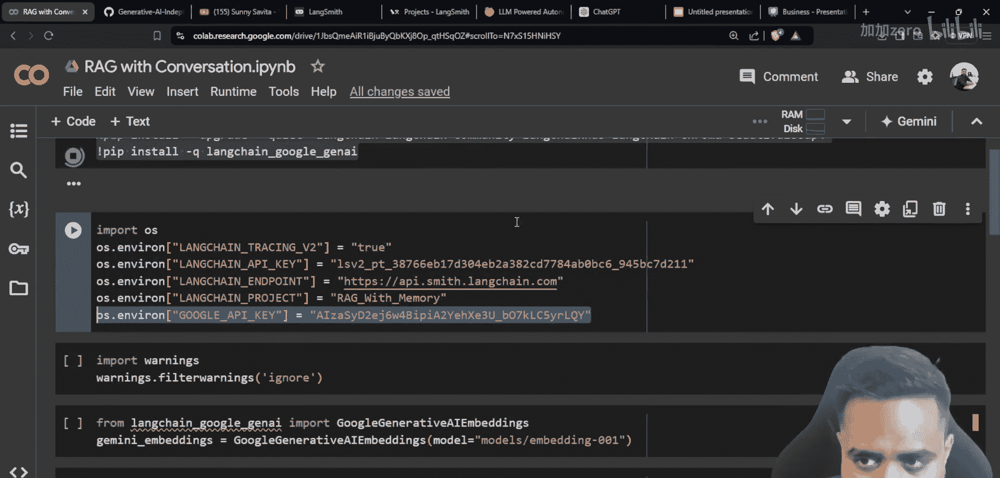

# 最后，将历史感知检索器和问答链组合成完整的检索链。
rag_chain_with_memory = create_retrieval_chain(history_aware_retriever, question_answer_chain)
```

现在，我们有了一个具备记忆功能的RAG链。但是，要使用它，我们需要手动管理记忆的输入和输出。更优雅的方式是将其封装成一个可交互的对话流程。

```python
from langchain.chains import ConversationalRetrievalChain

# 使用LangChain提供的更高级的对话检索链，它内部集成了记忆管理。
conversational_rag_chain = ConversationalRetrievalChain.from_llm(
    llm=llm,
    retriever=retriever,
    memory=memory,
    verbose=True # 设置为True可以看到链的思考过程
)

# 现在可以进行多轮对话了
result1 = conversational_rag_chain.invoke({"question": "生成式AI能做什么？"})
print("AI:", result1['answer'])

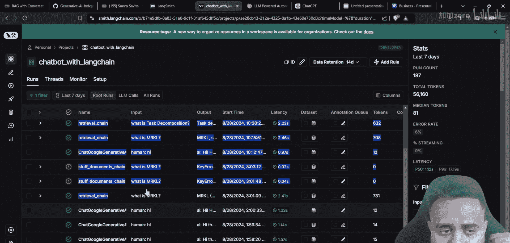

result2 = conversational_rag_chain.invoke({"question": "它和我刚才问的有什么区别？"}) # AI会记得上一轮对话
print("AI:", result2['answer'])
```

在这个链中，`memory`对象会自动存储每一轮的`question`和`answer`。当提出新问题时，链会从`memory`中读取历史记录，并将其与当前问题一起用于生成更准确的答案。

## 总结

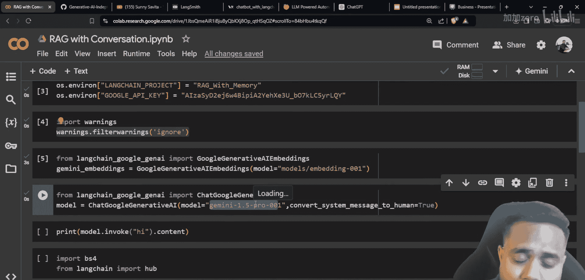

本节课中我们一起学习了如何构建一个具备记忆功能的RAG聊天机器人。我们从基础问答和RAG架构的理论讲解开始，明白了为何需要检索增强以及如何管理对话历史。随后，我们逐步实现了代码，包括设置环境、加载模型、创建知识库向量存储、构建基础RAG链，最后通过集成`ConversationBufferMemory`和`ConversationalRetrievalChain`，成功为机器人添加了记忆能力，使其能够进行连贯的多轮对话。