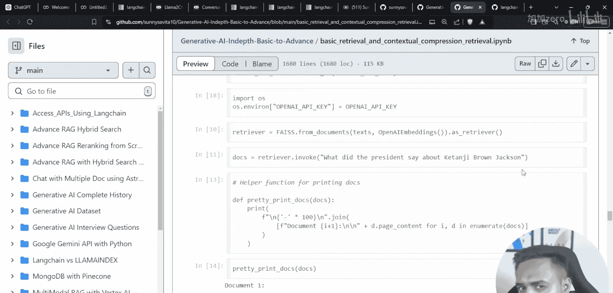
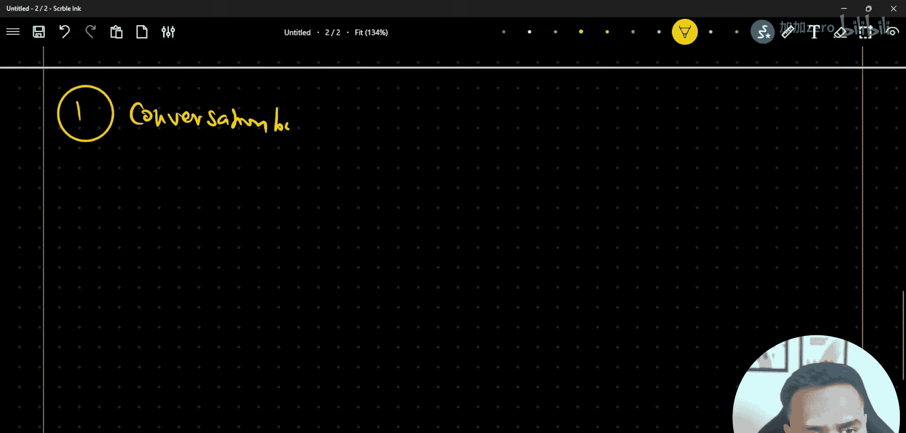

# 生成式AI：P54：Langchain 对话缓冲内存与对话缓冲窗口内存对比 🧠

在本节课中，我们将学习 Langchain 中两种基础的内存管理类：`ConversationBufferMemory` 和 `ConversationBufferWindowMemory`。我们将探讨它们的工作原理、区别以及各自的适用场景。


上一节我们介绍了如何在聊天机器人和 RAG 管道中维持对话记忆。本节中，我们来看看 Langchain 中更早引入的一些经典内存管理类。

## 理论概述 📖

在构建基于大语言模型的聊天应用时，维持对话的上下文或“记忆”至关重要。Langchain 提供了多种类来实现这一功能。


简单来说，一个基础的 LLM 流程是：输入问题，得到输出答案。当我们为这个流程添加对话历史记录时，它就变成了一个聊天机器人。为了增强其能力，我们还可以集成 RAG 管道来检索外部知识，或者创建代理来处理特定任务。

以下是 Langchain 中几种主要的内存类：
*   **ConversationBufferMemory**： 保存完整的对话历史。
*   **ConversationBufferWindowMemory**： 仅保存最近若干轮的对话。
*   **ConversationSummaryMemory**： 保存对话的摘要而非完整历史。
*   **ConversationSummaryBufferMemory**： 结合了摘要和最近对话的混合模式。
*   **ConversationEntityMemory**： 基于对话中识别的实体来管理记忆。

本节课我们将重点讲解前两种。

## ConversationBufferMemory 📚



`ConversationBufferMemory` 是最简单的内存形式。它的工作方式是将整个对话历史（所有的人类输入和 AI 回复）都保存在一个缓冲区中，并在每次新的交互时将这个完整的历史上下文提供给模型。

**核心机制**： 该内存类会无限制地累积所有对话轮次。其内部可以理解为维护着一个不断增长的列表：
```python
# 伪代码示意
memory_buffer = [
    “Human: 你好”,
    “AI: 你好！有什么可以帮您？”,
    “Human: 今天的天气如何？”,
    “AI: 我无法获取实时天气。”,
    # ... 后续所有对话都会追加至此
]
```
每次生成新回复时，这个完整的 `memory_buffer` 会作为上下文的一部分输入给 LLM。

**优点**： 能提供最完整的上下文，理论上模型能根据全部历史做出最连贯的回应。
**缺点**： 随着对话进行，上下文会越来越长。这可能导致两个问题：1) 消耗大量 Token，增加成本；2) 可能超过模型的最大上下文长度限制。

## ConversationBufferWindowMemory 🪟

`ConversationBufferWindowMemory` 是 `ConversationBufferMemory` 的一个变体，它通过引入一个“窗口”概念来解决上下文无限增长的问题。

**核心机制**： 该类只保留最近 `k` 轮的对话记录，更早的历史会被丢弃。这里的 `k` 是一个可配置的参数，例如 `k=3`。
```python
# 假设 k=2，伪代码示意
# 初始状态
memory_buffer = []
# 对话1轮后
memory_buffer = [“Human: 你好”, “AI: 你好！”]
# 对话2轮后
memory_buffer = [“Human: 你好”, “AI: 你好！”, “Human: 天气如何？”, “AI: 我不知道。”]
# 对话3轮后（窗口开始滑动，最早的第一轮对话被移除）
memory_buffer = [“Human: 天气如何？”, “AI: 我不知道。”, “Human: 那你擅长什么？”, “AI: 我擅长回答问题。”]
```

**优点**： 有效控制了上下文长度，节省 Token 使用量，并确保不会超出模型限制。对于关注近期对话的场景非常有效。
**缺点**： 会丢失窗口之外的早期对话信息，可能导致模型忘记很久之前讨论过的重要主题。

## 对比与总结 ⚖️

本节课中我们一起学习了 `ConversationBufferMemory` 和 `ConversationBufferWindowMemory`。

两者的核心区别在于对历史对话信息的保留策略：
*   **`ConversationBufferMemory`** 像一个**完整的对话记录本**，记住所有内容。适用于对话轮次不多、或需要长期记忆关键信息的场景。
*   **`ConversationBufferWindowMemory`** 像一个**短期记忆便签**，只记住最近几次交流。适用于需要控制成本、或对话主题频繁切换、仅近期上下文相关的场景。

选择哪一种取决于你的具体应用需求：是更需要完整的连贯性，还是更需要控制上下文长度和成本。



在接下来的课程中，我们将继续探讨另外两种更高级的内存管理类：`ConversationSummaryMemory` 和 `ConversationSummaryBufferMemory`。